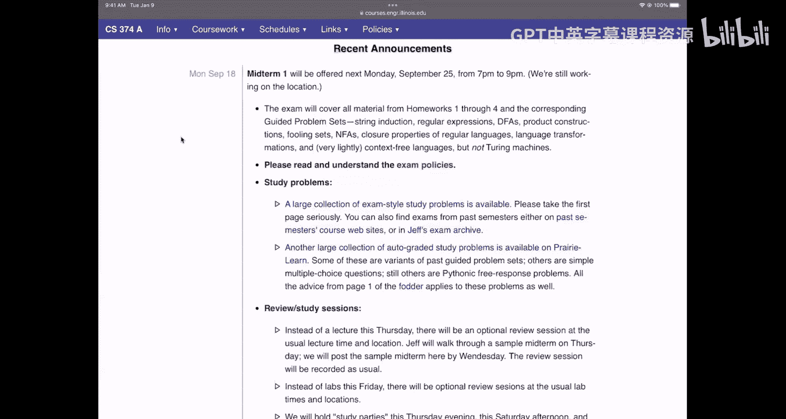
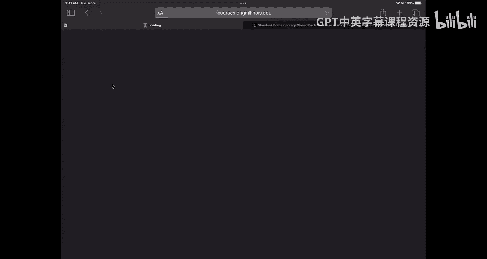
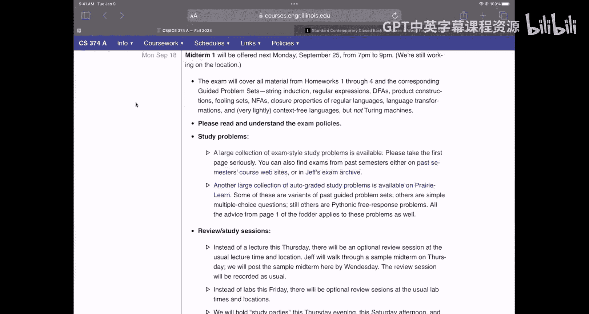
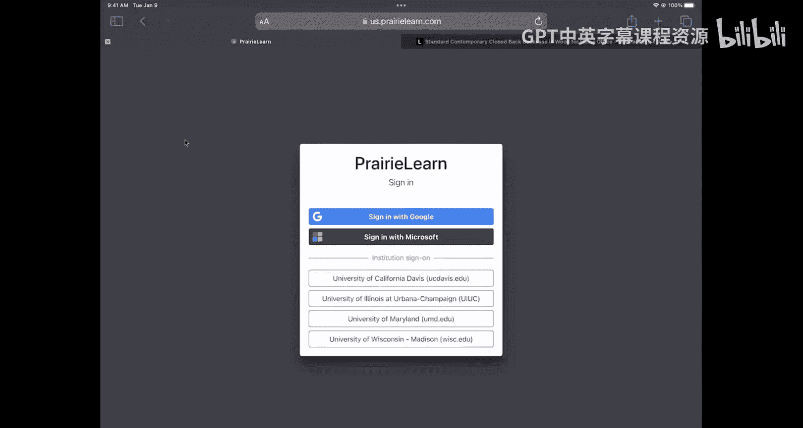
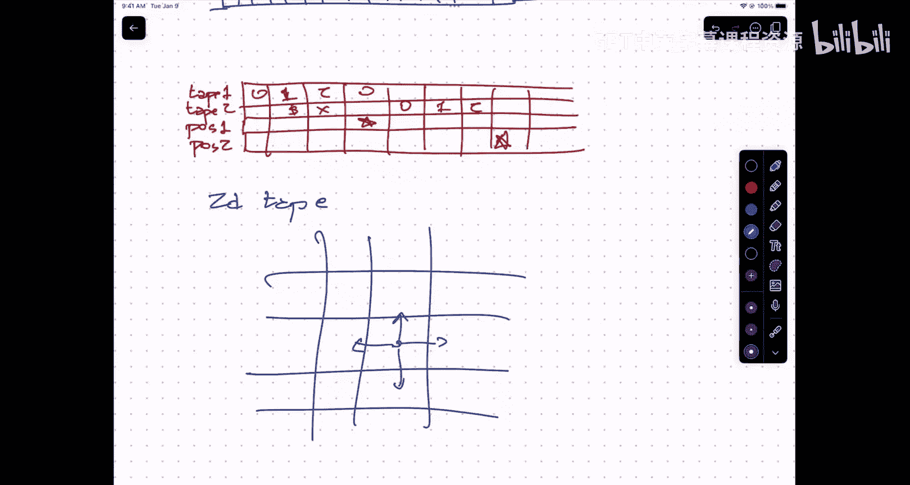

# 009：图灵机与停机问题


在本节课中，我们将学习计算理论中的一个核心概念——图灵机。我们将了解图灵机如何作为通用计算模型，并探讨一个著名的不可判定问题：停机问题。

## 期中考试安排提醒





首先，提醒大家一个重要的事务性信息：下周一晚上将举行期中考试。考试地点已分配，但具体哪个班级去哪个教室仍在安排中。请密切关注课程网站、Discord和Ed讨论区的通知。

关于考试范围，需要明确以下几点：
*   考试内容涵盖预备知识以及作业一、二、三、四的内容。
*   今天课程的内容**不会**出现在期中考试中，也不会出现在未来的任何期中考试或作业中。目前阶段我们主要进行复习。

以下是考试政策：
*   可以携带一张双面手写的“小抄纸”。
*   不允许复印、打印或在平板上书写后打印。
*   制作小抄的过程本身有助于巩固知识。





关于复习资源：
*   有一份大量的模拟试题集。建议的策略是：针对每个题型（如设计DFA），挑选2-4道题目，在模拟考试条件下（20分钟，白纸）练习。如果感到困难，再寻求帮助。
*   这些模拟题**没有**提供标准答案。这是因为本学期前四周我们已经通过作业、实验等提供了超过100道题的完整解答。现阶段，理解解题思路比记忆答案更重要。
*   Prairie Learn上也有大量自动评分的练习题。
*   本周四的课程中，我将讲解一套模拟考试题，展示获得满分所需的答题细节。
*   周五的实验课将是复习课。
*   周日，HKN将在ECE 1002（主演讲厅）组织复习会。

其他注意事项：
*   如果需要参加冲突考试，请尽早填写预约表。
*   如果需要考试便利（如额外时间、低干扰环境），建议通过考试便利中心预约，请尽快操作。

## 从有限状态机到图灵机

上一节我们回顾了不同层次的语言和机器模型。现在，我们来看看更强大的计算模型。

我们之前学习了：
*   **正则语言**：由正则表达式描述，对应**确定有限自动机（DFA）** 和**非确定有限自动机（NFA）**。它们模拟了代码中的顺序、分支和循环行为。
*   **上下文无关语言**：由上下文无关文法描述，对应**下推自动机（PDA）**。它引入了**递归**（或函数调用）的行为，通过一个栈来管理。

这些模型在内存访问上都有限制：DFA的状态有限；PDA的栈内存虽然无限，但只能以“后进先出”的方式访问栈顶元素。

我们需要的是一种能够**任意读写和再次访问**无限内存的模型。这就是**图灵机**。

## 图灵机：通用计算模型 🧠

图灵机是一个简单但功能强大的计算模型。其核心思想是：
*   一个**有限状态控制器**（类似于DFA）。
*   一条**无限长的纸带**，被划分为格子，每个格子可以写入一个符号（来自有限字母表）。
*   一个**读写头**，每次位于纸带的一个格子上。

图灵机的每一步操作如下（基于当前状态和读写头所指的符号）：
1.  **写入**一个新符号（或相同的符号）到当前格子。
2.  **改变**有限状态控制器的状态。
3.  **移动**读写头向左或向右一格。

用伪代码描述单步转移函数：
```
δ(当前状态, 当前读到的符号) = (新状态, 要写入的符号, 移动方向)
```
其中移动方向 ∈ {左, 右}。

初始时，纸带上包含输入字符串，其余部分为空白符号，读写头位于输入最左端。图灵机通过一系列这样的步骤运行，最终进入特定的**停机状态**（接受或拒绝）而结束。

**关键点**：图灵机的纸带提供了无限的、可随机访问的存储空间。你可以移动到纸带远处，写下信息，留下标记，然后返回原处继续计算，稍后再根据标记找回信息。这模拟了现代计算机中内存的工作方式。

艾伦·图灵在23岁时提出了这个模型，旨在形式化“人类进行数学计算”的过程。他认为任何物理上可实现的计算过程都可以用图灵机来模拟，这一观点被称为**丘奇-图灵论题**。

## 停机问题：一个不可判定的问题 ⚠️

图灵机的一个重要成果是解决了大卫·希尔伯特提出的“判定问题”：是否存在一个机械过程，能判断任意数学命题的真假？

图灵通过定义**停机问题**并证明其不可判定性，给出了否定的回答。

**停机问题**：给定一个图灵机 `M` 的描述（可以理解为程序源代码），问：`M` 是否会在有限步内停机？（即，是否会结束运行，而不是陷入无限循环？）

图灵证明了：**不存在这样一个图灵机程序 `H`，它能够正确判定所有输入图灵机是否停机。**

### 证明概要（反证法）

1.  **假设**存在这样一个“万能判定器”图灵机 `H`（`H` 本身总是停机）：
    *   输入：任意图灵机 `M` 的描述。
    *   输出：如果 `M` 停机，则输出“是”；如果 `M` 永不停机，则输出“否”。

2.  **构造**一个新的图灵机 `D`（“捣蛋机”）：
    *   输入：任意图灵机 `M` 的描述。
    *   行为：
        *   首先，用 `H` 来判定 `M`。
        *   如果 `H` 判定 `M` **停机**，那么 `D` 就故意进入**无限循环**（永不停机）。
        *   如果 `H` 判定 `M` **永不停机**，那么 `D` 就**立刻停机**。

    用伪代码描述 `D` 的行为：
    ```python
    def D(M):
        if H(M) == "停机":
            while True: pass  # 进入无限循环
        else:
            return            # 立即停机
    ```

3.  **考虑**当 `D` 以**它自身的描述**作为输入时会发生什么（即运行 `D(D)`）：
    *   如果 `H` 判定 `D` 停机 → 根据 `D` 的定义，`D(D)` 将进入无限循环（即不停机）。矛盾！
    *   如果 `H` 判定 `D` 永不停机 → 根据 `D` 的定义，`D(D)` 将立刻停机。矛盾！

4.  **结论**：我们得到了逻辑矛盾。因此，最初的假设不成立。这样的万能判定器 `H` **不可能存在**。

这个证明的核心洞见是**程序即数据**：一个程序的源代码可以作为字符串输入给另一个程序。通过让程序分析自身，导致了自指悖论。

## 总结

本节课中，我们一起学习了：
1.  **图灵机**的基本概念：它由有限状态控制器、无限长纸带和读写头构成，提供了通用计算的形式化模型。
2.  **丘奇-图灵论题**：认为图灵机可模拟任何物理上可行的计算过程。
3.  **停机问题**：判定任意给定程序是否会停机的问题。
4.  **停机问题的不可判定性**：通过巧妙的**自指构造**和**反证法**，图灵证明了不存在一个通用算法能解决停机问题。这是计算理论中第一个，也是最著名的不可判定问题，从根本上划定了算法能力的界限。



图灵的工作不仅奠定了计算机科学的基础，也深刻影响了数学和逻辑学。