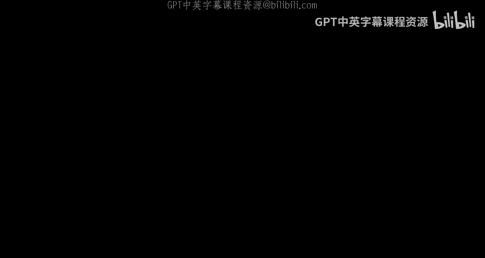
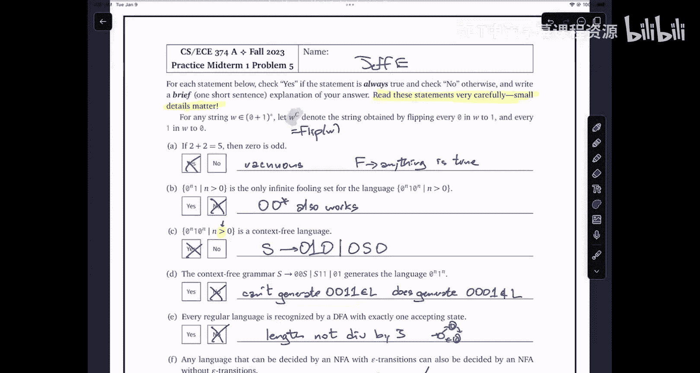

# 010：期中考试1复习（重录）📚

在本节课中，我们将一起复习期中考试1的模拟试卷。我们将逐一讲解试卷中的五道题目，涵盖语言变换、DFA与正则表达式、归纳证明、Fooling集与上下文无关文法以及真/假判断题。课程旨在帮助你理解考试形式、题目类型以及解题思路，为即将到来的考试做好准备。

## 算法与计算模型：1：考试结构与说明 📝

本次期中考试包含五道大题，每道题分值均为10分。考试时长为120分钟。考试开始时，监考人员会分发包含所有题目的试卷。你有几分钟时间阅读所有题目，之后可以提问。随后，监考人员会分发答题册，你需要在答题册上作答。

以下是考试的重要说明：
*   允许携带一张双面手写的“小抄”，除此之外不得使用其他任何资料。
*   答题时请将答案写在答题册的黑色边框内，否则扫描仪可能无法识别。
*   除非题目明确要求，否则无需写出完整的证明过程。
*   考试结束时，请上交所有试卷和答题册。

## 算法与计算模型：2：题目一：语言变换 🔄

上一节我们介绍了考试的整体结构，本节中我们来看看第一道大题。这是一道关于语言变换的题目。

题目定义了一个函数 `compressZeros(W)`，它接收一个由 `0` 和 `1` 组成的字符串 `W`，并将其中的每一个“零串”（连续的 `0`）长度压缩一半（向上取整）。例如，`compressZeros(000001100111)` 的结果是 `00011011`。

给定一个任意的正则语言 `L`，你需要证明以下两个相关的语言也是正则的：
1.  `{ w ∈ {0,1}* | compressZeros(w) ∈ L }`
2.  `{ compressZeros(w) | w ∈ L }`

**解题思路：**
对于第一个语言，我们需要构造一个自动机，它读取输入字符串 `w`，但只将 `compressZeros(w)` 的结果（即每隔一个零丢弃一个）传递给接受 `L` 的DFA。为此，新自动机的状态需要记住两个信息：模拟的DFA的当前状态，以及当前是否处于一个零串的“偶数位置”（即下一个零是否应该被丢弃）。以下是状态和转移的核心描述：

*   **状态集**：`Q' = Q × {even, odd}`，其中 `Q` 是原DFA的状态集。
*   **转移函数**（部分）：
    *   在 `even` 模式读 `0`：将 `0` 传递给原DFA，并进入 `odd` 模式。
    *   在 `odd` 模式读 `0`：不传递给原DFA，并进入 `even` 模式。
    *   读 `1`：将 `1` 传递给原DFA，并进入 `even` 模式（因为 `1` 结束了零串）。

对于第二个语言，我们需要构造一个NFA，它读取压缩后的字符串，并“猜测”原始的未压缩字符串是什么，然后将其传递给接受 `L` 的DFA。关键在于，当我们遇到一个零串的第一个 `0` 时，我们需要非确定性地猜测这个零串在原始字符串中是奇数长度（则只传递一个 `0`）还是偶数长度（则传递两个 `0`）。对于该零串后续的 `0`，则总是传递两个 `0`。新自动机的状态需要记住是否正处于一个零串中。

## 算法与计算模型：3：题目二：DFA与正则表达式 🧮

上一节我们处理了语言变换问题，本节中我们来看看如何为特定语言设计DFA和正则表达式。

题目要求为以下两个在字母表 `{0,1}` 上的语言分别描述一个接受它的DFA，并给出一个表示它的正则表达式。无需证明。

**语言A**：所有**至少包含一个长度能被3整除的零串或一串**的字符串。
**语言B**：所有**不包含子串“100”或“011”**的字符串。

**解题思路（语言A）：**
一个“串”是指最大的、非空的、由相同字符组成的子串。我们需要跟踪当前正在读取的串的类型（`0` 或 `1`）及其长度模3的余数。DFA可以设计为两个并行的“模3计数器”循环，一个用于 `0` 串，一个用于 `1` 串。当从一个循环跳转到另一个循环时（即字符类型改变），需要重置计数器。任何处于“余数为0”状态（即串长度是3的倍数）的状态都是接受状态。一个可能的正则表达式思路是：`(0+1)* ( (000)* 0* | (111)* 1* ) (0+1)*`，但需要仔细处理边界以确保匹配的是完整的串。

**解题思路（语言B）：**
我们可以通过分析来推导模式。如果一个字符串要避免“100”和“011”，那么一旦出现一个 `1` 后面跟着 `0`，或者一个 `0` 后面跟着 `1`，后续字符就必须严格交替（`0101...` 或 `1010...`），否则就会产生 forbidden 子串。此外，字符串也可以全部是 `0` 或全部是 `1`。因此，语言B的字符串要么是 `0*`，要么是 `1*`，要么是 `0*` 后接交替模式 `(01)*` 或 `(10)*`，并可能以 `0` 或 `1` 结尾。基于此可以构造DFA，其状态可以表示：“正在读全0前缀”、“正在读全1前缀”、“正在交替模式且上一个字符是0”、“正在交替模式且上一个字符是1”以及一个“失败”状态。

## 算法与计算模型：4：题目三：递归函数与归纳证明 📐

上一节我们设计了自动机和正则表达式，本节中我们使用归纳法来证明关于一个递归函数的性质。

定义递归函数 `bond(w)`：
*   `bond(ε) = ε`
*   `bond(0x) = 00 bond(x)`
*   `bond(1x) = 1 bond(x)`

需要证明：
1.  对所有字符串 `w`，有 `|bond(w)| >= |w|`。
2.  对所有字符串 `x, y`，有 `bond(xy) = bond(x) bond(y)`。

**解题思路：**
这两个证明都采用对字符串 `w`（或 `x`）的结构归纳法。

对于第一部分，归纳假设为：对所有比 `w` 短的字符串 `x`，有 `|bond(x)| >= |x|`。然后分情况讨论 `w` 的形式（空串、以 `0` 开头、以 `1` 开头），利用 `bond` 和字符串长度的定义，结合归纳假设，推导出 `|bond(w)| >= |w|`。

对于第二部分，固定 `y`，对 `x` 进行归纳。归纳假设为：对所有比 `x` 短的字符串 `z`，有 `bond(zy) = bond(z) bond(y)`。同样分三种情况讨论 `x` 的形式，利用 `bond` 的定义、归纳假设以及字符串连接运算的结合律，证明 `bond(xy) = bond(x) bond(y)`。

## 算法与计算模型：5：题目四：非正则语言与上下文无关文法 🚫

上一节我们完成了归纳证明，本节我们来看一个需要证明语言非正则并为其设计文法的题目。

定义语言 `L = { 0^a 1^b 0^c | a, b, c >= 0, 且 a=b 或 a=c 或 b=c }`。即由 `a` 个0、`b` 个1、`c` 个0组成的字符串，其中至少有两组数量相等。

**第一部分：证明 L 不是正则语言。**
可以使用 **Fooling Set** 论证法。考虑语言的一个子集，例如令 `c=0`，则我们关注形如 `0^a 1^b` 且满足 `a=b` 或 `a=0` 或 `b=0` 的字符串。但为了构造一个清晰的Fooling集，我们可以考虑更简单的子集：`F = { 0^n | n >= 1 }`。可以证明，对于 `F` 中任意两个不同的字符串 `0^i` 和 `0^j`，存在一个后缀 `z`（例如 `1^i`）使得 `0^i 1^i ∈ L` 但 `0^j 1^i ∉ L`。因此 `F` 是 `L` 的一个无限Fooling集，故 `L` 非正则。

**第二部分：为 L 设计一个上下文无关文法（CFG）。**
由于 `L` 是三个条件的并集（`a=b` 或 `a=c` 或 `b=c`），我们可以为每个条件设计一个子文法，然后用并集（`|`）连接。
*   **条件 `a=b`**：生成形如 `0^a 1^a 0^c` 的字符串。这可以分解为 `A -> A' C`，其中 `A'` 生成 `0^a 1^a`（例如 `A' -> 0 A' 1 | ε`），`C` 生成 `0^c`（`C -> 0 C | ε`）。
*   **条件 `a=c`**：生成形如 `0^a 1^b 0^a` 的字符串。可以用递归匹配两端的零：`B -> 0 B 0 | D`，其中 `D` 生成中间的 `1^b`（`D -> 1 D | ε`）。
*   **条件 `b=c`**：生成形如 `0^a 1^b 0^b` 的字符串。可以分解为 `E -> F C'`，其中 `F` 生成开头的 `0^a`（`F -> 0 F | ε`），`C'` 生成 `1^b 0^b`（`C' -> 1 C' 0 | ε`）。

最终文法起始符号 `S` 的产生式为：`S -> A | B | E`。

## 算法与计算模型：6：题目五：真/假判断 ✅❌

最后，我们来看真/假判断题。对于每个陈述，判断其是否**总是**为真，并给出非常简短的解释。

以下是题目中的陈述及简要分析：
1.  **如果 2+2=5，那么 0 是奇数。** **真**。前提为假时，蕴含式恒真（空真）。
2.  **{0^n 1 | n>0} 是语言 {0^n 1 0^n | n>0} 唯一的无限Fooling集。** **假**。对于任意非正则语言，都存在无穷多个不同的无限Fooling集。
3.  **{0^n 1 0^n | n>0} 是上下文无关语言。** **真**。可以构造CFG（例如 `S -> 0S0 | 010`）或下推自动机来接受它。
4.  **文法 S -> 0S0 | S11 | 01 生成语言 {0^n 1^n}。** **假**。该文法生成的字符串中0和1的数量都是奇数，无法生成 `0011` 这样的字符串。
5.  **每个正则语言都能被一个恰好只有一个接受状态的DFA识别。** **假**。反例：语言“长度不能被3整除的字符串”的最小DFA需要两个接受状态。
6.  **任何能被带ε转移的NFA判定的语言，也能被不带ε转移的NFA判定。** **真**。可以通过消除ε转移的算法构造等价的NFA。
7.  **如果 L 是 {0,1} 上的正则语言，那么 {xy^c | x∈L, y∈L} 也是正则的（y^c 表示y的逐位取反）。** **真**。这是两个正则语言 L 和 flip(L) 的连接，而 flip(L) 也是正则的（通过交换DFA中0和1的转移即可）。
8.  **如果 L 是 {0,1} 上的正则语言，那么 {ww^c | w∈L} 也是正则的。** **假**。反例：令 L = 0*，则 {ww^c | w∈L} = {0^n 1^n}，这不是正则语言。
9.  **正则表达式 (00+11)* 表示所有长度为偶数的 {0,1} 上的字符串。** **假**。该表达式生成的是每个“串”长度都为偶数的字符串，无法生成 `01`（长度为2）。
10. **如果 L1 和 L2 是正则语言，那么 (L1 ∪ L2)* 也是正则语言。** **真**。根据正则语言在并集和Kleene星号运算下的封闭性。

---

本节课中我们一起学习了期中考试模拟卷的全部五类题目：语言变换的自动机构造、DFA与正则表达式的设计、递归函数的归纳证明、利用Fooling集证明非正则性及设计CFG、以及需要仔细辨析的真/假判断。希望这次复习能帮助你巩固知识，熟悉考试题型和解题方法。祝你在考试中取得好成绩！