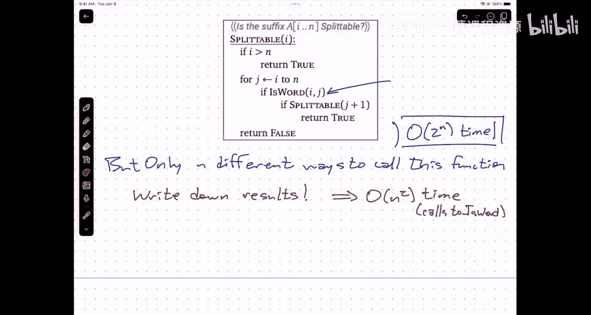

# 013：回溯算法


在本节课中，我们将学习一种新的递归算法——回溯算法。我们将通过几个经典例子，理解其核心思想：通过系统地尝试所有可能性来解决问题，即使这可能导致指数级的时间复杂度。我们首先关注算法的正确性，之后再考虑优化效率。

---

## 回溯算法简介

上一节我们介绍了分治算法，其核心是将大问题分解为规模按常数因子缩小的子问题。本节中，我们来看看回溯算法。它与分治算法类似，也是通过递归将问题分解为更小的子问题。但关键区别在于，回溯算法通常将规模为 `n` 的问题分解为规模为 `n-1` 或 `n-2` 的子问题，即规模是**加法式减小**，而非乘法式减小。这通常会导致算法具有指数级的时间复杂度。

在深入具体例子前，请记住一个适用于所有算法问题的通用建议：**先让它能运行，再让它运行得快**。我们首先关注如何构建一个能正确工作的算法。

---

## N皇后问题 👑

我们的第一个例子是著名的N皇后问题。问题描述是：在一个 `n x n` 的棋盘上放置 `n` 个皇后，使得它们彼此之间无法相互攻击（即不在同一行、同一列或同一对角线上）。

### 问题定义与递归思路

我们递归地解决这个问题。递归函数需要知道当前已经放置了哪些皇后，才能决定下一步的合法位置。因此，我们定义递归问题为：给定前 `r` 行皇后的位置，求解在剩余行放置皇后的所有可能方式。

以下是该算法的伪代码描述。核心思想是尝试当前行（第 `r` 行）所有可能的列位置，对于每个合法位置，放置皇后并递归处理下一行。

```python
def place_queens(Q, r, n):
    # Q: 数组，Q[i] 表示第 i 行皇后所在的列 (1 <= i <= r-1)
    # r: 当前要放置皇后的行号
    # n: 棋盘大小
    if r == n + 1:
        # 所有行都已放置皇后，找到一个解
        print_solution(Q)
    else:
        for j in range(1, n + 1): # 尝试当前行的每一列 j
            legal = True
            # 检查放置在第 r 行第 j 列的皇后是否与之前行 (1...r-1) 的皇后冲突
            for i in range(1, r):
                if (Q[i] == j) or (Q[i] == j + r - i) or (Q[i] == j - r + i):
                    legal = False
                    break
            if legal:
                Q[r] = j # 放置皇后
                place_queens(Q, r + 1, n) # 递归处理下一行
                # 递归返回后，尝试当前行的下一个位置（隐式“移除”皇后）
```

### 算法分析

该算法会系统地探索所有可能的放置组合。递归树可能非常庞大，最坏情况下的运行时间约为 `O(n^n)`，效率极低。然而，对于此类组合问题，这通常是已知的最佳方法之一。算法的正确性显而易见，因为它尝试了所有可能性。

---

## 双人完全信息游戏 🎮

上一节我们看了如何用回溯解决静态布局问题，本节中我们来看看如何将其应用于动态的双人游戏。

### 游戏树与必胜态/必败态

考虑一个简单的双人回合制游戏（如文中提到的“糖包游戏”或象棋）。游戏状态可以用一个位置和当前玩家来表示。我们可以构建一棵**游戏树**，根节点是初始状态，子节点是通过一步合法移动到达的状态。

我们的目标是判断在当前状态下，先手玩家是否存在**必胜策略**。我们递归定义：
*   **必胜态**：存在至少一步移动，可以引导游戏进入一个对对手而言的**必败态**。
*   **必败态**：所有可能的移动，都会引导游戏进入一个对对手而言的**必胜态**。

### 递归算法

基于此，我们可以设计一个递归的回溯算法来判断任意状态 `X` 对当前玩家 `P` 是必胜还是必败。

```python
def is_good_position(state, player):
    # state: 当前游戏状态
    # player: 当前轮到行动的玩家（‘我’或‘对手’）
    if state is a winning state for player:
        return True
    if state is a losing state for player:
        return False

    possible_moves = generate_all_legal_moves(state, player)
    for move in possible_moves:
        new_state = apply_move(state, move)
        # 如果存在一步移动能使对手陷入必败态，则当前状态是必胜态
        if not is_good_position(new_state, opponent(player)):
            return True
    # 所有移动都导致对手进入必胜态，则当前状态是必败态
    return False
```

### 与N皇后问题的区别

注意，在这个游戏算法中，递归子问题（`is_good_position(new_state, ...)`）的输入**只依赖于当前状态**，而不依赖于到达这个状态的历史路径。这与N皇后问题不同，在N皇后中我们需要记住之前所有皇后的位置。这种“无历史依赖”的特性在某些情况下是优化的关键。

---

## 字符串分解问题 🔤

现在，我们来看第三个例子：判断一个字符串是否能被分解为给定词典中的单词序列。这是一个更贴近实际的问题。

### 问题与递归分解

给定字符串 `A[1..n]` 和一个能判断子串是否为单词的函数 `isWord(w)`，我们需要判断 `A` 是否能写成一系列单词的连接。

递归思路非常直接：对于当前字符串（或后缀），我们尝试所有可能的前缀。如果某个前缀是一个单词，我们就“切掉”这个前缀，然后递归地判断剩余的后缀是否也能分解为单词序列。

### 递归算法

以下是该算法的两种等价表述。第一种更直观，第二种更高效（通过索引操作避免复制字符串）。

**表述一（直观）：**
```python
def splitable(suffix):
    if suffix is empty:
        return True # 空字符串可以分解为0个单词
    for i in range(1, len(suffix) + 1):
        prefix = suffix[0:i]
        rest = suffix[i:]
        if isWord(prefix) and splitable(rest):
            return True
    return False
# 初始调用: splitable(original_string)
```

**表述二（高效，使用索引）：**
```python
# A 是全局的输入字符串数组
def splitable(i):
    # 判断后缀 A[i..n] 是否可分解
    if i > n:
        return True # 空后缀
    for j in range(i, n + 1):
        # 检查子串 A[i..j] 是否为单词
        if isWord(A, i, j) and splitable(j + 1):
            return True
    return False
# 初始调用: splitable(1)
```

### 指数爆炸与重复子问题

该算法在最坏情况下（例如，每个子串都是单词）会尝试所有 `2^(n-1)` 种分割方式，运行时间为指数级 `O(2^n)`。

然而，观察函数 `splitable(i)`，它的输入参数 `i` 只有 `n+1` 种可能的值（`1` 到 `n+1`）。这意味着在整个庞大的递归树中，实际上只有 `O(n)` 个**不同的子问题**。指数级运行时间的根源在于，算法在递归过程中**反复计算了相同的子问题**。

例如，在计算 `splitable(7)` 时，可能会通过不同路径多次调用 `splitable(10)`。每次调用，算法都会重新进行完整的计算。

### 优化的关键：记忆化

这引出了一个强大的优化思想：**记忆化（Memoization）**。我们可以在第一次计算出 `splitable(i)` 的结果时，将其保存起来（例如，存入一个数组 `memo[i]`）。之后再次需要 `splitable(i)` 的结果时，直接查找 `memo[i]` 即可，无需重新计算。

这种方法能将算法的时间复杂度从指数级 `O(2^n)` 降低到多项式级 `O(n^2)`（因为最多有 `O(n)` 个子问题，每个子问题需要检查 `O(n)` 个前缀）。这，就是**动态规划**的核心思想之一。

---

## 总结

本节课中我们一起学习了回溯算法。我们通过三个例子深入理解了其核心模式：
1.  **N皇后问题**：通过递归尝试所有可能的放置，需要记录完整的历史决策。
2.  **双人游戏必胜策略**：通过递归探索游戏树，定义必胜态和必败态，通常只需关注当前状态。
3.  **字符串分解问题**：通过递归尝试所有可能的前缀分割，揭示了指数级递归中存在大量重复子问题。



回溯算法是一种“暴力但系统”的搜索方法，它确保我们能找到解（如果存在的话），但代价可能是极高的时间复杂度。然而，正如在字符串分解问题中看到的，识别并消除重复子问题的计算，是将其优化为高效算法（动态规划）的关键第一步。下节课，我们将正式进入动态规划的学习。