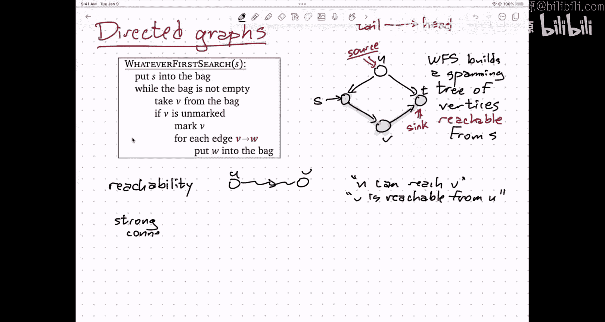
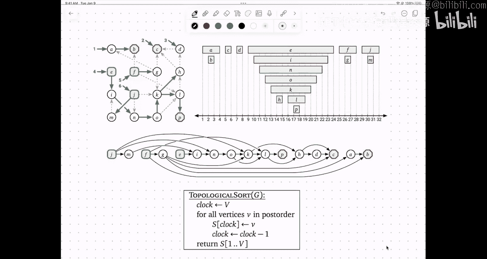

# 018：深度优先搜索、有向无环图与强连通分量


在本节课中，我们将要学习图算法家族中的一个重要成员——通用搜索算法，并重点探讨其变体深度优先搜索。我们将了解如何使用深度优先搜索来检测有向图中的环，以及如何识别有向图的强连通分量结构。

## 通用搜索算法概述

上一节我们开始讨论图算法，并介绍了一个通用的图遍历算法家族，称为“通用搜索”。其核心思想是使用一个名为“袋子”的数据结构来管理待访问的顶点。

一个“袋子”可以执行三种操作：
1.  将一个对象插入袋子。
2.  从袋子中取出一个对象（具体取出哪个取决于袋子的具体实现）。
3.  检查袋子是否为空。

以下是几种常见的“袋子”实现：
*   **栈**：后进先出。
*   **队列**：先进先出。
*   **优先队列**：根据优先级取出元素。

算法的基本流程如下：
1.  将起始顶点 `s` 放入袋子。
2.  当袋子不为空时：
    a. 从袋子中取出一个顶点 `v`。
    b. 如果 `v` 未被标记过，则标记它。
    c. 将 `v` 的所有（未标记的）邻居放入袋子。

该算法会标记所有从起点 `s` **可达**的顶点。其运行时间为 **O(V + E)**，其中 `V` 是可达顶点的数量，`E` 是可达边的数量。这是因为每个顶点最多被标记一次，每条边最多被处理两次（从两端各考虑一次）。

## 生成树与父指针

通用搜索算法可以稍作修改，为每个被发现的顶点（除了起点 `s`）记录一个“父”顶点。具体做法是，在将邻居 `w` 放入袋子时，同时记录 `v` 是 `w` 的父节点。

以下是修改后的算法伪代码：
```pseudocode
WhateverFirstSearch(s):
    mark(s)
    parent(s) = null
    bag.insert((null, s))
    while bag is not empty:
        (p, v) = bag.take()
        if v is unmarked:
            mark(v)
            parent(v) = p
            for each neighbor w of v:
                bag.insert((v, w))
```

这些父指针定义了一个以 `s` 为根的**生成树**，它覆盖了所有从 `s` 可达的顶点。这棵树具有以下性质：
*   恰好有 `V-1` 条父指针边。
*   这些边中**没有环**，因为父节点总是比子节点更早被发现。

## 深度优先搜索与广度优先搜索

根据所使用的“袋子”类型，通用搜索会演变成不同的具体算法，并产生不同形态的生成树。

**深度优先搜索**使用**栈**作为袋子。它倾向于深入探索一条路径，直到尽头再回溯，因此生成的树通常又深又窄。

**广度优先搜索**使用**队列**作为袋子。它从起点开始一层层向外探索，因此生成的树通常又宽又浅。更重要的是，在无权图中，广度优先搜索树中从根 `s` 到任意顶点 `v` 的路径，就是两者之间的**最短路径**（边数最少）。

## 无向图的应用

在无向图中，通用搜索算法可以解决几个基本问题：

**连通性**：判断两个顶点 `u` 和 `v` 是否连通（即是否存在路径）。只需从 `u` 开始运行搜索，检查 `v` 是否被标记即可。

**连通分量**：“连通”关系是一种等价关系。我们可以通过多次运行搜索来找出图的所有连通分量。算法如下：
```pseudocode
CountAndLabel(G):
    count = 0
    for all vertices v:
        if v is unmarked:
            count = count + 1
            WhateverFirstSearch(v, count) // 标记该分量所有顶点为 count
```
该算法的总运行时间仍然是 **O(V + E)**，因为每个顶点和每条边只被处理一次。

## 有向图：可达性与强连通性

将通用搜索算法应用于有向图时，流程基本相同，只是遍历的是有向边。算法会标记所有从起点 `s` 通过有向路径**可达**的顶点。




然而，在有向图中，“可达”关系**不是**对称的。`s` 可达 `t` 并不意味着 `t` 可达 `s`。因此，我们引入了**强连通**的概念：两个顶点 `u` 和 `v` 是强连通的，当且仅当 `u` 可达 `v` 且 `v` 可达 `u`。

强连通关系是一种等价关系，其等价类称为**强连通分量**。一个有向图的强连通分量具有一个关键性质：如果将每个强连通分量收缩为一个“超顶点”，那么得到的**分量图**（或称**凝聚图**）是一个**有向无环图**。这意味着分量之间的连接没有循环依赖。

识别所有强连通分量及其结构可以在 **O(V + E)** 时间内完成（例如使用 Kosaraju 或 Tarjan 算法）。

## 深度优先搜索的细节：时间戳与环检测

现在，让我们更深入地看看深度优先搜索。我们可以为算法添加“预处理”、“访问前”和“访问后”的钩子函数，并记录时间戳。

以下是记录时间戳的 DFS 伪代码：
```pseudocode
DFSAll(G):
    clock = 0
    for all vertices v:
        if v is unmarked:
            DFS(v)

DFS(v):
    previsit(v)        // 记录 pre(v) = ++clock
    mark(v)
    for each neighbor w of v:
        if w is unmarked:
            parent(w) = v
            DFS(w)
    postvisit(v)       // 记录 post(v) = ++clock
```

*   **前序编号** `pre(v)`：记录第一次递归进入顶点 `v` 的时间。
*   **后序编号** `post(v)`：记录完全处理完顶点 `v` 及其后代的时间。

顶点的**后序编号**有一个非常重要的应用：**检测有向环**。

**关键引理**：一个有向图 `G` 包含环，当且仅当图中存在一条边 `u -> v`，使得 `post(u) < post(v)`。

换句话说，如果存在一条从 `u` 到 `v` 的边，但 `u` 的后序编号却比 `v` 小（即 `u` 在 `v` 之后才结束处理），那么图中必然存在环。反之，如果一个有向图是无环的，那么按后序编号的**逆序**对顶点进行排序，得到的就是一个**拓扑排序**——所有边都从左指向右的线性顺序。

## 总结

本节课中我们一起学习了：
1.  **通用搜索算法**的核心框架及其运行时间分析 **O(V + E)**。
2.  通过记录父指针，搜索算法可以生成**生成树**。
3.  使用**栈**作为袋子得到**深度优先搜索**，使用**队列**得到**广度优先搜索**，后者可用于求解无权图最短路径。
4.  在无向图中，搜索算法可用于判断**连通性**和找出所有**连通分量**。
5.  在有向图中，我们引入了**强连通分量**的概念，其分量图构成一个**有向无环图**。
6.  深度优先搜索中的**后序编号**是强大的工具，可用于**检测有向环**，并为无环图生成**拓扑排序**。



理解这些基础的图遍历算法及其变体，是解决更复杂图论问题的基石。