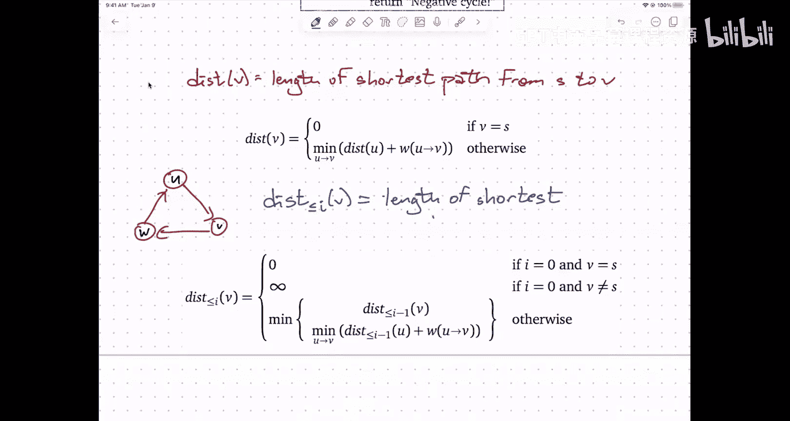

# 020：Dijkstra 与 Bellman-Ford 算法详解 🧭


在本节课中，我们将深入学习两种计算单源最短路径的核心算法：Dijkstra 算法和 Bellman-Ford 算法。我们将探讨它们的工作原理、适用场景以及背后的动态规划思想。

---

## 概述

所有最短路径算法都遵循一个通用策略：寻找并“松弛”那些“紧张”的边。对于一个顶点，我们维护一个距离值和一个前驱指针。如果存在一条从顶点 `u` 到顶点 `v` 的边，使得 `u.dist + w(u, v) < v.dist`，我们就称这条边是“紧张”的。松弛操作会更新 `v.dist` 为更小的值，并将 `v` 的前驱设置为 `u`。

通用策略的步骤如下：
1.  初始化：源点 `s` 的距离为 0，其他所有顶点的距离为无穷大。
2.  不断寻找并松弛紧张的边。
3.  当没有紧张的边时，前驱指针就构成了一棵最短路径树。

对于无权图（所有边权重为1），广度优先搜索（BFS）是线性时间的解决方案。对于有向无环图（DAG），按拓扑顺序松弛边也能在线性时间内解决问题。然而，对于具有任意权重的通用图，我们需要更强大的算法。

---

## Dijkstra 算法 🚀

上一节我们介绍了通用松弛策略，本节中我们来看看最著名的非负权重最短路径算法：Dijkstra 算法。它本质上是一种“最佳优先搜索”。

### 核心思想与数据结构

Dijkstra 算法使用一个优先队列（通常是最小堆）来管理顶点。每个顶点的优先级是其当前估计的距离。算法维护一个不变式：从优先队列中取出的顶点，其距离值就是最终的最短距离。

以下是算法依赖的优先队列操作：
*   `Insert(v, priority)`: 将顶点 `v` 以指定优先级插入队列。
*   `ExtractMin()`: 取出并返回队列中优先级最小的顶点。
*   `DecreaseKey(v, newPriority)`: 将已在队列中的顶点 `v` 的优先级降低为新值。

### 算法步骤

以下是 Dijkstra 算法的伪代码描述：

```pseudocode
Dijkstra(G, s):
    for each vertex v in G:
        v.dist = INFINITY
        v.pred = NULL
    s.dist = 0
    Initialize PriorityQueue Q
    Q.Insert(s, s.dist)

    while Q is not empty:
        u = Q.ExtractMin()
        for each edge (u, v) in G.adjacentEdges(u):
            if u.dist + w(u, v) < v.dist: // 边 (u, v) 紧张
                v.dist = u.dist + w(u, v) // 松弛
                v.pred = u
                if v is in Q:
                    Q.DecreaseKey(v, v.dist)
                else:
                    Q.Insert(v, v.dist)
```

### 算法演示与正确性

让我们通过一个例子来理解算法的执行过程。假设源点 `s` 在底部。
1.  初始时，只有 `s`（距离0）在优先队列中。取出 `s`，松弛其出边，更新邻居距离并加入队列。
2.  接下来，取出队列中距离最小的顶点（例如距离3的顶点），松弛其出边。如果松弛成功，则更新目标顶点的距离（可能需要 `DecreaseKey` 或 `Insert`）。
3.  重复此过程，直到队列为空。最终，所有顶点的距离值收敛为最短距离，前驱指针形成最短路径树。

Dijkstra 算法正确性的关键基于两个观察（在**所有边权非负**的前提下）：
1.  **距离值单调不增**：任何顶点的 `v.dist` 在整个算法过程中只会减小（当被松弛时），不会增加。
2.  **出队距离单调不减**：从优先队列中取出的顶点的距离值是单调不减的。因为每次取出最小距离顶点 `u` 后，通过它松弛得到的任何新距离 `v.dist` 都满足 `v.dist = u.dist + w(u, v) >= u.dist`。

这两个性质共同保证了**每个顶点最多被从优先队列中取出一次**。因为如果同一个顶点被取出两次，根据性质2，第二次的距离必须大于等于第一次；但根据性质1，它的距离只可能比第一次更小或相等，这产生了矛盾。

### 时间复杂度分析

基于上述“每个顶点最多出队一次”的结论：
*   `ExtractMin` 操作最多执行 **V** 次。
*   每条边最多在其尾顶点被取出时检查并可能松弛一次，因此 `Relax`（及其内部的 `DecreaseKey` 或 `Insert`）操作最多执行 **E** 次。
*   每个优先队列操作（`Insert`, `ExtractMin`, `DecreaseKey`）的时间复杂度为 **O(log V)**。

因此，Dijkstra 算法的总时间复杂度为 **O((V + E) log V)**。对于连通图（E >= V-1），通常简写为 **O(E log V)**。

---

## 处理负权边的情况 ⚠️

上一节我们分析了 Dijkstra 算法在非负权图上的优异表现，本节中我们来看看当图中存在负权边时会发生什么，并介绍能处理这种情况的 Bellman-Ford 算法。

### Dijkstra 算法与负权边

如果图中存在负权边，Dijkstra 算法的核心正确性保证会被打破。那个“出队即确定最短距离”的不变式不再成立。因为通过一个当前距离较大的顶点，经由负权边，可能得到一条到达某个已出队顶点的更短路径。

在这种情况下，原始的、允许将顶点重新插入优先队列的 Dijkstra 算法（即通用松弛策略）仍然有效（只要没有负权环）。但最坏情况下，一个顶点可能被多次插入和取出，导致运行时间退化，甚至可能达到指数级。不过，如果负权边数量很少（例如常数个），算法效率仍然可以接受。

对于存在负权环的图，最短路径问题本身可能无解（可以无限绕环降低总距离），任何基于松弛的算法都可能陷入无限循环。

### Bellman-Ford 算法 🛡️

为了系统性地、高效地处理具有任意权重（包括负权）且无负权环的图，我们使用 Bellman-Ford 算法。它的运行时间为 **O(V * E)**，虽然比 Dijkstra 慢，但更具普适性。它也可以用于检测图中是否存在负权环。

#### 动态规划视角

Bellman-Ford 算法可以从动态规划的角度优雅地推导出来。我们定义状态：
`dist[i][v]` = 从源点 `s` 到顶点 `v`，**最多使用 `i` 条边**的最短路径长度。

我们有以下递推关系（Bellman 方程）：
*   **基础情况**：`dist[0][s] = 0`；对于 `v != s`，`dist[0][v] = ∞`（不使用边无法到达其他点）。
*   **递推关系**：对于 `i > 0`，
    `dist[i][v] = min( dist[i-1][v], min_{(u, v) in E} ( dist[i-1][u] + w(u, v) ) )`
    解释：到 `v` 最多用 `i` 条边的最短路径，要么根本没用满 `i` 条边（即 `dist[i-1][v]`），要么其最后一条边是 `(u, v)`，那么路径就是 `s -> ... -> u`（最多 `i-1` 条边）加上边 `(u, v)`。

由于最短路径不可能包含正环（可删除）或负环（无解），因此最多包含 **V-1** 条边。这意味着我们只需要计算 `i` 从 0 到 V-1 的情况，最终的 `dist[V-1][v]` 就是真正的最短距离。

#### 算法简化与最终形式




根据上述 DP 思路，我们可以写出一个二维 DP 算法。但观察发现，计算 `dist[i][v]` 时只依赖于 `dist[i-1][*]`。因此，我们可以将二维数组压缩成两个一维数组，进一步地，我们可以只用**一个**一维数组 `dist[v]`，并在每一轮 `i` 中，用上一轮的结果松弛所有边。

这直接导出了 Bellman-Ford 算法的经典形式：

```pseudocode
BellmanFord(G, s):
    for each vertex v in G:
        v.dist = INFINITY
        v.pred = NULL
    s.dist = 0

    for i = 1 to |V| - 1:
        for each edge (u, v) in G.edges:
            if u.dist + w(u, v) < v.dist: // 边 (u, v) 紧张
                v.dist = u.dist + w(u, v) // 松弛
                v.pred = u

    // 检查负权环：如果还能松弛，则存在负权环
    for each edge (u, v) in G.edges:
        if u.dist + w(u, v) < v.dist:
            report "Graph contains a negative-weight cycle"
```

**外层循环 `V-1` 次**：这对应于动态规划中考虑路径边数从 1 增加到 V-1。
**内层循环遍历所有边**：在每一轮中，尝试松弛所有边。
**负环检测**：完成 V-1 轮松弛后，如果还能找到紧张的边，则说明图中存在负权环。

#### 时间复杂度与理解

*   时间复杂度很明显是 **O(V * E)**。
*   算法可以理解为：第一轮循环后，`dist[v]` 存储的是从 `s` 出发，**最多经过 1 条边**到达 `v` 的最短距离。第二轮后，存储的是**最多经过 2 条边**的最短距离…… 第 V-1 轮后，存储的就是**最多经过 V-1 条边**的最短距离，也就是全局最短距离。

---

## 总结

本节课中我们一起学习了两种最重要的单源最短路径算法：
1.  **Dijkstra 算法**：适用于**边权非负**的图。采用优先队列实现最佳优先搜索，时间复杂度为 **O(E log V)**。其正确性依赖于非负权重的假设，确保每个顶点只需处理一次。
2.  **Bellman-Ford 算法**：适用于**任意权重**（可正可负）且**无负权环**的图。基于动态规划思想，通过进行 **V-1** 轮全局边的松弛来逐步逼近最短路径，时间复杂度为 **O(V * E)**。它还能用于检测图中是否存在负权环。

选择算法的经验法则：
*   边权非负 → 优先使用 **Dijkstra**。
*   边权有负，或需要检测负环 → 使用 **Bellman-Ford**。
*   图是 DAG → 使用基于拓扑排序的线性时间算法。
*   图无权 → 使用 **BFS**。


理解这些算法背后的松弛策略和动态规划思想，比记忆代码更为重要。