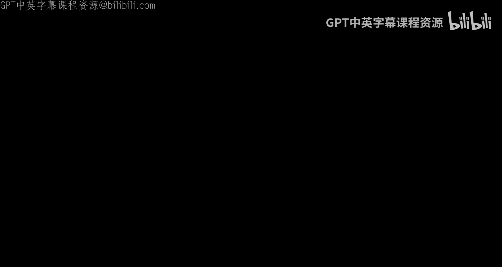
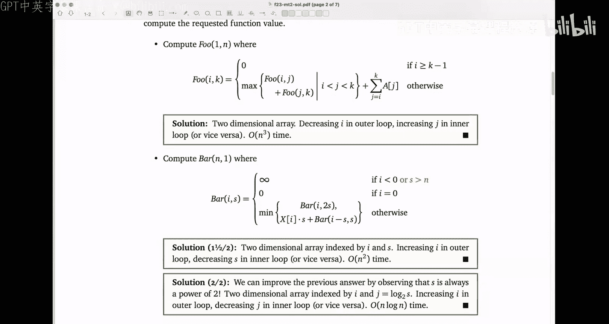
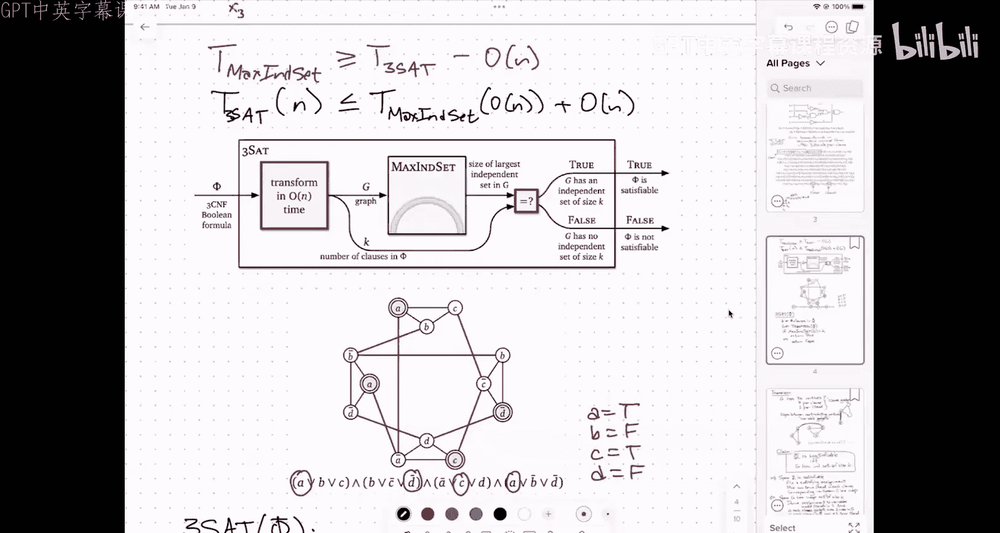

# 025：P、NP、NP-难、SAT、3SAT、规约到最大独立集

在本节课中，我们将学习计算复杂性理论中的核心概念：P类、NP类、NP-难问题，以及如何通过规约证明一个问题是NP-难的。我们将以布尔可满足性问题（SAT）及其特例3SAT为例，并展示如何将3SAT规约到最大独立集问题。

---

## 课程概述

本节课我们将探讨计算复杂性理论的基础。我们将定义P类和NP类问题，理解它们之间的区别与联系。我们将介绍布尔可满足性问题（SAT）及其特例3SAT，并学习如何通过多项式时间规约，证明最大独立集问题是NP-难的。理解这些概念是学习算法理论中更高级主题的关键。

---

## P类与NP类

上一节我们回顾了考试相关问题，本节中我们来看看计算复杂性理论的核心分类。

**P类** 是指所有能在多项式时间内被**确定性**图灵机解决的问题。简单来说，存在一个算法，其运行时间与输入规模的多项式成正比，可以准确解决问题。例如，判断一个电路是否能点亮灯泡（给定具体输入设置后），只需按拓扑顺序遍历电路即可在多项式时间内完成。

**NP类** 是指所有能在多项式时间内被**非确定性**图灵机解决的问题。更直观的理解是：如果问题的答案是“是”，那么存在一个简短的“证明”或“证书”，我们可以在多项式时间内验证这个证明的正确性。例如，对于布尔电路可满足性问题（SAT），如果答案是“是”，那么一个令灯泡点亮的输入设置就是一个证书，我们可以快速验证它。

非确定性可以理解为“幸运猜测”或“并行宇宙分支”。当算法面临选择时（例如，猜测一个变量的值），它会同时探索所有可能性。只要有一个分支最终成功，我们就认为问题可解。

**P与NP的关系** 是理论计算机科学的核心开放问题：P是否等于NP？即，所有容易验证解的问题，是否也都能容易地找到解？多数研究者认为P ≠ NP，但这尚未被证明。

---

## 布尔电路与SAT问题

上一节我们介绍了P和NP的定义，本节中我们来看看一个具体的NP问题：布尔可满足性问题。

一个**布尔电路** 由逻辑门（与门、或门、非门）和导线组成，计算布尔函数。输入是开关（代表布尔变量），输出是一个灯泡（代表布尔值）。电路可以表示为一个有向无环图。

**电路可满足性问题（Circuit SAT）** 是指：给定一个布尔电路的描述，是否存在一组输入设置（即各开关的开/关），使得输出灯泡点亮（即电路输出为真）。

*   验证一个给定的输入设置是否能点亮灯泡是容易的（P问题）：只需按拓扑顺序计算即可。
*   但是，**从头开始**寻找这样一个设置（如果存在的话）被认为是困难的。最朴素的方法是尝试所有2^n种可能的输入组合。

---

## 3SAT问题

上一节我们讨论了一般的电路SAT问题，本节中我们来看看一个更标准、更常用的形式：3SAT。

**3SAT** 是布尔可满足性问题的一个特例。其输入是一个布尔公式，该公式必须是**合取范式（CNF）**，且每个子句恰好包含**3个文字**。

*   **文字**：一个布尔变量或其否定（例如 `x` 或 `¬x`）。
*   **子句**：多个文字的析取（逻辑或）。在3SAT中，每个子句恰好包含三个文字（例如 `(x ∨ ¬y ∨ z)`）。
*   **公式**：多个子句的合取（逻辑与）。例如：
    `(A ∨ B ∨ C) ∧ (¬B ∨ D ∨ ¬E) ∧ (¬A ∨ C ∨ F)`

**3SAT问题** 是：给定这样一个3CNF公式，是否存在对各个变量的真值赋值，使得**整个公式**为真？即使得**每一个子句**中至少有一个文字为真。

**重要说明**：3SAT本身是一个**NP-完全**问题（我们将在后续课程中精确定义）。这意味着它是NP类中“最难”的问题之一。目前没有已知的多项式时间算法来解决它，并且如果任何一个NP-完全问题存在多项式时间算法，则P=NP。

---

## NP-难与规约

上一节我们定义了3SAT问题，本节中我们来看看如何利用“规约”来证明其他问题的难度。

**规约** 是将一个问题（A）转化为另一个问题（B）的过程，使得如果我们可以解决B，那么我们也就能解决A。在复杂性理论中，我们使用**多项式时间规约**：转化过程本身必须在多项式时间内完成。

如果我们可以将一个已知的NP-难问题（如3SAT）多项式时间规约到问题X，那么我们就证明了X至少和3SAT一样难。因此，X也是**NP-难的**。这意味着，如果X存在多项式时间算法，那么3SAT（以及所有NP问题）也将存在多项式时间算法，即P=NP。由于我们相信P≠NP，因此X不可能存在多项式时间算法。

这是一种**反证法**思路：假设X有高效算法 → 通过规约，3SAT也有高效算法 → 这与“3SAT是难的”共识矛盾 → 故假设不成立，X没有高效算法。

---

## 从3SAT规约到最大独立集

上一节我们介绍了规约的概念，本节中我们来看一个具体的规约例子：将3SAT问题规约到**最大独立集问题**。

**最大独立集问题**：给定一个无向图，找出一个最大的顶点集合，使得集合中任意两个顶点之间都没有边直接相连。这个集合的大小称为图的最大独立集大小。

以下是规约的步骤概要：

1.  **输入**：一个3CNF公式 `φ`，假设它有 `k` 个子句。
2.  **构造图 G**：
    *   对于公式中的每一个子句，创建一个由3个顶点组成的“三角形子句构件”。这3个顶点分别标记为该子句中的3个文字。
    *   对于图中任意两个标记为**互补文字**（如 `x` 和 `¬x`）的顶点，在它们之间添加一条边。这些边构成了“变量一致性构件”。
3.  **输出与判断**：构造图G后，询问图G的**最大独立集大小**是否等于子句数量 `k`。
    *   如果等于 `k`，则原始公式 `φ` 是可满足的。
    *   如果小于 `k`，则原始公式 `φ` 是不可满足的。

**规约正确性思路**：
*   **如果φ可满足**：取一个满足赋值。在每个子句中，至少有一个文字为真。从每个子句构件中，选取一个对应真文字的顶点。这些顶点来自不同的三角形，彼此间无边（三角形内顶点相连，但每个三角形只选一个）。同时，由于赋值一致，不会同时选取 `x` 和 `¬x`，因此由红边连接的顶点也不会同时被选。这样我们就得到了一个大小为 `k` 的独立集。
*   **如果G有一个大小为k的独立集**：由于每个三角形子句构件中至多能选一个顶点（否则它们之间有边），大小为k意味着每个三角形恰好贡献了一个顶点。我们可以将这些顶点对应的文字设为真，并据此给变量赋值（如果出现矛盾，由于红边的存在，矛盾的文字不会同时被选中）。这样每个子句都至少有一个文字为真，因此φ可满足。

这个构造过程显然是多项式时间的（遍历公式即可）。因此，如果我们能在多项式时间内解决最大独立集问题，我们就能在多项式时间内解决3SAT问题。由于3SAT是NP-难的，这证明了**最大独立集问题也是NP-难的**。

---

## 课程总结

本节课我们一起学习了计算复杂性理论的核心概念。
*   我们定义了**P类**（可在多项式时间内确定性地解决的问题）和**NP类**（可在多项式时间内验证“是”答案的问题）。
*   我们介绍了**布尔可满足性问题（SAT）** 及其特例**3SAT**，这是经典的NP-完全问题。
*   我们学习了**规约**的概念，它是证明问题计算难度的关键工具。
*   最后，我们通过一个具体的例子，展示了如何将**3SAT问题多项式时间规约到最大独立集问题**，从而证明最大独立集是NP-难的。

理解这些基础是探索更广阔的计算复杂性世界和算法设计极限的第一步。