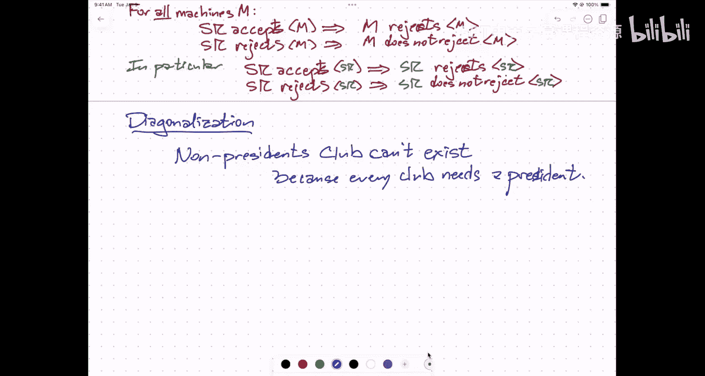

# 028：不可判定性

在本节课中，我们将要学习计算理论中的一个核心概念：不可判定性。我们将了解什么是不可判定的问题，并通过一个经典的证明来理解为什么某些问题不存在任何算法可以解决它们。

## 课程概述与安排

上一节我们介绍了NP难问题，其核心是“没有快速算法”。本节中我们来看看一个更极端的概念：不可判定性，即“没有任何算法”。

首先，我们来看一下课程近期的安排。以下是需要大家注意的事项：

*   **引导式习题集**：一份简短的习题集已发布，一周后截止，内容关于不可判定性。
*   **家庭作业12**：仅供练习，同样关于不可判定性。
*   **期末考试**：定于12月8日（周五）上午8点。若有时间冲突，请尽快填写冲突考试登记表。
*   **成绩复议**：期中考试1和部分作业的成绩复议已处理。若对GradeScope上的复议结果不满意且复议窗口已关闭，可使用另一个专用表单提交后续请求。
*   **教学评估**：请通过学校的ICES系统填写课程和讨论课评估。此外，我们还为助教（TA）和课程助理（CA）设置了单独的匿名反馈表。
*   **课程相关调查**：关于合作学习、引导式习题集体验以及本学期延期政策的两份调查即将发布。若提交人数超过班级总人数的40%，全体同学将获得额外学分。
*   **PrairieLearn开发团队招聘**：春季学期招聘开发人员，申请表稍后发布。
*   **课程助理（CA）申请**：春季学期374课程的CA申请表格将由授课教师稍后发布。

## 从NP难到不可判定

我们之前讨论的NP难问题，如**3SAT**或旅行商问题，存在算法，但最坏情况下需要指数时间。例如，对于有n个变量的3SAT问题，暴力尝试所有`2^n`种变量赋值组合的算法总能给出正确答案。

然而，存在另一类问题，它们**没有任何算法**能在有限时间内对任意输入给出是/否的答案。这就是不可判定问题。

## 一个例子：波斯特对应问题

为了直观理解，我们首先看一个称为**波斯特对应问题**的例子。

**问题描述**：给定n个**卡片类型**，每种类型有无限张相同的卡片。每张卡片上半部分（蓝色）有一个字符串，下半部分（红色）有一个字符串。目标是选择一系列卡片（每种类型可使用任意次），使得将这些卡片按顺序排列后，**上半部分拼接成的字符串**与**下半部分拼接成的字符串**完全相同。

**示例1（有解）**：
假设有三种卡片：
1.  上半: `1`， 下半: `101`
2.  上半: `10`， 下半: `00`
3.  上半: `0`， 下半: `011`

可以按顺序 `[1, 3, 2, 3]` 选择卡片：
*   顶部拼接：`1` + `0` + `10` + `0` = `10100`
*   底部拼接：`101` + `011` + `00` + `011` = `10100011`
此例无解。实际上，可以证明**不存在任何算法**能正确判定任意给定的波斯特对应问题实例是否有解。即使对于只有3种卡片类型的情况，我们也不知道它是否可判定。

## 不可判定性的核心：程序与数据

要理解不可判定性的深层原因，我们需要思考程序和数据的本质。

*   **程序（代码）**：一个可以执行计算的实体，例如一个编译后的可执行文件或一个物理的图灵机。
*   **程序描述（数据）**：描述该程序的字符串，例如源代码。任何程序的源代码本身就是一个文本文件，可以被其他程序（如编译器或解释器）读取和处理。

关键在于，**程序描述可以作为数据输入给另一个程序（甚至自己）**。编译器将源代码（数据）转换为可执行代码（程序）。通用图灵机（或Python解释器）读取一个程序的描述（数据），并模拟该程序的行为。

我们引入记号：
*   `M`：表示机器或程序本身。
*   `<M>`：表示机器`M`的描述（即其源代码）。

## 停机问题与“自拒绝”问题

一个著名的不可判定问题是**停机问题**：判断一个给定程序在特定输入上是否会无限运行（即“停机”）。我们通过一个更具体的问题来证明其不可判定性：“自拒绝”问题。

**“自拒绝”问题定义**：给定一个程序`M`的描述`<M>`，问：当`M`以自己的描述`<M>`作为输入运行时，它是否会在有限时间内**拒绝**这个输入（即输出“否”）？

**证明（反证法）**：
1.  **假设**存在一个程序`SR`，它能完美判定“自拒绝”问题。即，对于任何输入`<M>`：
    *   如果`M`拒绝`<M>`，则`SR(<M>)`接受（输出“是”）。
    *   如果`M`不拒绝`<M>`（即接受或无限循环），则`SR(<M>)`拒绝（输出“否”）。
    *   `SR`自身总是能在有限时间内停机。
2.  **现在考虑`SR`以自己的描述`<SR>`作为输入运行会发生什么**：
    *   **情况1**：假设`SR(<SR>)`接受。根据`SR`的定义，这意味着`SR`拒绝`<SR>`。矛盾。
    *   **情况2**：假设`SR(<SR>)`拒绝。根据`SR`的定义，这意味着`SR`不拒绝`<SR>`。由于`SR`总是停机，这意味着`SR`接受`<SR>`。矛盾。
3.  无论哪种情况都导致矛盾。因此，最初的假设不成立。
4.  **结论**：这样的程序`SR`**不可能存在**。“自拒绝”问题是不可判定的。

这个证明运用了**对角化**思想，类似于“非主席俱乐部”悖论：一个规定“会员不得是任何社团的主席”的俱乐部，其自身的主席人选将导致逻辑矛盾，因此这个俱乐部无法成立。

## 总结

本节课中我们一起学习了计算理论中的**不可判定性**概念。我们首先通过**波斯特对应问题**直观感受了不存在任何算法的问题。然后，我们深入探讨了**程序与其描述**的关系，并通过对角化方法，证明了**“自拒绝”问题**是不可判定的。这个证明的核心在于展示了假设存在判定程序会导致**逻辑上的自相矛盾**。在下一节中，我们将学习如何利用这种不可判定性，通过**规约**来证明其他问题的不可判定性。