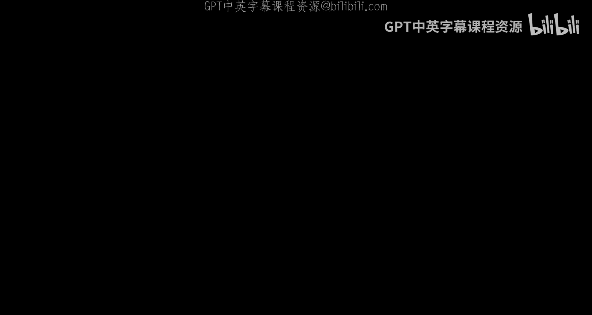
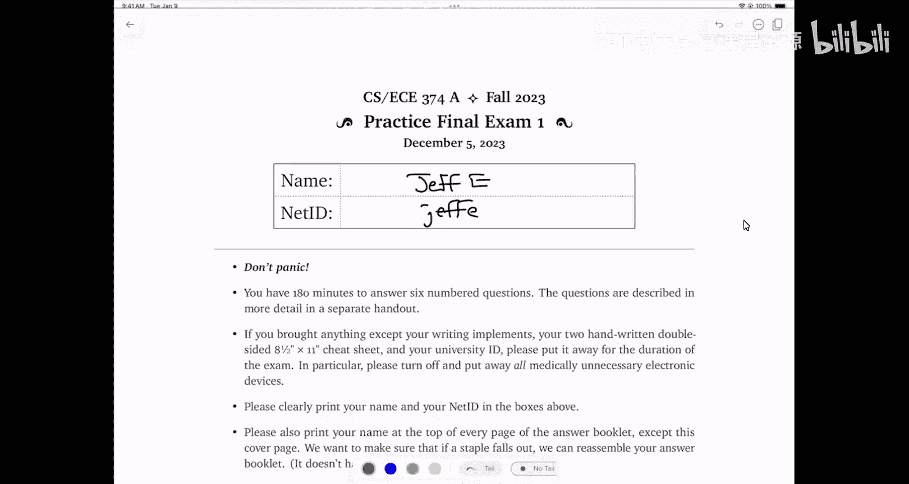

# 030：期末复习（第二部分）🎓



在本节课中，我们将继续讲解期末模拟考试中剩余的问题。我们将逐一分析每个问题，并提供清晰的解题思路和答案。课程内容涵盖动态规划、正则语言、NP完全性、图论以及有向无环图（DAG）等核心概念。

---

## 问题一：判断题 ✅❌

以下是判断题部分。对于每个陈述，如果该陈述在所有情况下都成立，请勾选“是”；否则，请勾选“否”，并给出简要解释。我们假设P ≠ NP。

### 1. 递归式 `T(n) = 8T(n/2) + n²` 的解是 `T(n) = O(n²)`。

**答案：否** ❌

**解释：**
我们可以通过递归树来分析。根节点的代价是 `n²`，第一层有8个子问题，每个子问题的规模是 `(n/2)² = n²/4`，因此第一层的总代价是 `8 * (n²/4) = 2n²`。第二层有64个子问题，每个规模为 `(n/4)² = n²/16`，总代价为 `4n²`。这是一个递增的几何级数，总代价由叶子节点决定。叶子节点数量为 `n^(log₂8) = n³`，因此总时间复杂度为 `O(n³)`，而不是 `O(n²)`。

### 2. 递归式 `T(n) = 2T(n/8) + n²` 的解是 `T(n) = O(n²)`。

**答案：是** ✅

**解释：**
同样使用递归树分析。根节点代价为 `n²`，第一层有2个子问题，每个代价为 `(n/8)² = n²/64`，总代价为 `2 * (n²/64) = n²/32`。这是一个快速衰减的几何级数，总代价由根节点主导，因此为 `O(n²)`。

### 3. 每个有向无环图（DAG）都至少有一个汇点（sink）。

**答案：是** ✅

**解释：**
汇点是指只有入边、没有出边的顶点。假设一个DAG中没有汇点，那么从任意顶点出发，总可以沿着出边走到另一个顶点。由于图是无环的，这条路径不能无限延伸，最终会到达一个没有出边的顶点，即汇点。因此，每个DAG都至少有一个汇点。

### 4. 对于任何无向图，我们都可以使用广度优先搜索（BFS）或深度优先搜索（DFS）在线性时间内计算出一棵生成树。

**答案：否** ❌

**解释：**
生成树要求图是连通的。如果图不连通，BFS或DFS只能得到包含起始顶点的连通分量的生成树，而无法得到整个图的生成树。因此，该陈述不成立。

### 5. 对于动态规划递推式 `dp[i][j] = dp[i][j-1] + dp[i-1][j] + dp[i+1][j+1]`，可以通过外层循环递增 `i`、内层循环递增 `j` 的顺序正确计算。

**答案：否** ❌

**解释：**
该递推式存在循环依赖。为了计算 `dp[i][j]`，需要 `dp[i+1][j+1]` 的值，但按照给定的顺序，`dp[i+1][j+1]` 会在 `dp[i][j]` 之后才被计算。实际上，依赖图中存在环，因此没有任何计算顺序可以正确计算该递推式。

---

## 问题二：语言与复杂性 🧠

对于以下每个陈述，判断是否存在至少一种语言 `L` 使其成立。

### 1. `L* = L**`

**答案：是** ✅

**解释：**
例如，令 `L = {1}`，则 `L* = 1*`，且 `L** = (1*)* = 1*`，两者相等。

### 2. `L` 是可判定的，但 `L*` 是不可判定的。

**答案：否** ❌

**解释：**
如果 `L` 是可判定的，我们可以使用动态规划（如文本分割算法）在多项式时间内判定 `L*`。因此，`L*` 也是可判定的。

### 3. `L` 既不是正则语言，也不是NP难问题。

**答案：是** ✅

**解释：**
例如，语言 `L = {0ⁿ1ⁿ | n ≥ 0}` 不是正则语言（使用泵引理可证），但可以在线性时间内判定，因此属于P类。假设P ≠ NP，则 `L` 不是NP难问题。

### 4. `L ∈ P` 且 `L` 有无限泵引理。

**答案：是** ✅

**解释：**
同样以 `L = {0ⁿ1ⁿ | n ≥ 0}` 为例，它属于P类，且不是正则语言，因此具有无限泵引理。

### 5. 图灵机编码的语言 `{⟨M⟩ | L(M) 不可判定}` 是不可判定的。

**答案：是** ✅

**解释：**
根据莱斯定理，任何关于图灵机语义的非平凡性质都是不可判定的。这里询问的是图灵机接受的语言是否可判定，这是一个非平凡性质，因此不可判定。

---

## 问题三：有向图与NP完全性 🔗

考虑以下两个语言：
- **有向哈密顿路径（DHP）**：包含有向哈密顿路径的有向图。
- **无环图（DAG）**：不包含环的有向图。

### 1. DAG ∈ NP

**答案：是** ✅

**解释：**
给定一个图，如果它是无环的，我们可以通过深度优先搜索在多项式时间内验证这一点。因此，DAG ∈ P ⊆ NP。

### 2. DAG ∩ DHP ∈ P

**答案：是** ✅

**解释：**
要判断一个图是否同时是无环图且包含哈密顿路径，可以先使用DFS检查是否有环（多项式时间），如果是DAG，再使用动态规划求最长路径（多项式时间）。如果最长路径长度等于顶点数减一，则存在哈密顿路径。

### 3. DHP 是可判定的

**答案：是** ✅

**解释：**
虽然DHP是NP难问题，但可以通过枚举所有顶点排列（共 `n!` 种）并在多项式时间内检查每条路径是否为哈密顿路径来判定。尽管该算法时间复杂度极高，但它确实是一个算法，因此DHP是可判定的。

### 4. 从一个问题到另一个问题的多项式时间归约意味着 P = NP

**答案：仅当从 DHP 归约到 DAG 时成立** ✅

**解释：**
- 如果存在从DHP到DAG的多项式时间归约，且DAG ∈ P，则DHP ∈ P，从而 P = NP。
- 如果存在从DAG到DHP的多项式时间归约，这仅意味着我们有一个低效的算法解决DAG，不能推出 P = NP。

---

## 问题四：多项式时间归约 🔄

假设存在从语言 `A` 到语言 `B` 的多项式时间归约，且 P ≠ NP。判断以下陈述是否总是成立。

### 1. `A ⊆ B`

**答案：否** ❌

**解释：**
归约不要求子集关系。例如，`A = 0*`，`B = 1*`，通过将0替换为1的归约，`A` 可以归约到 `B`，但 `A` 不是 `B` 的子集。

### 2. 如果 `B ∈ P`，则 `A ∈ P`

**答案：是** ✅

**解释：**
根据多项式时间归约的定义，如果 `B` 可以在多项式时间内解决，且存在从 `A` 到 `B` 的多项式时间归约，则 `A` 也可以在多项式时间内解决。

### 3. 如果 `B` 是NP难问题，则 `A` 是NP难问题

**答案：否** ❌

**解释：**
归约方向错误。正确的方向是：如果 `A` 是NP难问题，且存在从 `A` 到 `B` 的多项式时间归约，则 `B` 是NP难问题。

### 4. 如果 `B` 是正则语言，则 `A` 是正则语言

**答案：否** ❌

**解释：**
多项式时间归约可以执行复杂的计算，不一定保持正则性。例如，`A` 可以是非正则语言，但通过归约调用 `B` 的DFA。

### 5. 如果 `B` 是正则语言，则 `A` 是可判定的

**答案：是** ✅

**解释：**
正则语言属于P类，因此 `B ∈ P`。根据归约性质，`A ∈ P`，从而 `A` 是可判定的。

---

## 问题五：骨牌覆盖问题 🀄

我们有一个 `2 × n` 的网格，每个格子有一个整数值。使用 `2 × 1` 的骨牌覆盖网格，垂直骨牌覆盖的格子值相加，水平骨牌覆盖的格子值相减，求最大总得分。

### 动态规划解法

定义 `dp[i]` 为覆盖第 `i` 列到第 `n` 列的最大得分。递推关系如下：

```
dp[i] = max(
    value[i][1] + value[i][2] + dp[i+1],  // 放置垂直骨牌
    -value[i][1] - value[i][2] - value[i+1][1] - value[i+1][2] + dp[i+2]  // 放置两个水平骨牌
)
```

边界条件：
- 如果 `i > n`，`dp[i] = 0`
- 如果 `i == n`，只能放置垂直骨牌

从右向左计算 `dp[1]`，时间复杂度为 `O(n)`。

---

## 问题六：正则语言与泵引理 🔤

### 1. 设计DFA、NFA和正则表达式

语言 `L`：所有0后面都至少紧跟一个1的字符串。

- **正则表达式**：`(1 + 01)*`
- **DFA**：
  - 状态 `q0`（起始状态，接受状态）：读1留在 `q0`，读0转到 `q1`
  - 状态 `q1`：读1回到 `q0`，读0转到拒绝状态

### 2. 证明语言非正则

语言 `LB`：所有游程长度严格递增的字符串。

使用泵引理证明。考虑语言中只有两个游程的字符串子集，例如第一个游程是0，第二个游程是1。令 `F = {0^i | i ≥ 1}`。对于任意两个不同的字符串 `0^i` 和 `0^j`（假设 `i < j`），取 `z = 1^j`。则 `0^i 1^j ∈ LB`，但 `0^j 1^j ∉ LB`。因此，`F` 是无限混淆集，`LB` 不是正则语言。

---

## 问题七：山地徒步问题 ⛰️

给定一个 `n × n` 的高度网格，每次只能向四个方向移动，且相邻格子高度差不超过 `Δ`。徒步路线必须先严格上升，后严格下降。求最长徒步路线长度。

### 解法：构建有向无环图（DAG）

1. **顶点**：为每个网格点 `(i, j)` 创建两个顶点 `(i, j, up)` 和 `(i, j, down)`，分别代表上升阶段和下降阶段。
2. **边**：
   - **上升边**：从 `(i, j, up)` 到邻居 `(i', j', up)`，如果高度严格增加且差 ≤ Δ。
   - **下降边**：从 `(i, j, down)` 到邻居 `(i', j', down)`，如果高度严格减少且差 ≤ Δ。
   - **转换边**：从 `(i, j, up)` 到 `(i, j, down)`，表示从上升转为下降。
3. **权重**：所有边权重为1，转换边权重为0。
4. **最长路径**：在DAG中，从 `(s, up)` 到 `(t, down)` 的最长路径即为所求。使用动态规划求DAG最长路径，时间复杂度 `O(V + E) = O(n²)`。

---

## 总结 📚

本节课我们一起完成了期末模拟考试的所有问题，涵盖了算法与计算模型的核心知识点：

1. **递归式分析**：通过递归树判断时间复杂度。
2. **语言与复杂性**：理解正则语言、可判定性、P与NP的关系。
3. **NP完全性**：掌握多项式时间归约及其含义。
4. **动态规划**：解决骨牌覆盖等最优化问题。
5. **正则语言**：设计自动机并使用泵引理证明非正则性。
6. **图论算法**：将实际问题转化为DAG最长路径问题。



希望本教程能帮助你巩固知识，为期末考试做好充分准备。祝你考试顺利！