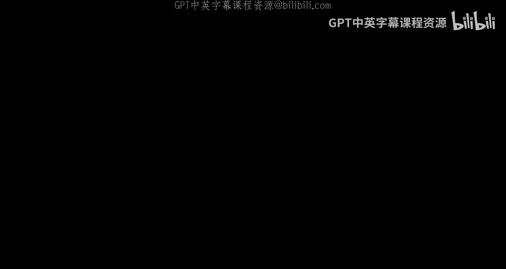
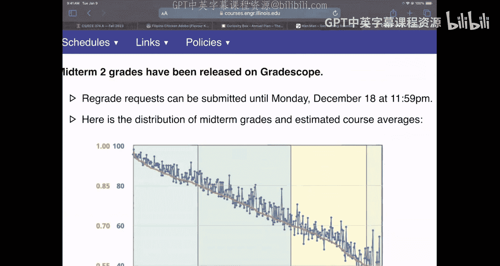
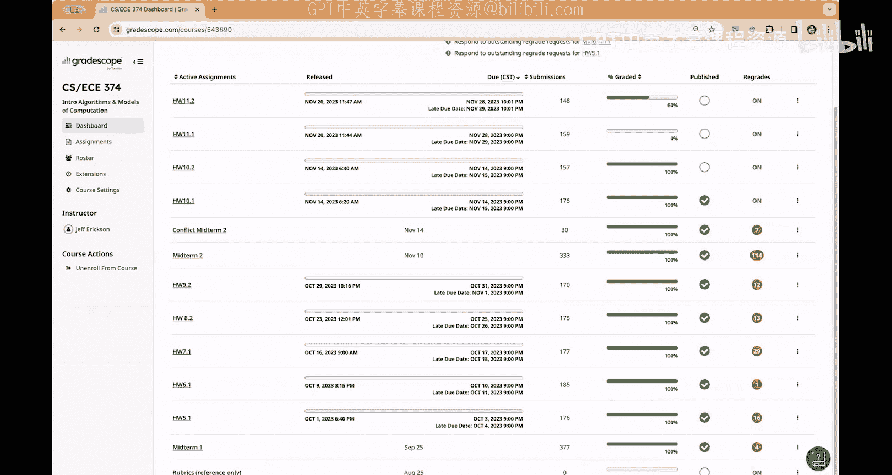
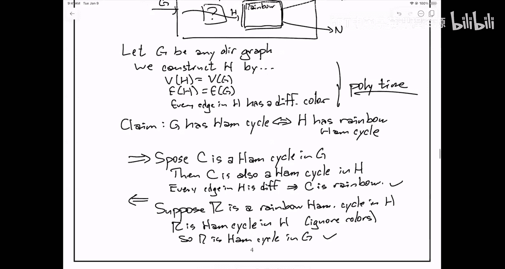
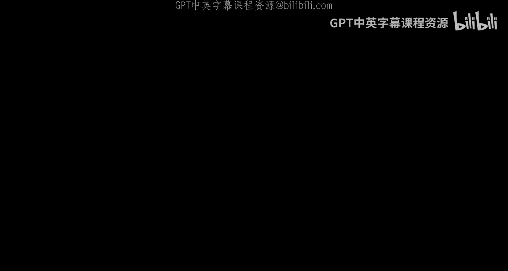
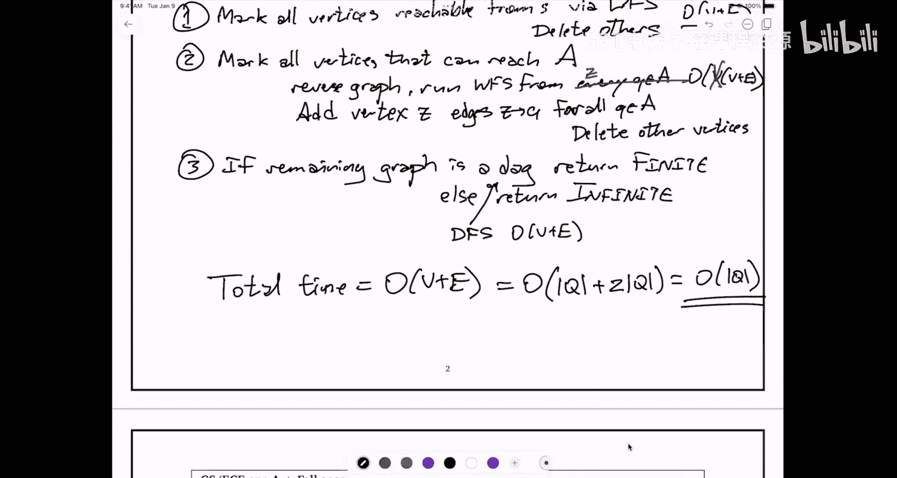

# 031：期末复习（第一部分）📚







在本节课中，我们将一起复习期末考试的核心内容，涵盖NP完全性证明、有穷自动机（DFA）语言判定以及算法设计等关键主题。课程内容基于一份模拟试卷，我们将详细解析其中的典型问题，帮助你为考试做好准备。

---

## 问题四：NP完全性证明 🔍




上一节我们介绍了期末考试的总体结构，本节中我们来看看一个典型的NP完全性证明问题。这类问题通常要求你将一个已知的NP难问题归约到目标问题。

### 问题描述
试卷中提供了两个NP难问题供选择证明。我们选择第二个问题进行详细分析：**彩虹哈密顿环问题**。

**彩虹哈密顿环问题**：给定一个有向图，其每条边都被赋予一种颜色。问是否存在一个哈密顿环（即访问每个顶点恰好一次的环），且环中任意两条连续的边颜色不同（即一个“彩虹”环）。

我们的目标是证明该问题是NP难的。为此，我们需要从一个已知的NP难问题出发，构造一个多项式时间归约。

### 证明步骤
以下是证明彩虹哈密顿环问题是NP难的完整过程。

1.  **选择归约源问题**：我们选择从**有向图哈密顿环问题**（Directed Hamiltonian Cycle）进行归约。这是一个经典的NP完全问题。

2.  **构造归约**：给定一个有向图 `G = (V, E)` 作为有向哈密顿环问题的输入实例。我们构造彩虹哈密顿环问题的一个实例 `H`：
    *   `H` 的顶点集与 `G` 的顶点集 `V` 相同。
    *   `H` 的边集与 `G` 的边集 `E` 相同。
    *   对于 `H` 中的每一条边，我们为其分配一种**独一无二**的颜色。也就是说，如果 `G` 有 `m` 条边，我们就使用 `m` 种不同的颜色，每条边一种。

    这个构造过程显然是多项式时间的（只需遍历所有边并分配颜色）。

3.  **证明等价性**：我们需要证明 `G` 包含一个哈密顿环 **当且仅当** `H` 包含一个彩虹哈密顿环。
    *   **（⇒）如果 `G` 有哈密顿环**：设 `C` 是 `G` 中的一个哈密顿环。由于 `H` 与 `G` 具有相同的顶点和边，`C` 也是 `H` 中的一个哈密顿环。又因为 `H` 中每条边的颜色都不同，环 `C` 中任意两条连续边的颜色必然不同。因此，`C` 就是 `H` 中的一个彩虹哈密顿环。
    *   **（⇐）如果 `H` 有彩虹哈密顿环**：设 `R` 是 `H` 中的一个彩虹哈密顿环。忽略边的颜色，`R` 本身就是 `H`（因而也是 `G`）的一个哈密顿环。因此，`G` 包含一个哈密顿环。

4.  **结论**：由于我们给出了一个从NP难问题（有向哈密顿环）到彩虹哈密顿环问题的多项式时间归约，并且证明了两个问题的答案等价，因此彩虹哈密顿环问题也是NP难的。

**核心概念公式/代码描述**：
归约过程可以概念性地表示为：
```python
def reduce_DHC_to_RainbowHC(G):
    H = copy(G)
    for each edge e in H.edges:
        assign_unique_color(e)
    return H
# 那么: G has Hamiltonian cycle ⇔ H has Rainbow Hamiltonian cycle
```





---

## 问题二：判定DFA语言的有限性 🔄

在理解了NP完全性证明后，我们转向另一个重要主题：有穷自动机。本节将探讨如何判定一个确定性有穷自动机（DFA）所接受的语言是有限的还是无限的。

### 问题描述
给定一个DFA，描述并分析一个算法，用于判断该DFA接受的语言是有限的（Finite）还是无限的（Infinite）。你可以假设输入字母表为 `{0, 1}`。提示：将DFA视为一个有向图。

### 算法思路与步骤
DFA可以自然地表示为一个有向图：状态是顶点，转移函数定义了带标签的有向边。一个DFA接受无限语言，当且仅当存在某些足够长的字符串能被接受。根据泵引理的思想，这等价于在DFA对应的图中存在一个特定的环。

**关键观察**：DFA `M` 接受无限字符串，**当且仅当** 在其状态转移图中存在一个环，且该环满足：
1.  从起始状态 `s` 可以到达该环。
2.  从该环中的某个状态可以到达某个接受状态。

以下是具体的算法步骤：

1.  **预处理图**：首先，从图中删除所有从起始状态 `s` **无法到达**的状态。这可以通过以 `s` 为起点运行一次图搜索算法（如BFS或DFS）实现，标记所有可达顶点，然后删除未标记的顶点及其关联边。

2.  **处理接受状态可达性**：其次，我们需要知道哪些状态可以到达某个接受状态。高效的做法是：
    *   添加一个虚拟的“超级汇点” `z`。
    *   对于每一个接受状态 `q`，添加一条从 `q` 指向 `z` 的有向边。
    *   在**反向图**（将所有边反转）中，从 `z` 开始运行一次图搜索。这样，在原始图中能到达某个接受状态的状态，就是在反向图中能从 `z` 到达的状态。
    *   删除所有在反向图中无法从 `z` 到达的状态（即在原始图中无法到达任何接受状态的状态）。

3.  **检测环**：经过前两步处理后，我们得到了一个简化后的图。在这个图中，所有剩余状态都满足：从 `s` 可达，且可以到达某个接受状态。
    *   如果这个简化后的图是一个**有向无环图（DAG）**，则不存在满足条件的环，因此DFA的语言是**有限的**。
    *   否则，图中存在环，该环必然满足上述两个条件，因此DFA的语言是**无限的**。我们可以通过DFS检测环的存在性。

### 复杂度分析
设DFA的状态数为 `n`。由于输入字母表是 `{0,1}`，每个状态有恰好两条出边，因此图的边数 `m = 2n`。
上述算法的每一步（图搜索、反向图搜索、环检测）都可以在 `O(n + m) = O(n + 2n) = O(n)` 时间内完成。因此，总时间复杂度是 **`O(n)`**，即线性于DFA的状态数。

**核心概念公式/代码描述**：
算法逻辑的伪代码表示：
```python
def is_language_infinite(DFA M):
    G = graph_of(M)
    # 步骤1: 删除从起始状态s不可达的状态
    reachable_from_s = BFS(G, M.start_state)
    G1 = delete_vertices(G, not in reachable_from_s)

    # 步骤2: 删除无法到达任何接受状态的状态
    # 构建反向图并添加超级汇点z
    G_rev = reverse_graph(G1)
    add_vertex(G_rev, 'z')
    for accept_state in M.accept_states:
        add_edge(G_rev, accept_state, 'z') # 注意：这是在反向图中加边
    can_reach_accept = BFS(G_rev, 'z')
    # 在原始图G1中，能到达接受状态的状态，是反向图中能从z到达的状态
    G2 = delete_vertices(G1, not in can_reach_accept)

    # 步骤3: 检测剩余图中是否有环
    return contains_cycle(G2) # 使用DFS检测
```

---

## 总结 📝

本节课中我们一起学习了期末复习的两个核心部分：
1.  **NP完全性证明**：我们通过将“有向哈密顿环问题”归约到“彩虹哈密顿环问题”，展示了如何构造多项式时间归约并证明两个问题的等价性，从而证明目标问题是NP难的。
2.  **DFA语言有限性判定**：我们将DFA视为有向图，通过分析图中是否存在满足特定条件（从起点可达、可到达接受状态）的环，设计了一个线性时间算法来判断DFA接受的语言是有限的还是无限的。



掌握这些问题的解决思路，对于应对期末考试中类似的证明和算法设计题目至关重要。建议结合模拟试卷中的其他题目进行练习，以巩固理解。祝你复习顺利，考试成功！