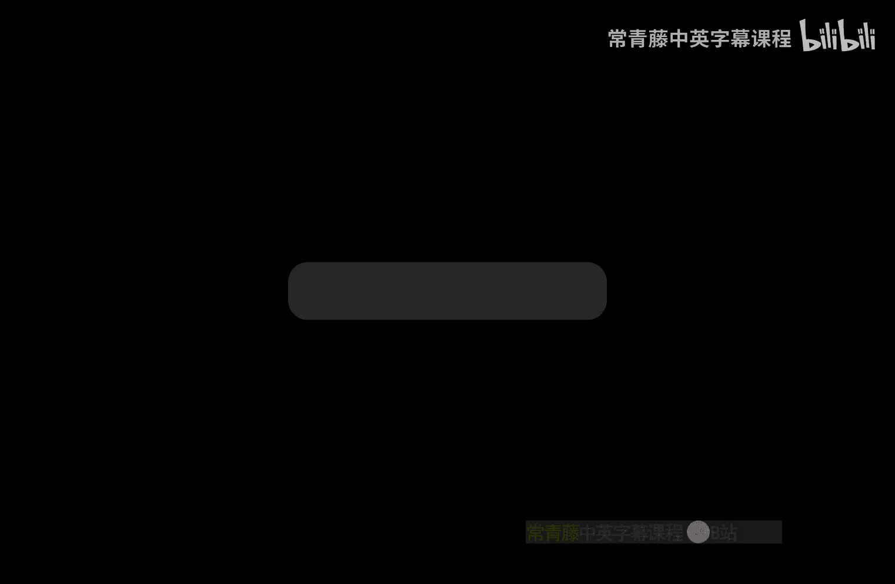
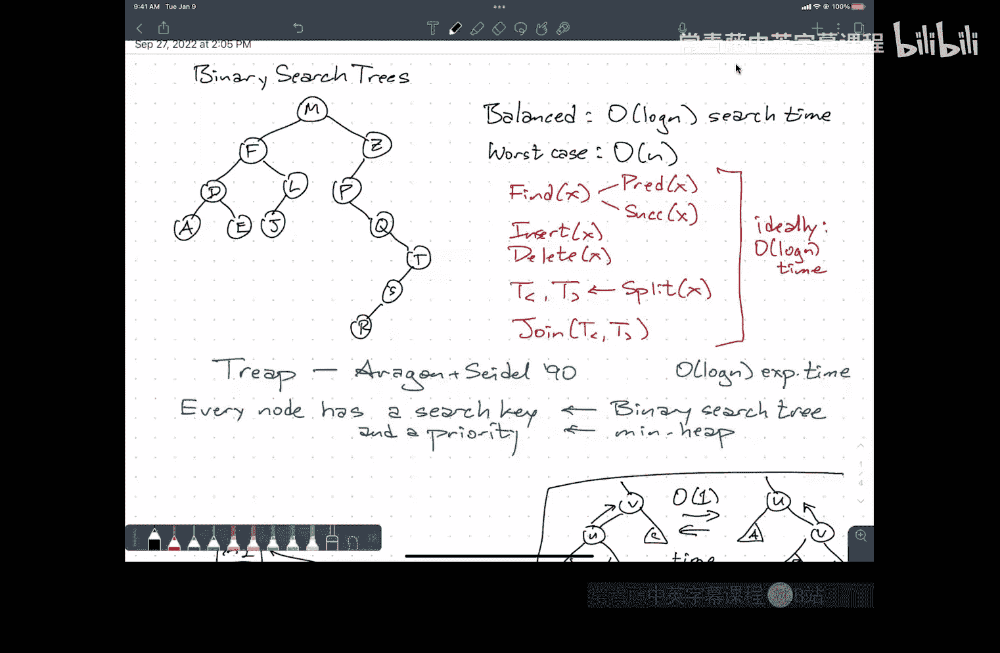

# 011：P11 Treaps



在本节课中，我们将学习一种名为Treap的简单而强大的数据结构。Treap结合了二叉搜索树和堆的特性，能够以期望的对数时间复杂度支持动态集合的插入、删除、查找、分裂与合并等操作。我们将从基本概念开始，逐步理解其工作原理、操作实现以及背后的概率分析。

---

## 概述

Treap是一种随机化的二叉搜索树。它的每个节点包含一个**搜索键**和一个随机分配的**优先级**。从搜索键的角度看，它是一棵二叉搜索树；从优先级的角度看，它又是一个堆（通常是最大堆或最小堆）。这种双重属性使得Treap在期望上是平衡的，从而保证了高效的操作性能。

---

## Treap的定义与性质

上一节我们介绍了Treap的基本思想，本节中我们来看看它的精确定义和关键性质。

一个Treap是一棵二叉树，每个节点存储一个键值对 `(key, priority)`，并满足以下两个性质：

1.  **二叉搜索树性质**：对于任意节点，其左子树中所有节点的键值小于该节点的键值，其右子树中所有节点的键值大于该节点的键值。
    *   公式：`node.left.key < node.key < node.right.key`
2.  **堆性质**：我们通常采用最小堆，即每个节点的优先级不大于其子节点的优先级。
    *   公式：`node.priority <= node.left.priority` 且 `node.priority <= node.right.priority`

**一个重要结论**：给定一组互不相同的键和互不相同的优先级，存在**唯一**的Treap结构。根节点是优先级最小的节点，然后根据其键值将剩余节点划分到左子树（键值较小）和右子树（键值较大），并递归构建。

---

## Treap的核心操作

理解了Treap的结构后，我们来看看如何对其进行动态操作。所有操作都依赖于一个基础工具：**旋转**。

### 旋转操作

旋转是用于在保持二叉搜索树性质的前提下，调整节点父子关系的局部操作。以下是右旋（将左子节点提升为父节点）的示意图和代码逻辑。

设节点 `u` 是 `v` 的左孩子，`A`、`B`、`C` 是它们的子树。旋转操作保持 `A < u < B < v < C` 的顺序不变。

```python
def rotate_right(v):
    u = v.left
    v.left = u.right
    u.right = v
    return u  # 新的子树根节点
```

对称地，也存在左旋操作。旋转可以在常数时间内完成。

---

### 插入操作

插入操作分为两步，模拟了“先按二叉搜索树插入，再按堆调整”的过程。

1.  **二叉搜索树插入**：像在普通二叉搜索树中一样，根据键值寻找到插入位置，创建一个新节点作为叶子节点插入。同时，为该节点随机生成一个优先级。
2.  **堆化上浮**：如果新节点的优先级破坏了堆性质（即比其父节点的优先级小），则通过旋转操作将其“上浮”。不断将其与父节点进行旋转，直到堆性质恢复为止。

由于每次旋转都将新节点向根节点移动一步，这个过程必然会在有限步内终止。

---

### 删除操作

删除操作是插入操作的逆过程，目标是将待删除节点移至叶子位置后轻松移除。

1.  **堆化下沉**：将待删除节点的优先级设置为 `+∞`（对于最小堆）。此时，该节点优先级大于其子节点，破坏了堆性质。为了修复，我们需要将其“下沉”：比较其左右子节点的优先级，将优先级较小的子节点通过旋转提升上来。重复此过程，直到该节点成为一个叶子节点。
2.  **剪除叶子**：直接移除已成为叶子节点的待删除节点。

---

### 分裂与合并操作

利用插入和删除的思想，我们可以实现强大的分裂与合并操作。

*   **分裂(Split)**：给定一个值 `x`，将Treap分裂成两个Treap，一个包含所有键值小于 `x` 的节点，另一个包含所有键值大于 `x` 的节点。
    *   **方法**：插入一个键值为 `x`、优先级为 `-∞` 的临时节点。根据堆性质，这个节点会通过旋转成为整棵树的根。此时，它的左子树和右子树就是所需的两部分。最后删除这个临时根节点。
*   **合并(Join)**：给定两个Treap `L` 和 `R`，且 `L` 中所有键值小于 `R` 中所有键值，将它们合并成一棵Treap。
    *   **方法**：创建一个优先级为 `-∞`、键值介于两树之间的临时根节点，其左孩子指向 `L`，右孩子指向 `R`。然后删除这个临时根节点（即执行一次删除操作），其左右子树会在调整过程中自然合并。

---

## Treap的性能分析

我们已经了解了所有操作的步骤，现在来分析它们为什么高效。所有操作的时间都主要花费在从根节点到某个节点的路径遍历上，因此**节点的深度**是关键。

### 期望深度分析

我们分析在优先级完全随机的情况下，任意节点 `k` 的期望深度。深度定义为从根节点到该节点的路径上的边数（即祖先节点个数）。

**关键引理**：对于两个键值 `i < k`，节点 `i` 是节点 `k` 的祖先的**充要条件**是：在所有键值介于 `i` 和 `k` 之间（含）的节点中，`i` 的优先级是最小的。

**直观理解**：在Treap的递归构建过程中，一个节点会成为某个子树的根，当且仅当它在当前集合中优先级最小。如果 `i` 是 `i` 到 `k` 这个区间内优先级最小的，那么它将成为包含 `k` 的这个子树的根，从而成为 `k` 的祖先。

基于这个引理，`i` 是 `k` 祖先的概率就是 `1 / (k - i + 1)`（即 `i` 在 `[i, k]` 区间内优先级最小的概率）。

因此，节点 `k` 的期望深度为：
`E[depth(k)] = Σ_{i<k} 1/(k-i+1) + Σ_{i>k} 1/(i-k+1)`

这个和式被两个调和数所界定，其结果是 `O(log n)`。具体地，它小于 `2 * ln(n)`。

### 操作时间复杂度

由于插入、删除、查找等操作的时间都与相关节点的深度成正比，因此它们的**期望时间复杂度都是 O(log n)**。更严格的分析可以证明，这个对数深度是**高概率**成立的，即性能非常稳定。

---

## Treap的多种视角

Treap的魅力还在于它连接了几个不同的概念：

1.  **随机优先级二叉搜索树**：这是最直接的定义。
2.  **按随机顺序插入的二叉搜索树**：如果按照优先级从小到大的顺序将节点插入一棵普通的、不进行平衡操作的二叉搜索树，得到的结果就是Treap。这解释了为什么随机插入能产生平衡的树。
3.  **随机化快速排序的递归调用树**：Treap的结构与随机选择主元的快速排序的递归过程完全一致。树中节点 `i` 是节点 `k` 的祖先，等价于在快速排序中，`i` 曾作为主元与 `k` 进行比较。对Treap深度的分析本质上就是分析快速排序的比较次数。

这种深刻的联系意味着，对Treap的操作（如插入一个遗漏元素）类似于“回到”快速排序的递归历史中去修复它。这种“持久化”或“回溯”思想在诸如版本控制系统（如Git）等高级应用中有重要体现。

---

## 总结



本节课中我们一起学习了Treap数据结构。我们首先了解了它结合二叉搜索树和堆的双重特性，然后学习了基于旋转的核心操作：插入、删除、分裂与合并。通过分析节点期望深度为 `O(log n)`，我们证明了所有操作都具有高效的对数期望时间复杂度。最后，我们探讨了Treap与随机插入二叉搜索树、随机化快速排序之间的深刻联系，揭示了其简洁设计背后的强大与优美。与复杂的AVL树或红黑树相比，Treap以其易于实现、理解和证明的优点，成为实现动态有序字典的一个出色选择。