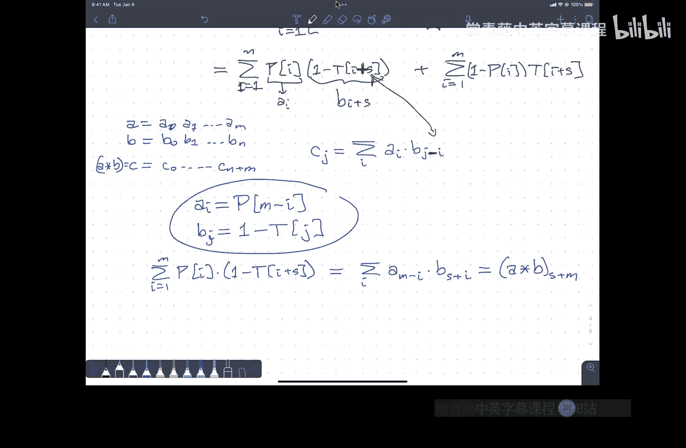

# 012：尾不等式与算法分析


在本节课中，我们将学习如何分析随机算法的运行时间，特别是如何证明算法“以高概率”运行得很快。我们将从基本的概率不等式开始，逐步深入到更强大的分析工具，并最终应用这些工具来分析Treap和快速排序等算法。

## 概述

随机算法的期望运行时间分析（如快速排序的O(n log n)）是一个良好的开端。然而，我们通常希望更强的保证：算法运行时间远差于期望值的概率非常低。这种“尾概率”的分析需要更精细的工具，即尾不等式。本节课我们将学习马尔可夫不等式、切比雪夫不等式以及指数矩不等式，并了解如何利用随机变量之间的独立性来获得越来越强的概率上界。

## 马尔可夫不等式

马尔可夫不等式是最基本、最通用的尾不等式。它不对随机变量的分布做任何特殊假设。

**定理（马尔可夫不等式）**：设Z是任意非负随机变量，其期望值为μ = E[Z]。那么对于任意实数z > 0，有：
```
P[Z ≥ z] ≤ μ / z
```

**直观理解与推导**：
我们可以将期望值E[Z]视为概率分布曲线下的面积。考虑事件`Z ≥ z`对应的概率`P[Z ≥ z]`。我们可以通过比较面积来证明这个不等式。

定义指示函数：对于每个可能的整数值i，考虑事件`Z ≥ i`。期望值E[Z]可以写成：
```
E[Z] = Σ_{i≥1} P[Z ≥ i]
```
现在，考虑我们关心的阈值z。我们有：
```
E[Z] = Σ_{i≥1} P[Z ≥ i] ≥ Σ_{i=1}^{z} P[Z ≥ i] ≥ Σ_{i=1}^{z} P[Z ≥ z] = z * P[Z ≥ z]
```
整理后即得`P[Z ≥ z] ≤ E[Z] / z`。

**应用与局限性**：
马尔可夫不等式非常通用，但因此得出的上界通常很弱。例如，若已知快速排序的期望运行时间为`4n log n`，该不等式仅能告诉我们，运行时间超过`8n log n`的概率不超过1/2。为了得到更紧的界（如概率随n增大而衰减），我们需要对随机变量的特性做出更强假设。

## 从独立性到更强的尾界

为了获得更紧的概率上界，我们需要利用随机变量之间的关系。核心思想是：随机变量之间越独立，其和偏离期望值的概率衰减得越快。

首先，我们回顾独立性的定义：

*   **独立**：两个随机变量X和Y独立，当且仅当对于任意值x, y，有`P[X=x ∧ Y=y] = P[X=x] * P[Y=y]`。这意味着知道一个变量的值不会提供关于另一个变量的任何信息。
*   **完全独立**：一组随机变量`X1, X2, ..., Xn`是完全独立的，如果其中任意子集联合取值的概率等于各自概率的乘积。
*   **k阶独立**：一组随机变量是k阶独立的，如果其中任意大小不超过k的子集是完全独立的。例如，“两两独立”意味着任意两个变量是独立的，但三个变量之间可能不独立。

上一节我们介绍了最通用的马尔可夫不等式。本节中，我们将看到，如果随机变量具备某种独立性，我们可以得到强得多的结论。

### 切比雪夫不等式

如果我们关心的随机变量X是多个**两两独立**的指示变量（取值为0或1）之和，那么我们可以使用切比雪夫不等式来获得更好的尾概率上界。

**设定**：设`X = Σ_{i=1}^{n} X_i`，其中每个`X_i`是指示变量，`P[X_i = 1] = p_i`。令`μ = E[X] = Σ p_i`。

**定理（切比雪夫不等式）**：如果`X_i`是两两独立的，那么对于任意`z > 0`，有：
```
P[ |X - μ| ≥ z ] ≤ μ / z^2
```
更常用的形式是，对于任意`δ > 0`：
```
P[ X ≥ (1+δ)μ ] ≤ 1 / (δ^2 μ)
P[ X ≤ (1-δ)μ ] ≤ 1 / (δ^2 μ)
```

**思路证明**：
1.  我们关心`|X - μ|`，即偏离均值的距离。为了应用马尔可夫不等式（要求非负），我们考虑平方偏差`Y = (X - μ)^2`。
2.  计算`E[Y] = E[(X-μ)^2]`，这被称为**方差**。利用两两独立性，可以证明`E[Y] ≤ μ`。
3.  注意到事件`|X-μ| ≥ z`等价于事件`Y ≥ z^2`。
4.  对随机变量Y应用马尔可夫不等式：`P[Y ≥ z^2] ≤ E[Y] / z^2 ≤ μ / z^2`。

**意义**：
与马尔可夫不等式给出的`1/δ`上界相比，切比雪夫不等式给出了`1/(δ^2 μ)`的上界。由于μ通常随问题规模n增长（例如在算法分析中），这个上界可以随着n增大而衰减（例如`1/n`量级），这是一个显著的改进。

### 指数矩不等式与完全独立

如果我们拥有的随机变量是**完全独立**的，我们可以得到最强的结果——尾概率呈指数衰减。

**定理（指数矩不等式，切尔诺夫界的一种形式）**：设`X = Σ_{i=1}^{n} X_i`，其中`X_i`是独立的伯努利变量（不一定同分布），`μ = E[X]`。那么对于任意`δ > 0`，存在一个上界：
```
P[ X ≥ (1+δ)μ ] ≤ exp( -δ^2 μ / 3 )   （当 0 < δ ≤ 1 时较紧）
P[ X ≤ (1-δ)μ ] ≤ exp( -δ^2 μ / 2 )
```
更一般的形式是，对于任意`t > 0`，有`P[X ≥ μ + t] ≤ exp( -t^2/(2(μ+t/3)) )`。

**直观理解**：
这个不等式的证明核心是计算`E[exp(λX)]`（即指数矩），并利用完全独立性将其分解为各变量指数矩的乘积。通过优化参数λ，得到最紧的指数形式上界。

**意义**：
指数衰减（如`e^{-c n log n}`）比多项式衰减（如`1/n^2`）要快得多。这意味着当变量完全独立时，偏离期望值很远的事件发生的概率是极其微小的。

## 应用：以高概率分析Treap深度

现在，让我们应用这些工具来分析一个熟悉的随机数据结构：Treap。

回顾Treap深度的分析：一个特定节点k的深度`D(k)`等于所有可能成为其祖先的节点数量之和。即：
```
D(k) = Σ_{i≠k} X_i，其中 X_i = 1 当且仅当节点i是节点k的祖先。
```
我们知道`E[X_i] = 1 / |i-k|+1`，且`E[D(k)] = H_{k-1} + H_{n-k} < 2 ln n`。

**关键观察**：虽然所有的`X_i`并不完全独立，但我们可以将它们分成两组：`i < k`的节点和`i > k`的节点。可以证明，**每组内部的指示变量是相互独立的**。例如，对于所有`i < k`，事件“i是k的祖先”是独立的。

以下是分析步骤：

1.  **分组应用指数矩不等式**：将深度分解为`D(k) = D_left(k) + D_right(k)`，分别对应左侧祖先和右侧祖先。由于每组内部变量独立，我们可以对`D_left(k)`和`D_right(k)`分别应用指数矩不等式。
2.  **控制单个节点的深度**：对于任意常数`c > 2`，我们可以证明：
    ```
    P[ D(k) ≥ c ln n ] ≤ n^{-(c/2 - 1)}   （大致形式，具体常数取决于c）
    ```
    这意味着单个节点深度过大的概率随n增大而多项式衰减，且指数部分随c增大而增大。
3.  **控制整棵树的最大深度**：利用布尔不等式（并集界），整棵树的最大深度超过`c ln n`的概率，不超过所有节点深度超过`c ln n`的概率之和：
    ```
    P[ max_depth ≥ c ln n ] ≤ Σ_{k=1}^{n} P[ D(k) ≥ c ln n ] ≤ n * n^{-(c/2 - 1)} = n^{-(c/2 - 2)}
    ```
4.  **结论**：通过选取足够大的常数c（例如c=8），我们可以使`n^{-(c/2 - 2)}`成为一个衰减极快的函数（如`1/n^2`）。这意味着Treap的**最大深度以高概率为O(log n)**。更进一步，这个结果暗示了Treap的期望高度本身就是O(log n)，因为尾部贡献极小。

类似的分析完全可以应用于随机化快速排序，证明其运行时间以高概率集中在`O(n log n)`附近，远差于期望值的可能性微乎其微。

## 总结

在本节课中，我们一起学习了用于分析随机算法尾概率的关键工具——尾不等式。

*   我们从最通用但最弱的**马尔可夫不等式**开始，它仅要求随机变量非负。
*   为了获得更紧的界，我们引入了随机变量间的**独立性**概念。利用**两两独立性**，我们得到了**切比雪夫不等式**，它提供了多项式衰减的概率上界。
*   最后，对于**完全独立**的随机变量，我们介绍了强大的**指数矩不等式**（切尔诺夫界），它能给出指数衰减的上界，这是分析算法“以高概率”行为的最有力工具。

我们将这些不等式应用于**Treap**（以及间接应用于快速排序）的深度分析，证明了其最大深度不仅期望值是`O(log n)`，而且实际深度远超此值的概率是超多项式小的。这为随机算法的可靠性和效率提供了坚实的理论保证。



---
*课程内容整理自伊利诺伊大学CS473算法课程（2022年秋季）第12讲。核心不等式将在考试公式表中提供。*