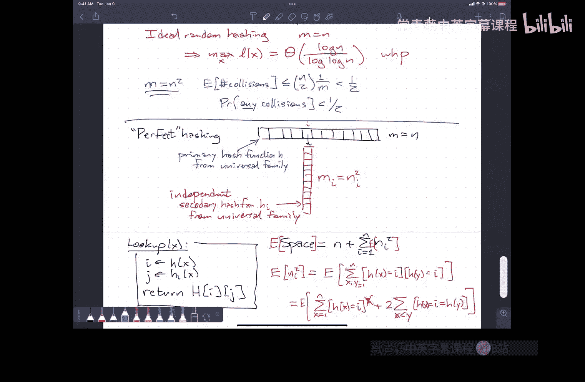

# 013：哈希表


在本节课中，我们将要学习哈希表，这是随机化算法中最常见、最强大的应用之一。我们将探讨哈希表的基本概念、如何设计好的哈希函数、如何处理碰撞，并最终介绍一种能实现常数时间查找的完美哈希方案。

## 哈希表的基本概念

哈希表的目标是存储一个来自某个大集合（称为全集 `U`）的数据子集 `S`，并尽可能实现直接访问。我们使用一个大小为 `M` 的数组（哈希表）来存储这些数据。

为了将全集 `U` 中的元素映射到数组的索引上，我们需要一个**哈希函数** `h`。理想情况下，我们希望对于数据集 `S` 中的所有不同元素 `x` 和 `y`，都有 `h(x) != h(y)`。这样，每个元素都能被无冲突地放入表中。

然而，由于全集 `U` 通常远大于表的大小 `M`，冲突（即 `h(x) == h(y)`）是不可避免的。因此，我们需要策略来处理这些冲突。

## 哈希函数的性质

上一节我们介绍了哈希表的基本目标，本节中我们来看看对哈希函数有哪些要求。一个常见的误解是追求**均匀性**，即对于任意元素 `x` 和任意索引 `i`，有 `P(h(x) = i) = 1/M`。但一个均匀的哈希函数族可能是无用的，例如，一个只将所有元素映射到固定索引 `i` 的函数 `Hi` 组成的族也是均匀的。

我们真正需要的是**全域性**。对于一个从函数族 `H` 中随机选择的哈希函数 `h`，我们希望对于任意两个不同的元素 `x` 和 `y`，发生碰撞的概率很小：
```
P(h(x) = h(y)) <= 1/M
```
这个性质保证了在平均情况下，冲突是可控的。

## 处理碰撞：链地址法

当冲突发生时，我们需要一种方法来解决它。以下是两种常见的方法，我们先介绍链地址法。

在链地址法中，哈希表的每个槽位不再存储单个元素，而是存储一个链表（或其他数据结构）。所有哈希到同一索引的元素都被放入这个链表中。

查找一个元素 `x` 的期望时间是 `O(1 + E[链表长度])`。如果使用一个全域哈希函数族，并且表的负载因子 `α = n/M` 是一个常数，那么期望查找时间就是常数。

## 哈希函数的构建方法

我们已经了解了哈希函数需要具备全域性。那么，如何构建这样的函数族呢？以下是几种经典的方法：

1.  **乘法哈希**：选择一个大于全集大小的素数 `p`，随机选择参数 `a ∈ {1, ..., p-1}`。哈希函数定义为：
    ```
    h(x) = ((a * x) mod p) mod M
    ```
    这个族是“接近全域”的。

2.  **带偏移的乘法哈希**：在乘法哈希基础上增加一个随机偏移 `b`。
    ```
    h(x) = ((a * x + b) mod p) mod M
    ```
    这个族是全域且均匀的。

3.  **二进制乘法哈希**：假设键是 `w` 位二进制数，表大小 `M = 2^l`。随机选择一个 `w` 位数 `a`，哈希函数为：
    ```
    h(x) = (a * x) >> (w - l)
    ```
    即取乘法结果的高 `l` 位。这也是接近全域的。

4.  **查表哈希**：将 `w` 位的键分割成多个小块（如两个 `w/2` 位的块）。预先准备多个随机表 `T1, T2, ...`，每个表存储随机值。哈希值为各表查得值的异或和。
    ```
    h(x) = T1[x_高半部分] XOR T2[x_低半部分]
    ```
    这种方法实现简单，且具有更强的统计保证（如2-全域性）。

5.  **矩阵哈希**：构建一个随机的 `l × w` 的二进制矩阵 `A`。将键 `x` 视为一个 `w` 维二进制向量，哈希值是通过矩阵乘法（在模2下，即异或）得到的 `l` 维向量：
    ```
    h(x) = A * x (mod 2)
    ```
    这也是接近全域的。

## 从期望性能到最坏情况性能

虽然链地址法在期望情况下能提供常数时间的查找，但最坏情况下（即最长链的长度）可能达到 `Θ(log n / log log n)`。这对于需要强性能保证的场景（如网络路由器）是不够的。

如果我们简单地通过增大表尺寸（例如使 `M ≈ n^2`）来避免冲突，虽然可以高概率获得无冲突的完美哈希，但空间开销过大。

## 完美哈希

本节中我们来看看如何实现一个空间线性、查找时间严格为常数的数据结构，即**完美哈希**。

其核心思想是使用两级哈希：
1.  第一级：使用一个全域哈希函数 `h1` 将 `n` 个元素散列到一个大小为 `n` 的主表 `T` 中。设散列到槽位 `i` 的元素个数为 `ni`。
2.  第二级：对于主表的每个槽位 `i`，如果 `ni > 1`，则为其构建一个次级哈希表 `Ti`。`Ti` 的大小为 `mi = ni^2`（或略大的素数）。并为 `Ti` 独立地随机选择一个次级哈希函数 `h2_i`，直到 `h2_i` 在 `ni` 个元素上**无冲突**为止。由于表大小为 `ni^2`，根据之前分析，随机哈希函数无冲突的概率大于 `1/2`，因此期望只需尝试常数次即可找到无冲突的 `h2_i`。

查找元素 `x` 时，先计算 `i = h1(x)`，再计算 `j = h2_i(x)`，最后访问 `T[i][j]` 即可。由于次级表内无冲突，查找是确定性的常数时间。

现在分析总空间复杂度。总空间为主表大小 `n` 加上所有次级表大小之和 `Σ mi`。我们需要计算 `E[Σ ni^2]`。
```
E[Σ ni^2] = Σ E[ni^2] = Σ (E[ni] + Σ_{x≠y} P(h1(x)=h1(y)=i))
```
由于 `h1` 是全域的，`P(h1(x)=h1(y)=i) <= 1/n^2`。经过推导可得 `E[Σ ni^2] < 2n`。因此，总期望空间为 `O(n)`。

## 总结



本节课中我们一起学习了哈希表的核心原理。我们从哈希表的基本概念和理想目标出发，认识到冲突的必然性，从而引入了哈希函数族和全域性的概念。我们介绍了使用链地址法处理冲突，并分析了其在期望下的常数时间性能。接着，我们探讨了几种构建全域哈希函数族的具体方法。最后，为了克服期望性能的局限性，我们学习了一种两级哈希的完美哈希方案，它能够在线性空间内实现确定性的常数查找时间，这是通过巧妙的概率分析和二级结构设计达成的。哈希表是算法设计中平衡效率与随机化力量的杰出范例。