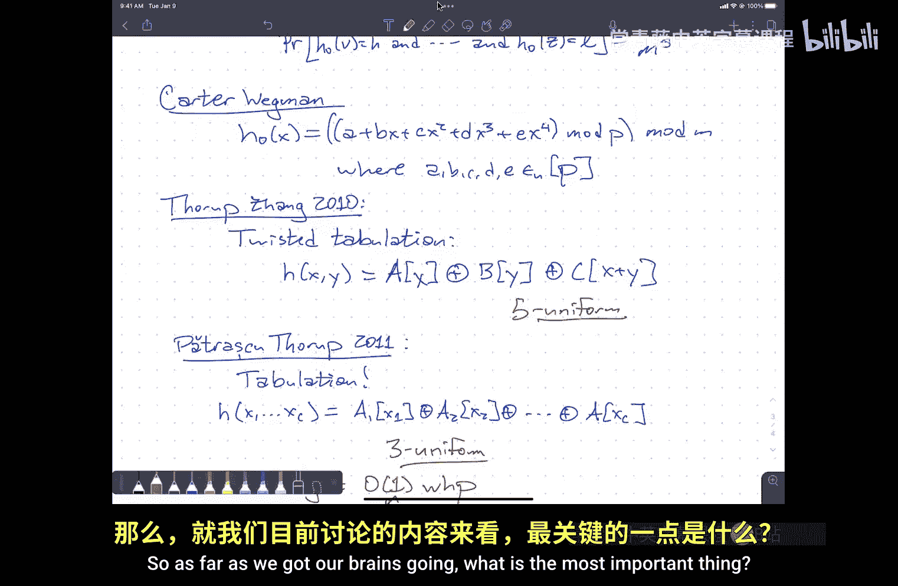

# 014：高级哈希技术


在本节课中，我们将继续探讨哈希技术，特别是**开放寻址哈希**。我们将了解其工作原理、性能分析，以及如何通过精心设计的哈希函数来保证其高效性。本节课内容比之前讨论的哈希技术更为深入，但核心算法本身并不复杂。我们的目标是，即使不完全理解分析过程，你也能实现一个性能可证明良好的开放寻址哈希表。

---

## 回顾：链式哈希

上一节我们介绍了**链式哈希表**。其核心思想是：哈希表的每个槽位不存储单个元素，而是存储一个链表（或其他数据结构），用于存放所有哈希到该槽位的元素。

如果选择正确的哈希函数（例如**全域哈希函数**），并合理设置次级哈希表的大小，我们就能保证：
*   **常数时间的查找**。
*   **常数期望时间的插入和删除**（不考虑重建操作）。

简而言之，只要选择合适的哈希函数，链式哈希就能高效工作。

---

## 引入：开放寻址哈希

本节中，我们来看看**开放寻址哈希**。在这种方法中，哈希表本身就是一个连续的数组（内存块），不包含任何额外的数据结构。我们仍然需要解决冲突。

其高级思想是：如果第一个哈希值对应的槽位已被占用，则尝试第二个哈希函数，如果还不行，就尝试第三个，依此类推。最终，我们得到一系列哈希函数 `H0(x), H1(x), H2(x), ...`。

我们假设这个序列 `H0(x), H1(x), ..., H_{m-1}(x)` 构成了索引 `{0, 1, ..., m-1}` 的一个**排列**。这意味着哈希函数不是返回一个索引，而是返回表中所有索引的一个探测顺序。我们按此顺序探测，直到找到一个空槽插入元素，或者（在查找时）找到目标元素或遇到空槽。

### 线性探测与二进制探测

在实际中，常见的实现是**线性探测**：
`H_i(x) = (H_0(x) + i) mod m`
探测序列从初始哈希值开始，按顺序遍历后续索引。

然而，线性探测的分析较为复杂。我们将介绍一种实践中表现更好、也更容易分析的方法：**二进制探测**。我们假设表大小 `m` 是 2 的幂（便于动态调整），并使用按位异或操作来生成探测序列：
`H_i(x) = H_0(x) XOR i`
这里 `i` 以二进制形式参与运算。

以下是二进制探测的工作原理示例：
假设 `H_0(x) = 0101`（二进制，即十进制5）。
*   `H_1(x) = 0101 XOR 0001 = 0100`（4）
*   `H_2(x) = 0101 XOR 0010 = 0111`（7）
*   `H_3(x) = 0101 XOR 0011 = 0110`（6）
*   以此类推。

二进制探测的优势在于其**缓存友好性**。在探测过程中，它会完整地探索一个大小为 2^k 的地址块，然后再移动到其他块，这符合现代CPU缓存行的边界（大小通常是2的幂），从而减少缓存失效。

---

## 性能分析：直觉与设定

为了分析性能，我们首先做一个很强的假设：**强均匀哈希假设**。即每个探测序列都是所有可能排列中的一个均匀随机排列。在这个假设下，我们可以推导出插入第 `n` 个元素到大小为 `m` 的表中所需的期望探测次数 `T(n, m)` 满足一个递归关系，最终解为 `m / (m - n)`。

通常我们关注**负载因子** `α = n / m`。如果我们设定负载因子为 1/2（即表半满），那么期望探测次数约为 2 次。更一般地，期望探测次数约为 `1 / (1 - α)`。

然而，“强均匀哈希假设”在实践中难以实现。我们需要更实际、可证明的保证。

---

## 基于块的分析框架

我们转向分析**二进制探测**。分析的核心是研究包含初始哈希值 `H_0(x)` 的、不同大小的块是否被填满。

我们定义 `B_k(x)` 为包含 `H_0(x)` 的大小为 `2^k` 的地址块。算法的高层描述如下：
```
for k from 0 to log m:
    if block B_k(x) is not full:
        put x into B_k(x) and return
```
由于表只是半满，最终总会找到一个未满的块（例如整个表）。

算法的运行时间与找到的**第一个未满块**的大小成正比（实际上最多是其常倍数）。因此，我们需要分析**包含 `H_0(x)` 的最大满块**的期望大小。

### 从“满”到“流行”

判断一个块是否“满”很复杂，因为它不仅取决于哈希到该块的元素，还取决于因冲突从其他块“溢出”到该块的元素。

为了简化分析，我们引入“流行”的概念：一个块是**流行的**，如果至少有 `2^k` 个元素的初始哈希值 `H_0(y)` 落在这个大小为 `2^k` 的块内。也就是说，在忽略溢出逻辑的链式哈希中，这个块也会被填满。

关键关系在于：**如果一个块是满的，那么要么它自己是流行的，要么它的某个“叔父块”（即更大尺寸的祖先块）是流行的**。因此，块“满”的概率 `F(k)` 可以以其自身及更大块“流行”的概率 `P(j)` 之和为上界。

### 分析“流行”的概率

令 `Y` 为初始哈希值落在块 `B_k(x)` 内的元素数量。在哈希值均匀随机的假设下，`Y` 的期望值 `E[Y] = n * (2^k / m) = 2^{k-1}`（因为 `n = m/2`）。

我们关心 `P(Y >= 2^k)`，即 `Y` 至少是其期望值两倍的概率。这正是**尾概率不等式**的用武之地。

1.  **假设两两独立**：如果哈希函数 `H_0` 是两两独立的，那么 `Y` 是两两独立随机变量之和。应用**切比雪夫不等式**可得：
    `P(Y >= 2^k) = P(Y >= 2 * E[Y]) <= 1 / E[Y] ≈ 2^{-(k-1)}`
    由此可推出 `F(k) = O(2^{-k})`。然而，将其代入运行时间期望公式 `∑ [2^k * F(k)]` 时，我们得到 `∑ O(1) = O(log m)`。这仅能证明性能不差于二叉搜索树，但并非我们想要的常数时间。

2.  **假设四路独立**：为了获得常数时间，我们需要更强的独立性。假设 `H_0` 是四路独立的，我们可以使用高阶矩不等式（类似切比雪夫不等式的推广）得到更强的尾界：
    `P(Y >= 2^k) = P(Y >= 2 * E[Y]) <= O(1 / (E[Y])^2) ≈ O(4^{-k})`
    此时，`F(k) = O(4^{-k})`。代入运行时间期望公式：`∑ [2^k * F(k)] = ∑ [2^k * O(4^{-k})] = ∑ O(2^{-k}) = O(1)`。
    **因此，在四路独立哈希函数的假设下，开放寻址哈希（二进制探测）的每次操作期望时间是常数。**

**技术细节**：为了严格分析插入一个新元素 `x` 的过程，我们需要考虑 `x` 与表中已有元素的联合分布。因此，实际上需要的是**五路独立**的哈希函数，以确保包含 `x` 在内的任意五个元素的哈希值都是独立均匀的。

---

## 实现：如何获得高阶独立哈希函数？

理论分析要求高阶独立性，我们如何实现这样的哈希函数？

1.  **多项式哈希**：卡特和韦格曼提出的经典方法。对于五路独立，我们可以使用一个四次多项式：
    `H(x) = (a + b*x + c*x^2 + d*x^3 + e*x^4) mod p mod m`
    其中 `p` 是一个大素数，系数 `a, b, c, d, e` 随机选取。这种方法简单但计算成本较高。

2.  **简单列表哈希**：将输入的关键字分成 `c` 个部分（例如8个）。预先准备 `c` 个随机数组。哈希值时，用每个部分作为索引查找对应数组中的随机值，然后将所有查找到的值进行异或操作。这种方法在实践中非常快。
    *   虽然理论分析表明它仅能提供有限的独立性（如三路独立），但帕特劳斯库和索普的深入研究证明，对于像开放寻址哈希这样的应用，它的表现**如同完全随机的哈希函数**，能够提供常数时间的高概率性能保证。其分析更为复杂，但结论坚实可用。

---

## 总结

本节课中，我们一起学习了开放寻址哈希，特别是二进制探测法。

*   我们首先对比了链式哈希和开放寻址哈希的基本思想。
*   我们介绍了线性探测和更优的二进制探测，并解释了后者的缓存友好特性。
*   为了分析性能，我们建立了一个基于“块”的分析框架，并将复杂的“满块”问题转化为更易分析的“流行块”问题。
*   通过应用概率论中的尾不等式，我们发现：**两两独立的哈希函数只能保证 `O(log n)` 的期望探测次数，而四路（或五路）独立的哈希函数则可以保证 `O(1)` 的期望探测次数**。
*   最后，我们探讨了实现高阶独立哈希函数的实用方法，包括多项式哈希和高效且理论保证坚实的简单列表哈希。



因此，在实践中，通过选择像简单列表哈希这样高效且经过充分分析的哈希函数，你可以实现一个性能可证明良好的开放寻址哈希表，并放心地在作业和考试中假设其基本操作具有常数期望时间。