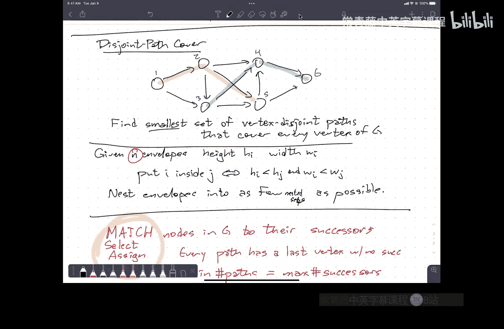

# 021：更多最大流应用

在本节课中，我们将学习如何将各种实际问题转化为最大流问题，并利用最大流算法来解决它们。我们将通过几个具体的例子，如考试调度、有向无环图的路径覆盖和图的环覆盖，来深入理解这种“归约”的思路和步骤。

---

## 概述：归约策略

上一讲我们介绍了最大流的一些应用，如边不相交路径、顶点不相交路径和二分图匹配。本节中，我们将看到更多应用，并总结一个通用的解决模式。

解决这类问题的通用策略是“归约”。其流程如下：
1.  **输入转换**：将原始问题的输入（如考试、信封、图的边）转化为一个流网络。
2.  **黑盒计算**：使用最大流算法（如Ford-Fulkerson算法）在这个网络上计算最大流。
3.  **输出转换**：将得到的最大流（或其路径分解）解释回原始问题的解。

整个过程可以看作一个“算法管道”。我们需要描述输入/输出转换的算法，分析其运行时间（用原始问题的参数表示），并理解两个问题解之间的对应关系，这本质上就是证明归约的正确性。

---

## 应用一：考试调度问题

现在，我们来看一个具体的例子：期末考试调度。

### 问题描述
我们需要为一系列课程安排期末考试。每场考试需要分配一个教室、一个时间槽和一名监考员。存在以下约束：
*   每门课程只能安排一场考试。
*   教室的容量必须大于或等于课程的学生人数。
*   每个教室在每个时间槽最多只能安排一场考试。
*   每位监考员最多只能监考5场考试。
*   监考员只在特定时间槽有空。

我们需要判断是否能安排所有考试，并给出具体的安排方案。

### 解决方案：构建流网络
这是一个典型的**元组选择问题**。我们需要从资源集合（课程、教室、时间、监考员）的笛卡尔积中，选出一个满足所有约束的元组集合。关键在于，约束必须只出现在相邻的资源集合之间。

以下是构建流网络的步骤：

1.  **确定资源顺序**：根据约束，我们需要将资源按“课程 -> 教室 -> 时间 -> 监考员”的顺序排列成层。
2.  **创建顶点**：为每一类资源（课程、教室、时间、监考员）的每个实例创建一个顶点。此外，添加源点 `s` 和汇点 `t`。
3.  **添加边并设置容量**：
    *   从 `s` 到所有“课程”顶点添加边，容量为1（每门课一场考试）。
    *   在相邻层之间添加所有可能的边（例如，从每个课程顶点到每个教室顶点）。
    *   根据约束设置边容量：
        *   **课程-教室边**：如果课程人数 <= 教室容量，容量为1（允许安排），否则为0（不允许）。
        *   **教室-时间边**：容量为1（每个教室每个时间最多一场考试）。
        *   **时间-监考员边**：如果监考员在该时间有空，容量为1，否则为0。
    *   从所有“监考员”顶点到 `t` 添加边，容量为5（每位监考员最多监考5场）。
    *   未明确指定容量的顶点和边，容量视为无穷大。

### 算法与对应关系
构建好网络 `G` 后，我们执行以下算法：
1.  在 `G` 上计算最大流 `f*`。
2.  如果 `f*` 的值小于课程总数 `n`，则无法安排所有考试，返回 `false`。
3.  否则，将流 `f*` 分解为 `n` 条值为1的 `s-t` 路径。
4.  每条路径 `(s -> 课程C -> 教室R -> 时间T -> 监考员P -> t)` 对应一场考试安排 `(C, R, T, P)`。

**对应关系定理**：存在一个可行的考试安排方案，当且仅当在构建的流网络中存在一个值为 `n` 的可行流。每条 `s-t` 流路径唯一对应一场考试安排。

### 运行时间分析
设课程数为 `C`，教室数为 `R`，时间槽数为 `T`，监考员数为 `P`。流网络的顶点数 `V = O(C + R + T + P)`，边数 `E = O(C*R + R*T + T*P)`。使用 `O(VE)` 的最大流算法，总运行时间为输入规模的多项式时间。

---

## 应用二：有向无环图的顶点不相交路径覆盖

接下来，我们考虑一个覆盖问题：给定一个有向无环图，希望用尽可能少的顶点不相交路径覆盖图中所有顶点。

### 问题描述与转化
一个经典实例是“信封嵌套”问题：有 `n` 个信封，每个有宽和高。信封 `i` 可以套入信封 `j` 当且仅当 `i` 的宽和高都小于 `j`。目标是用最少的“套娃”堆来装下所有信封。

将每个信封视为图 `G` 的一个顶点。如果信封 `i` 能套入 `j`，则添加有向边 `i -> j`。这样，一个嵌套堆对应图上的一条路径。问题转化为：用最少的顶点不相交路径覆盖 `G` 的所有顶点。

**关键洞察**：最小化路径数等价于最大化每个顶点的后继分配数（因为每条路径的最后一个顶点没有后继）。这提示我们使用匹配。

### 解决方案：归约为二分图匹配
我们通过构建一个二分图 `G‘` 来将路径覆盖问题归约为最大匹配问题。

以下是构建二分图的步骤：
1.  **创建顶点**：对于原图 `G` 的每个顶点 `v`，在二分图 `G‘` 的左部 `L` 和右部 `R` 各创建一个副本，分别记为 `v_L` 和 `v_R`。
2.  **添加边**：对于原图 `G` 中的每条边 `(u -> v)`，在 `G‘` 中添加一条从左部 `u_L` 到右部 `v_R` 的边。

### 算法与对应关系
构建好二分图 `G‘` 后，我们执行以下算法：
1.  在 `G‘` 上计算最大匹配 `M`。
2.  在匹配 `M` 中，每条边 `(u_L, v_R)` 对应原图中将 `u` 的后继分配为 `v`。
3.  这些后继关系在原图 `G` 中形成一组顶点不相交的路径（可能包含单个顶点的路径）。路径的数量等于 `|V| - |M|`。

**对应关系定理**：原图 `G` 中顶点不相交路径覆盖的最小路径数等于 `|V| - (G‘ 的最大匹配数)`。

### 运行时间分析
设原图 `G` 有 `n` 个顶点，`m` 条边。二分图 `G‘` 有 `2n` 个顶点，`m` 条边。使用 `O(VE)` 的二分图匹配算法，运行时间为 `O(n * m)`。对于信封问题，`m` 最多为 `O(n^2)`，故总时间为 `O(n^3)`。

---

## 应用三：有向图的边不相交环覆盖

最后，我们看一个边覆盖问题：给定一个有向图，希望将所有的边划分成若干个边不相交的有向环。

### 问题描述与转化
我们希望将图的边集划分成若干个环，环之间可以共享顶点，但不能共享边。这可以理解为：为每条边指定它在同一个环中的“下一条边”。

**关键动词**：为每条边**选择**其后继边。这又是一个匹配/分配问题。

### 解决方案：归约为二分图匹配
我们构建一个二分图 `H`，其顶点代表原图的边。

以下是构建二分图的步骤：
1.  **创建顶点**：对于原图 `G` 的每条边 `e`，在二分图 `H` 的左部 `L` 和右部 `R` 各创建一个副本。
2.  **添加边**：对于原图 `G` 中的两条边 `(u->v)` 和 `(v->w)`（即第一条边的终点是第二条边的起点），在 `H` 中添加一条从左部 `(u->v)` 的副本到右部 `(v->w)` 的副本的边。这条边表示 `(v->w)` 可以作为 `(u->v)` 在环中的后继。

### 算法与对应关系
构建好二分图 `H` 后，我们执行以下算法：
1.  在 `H` 上计算一个**完美匹配**（即覆盖所有顶点的匹配）`M`。
2.  在匹配 `M` 中，每条边 `( (u->v)_L, (v->w)_R )` 对应原图中边 `(u->v)` 的后继是 `(v->w)`。
3.  这些后继关系将原图 `G` 的边集划分成若干个边不相交的有向环。

**对应关系定理**：原图 `G` 存在边不相交的环覆盖，当且仅当在构建的二分图 `H` 中存在一个完美匹配。

### 运行时间分析
设原图 `G` 有 `m` 条边，`n` 个顶点。二分图 `H` 有 `2m` 个顶点。`H` 中的边数 `E‘`：对于原图的每条边 `(u->v)`，其可能的后续边数不超过顶点 `v` 的出度。因此，`E‘ ≤ m * max_out_degree ≤ m * n`。使用 `O(VE)` 的匹配算法，运行时间为 `O(m * (m*n)) = O(m^2 * n)`。

---

## 总结

本节课我们一起学习了如何利用最大流和匹配算法解决复杂的规划与覆盖问题。核心在于掌握“归约”的思维模式：
1.  识别问题中的“选择”、“匹配”、“分配”等关键词。
2.  将问题抽象为**元组选择问题**，并确保约束是“局部”（相邻资源间）的，以便构建分层流网络。
3.  或者，将问题转化为**二分图匹配问题**，通过为对象（顶点或边）分配后继来构建解。
4.  明确构建的图模型与原问题解之间的**对应关系定理**，这是算法正确性的核心。
5.  用原始问题的参数分析最终算法的运行时间。

通过考试调度、路径覆盖和环覆盖这三个例子，我们看到了这种技巧的强大与灵活。在作业和考试中，理解并应用这一流程是解决相关问题的关键。