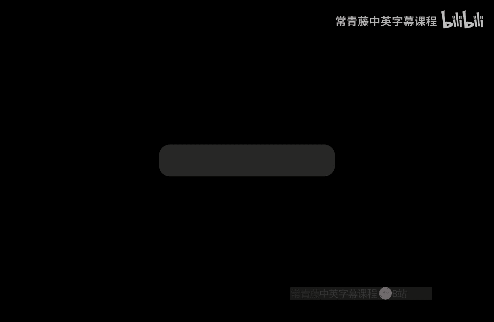
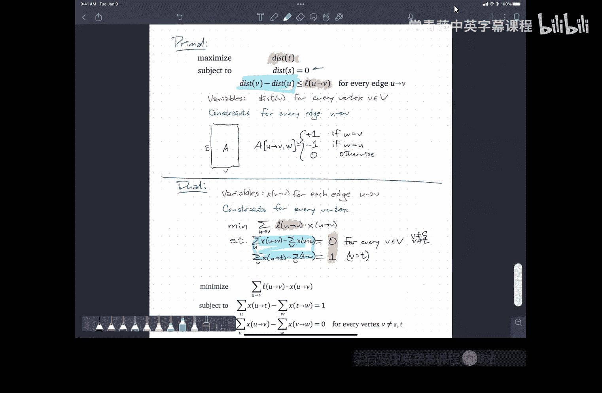

# 024：线性规划入门

在本节课中，我们将学习线性规划的基本概念。线性规划是一类强大的优化问题，它要求我们在满足一系列线性约束的条件下，最大化或最小化一个线性目标函数。我们将从几何角度理解它，学习其标准形式，并探索其对偶性这一核心概念。

## 线性规划是什么？🤔

线性规划问题可以抽象地描述为：给定一系列系数，我们试图找到一组变量（实数）的值，使得它们满足一组线性不等式或等式约束，同时最大化（或最小化）一个线性目标函数。

其数学形式可以概括为：
*   **目标**：最大化 **c₁x₁ + c₂x₂ + ... + c_d x_d**
*   **约束**：满足 **aᵢ₁x₁ + aᵢ₂x₂ + ... + aᵢ_d x_d ≤ bᵢ** （对于某些 i）
*   **变量**：**x₁, x₂, ..., x_d** 是实数。

这里的“线性”指的是所有表达式都是变量的线性组合（常数乘以变量后相加），不会出现变量相乘、平方或其它非线性函数。“规划”一词与动态规划中的含义类似，指的是通过系统化的方法（如构建表格）来求解。

上一节我们介绍了线性规划的抽象定义，本节中我们来看看如何从几何角度直观地理解它。

## 几何视角 📐

考虑一个只有两个变量 **x₁** 和 **x₂** 的线性规划。每个线性约束 **a₁x₁ + a₂x₂ ≤ b** 在平面上定义了一个**半空间**（一条直线及其一侧的所有点）。所有约束半空间的**交集**构成了一个区域，称为**可行域**或**可行多面体**。

在更高维度（例如三维）中，每个约束是一个平面及其一侧的空间，可行域则是这些半空间的交集，形成一个多面体。

目标函数 **c₁x₁ + c₂x₂** 可以看作一个方向向量。我们可以旋转坐标系，使得这个方向指向“下方”。于是，线性规划问题就转化为：在可行域这个多面体内，找到“最低”的那个点（即沿目标函数方向投影最小的点）。

这种几何理解比单纯看数字表格更直观。最著名的线性规划算法——单纯形法，其核心思想就像在这个多面体内丢下一颗弹珠，让它滚到最低点。

了解了几何意义后，我们来看看线性规划可能出现的几种特殊情况。

## 可能遇到的问题 ⚠️

在寻找“最低点”的过程中，可能会遇到两种“病理”情况：

1.  **无界**：可行域存在，但目标函数值可以无限降低（在最大化问题中则是无限升高），没有最优解。例如，在最短路径问题中存在负权环时。
2.  **不可行**：约束条件互相冲突，导致可行域是空集，没有任何点能满足所有约束。例如，在流网络中，供需不平衡或容量不足导致不存在可行流。

值得注意的是，问题是否有界取决于约束矩阵（决定了多面体的形状）和目标函数方向，而是否可行则取决于约束矩阵和偏移向量（决定了半空间的位置）。

接下来，我们将通过一个经典例子，看看如何将实际问题建模为线性规划。

## 示例：最短路径作为线性规划 🛣️

最短路径问题可以表述为一个线性规划。以下是其中一种建模方式（最大化形式）：

*   **变量**：对每个顶点 **v**，有一个变量 **dist(v)**，表示从源点 **s** 到 **v** 的距离。
*   **目标**：最大化 **dist(t)** （即我们希望 **t** 点的距离尽可能大，但会受到约束限制）。
*   **约束**：
    1.  **dist(s) = 0**。
    2.  对每条边 **(u, v)**，有 **dist(u) + l(u,v) ≤ dist(v)**。这保证了最终的距离满足三角不等式，即边是“松弛”的。
*   **解释**：算法（如 Dijkstra, Bellman-Ford）初始化距离为无穷大，然后不断降低距离使其满足约束。这个线性规划则是在所有满足约束的解中，寻找使 **dist(t)** 最大的那个，这恰好就是最短路径长度。

另一种建模方式（最小化形式）则涉及为每条边分配一个表示最短路径使用次数的变量，并将其转化为一个最小成本流问题。有趣的是，这两种形式是互相对偶的。

为了更系统地讨论和求解，我们需要将线性规划转化为一种标准形式。

## 标准不等式形式 📝

为了避免处理各种形式的约束（≤, ≥, =），我们通常将线性规划转化为如下**标准不等式形式**：

*   **目标**：最大化 **cᵀ x** （**c** 是目标系数向量，**x** 是变量向量）。
*   **约束**：
    1.  **A x ≤ b** （**A** 是约束矩阵，**b** 是偏移向量）。
    2.  **x ≥ 0** （所有变量非负）。

任何线性规划都可以通过引入新变量、等式拆分、乘以 -1 等方式转化为这种形式。在这种形式下，输入就是矩阵 **A**、向量 **b** 和向量 **c**。

线性规划一个极其优美且强大的特性是对偶性，这类似于最大流与最小割的关系。

## 对偶性：邪恶的双胞胎 😈

每个线性规划（称为**原问题**）都有一个对应的**对偶问题**。对于标准不等式形式的原问题（最大化），其对偶问题是一个最小化问题：

*   **原问题 (P)**：最大化 **cᵀ x**，满足 **A x ≤ b** 且 **x ≥ 0**。
*   **对偶问题 (D)**：最小化 **bᵀ y**，满足 **Aᵀ y ≥ c** 且 **y ≥ 0**。

其中 **y** 是对偶变量向量。可以看到，原问题的系数与对偶问题的偏移量互换了，约束矩阵转置了，不等号方向改变了，优化方向也反了过来。

原问题与对偶问题通过**弱对偶定理**和**强对偶定理**紧密相连：
*   **弱对偶**：任何原问题的可行解 **x** 的目标值，不超过任何对偶问题的可行解 **y** 的目标值。即 **cᵀ x ≤ bᵀ y**。
*   **强对偶**：如果原问题有最优解 **x***，那么对偶问题也有最优解 **y***，并且最优值相等：**cᵀ x* = bᵀ y***。

这就像最大流的值等于最小割的容量。如果找到一个原问题可行解和一个对偶问题可行解，使得它们的目标值相等，那么这两个解都是各自问题的最优解。

最后，让我们实践一下，如何为之前的最短路径线性规划构造对偶问题。

## 构造对偶：以最短路径为例 🔄

回顾最短路径线性规划（原问题，P）：
*   变量：**dist(v)** 对于所有顶点 **v**。
*   目标：最大化 **dist(t)**。
*   约束：对于每条边 **(u,v)**，有 **dist(v) - dist(u) ≤ l(u,v)**；且 **dist(s) = 0**。

按照对偶规则进行转换：
1.  原问题是最大化，所以对偶是最小化。
2.  原问题每个约束（每条边）对应一个对偶变量。设对偶变量为 **x(u,v)**（对于每条边）。
3.  原问题的目标系数（除了 **dist(t)** 系数为1，其余为0）成为对偶约束的右侧。
4.  原问题的变量 **dist(v)**（除了 **dist(s)** 固定为0）对应对偶的约束。**dist(s)** 固定，故在对偶中无对应约束；其他 **dist(v)** 无符号限制，故在对偶中产生等式约束。

经过推导，得到对偶问题 (D)：
*   变量：**x(u,v) ≥ 0** 对于每条边 **(u,v)**。
*   目标：最小化 **∑ l(u,v) * x(u,v)**。
*   约束：对于每个顶点 **v ∉ {s, t}**，流入的 **x** 之和等于流出的 **x** 之和；对于顶点 **t**，流入的 **x** 之和等于 1。

这正是一个从 **s** 到 **t** 发送 1 单位流量的**最小成本流问题**，其最优值就是最短路径长度。这完美体现了对偶性。

---

本节课中我们一起学习了线性规划的基础：从其定义和几何解释，到可能遇到的无界与不可行情况。我们通过最短路径问题实例了解了如何建模，并介绍了标准形式。最后，我们探讨了线性规划的核心——对偶性，揭示了原问题与对偶问题之间深刻而对称的联系，并通过实例演示了如何构造对偶问题。理解这些概念是运用线性规划这一强大工具解决实际优化问题的关键。