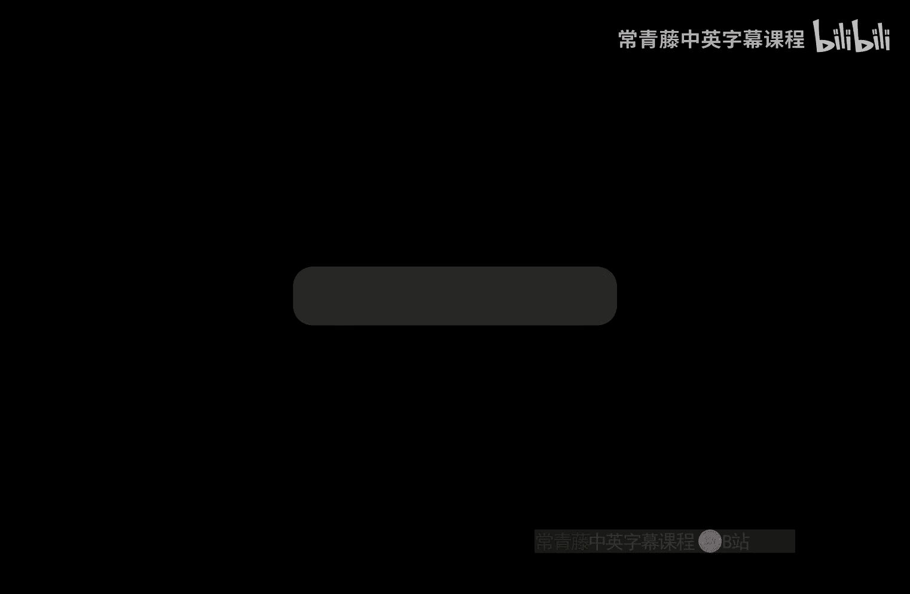
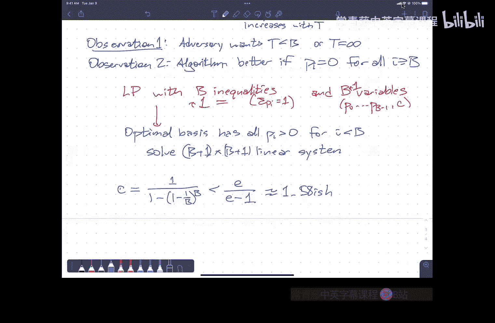

# 026：在线算法简介与竞争分析

在本节课中，我们将要学习一种特殊的算法——在线算法。我们将了解其核心概念，并通过几个经典例子（如寻牛问题、租或买问题）来学习如何分析在线算法的性能，即竞争比分析。

## 在线算法与离线算法

上一节我们介绍了在线算法的基本概念，本节中我们来看看它与传统算法的区别。

在线算法需要处理一个**操作序列**，并且必须**立即响应**每一个操作请求，无法预知未来的请求。其目标是**最小化处理整个序列的总成本**。

与之对比的是**离线算法**，它能够预先获得整个操作序列，从而可以做出全局最优的决策。在线算法的性能，通常通过**竞争比**来衡量，即将其总成本与一个全知全能的离线最优算法的总成本进行比较。

一个数据结构的操作过程，可以看作是在线算法的一个例子。你向这个“盒子”发送指令（如存储、查询），它立即响应并返回结果。

## 缓存管理：一个经典例子

为了理解竞争比，我们先看一个熟悉的例子：缓存管理。

假设有一个容量为 **K** 的缓存。操作是请求一个内存地址 **x**。
*   如果 **x** 在缓存中，成本为 **0**。
*   如果 **x** 不在缓存中，成本为 **1**。此时需要将 **x** 载入缓存，并**驱逐**一个已有的项。

以下是几种常见的缓存置换策略：
*   **FIFO**：缓存是一个先进先出队列。新项加入队头，驱逐队尾项。
*   **LRU**：缓存是一个优先队列，驱逐**最近最久未使用**的项。

离线最优算法（OPT）的策略是：驱逐那个在**未来最晚**会被再次访问的项。

分析表明，FIFO和LRU都是 **K-竞争** 的。这意味着对于**任何**访问序列，它们产生的总成本**至多**是OPT成本的 **K** 倍。即竞争比为 **K**。

然而，在实际应用中，由于程序访问具有局部性，LRU通常表现远优于FIFO。这是因为理论分析针对的是**最坏情况**，由一个全知且恶意的“对手”设计访问序列。

为了对抗这种最坏情况，可以使用**随机化**。例如，**随机标记算法** 的**期望**竞争比可以降至 **O(log K)**，这比确定性的 **K** 有指数级改进。

## 寻牛问题：确定性策略

现在，我们来看一个更简单的在线问题：寻牛问题。

一头牛在一条无限长的路上醒来，它不知道自己的位置。路上某处有一个谷仓，牛必须走到谷仓所在点才能发现它。牛的目标是设计一个行走策略，最小化其**行走总距离**与**谷仓实际距离**的比值（竞争比）。

假设牛醒来的位置为0点，谷仓在位置 **T**（T > 0）。一个自然的策略是交替向左右方向进行**指数级增长**的探索。

一个确定的策略序列可以是：向右走 **1** 单位，返回0点；向左走 **2** 单位，返回0点；向右走 **4** 单位，返回0点；向左走 **8** 单位…… 即步长按 **2的幂次** 增长。

当谷仓位于 **2^(2i) < T < 2^(2i+2)** 时，牛走过的总距离 **D** 满足 **D < 9T - 2**。因此，该确定性算法的竞争比**至多为9**。可以证明，9是确定性算法竞争比的下界。

## 寻牛问题：随机化策略

上一节的确定性策略有一个任意选择：第一步的方向。随机化可以改善这一点。

一个简单的随机化策略是：以 **1/2** 的概率第一步向右走，以 **1/2** 的概率第一步向左走，后续步长仍按2的幂次增长。

分析表明，这个简单随机策略的**期望**竞争比可以降至 **6.28...**。通过进一步优化（例如随机化增长基数 **B**，或增加一个随机偏移量 **δ**），可以得到期望竞争比约为 **4.61** 的最优随机算法，并且这被证明是理论下界。

## 租或买问题：确定性策略

另一个经典在线问题是租或买问题。

你每天都需要使用一件物品（如滑雪板）。每天你可以选择：
*   **租**：花费 **1** 单位成本。
*   **买**：花费 **B** 单位成本，此后可以永久免费使用。

但你不知道世界（或滑雪季）会在第 **T** 天结束。你的目标是使总花费尽可能小。

离线最优策略很简单：如果 **T < B**，则始终租用；如果 **T ≥ B**，则在第一天购买。

在线算法只能决定一个购买时间 **i**。算法策略为：先租 **i** 天，然后在第 **i+1** 天购买。

可以分析得出，最优的确定性选择是 **i = B - 1**。此时，竞争比为 **2 - 1/B**。当 **B** 很大时，竞争比趋近于 **2**。这也是确定性算法的下界。

## 租或买问题：随机化与线性规划

对于租或买问题，我们可以设计随机算法来获得更好的竞争比。

设算法以概率 **p_i** 选择“租 i 天后购买”。我们的目标是选择一组概率 **{p_i}**，使得对于所有可能的结束时间 **T**，算法的**期望成本**与最优离线成本 **min(T, B)** 的比值（即期望竞争比）**C** 尽可能小。

这可以形式化为一个**线性规划**问题：
*   **变量**：概率 **p_0, p_1, ...** 和竞争比 **C**。
*   **约束**：对于每个 **T**，算法的期望成本 ≤ **C * min(T, B)**。
*   **目标**：最小化 **C**。

通过观察（对手最优策略是令 **T < B** 或 **T → ∞**）和推理（算法无需租超过 **B-1** 天），可以将这个无限维线性规划简化为有限维问题。

求解该线性规划，得到最优的随机策略概率分布和最优竞争比 **C = e/(e-1) ≈ 1.58**。这显著优于确定性算法的竞争比2。这个解同时由对偶性证明了其最优性：不存在期望竞争比低于 **e/(e-1)** 的随机算法。

## 总结

本节课中我们一起学习了在线算法的基本概念和竞争分析方法。
*   在线算法必须即时处理未知未来的请求序列，其性能通过与离线最优算法的竞争比来衡量。
*   我们通过**缓存管理**例子了解了竞争比分析。
*   **寻牛问题**展示了如何通过确定性和随机化策略设计在线算法，并分析了其竞争比。
*   **租或买问题**揭示了如何将随机算法设计转化为线性规划问题，并求得了理论最优解。

在线算法和竞争分析为我们在信息不完全的情况下进行决策提供了重要的理论工具和设计思路。