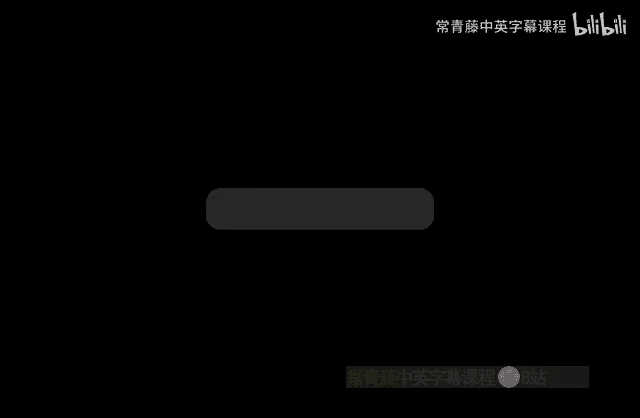
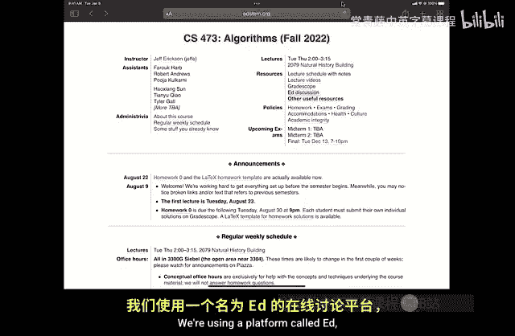
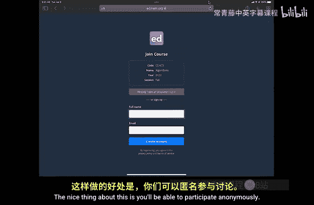
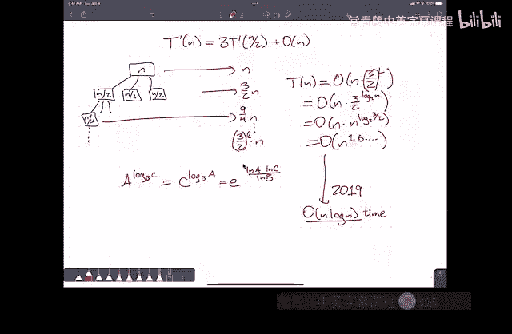

# 算法导论：P1：课程介绍与递归入门




在本节课中，我们将学习课程的基本信息，并深入探讨算法设计中最重要的工具之一：递归。我们将通过经典的汉诺塔问题和整数乘法问题来理解递归的思想和分析方法。

## 课程介绍

这门课程是伊利诺伊大学的高级算法课程，主要面向已完成CS374（本科理论课程）的本科生，或计算机科学及相关领域的研究生。课程将深入探讨算法设计与分析。

如果你对算法、大O表示法、二叉搜索树或递归不熟悉，这门课程可能不适合你。课程需要一定的编程经验和离散数学证明基础。



本学期课程注册人数远超以往，导致助教资源相对紧张。我们将尽力确保教学质量，如果你遇到任何问题，请及时与我们沟通。



课程所有资料都将在网上发布。我们将使用GradeScope提交作业，使用Ed平台进行在线讨论。鼓励大家在Ed上匿名提问和讨论。

## 课程政策

关于小组作业，你可以与任何人合作，使用任何资源。但在提交作业时，必须用自己的语言撰写解决方案，并注明所使用的资源（包括合作者）。从作业一开始，可以以最多三人的小组形式提交作业。

我们遵循尊重、包容、责任和诚信的价值观。任何形式的偏见、骚扰或暴力行为都是不可接受的。如果你遇到相关问题，请及时与课程工作人员沟通。

如果你感觉不适，请不要来上课。所有课程内容都有在线资源。如果你需要残疾相关的便利措施，请提前联系相关办公室并获取证明信。

## 递归：核心设计工具

上一节我们介绍了课程的基本信息，本节中我们来看看递归这一核心的算法设计工具。

递归的基本思想是：要解决一个给定问题实例，不是直接解决它，而是先取得一点进展，直到得到一个或多个更小的相同问题实例，然后将这些更小的实例委托给“递归精灵”去解决。

你可以将其视为“归约为更小的实例，然后委托”。如果实例已经足够小，你可以直接暴力解决。任何在常数大小输入上运行的算法都只需要常数时间，这就是每个递归算法的基本情况。

### 经典示例：汉诺塔问题

汉诺塔问题是一个经典的递归问题。它包含三根柱子和一堆大小不同的圆盘，目标是将所有圆盘从一根柱子移动到另一根柱子，规则是每次只能移动一个圆盘，且不能将较大的圆盘放在较小的圆盘上。

以下是解决该问题的递归思路：

1.  为了移动最底下的最大圆盘，必须先将上面的 `n-1` 个圆盘移开。
2.  将 `n-1` 个圆盘移动到另一根柱子（这是一个更小的相同问题，交给递归精灵）。
3.  移动最大的圆盘到目标柱子。
4.  将 `n-1` 个圆盘从临时柱子移动到目标柱子（这又是一个更小的相同问题，交给递归精灵）。

算法可以简洁地描述为：
```
函数 Hanoi(n, source, dest, temp):
    如果 n > 0:
        Hanoi(n-1, source, temp, dest)   // 步骤1
        移动圆盘 n 从 source 到 dest      // 步骤2
        Hanoi(n-1, temp, dest, source)   // 步骤3
```
当 `n = 0` 时，无事可做，算法自然结束。

**核心建议**：相信递归精灵。不要试图打开黑盒去理解递归调用的每一步，就像调用一个已实现的库函数一样使用它。

### 递归算法分析

我们需要分析汉诺塔算法的运行时间（这里指移动次数）。定义 `T(n)` 为移动 `n` 个圆盘所需的次数。

根据算法结构，我们可以得到递推关系：
```
T(0) = 0
T(n) = 2 * T(n-1) + 1, 当 n > 0
```
通过观察小数值或数学归纳法，可以证明其闭合形式解为：
```
T(n) = 2^n - 1
```
**证明（归纳法）**：
*   **归纳假设**：假设对于所有 `k < n`，有 `T(k) = 2^k - 1`。
*   **基础情况**：`n=0` 时，`T(0)=0 = 2^0 -1`，成立。
*   **归纳步骤**：当 `n>0` 时，
    ```
    T(n) = 2 * T(n-1) + 1          // 根据递推式
          = 2 * (2^(n-1) - 1) + 1  // 应用归纳假设于 n-1
          = 2^n - 2 + 1
          = 2^n - 1
    ```
    因此，对于任意非负整数 `n`，`T(n) = 2^n - 1` 成立。

## 更复杂的递归：整数乘法

现在，让我们看一个更复杂的递归应用：整数乘法。

传统的竖式乘法（或格子乘法）将两个 `n` 位数相乘，需要大约 `n^2` 次单数字乘法操作。历史上，人们曾猜想任何整数乘法算法都必须具有平方级复杂度。

### 朴素分治算法

我们可以将两个 `n` 位数 `x` 和 `y` 分别拆分为两部分：
```
x = a * 10^(n/2) + b
y = c * 10^(n/2) + d
```
那么它们的乘积为：
```
x * y = (a*c) * 10^n + (a*d + b*c) * 10^(n/2) + (b*d)
```
这需要计算四个 `n/2` 位数的乘积：`a*c`, `a*d`, `b*c`, `b*d`。由此得到递推式：
```
T(n) = 4 * T(n/2) + O(n)
```
使用递归树法分析，总工作量是各级别工作量之和。最终分析表明，该算法的时间复杂度仍然是 `O(n^2)`，并未改进。

### Karatsuba 算法

Karatsuba 发现了一个关键技巧：我们只需要进行**三次** `n/2` 位数的乘法，而不是四次。

注意到中间项 `(a*d + b*c)` 可以通过以下方式计算：
```
a*d + b*c = (a+b)*(c+d) - a*c - b*d
```
由于我们已经计算了 `a*c` 和 `b*d`，要得到中间项，只需再计算一次 `(a+b)*(c+d)` 即可。因此，新的递推式为：
```
T(n) = 3 * T(n/2) + O(n)
```
再次使用递归树法分析。此时，每层的工作量增长因子变为 `3/2`。总时间复杂度为：
```
O(n ^ (log_2 3)) ≈ O(n^1.585)
```
这确实是一个优于平方复杂度的算法。在实践中，当数字位数超过约50位时，Karatsuba 算法就比朴素算法更快。

## 总结

本节课中我们一起学习了课程的基本框架和递归这一强大的算法设计范式。

我们首先介绍了课程的目标、资源和政策，强调了合作学习与学术诚信的重要性。

接着，我们深入探讨了递归思想，通过汉诺塔问题展示了如何将问题分解并委托给递归调用，并分析了其时间复杂度。

最后，我们探索了递归在解决复杂问题上的威力，以整数乘法为例，从朴素的 `O(n^2)` 算法出发，逐步推导出 Karatsuba 的 `O(n^1.585)` 分治算法，并简要介绍了更快的算法（如基于FFT的算法）的存在。



递归的核心在于相信“递归精灵”能解决更小的子问题，而你将专注于如何组合这些结果。这种“分而治之”的策略是算法设计的基石，我们将在后续课程中反复运用。