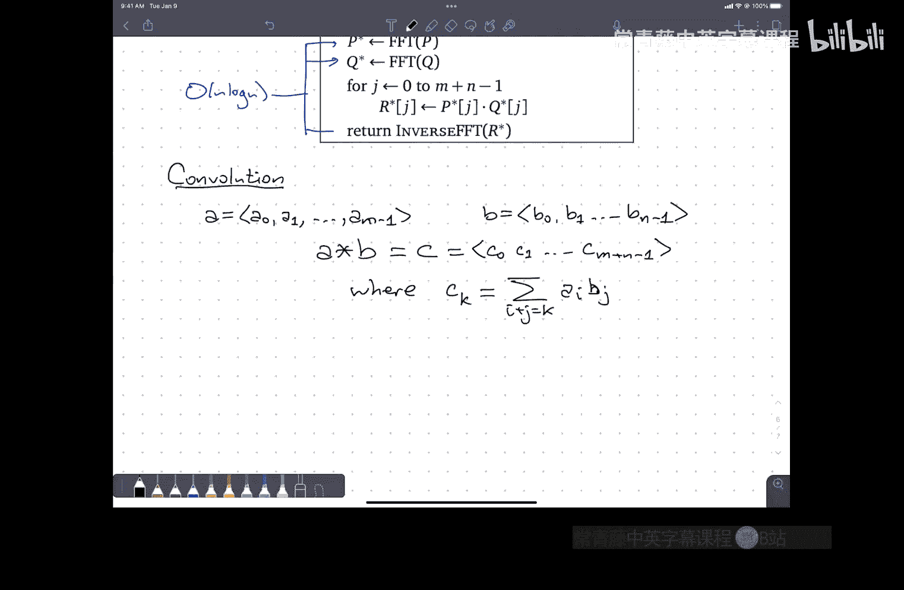
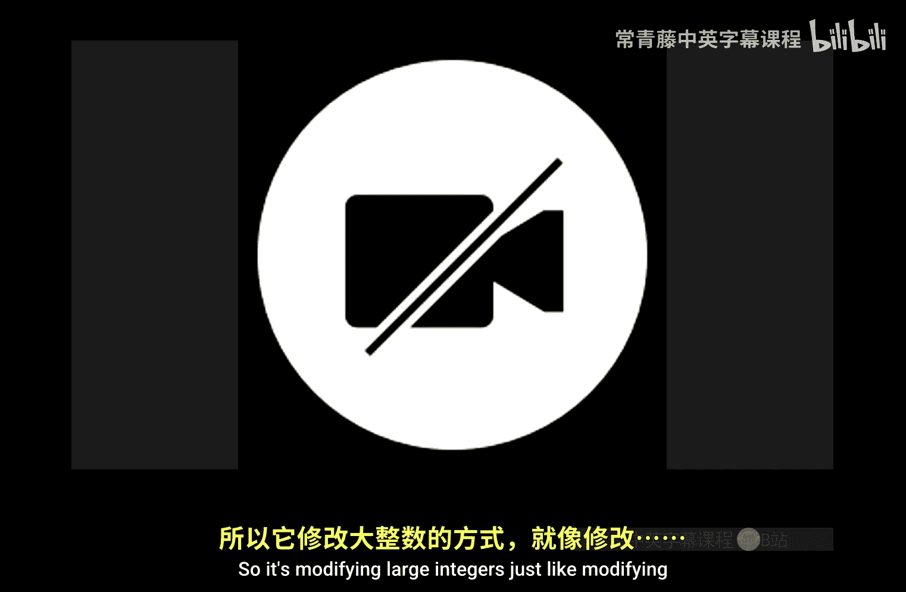

# 算法课程：CS473：P2 快速傅里叶变换


在本节课中，我们将学习一种强大的算法工具——快速傅里叶变换。我们将探讨如何利用它来高效地处理多项式，特别是实现比传统方法快得多的多项式乘法。

## 课程概述

上一节我们介绍了分治算法。本节中，我们将深入探讨一个具体的分治应用：快速傅里叶变换。这是一种将多项式从一种表示形式快速转换为另一种表示形式的算法，是实现快速多项式乘法的关键。

## 多项式及其表示

多项式是形如 `P(x) = Σ_{i=0}^{n} a_i * x^i` 的函数。在计算机科学中，我们通常用数组 `a` 来存储系数 `a_i`，这称为**系数表示法**。

以下是多项式的基本操作：

*   **求值**：给定 `x`，计算 `P(x)`。使用霍纳法则可以在 `O(n)` 时间内完成。
*   **加法**：给定两个多项式 `P` 和 `Q` 的系数数组，结果多项式 `R` 的第 `j` 个系数是 `R[j] = P[j] + Q[j]`。这可以在 `O(n)` 时间内完成。
*   **乘法**：给定两个多项式 `P` 和 `Q` 的系数数组，结果多项式 `R` 的第 `k` 个系数是 `R[k] = Σ_{i+j=k} P[i] * Q[j]`。使用嵌套循环的朴素算法需要 `O(n^2)` 时间。

系数表示法求值快，但乘法慢。是否存在其他表示法能加速乘法呢？

## 其他多项式表示法

除了系数表示法，还有两种重要的表示方式。

**点值表示法**：通过记录多项式在一组特定点 `{x_0, x_1, ..., x_n}` 上的值 `{y_0, y_1, ..., y_n}` 来表示多项式。对于 `n` 次多项式，需要 `n+1` 个点。

以下是点值表示法的操作效率：
*   **加法**：如果两个多项式在相同的点集上采样，直接将对应点的值相加即可，时间复杂度为 `O(n)`。
*   **乘法**：同样，将对应点的值相乘即可。但需要注意，结果多项式的次数是两多项式次数之和，因此初始采样点必须足够多（至少为 `m+n+1` 个），时间复杂度为 `O(n)`。
*   **求值**：为了在任意新点 `x` 求值，需要使用拉格朗日插值公式，其时间复杂度为 `O(n^2)`。

点值表示法乘法快，但求值慢。

**根表示法**：通过记录多项式的所有根（零点） `{r_1, r_2, ..., r_n}` 和一个缩放因子 `c` 来表示多项式：`P(x) = c * Π_{i=1}^{n} (x - r_i)`。

以下是根表示法的操作效率：
*   **求值**：直接将 `x` 代入乘积公式，时间复杂度为 `O(n)`。
*   **乘法**：将两个多项式的根列表合并，并乘以缩放因子，时间复杂度为 `O(n)`。
*   **加法**：没有直接的方法。通常需要转换回系数表示法进行加法，再重新求根，这非常困难且低效。

根表示法求值和乘法快，但加法几乎无法进行。

## 表示法转换与范德蒙德矩阵

我们面临一个权衡：系数表示法求值快、乘法慢；点值表示法则相反。一个理想的想法是：能否在两种表示法之间快速转换？这样，要进行乘法时，可以先将两个多项式从系数表示转换为点值表示，在点值表示下进行 `O(n)` 的乘法，然后再转换回系数表示。

从系数 `a` 转换到点值 `y` 是一个线性变换，可以用矩阵乘法描述：
`y = V * a`
其中矩阵 `V` 是一个**范德蒙德矩阵**，其第 `i` 行第 `j` 列元素为 `x_i^{j-1}`。

朴素地计算这个矩阵乘法需要 `O(n^2)` 时间。问题的关键在于：我们能否通过精心选择采样点 `{x_i}`，使得矩阵 `V` 具有特殊结构，从而加速这个计算过程？

## 快速傅里叶变换的核心思想

答案是肯定的。如果我们选择一组特殊的采样点——**单位复根**，就可以应用分治策略。

`n` 次单位复根是方程 `ω^n = 1` 在复数域上的 `n` 个解。它们均匀分布在复平面的单位圆上。主 `n` 次单位根定义为 `ω_n = e^{2πi/n} = cos(2π/n) + i*sin(2π/n)`。所有单位根可以表示为 `ω_n^0, ω_n^1, ..., ω_n^{n-1}`。

这组点具有一个关键性质：**可折叠性**。当我们计算 `(ω_n^k)^2` 时，由于 `(ω_n^k)^2 = ω_{n/2}^k`，平方后的点集恰好是 `n/2` 次单位根的集合，规模减半。

利用这个性质，我们可以设计一个分治算法来求值。对于一个 `n` 次多项式 `P(x)`（假设 `n` 是 2 的幂），我们可以将其按奇偶次项拆分：
`P(x) = P_even(x^2) + x * P_odd(x^2)`
其中 `P_even` 包含所有偶次项系数，`P_odd` 包含所有奇次项系数。

为了计算 `P(x)` 在所有 `n` 次单位根上的值，我们需要计算 `P_even` 和 `P_odd` 在所有 `(n/2)` 次单位根上的值。这恰好是两个规模减半的相同子问题。

## 快速傅里叶变换算法

基于上述思想，我们得到**快速傅里叶变换** 算法，用于计算离散傅里叶变换。

以下是递归形式的 FFT 伪代码：
```
function FFT(a):
    // a 是长度为 n (n是2的幂) 的系数数组
    if n == 1:
        return a  // 只有一个系数，其DFT就是自身
    omega_n = e^(2πi/n)
    omega = 1
    // 拆分奇偶系数
    a_even = [a[0], a[2], ..., a[n-2]]
    a_odd = [a[1], a[3], ..., a[n-1]]
    // 递归计算
    y_even = FFT(a_even)
    y_odd = FFT(a_odd)
    // 合并结果
    for k from 0 to n/2 - 1:
        y[k] = y_even[k] + omega * y_odd[k]
        y[k + n/2] = y_even[k] - omega * y_odd[k]
        omega = omega * omega_n
    return y // y 是点值数组，即 DFT 结果
```

该算法的时间复杂度递归式为 `T(n) = 2T(n/2) + O(n)`，解得 `T(n) = O(n log n)`。

## 逆快速傅里叶变换

为了从点值表示（DFT结果）`y` 恢复系数 `a`，我们需要计算逆 DFT。幸运的是，DFT 对应的范德蒙德矩阵的逆矩阵几乎与其自身相同，只是需要将单位根 `ω_n` 替换为其共轭 `ω_n^{-1}`，并对结果除以 `n`。

因此，**逆FFT** 算法与 FFT 算法几乎完全相同：
*   将 FFT 算法中所有的 `ω_n` 替换为 `ω_n^{-1}`（或 `e^{-2πi/n}`）。
*   在算法最后，将得到的每个结果除以 `n`。

逆 FFT 的时间复杂度同样为 `O(n log n)`。

## 快速多项式乘法

现在，我们可以组合 FFT 和逆 FFT 来实现快速多项式乘法。

以下是快速多项式乘法的步骤：
1.  **补零**：给定两个多项式 `P`（次数 `m`）和 `Q`（次数 `n`）的系数数组。将它们的长度都补零到 `L`，其中 `L` 是大于 `m+n` 的最小的 2 的幂。
2.  **正向变换**：分别计算 `P` 和 `Q` 的长度为 `L` 的 DFT，得到它们的点值表示 `Y_P` 和 `Y_Q`。使用 FFT，时间复杂度 `O(L log L)`。
3.  **点乘**：逐点相乘得到结果多项式的点值表示：`Y_R[k] = Y_P[k] * Y_Q[k]`。时间复杂度 `O(L)`。
4.  **逆向变换**：对 `Y_R` 进行逆 DFT（使用逆 FFT），得到结果多项式 `R` 的系数数组。时间复杂度 `O(L log L)`。

总时间复杂度为 `O(L log L)`，远优于朴素的 `O(n^2)` 算法。

## 卷积运算

多项式乘法在信号处理等领域有一个更通用的名字：**卷积**。给定两个序列 `a` (长度 `m`) 和 `b` (长度 `n`)，它们的卷积 `c` 是一个长度为 `m+n-1` 的序列，其中：
`c[k] = Σ_{i+j=k} a[i] * b[j]`
这正是多项式乘法系数的计算方式。因此，FFT 也可以用来在 `O(N log N)` 时间内计算两个序列的卷积，其中 `N` 与序列总长度相关。

## 历史注记与总结

快速傅里叶变换的思想最早可追溯到高斯，他用于计算小行星轨道，但因数据噪声问题转向了最小二乘法。现代形式的 FFT 由库利和图基在 20 世纪 60 年代重新发现并推广，主要用于信号处理。





本节课中我们一起学习了快速傅里叶变换的原理和算法。我们了解了多项式不同表示法的优劣，发现了通过选择单位复根作为采样点，可以利用分治策略在 `O(n log n)` 时间内完成系数表示与点值表示的相互转换。基于此，我们实现了 `O(n log n)` 时间的快速多项式乘法算法，并了解了其与卷积运算的紧密联系。FFT 是算法设计中一个经典而强大的工具。