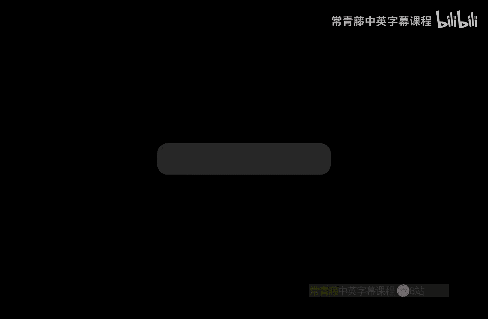
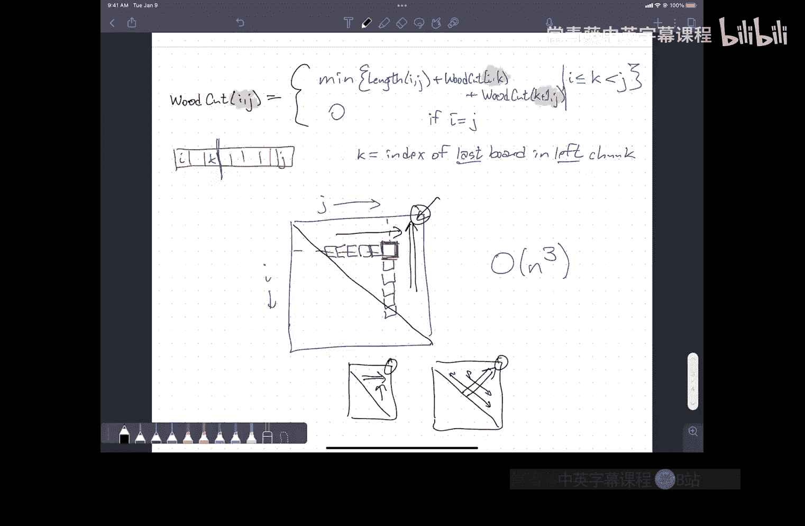

# 伊利诺伊大学【中英⚡算法｜CS473 Fall 2022 Algorithms】 p04 P4 4._More_dynamic_programming_(HD_1080_-_WEB_(H264_4000)) -BV1RdBTBrEdx_p4-

Yeah。这认我这个。跟我那什关。

好的讲。さ。Yeah but there was no listing here。还有次在。对我。What。Please stop right here。不说那个。Eesting。要。Yeah。对。不。

用弄起来。so the。Yeahは。Yes。Okay， folks， let's。Go ahead and get started， turn this down a little bit。嗯。So。

I need to do one thing that I forgot。Which is to put on this mask。😔，Um， so。After class。On Tuesday。

 I got email from a student that said， I'm sorry to tell you this， I was in class today。

 I just tested positive for COVID。So I did announce this on Ed， hopefully everybody saw that。

So please view where transmission rates are very high。😡，My wife， who's teaching Ma 241， has gotten。

 emails from 10 different students at this point just within the last week saying， oops。

 I was in class and I tested positive for Covid。Slightly larger class than this one。Um， so。Again。

 a reminder。😡，The recommendation is that everyone wear masks when you're inside the classroom。

If you are feeling sick or under the weather。Don't come to class， everything's going to be online。

 it's okay。If you test positive。Again， don't come to class the normal recommendation is。

You should generally isolate yourself until you're testing negative。嗯。So。Fortunately。

 it seems most of the cases that are popping up around campus are not particularly serious。

 but it'd be nice to keep it that way。嗯。I don't think there are any other。

Administrative or logistical questions。The Ts are and the CAAs are chewing through homework zero。

We are hoping to be able to get that back to you by the middle of next week because homework one is coming in on Tuesday。

Oh， yes， there is one administrative thing。Monday is Labor Day。Labor Day is a university holiday。

Which means I can't require the TAs to work on Monday。

So some of the TAs who have office hours on Monday。😡，We'll not have office hours next Monday。

 but they'll allow office hours tomorrow instead。So look on。The Ed discussion forum。

I think one of the Ts decided I might as well come in on Monday anyway。嗯。Um。So just be aware of that。

That the office hours， the day before homework one is due are going to be a bit weird because we're not officially here。

Any other administrative issues？Okay。So。Last time we started talking about dynamic programming。And。

So。This is， I think， the simplest。Maybe the most concise description of what a dynamic programming algorithm is。

😡，Is it's an efficient。Iterative。Evaluation of a recursive function。And。嗯。So the examples of the。

 the。D programmingming problems that I talked about on Tuesday。

 one was the text segmentation problem。Where。I'm given a long sequence of。Characters。

 and I want to figure out how to split it into words。And so this needs to be a word。

 this needs to be a word and so on。And。Ultimately。The algorithm is based on thinking about the question。

😡，Where does the first word end？So。If somehow I could magically figure out where the first word ended。

😡，Then I could figure out this first line on the left。😡。

And then pass the rest of the segmentation task off to the recursion ferry。

Thecursion ferry just given the rest of the big long string。

 it'll figure out a way to segment it if it exists， and then I'm done。

I don't know where to put that first dividing line。

 so I will try all possibilities by just plain old familiar brute force。😡，I would just say， well。

 the first word ends somewhere between the first character and after the1 character。

 say I've got a big for loop。Inside that for loop， for every possibility， I'm going to ask。

 is that prefix a word and if it is， is the suffix partitionable splitable into words？嗯。

But then we recognized that that。啊。Function that we called you know， splitable I， this is。Is。

The text starting at I from one to N。嗯。Sputable。Into words。We could memorize that into a big table。

 which we could fill from。Right to left。In a total of n squared time。😡。

And the reason it was n squared is that there are n possible subproms that we need to consider。

 there are n possible values that we can plug in as input to this function。😡。

And for each one of those values， I need to do a for loop over a potentially linear number of recursive subset problems。

😡，系。嗯。Right so when we。Fill in the table from left to right， that's the outer loop。😡。

Inside the inner for loop， I'm looking up I want to fill it in one entry。

 I'm looking at all of the entries to the right， potentially。嗯。The second problem that we looked at。

Was longest increasing subsequentence。Here。We're given。嗯。Given some sort of sequence of numbers。

And we want to pick out a subsequence。Of numbers that appear in。Increasing order。Now， here。

The way that we developed this algorithm。Is by pointing at， you know。

 imagining that we're constructing this sub sequenceence in order from left to right。

And I point at a particular number that's to the right of something I've already decided is in the subsequent and say。

 is that the next entry？Right。Is this？The next。Element。Of。The longest increasing subsequentence。Now。

To sort of formalize what it means to kind of ask this question。嗯。The idea is。I could either answer。

😡，No， this is not the one I want。And then， I'm kind of left with。

The same problem except this number doesn't exist anymore。

 I've just decided I'm going to ignore that number so I can literally just sort of move my pointer further to the right。

But something slightly different happens when I say yes。If I decide that I want to include it。

 I've actually changed the nature of the question slightly。

So the recursive question I'm asking isn't just about the numbers that I haven't processed yet？😡，So。

Let me make this a little bit more interesting。Let's call that five and this was circled。

And I'll circles this and I'll draw the line here。My choices of which things I can accept or not。

Unlike in the previous problem， depend a little bit on my previous choices。😡。

I need to remember a little bit about the past。In order to make decisions about the future。

 specifically。I can't include this three in my longest increasing sub sequence if I've already decided that one。

 two， three， five， and seven are going to be in it because。😡，Three is less than seven。It's too small。

 so I can't include it。😡，嗯。So I really need to kind of remember。This seven。

 when I'm considering what to do to the right of that dashed line。

And so this kind of changes the nature of the question。嗯。Then adding this extra extra rider。

That the previous。Element。Was seven。 and really， again。I should say it was here。

So now my question doesn't just depend on。😡，One parameter。

 namely the length of the suffix that I'm looking on， rather， it depends on two parameters。

Where does the suffix that I care about begin？And。😡。

What is the lower bound that I need to apply to the numbers that I can accept。

 what's the last number that I accepted as part of my sequence， my sub sequenceequence？😡。

That all future numbers need to be bigger then。😡，And so I end up with this function called that I called LIS of IJ。

This is the length。Of the longest。Increasing subsequentence。Of this suffolk starting at J。

Where all elements are bigger。Then a sub。Okay， two parameters。

One that just describes the data that I want to feed to the subproblem and that's J。

 but the second parameter， or in this case， I guess the first， but the other parameter，😡。

Is remembering something about the past in order to make sure that my future decisions are consistent with the decisions I've already made？

嗯。In this case。I'm going to have about n squared different subpros。😡，For any choice of I And J。

 I have to make a decision。 Is A J in or out， Yes or no。

So there are only two things that I need to check。😡。

One of them may be ruled out immediately because the numbers are in the wrong order。

 in which case it's even easier， I only have one thing to chuck。But I might have two things to check。

So I've got n squared different subproble， and for each one。

 I need to make either one or two recursive calls。😡，Now。

 if I just implemented this as a recursive algorithm， it would still take exponential time。😡。

But if I memorize this。Into an array。With two indices， a 2 D array。😡，UAnd。I fill the array。

In the right order。So decreasing J in the outer loop。

 I don't care what order you consider I in the inner loop。Again。

You end up with a running time order and squared。Now， in this review。

 the one thing that I didn't write down for either of these two problems is the actual recurrence。😡。

嗯。At some level， that's where all the real work is done。嗯。

But I don't want to spend the time writing the recurrence down and explaining it。

 given that I talked about it on Tuesday and it's in the notes that are available from the web page。

But I'm happy to answer questions about it if people have any。Okay， so。One thing I said at the very。

 very end of class on Tuesday。😡，So I pointed up at the screen at the things that I'd written for the longest increasing sub problem。

 and I said， this is all you need to write for full credit。And the one thing that I didn't write。😡。

Was the pseudocoat？Hey。😊，So what do we need？You know。Need for dynamic programming full credit。Hey。

 this is what we want。One is we want an English specification。Of the problem that we're solving。

What's this？So a couple of things about this English specification one。😡，Give it an mnemonic name。

 do not call your dynamic programming function DP。😡，If you look on hacker right。

Every single dynamic programming problem， the array is called DP。Do not do this。😡。

Code is meant primarily to be read by the next programmer and only secondarily to make the computer do something。

I really believe this， this is one of the things I believe like in the recursion fairry and the all powerful malicious adversary。

Code is written for humans。 Humans do not speak C plus plus。😡，UmHumans do not know， you know。

 I know it's dynamic programming， it's nested loops。😡，What does it mean。Give it an monic name。

And then write a comment that says what it actually means in English。

 that thing that I've surrounded in the boxes。Second thing。

I've given explicit parameters to this function， which are typically going to be integers between one and n and one in something else or zero in something else。

😡，These are indices into an array， so I've chosen the mnemonic names I andJ。😡。

If there's something else， he's a different mnemonic name。Over on the right。

I have a description that is a standalone description。That uses the parameters I and J。😡。

As part of the definition。😡，The English description specifies how the variables I and J affect the actual output value over there。

😡，On the other hand， things that don't appear over there are anything about the current number。😡。

Or the current state。Or the numbers we've looked at so far。😡。

This is not referring to any sort of internal state of an algorithm because we don't have an algorithm。

😡，We're not to the point of designing an algorithm yet。😡。

It's just a function that has a well defined meaning。😡。

In the absence of any other information whatsoever。诶。

This is what's written at the top of the man page for the LIS function。😡。

You don't know what the internals are， and you shouldn't tell me what the internals are。

I'm saying all these things because these are all very common mistakes that people make。😡，All right。

The second thing that we need。Is a recurrence？Which could be written using。

LA of Ij equals in a big open brace and。Cases or it could be written in pseudocode as a recursive algorithm。

 either one is fine， we can read them both。嗯。This explains how to solve the problem that you've described here。

😡，The third is the iterative details。How to turn how to evaluate this recurrence efficiently so you don't get the exponential blow up because you're repeating the same sub problemsm over and over again。

And there are three pieces to the iterative details， one。

 you need to tell us what data structure to use to record the results。😡，There's a standard idiom。

Then something to looked like a square， we're going to assume you mean a two dimensional array。😡。

Please write the I and J indexing on the sides so that we know whether I is the row index or column index in which way are you indexing up or down？

If you get a long thin box like that。We're going to assume that you need a one dimensional array。

Should you draw a cube。We're going to assume you mean a three dimensional all right， but again。

 please label the axes of the cube。You don't need to actually write 2D array， just you wrote a box。

 I assume that's a 2D array。😡，Two， you need to tell us the order that you traverse the data structure to fill in the values。

😡，Again。Idiiomatically， we're going to use arrows to specify that so that long long thin rectangle with then arrow pointing to the right。

😡，That's a one dimensional array filled in decreasing order。

 You can now translate that into for equals n down to one。If you're not comfortable with this。

 you can also just write for eye equalicles n down to one or decreasing I。😡，Likewise， here。😡。

I'm using these different styles of arrows to represent inner outer loops in the direction。

 so the double line arrow is the outer loop， the single line arrow is the inner loop。😡。

What this says is in the outer loop， decrease J， in the inner loop。

 consider all I don't care what order。😡，You could also write。Outer loop decrease J， inner loop。

 increase I or outer loop for J equals n down one inner loop for I equals1 up to J。😡。

But all those are fine。And then you need the running time。😡。

And because this is generally just going to be a few nested loops。😡。

We don't need any further justification to the running time to say， oh， it's a 2D array。😡。

The total time to fill it is in squared。It's a 1D array， it's total time to fill it as n squared。

You don't need to analyze space， I'll actually talk a little bit about optimizing space next week。😡。

But as a general rule。In this class， we're just going to want time bounds。

 don't worry about optimizing space。😡，U。This dynamic programming problem in particular。

 it's easy to cut the space down from quadratic to only linear by realizing that once you've filled in a column。

 you don't need the next column to the right anymore。

 so you never have to actually store more than two columns at a time。😡，And if you're careful。

 you actually only need to store one。But that's not an optimization that we。哦。

We're going to worry about here。Notice。What we need doesn't include pseudocode。😡，But。

 you could include that。But then。You don't need these two things。

Because the pseudo code tells you explicitly what the evaluation order is。

 what the data structure is， yeah， you still need the running time。

 I should pull that out of the box。And in the middle of the iterative pseudocode in the innermost loop。

😡，There'll be five lines of code that are the recurrence。😡。

So you don't need to save the recurrence again。😡，So。You can either give us。1，2， and 3。嗯。

Or you can give us one in four。Whichever one you're more comfortable with。😡。

Thing you can't avoid is one。😡，A lot of people who've been doing。Haackcker rank type things。

Have a really bad habit of， okay， the first thing I'm going to do is I'm going to sit down and I'm going to write the C++ code。

😡，The array is called DP。And then okay， I wrote the code down， I tested it， I think it works。😡。

What is this English stuff？My claim is that if you can't explain to me in English what the IJth entry of that array means。

 you don't actually understand what you're doing， which means you have no basis on which to believe that your algorithm is correct。

😡，The other hand。When people get confused developing dynamic programming algorithms。

 in my experience， the place where they're actually getting confused is not dynamic programming。

 it's not even necessarily recursion。😡，It's what problem are you actually trying to solve？😡。

That's what the English is for。All right。So today I want to do a couple more examples。

The first example I want to do is the other way of doing longest increasing subence。😡。

Just to show you that there's multiple paths up the mountain。And the second one is a little bit more。

Complicated than that。So。Any questions about sort of the general？

Components of a dynamic programming algorithm。Okay， great。So。Longest increasing。😔。

Sub sequenceequence。2。😊，嗯。Okay， so previously the way I approached this is I imagine putting my right index finger on the numbers one at a time and say。

 is this next， is this next， is this next， is this next， is this next。

 is this next answering yes or no each time the question that I want to answer。😡。

This time seems like it might be a little bit faster。 what's next？😡，So at the very beginning。

 I'm going to be asking。嗯。What is？The first。Element。Of the longest increasing subsequentence。Um。

 what about， I don't know when I don't know， I'm not going to try to guess。

 I'm not going to try to be clever， being clever is far too much work。

I'm just going to write a for loop and try every possibility。😡，I don't know， it's one of those。Um。

 so I don't know， let's imagine a little birdie landands on my shoulder and tells me it's this one。嗯。

So then the question becomes， okay， what's the next element after the one？

Now I could think of this by like， I'm drawing a line here and asking。

 what's the first element in the longest increasing subence to the right？But that's not really fair。

 that's not really the question I'm asking， I do actually have to remember something about my past decisions and more generally if I've done something like this。

I've decided， say in the first three elements。Then there's no way that I can accept this too as the answer to what's the next element in the longest increasing sub sequenceence。

 it's too small。😡，So。I have to remember。The previous element that I accepted into my sub sequenceequence。

 just like I did the other approach to the question。😡。

But now I think actually the way that I want to ask this question is。What is the second。Eleement。

In the longest increasing subsequence。M。First。Eleement。Is here。Let me make that a little bit neatter。

 sorry about handwriting。I don't actually care when I'm thinking about the stuff to the right of the three。

Whether the three really is the third element in my longest increasing sub sequenceence or only the second or only the first。

 whether I picked the one that's in the fourth position or the one that's in the second position。

 none of those details matter to me。😡，The only thing that I actually that affects what decisions I could make to the right in the future。

😡，Is。U。The the value that I'm pointing to， it's the last value that I accepted into my。😡。

Into my output。嗯。So I can formalize this。By defining。Fun LAS prime。

 so it's a different function than the one I defined on Tuesday。This is the length。Of the longest。

Increasing。Subs sequenceequence of a I through n。It starts。With AI。So I'm using the index I both。😡。

To point to the beginning of the suffix that I'm interested in examining。

And to an element that I have accepted into my longest increasing subence。Yes。Okay。

All of this should started the index AI。That's yes， that's correct， that's correct。Okay。

 so I think what you're starting to get at is the original problem doesn't specify an initial element。

So how do I use this function to answer the original question。

 what's the longest increasing sub sequenceequence in the original array？😡。

And here there's a fairly common trick。 I'm going to add a sentinel element to my original input array。

嗯。With value， negative infinity。😡，And I say， tell me the length to the longest increasing sub sequenceequence starting at negative infinity。

😡，It will include negative infinity， so I'll subtract one at the end。So in the end。

The the actual thing I want。Is I'm going to set a0。To be negative infinity。 and then in the end。

I'm going to return LIS of0 minus1。The other possibility is to say。

 I don't know what the first element is， let me just try all and possibilities and return the smallest of those end results。

😡，This is less code。Turns out to be exactly the same amount of computation。嗯。Okay。

So there's my English specification for the problem I'm trying to solve now I need to write。

A recurrence。嗯。Now， often it's tempting when you're writing recurrences to do the base cases first because they're right there in your hand。

As things get more complicated， I actually find it much more productive to think about the more general case first。

😡，And then look for places where there are kind of gaps in the missing assumptions that you need to worry about。

嗯。The length of the longest increasing subequence starting at index I。

 the length of that is going to， well， there's definitely at least one。😡。

Because I'm including A subI， so I'm going to count that now。And then。I need to take the max。

Over all possible choices for the second element。😡，And for each choice。

 I want to look at the longest and increasing subsequent starting at that index， which I'll call J。😡。

But this index J has to satisfyati two conditions。One is J has to be a larger index than I。😡。

And the other is that the value stored at that index has to be larger than the value stored at index I。

Yeah。No。Just to。嗯。See if everybody's on board here， let's suppose。This。Is a subai。

What will the recurrence？This function that I've written down。Actually return。For LIS Prime of I。1。

What happened to that max？How many elements are in this set？That I'm taking the maximum of。0。

What's the maximum of the empty set？😡，A。Error， well， so if I， if I really want to be safe here。

 I should define this is a set of。😡，Possible lengths of a subsequent。

This is a set of natural numbers。😡，So it's kind of reasonable if I remember the type of set it is to let the maximum of the MP set be zero。

 this means no matter you know what other element， the first element I pick in put in。

 it's going to be greater or equal to this and so the maximum of any one element set really is going to be that one element。

😡，Now， if this were a set of。Arbitrary integers， positive or negative。

 or this sort a set of arbitrary real numbers， then max of the empty set would naturally be defined as negative infinity。

嗯。This is kind of why know I would recommend actually writing this down。😡，They say， oh， by the way。

When I talk about the max of the empty set， I mean zero。😡，Am I done？I wrote down the recursive case。

What's the。Bace case。Remember what the base case means。Base case of a recursive definition。

 base case of an inductive proof。Is any case that does not involve the recursion ferry？😡。

When that set is empty， I don't make any recursive calls， that's my base case。😡。

When the number at position I is larger than every number that follows it。😡，The answer is one。

That's the base case。Or those are the base cases。In fact。

 if I have my original input array in decreasing order。😡，Every case is a base case。

 because the set is always empty。Okay so no， I don't need to write anything else down。

 I'm actually done。😡，It's just that in that one line。😡。

I got a recursive case when the set was not empty and I got a base case when the set was empty now I could have written that out explicitly。

😡，If this set is empty， return one， otherwise return this expression。😡。

But I basically sort of did that by writing。Just defining the max of the empty set to be zero。

This is one of the examples why I don't recommend。When you're writing the recurrence or you're writing an inductive proof to start by writing base case。

 colon， inductive case， colon。Because you may not need to actually。Right two separate things。

 and it's not necessarily clear a priori how many base cases you need or how many will just fall out。

Yes。这是。Okay， so do I need to account for J is bigger than N if I really want to be careful here。

 I should write。😡，This。The problem is only well defined if I actually points to a particular element。

😡，So。That means I'm never going to call the function LIS Prime with an argument larger than N。😡。

It doesn't make sense to ask this particular question about the empty sequence。😡。

So I don't need the usual sort of empty sequence。嗯。😊，Base case。Okay。Got a recurrence。If I。

Evaluate this as a recursive algorithm， it runs into to the end time。

 I'll let you figure it that yourself if you want。At this point I get up， I go to the bathroom。

 I get a drink of water， I change my hat， I put different music on。

 I move to a different table at the coffee shop and I go， wow， a recurrence where it came from。

 let's figure out how to memorize it。😡，And I'm not entirely joking about getting up and changing your hat and going to the bathroom。

 is really is two separate parts of the process and it's best not to mix them。Okay。

 I've got a function with one argument， it appears to be an integer between one and n。😡。

I guess between zero and n， what data structure should I use to memorize it？Theres one argument。😡。

Between one and n。So the 1D。If I what order should I fill it in well？If I'm filling in LIS of I。😡。

I may refer to LAIS prime of J， but only for J larger than I。So to fill in this hollow square here。

 I might need to evaluate。Some other squares over here。First。

Some subset I don't know which one it depends on the contents of the array。

But I'm not going to need to fill in anything on the left。😡，Of that black box first。So。

If I evaluate the array from right to left。Then when my code gets to this point in the array。

 all of the information it needs to determine that the value that goes there has already been computed。

😡，And I can replace the recursive calls that have written up there with an Ray lookup。Okay。

 what's the running time of the algorithm？😡，N squared。And the reason is。

There are two variables in this recurrence。😡，There's the eye that appears on the left。😡。

And there's the J that appears on the right。And for each of those variables can take on values more or less arbitrarily between one and n。

 there's a restriction that I has to be less than J， but that only cuts the possibilities in half。So。

Quarter out of time。Do you actually implement this？😡。

This green arrow here is the outer loop that sp equals n down to one。😡，And then inside that loop。

 there will be another loop for j equals i plus1 up to n or for j equals n down to i plus1。😡。

And then do an if and then compare to your running maximum。

So even though it's a one parameter function。😡，Even though it's written in one line。

The actual implementation is still going to be too nested for loops。

 and so the running time is still going to be unsred。Yeah。喂。

Could there be a slight difference in the constant of this？就事。おった？Yeah。So， it is true that。Here。

The sub problem position I depends on n minus I other problems。

 and so you get roughly n squared over two different pairs Ij。😡。

But in the other formulation of the problem。That's also true。

J is also greater than I in this formulation， so even though I drew that box。

 I'm actually only going to fill the parts of the box above the diagonal。😡，So。

There's about n squared over two things to figure out。😡，They're organized slightly differently。

Whether you have two options or one or whether that pair actually appears or not depends on the comparison of two items。

😡，There is kind of a sense that these two algorithms are doing the same work just in different order。

😡，But。The real answer to this question is。Constant。Don't worry about constantsts。

RightBut when you're absolutely doing this in practice， of course you should worry about constants。

 but when you're designing the algorithm。Should just design something that works and is fast up to Big O。

😡，And then worry about the constants only if you've done a profile of your running program and you realize that you're spending 89% of your time in this nested for loops。

😡，Don't optimize anything that uses less than 20% of your CPU time。😡，Yeah， yeah。

 reason I is the facts。Another one is it's kind of structured a little differently。

 like you get right over all the Js get， then you take the back over there。

 you will fix the J and then make a pants so two different。

So I was just wondering if that operation So the question is whether I want to think about this as here。

 I'm taking the Max of a whole bunch of things。 But in the other algorithm。

 I'm only taking the max of two things。But on the other hand。

 the way that you take a max of a whole bunch of things。

 you take the max of this and the next thing and then that and the next thing。

 that and the next thing， you unroll it into a bunch of pairwise comparisons， so I'm not。It。

It's not immediately clear that there's a significant difference， but again。

 if there is it's only a constant， so I'm not inclined to think about it too hard。Yeah。Now。

 one thing， again， hopefully I have time to get to next week。😡，This is not。

This is a sort of straightforward implementation of that recurrence。😡，Unlike the other recurrence。😡。

This recurrence。You can evaluate it more quickly with the help of something you've seen in 225。😡。

Data structures。嗯。I can take the values that I've computed in my memorization table and put them into a more interesting data structure than an array。

😡，And if I do this in just the right way。I can answer that Max。😡，I can figure out that maximum value。

In log end time。😡，So the trick is I'm going to put the data that I compute， not just into an array。

 but into a certain type of balanced binary search tree。😡，In that AJ greater than AI。

 that's going to be a binary search for the value of AI。😡。

And I'm going to return they'll store values of the function in the tree and return the maximum thing to the right。

ll talk about this in more detail next week。😡，This formulation of the problem actually allows through the clever use of data structures。

😡，A faster solution than the other formulation of the problem。No， unfortunately。

 I don't know a rule that tells you which question should I ask that will allow me to use data structures？

😡，You just have to try different things and sometimes something works out。Yeah。系。Al right。

Any other questions about longest increasing subequences？Okay。Um。So。

Now I'm going to do something a little bit dangerous here。😡，The problem I'm going to talk about。

Is a thinly veiled。And hopefully simpler version of a problem that's in the notes in the textbook。

But not using the same language。So I'm going to try to be careful about writing things down here。

 but you're not going to find like an immediate isomorphism between the language that I use to talk about this problem。

😡，And the language that's in the existing notes， hopefully over the weekend。

 I'll have a chance to actually write up lecture notes for this particular formulation for this particular problem。

 but I want to warn you in advance that I'm deviating from the textbook because I think I can explain this better than the textbook author did。

😡，没有。Past me， damn you past me， okay， all right， so here's the woodcutters problem。😡。

I have a long plank of wood。😡，With。Cut marks on it。He。

 so the wood is marked into places that I want to cut it。没有。The wood cutter is is， you know。

 actually one of these， you know。Really。89 year old Japanese carpenter with like does magic woodworking thing to make puzzle boxes and out of his furniture and he's very。

 very particular about the places that you cut the wood。In particular。

 it's not just that he needs a three foot piece and a one foot piece。

 it has to be that three foot piece and that one foot piece because if you did them in the other order the grain wouldn't line up and it would be ugly。

😡，So I'm really going to insist I want to cut the board。😡，Into pieces at these marks the end okay。嗯。

Now。There's a sawmill。Will make。One cut。But the cost is proportional to the length。Of。The point。

The entire plane。The question is。What's the cheapest way to disassemble the board。

 the plank into the individual boards？😡，So。I could。Cut the board here。

The cost for the first cut is the same， no matter where it is。😡，It's the total length of the board。😡。

But if I cut here in the middle， then I've got two subproms。

 I've got a shorter plank on the left and I've got a shorter plank on the right。

 so I can recursively cut up the shorter plank on the left and I can recursively cut up the shortestk shorter plank on the right。

😡，But。I don't know， it might actually be cheaper。To make the first cut here。Or somewhere else。

So this is the question。嗯。啊。What is the cheapest way to disassemble the board？嗯。😊。

I kind of understand what the problem is。8ight。So you can make up your own story about why the sawmill takes proportion costs proportional to length of the whole plank。

 so I'll make up something out of thin air。You take the board of the sawmill。

 actually you're taking to the landing dock for the sawmill。

 and in fact need to they have drones that actually carry the plank to the real saw。😡。

And the cost depends on the number of drones they need to pick up the board。

 which is proportion of the length。😡，Okay， there， I made up a story。don't worry about the story。

 just let's accept it like this。Okay， so to be formal about this。I'm going to imagine that。I'm given。

An array。Let's call it。B from one to n of。Board lengths。So this piece has length B1。

This piece has length B2， this has length B3， and so on。Okay。Now。

It's just as reasonable to say my input consists of an array where the Ih entry in the array tells me the position of the Ih mark starting at the left end of the board。

😡，But I can convert back and forth between the positions of the cuts and the length of these boards by doing a linear time sweep through the array。

 so if you want， I can now compute an array X of1 through n of cut positions。😡，By defining Xj。

As the sum overall I less than equal to J of B。Or going the other way。I could define B I。

As X I minus。Xi minus1， assuming that x0 is equal to 0。So I can go back and forth。

 given one way I can compute the other， so what the hell we might as well assume we were given both the beginning。

It's going to be a little bit easier to deal with the board length。😡，All right。Okay。

I'd really like to think about this in a way where I can make one decision and I can pass the rest of the problem off to the recursion fairry。

😡，So。What's my job？Where's the first cut？It's recursion Fer his job。你好。How do you， first， what is it。

 then how do you do it？😡，What question is the recursion fairry answering before you start talking about the algorithm to answer it？

八ster八五。Recursively cut up the left piece。😡，And recurively cut up the right piece。哎。嗯。Okay。

So let's imagine that I that I。Thinking about this now for a while。

A little birderie lands on my shoulder and says I should cut here first。

Now I've got two reccursive subprobles。嗯。Now let's play this game again over here on the right。

 I need to figure out the sorry， the recursion ferry on the right needs to figure out where's the first place to cut this piece on the right so little Berie lands on the recursion Ferrys shoulder and says here。

😡，And so the recursion theory。Calls the recursive recursion ferry。With these two boards。Right。

And we're already kind of。In the general situation here。My sub problemsm。

 the pieces of wood that I need to deal with in the middle of this process of cutting it up。

Are intervals between cuts， they're not prefixes， and they're not suffixes。😡。

So a subpro here is going to be specified by where is the left cut？😡。

For that piece and wheres the right cut for that piece， which means， of course， I should imagine。

 you know， here's a。You know。I know the entire links to the board。嗯。

So I can kind of think of this saying， well， remember。

 eventually I'm going to cut this board up into a bunch of smaller pieces。That。That subplank。

Right now consists of boards I through J。😡，That's the way I'm going to specify this。😡。

Smaller piece of wood。It's the one that starts at the left edge of board I。

 and it ends at the right edge of board J。😡，There's lots of other ways that I could have done this。

 this seems convenient。😡，可以。😊，Now。At this point， I can kind of write down an English description of the recursive function that I'm trying to evaluate。

😡，嗯。Woodcut IJ is the minimum cost。😡，2。😔，But。Let's how would we want to say this？Put the plank。

Containing。Boards。I through J。Into individual boards。Okay， I need to do a sanity check here。

One of these smaller planes。I can imagine two different ways to get to that plank starting an I ending at J one is the very first cut at the beginning of time was at position I。

😡，And then in the subproblem on the right。😡，I did a cut at position J plus1。

The other way I can imagine getting here is at the beginning of time， I did a cut position J plus1。

 and then in left subproblem， I did a cut at position I。😡。

So two different ways to get to the same subproble that's a good sign that means there's going to be something for me to remember and so dynamic programming is going to help good。

 but I need to think，😡，Do I care when I'm handed the board that goes from I to J。

 do I care how this board came to be？😡，Is there any information that I need to remember about previous cuts？

😡，To make decisions about future cuts。No。The cost only depends on the length of the board that I'm holding and where the cuts are in the board I'm holding。

😡，Okay， good。These really are the only parameters that I need to put it into my function。

 unlike the longest increasing subence problem where I need to remember one thing about my past。😡，Oh。

Another sanity check。Um。Remember when I talked about text segmentation。

 I said we're building some kind of recursively defined structure， in that case it was a sequence。😡。

A sequence is either nothing or it's a word followed by sequence。😡。

What recursive structure are we building？😡，Not just a tree， but a binary tree。And so in this case。

It's a binary tree whose leaves。Ourre individual boards。

And whose internal nodes are longer pieces of wood。So a binary tree is either。😡，A single board。

Or it's a plank。😡，With。😡，Some left part。😡，Cut up into a binary tree and the corresponding right part cut up into a binary tree。

Or in words that you're maybe more used to。A binary tree is either nothing。😡。

Or it's a node with a thing on the left， which is a binary tree and the thing on the right。

 which is a binary tree。😡，And so。If I want to build the binary tree。

 my job is to figure out the non recursive part， what is the root？😡。

And the recursion varies job is to figure out the recursive parts， what's the left subt。

 what's the right subt？All right。So。Let's see if we can define。

See if we can define ourselves a recurrence。哦嗯。Let's see。

 should we start with the base case or start with the general case？Let's start with the general case。

 it's always fun。In this case， I think we can guess there probably will be a base case。嗯。

Let's think about the most general case。Which is I and J are different。😡。

There is at least one interior。To be made。U。All， so maybe to be clear， this starts。Actually。

 at cut I minus1 and ends at cut J。Is that right？let me let me yeah let me it leave the indexing as it is。

 I is the index of the first board inside that plank J is the index of the last board inside that plank。

Okay。So I'm going to cut this somewhere。😡，But I don't know where。So。I need to try all possibilities。

And compute the minimum of those possibilities。Okay。嗯。

So I can cut immediately after board I immediately after board I plus1 immediately after board J -1。

 So let's use K to be。The last board in the left piece after we cut。はい。

So that means K is going to be somewhere。Greater than or equal to I and less than or equal to。

Or sorry， less than Jay。Okay。😊，Now。If somehow I knew the value of k。😡，What is the value。

 what is the actual cost of cutting up the wood。😡，嗯。There's a non recursive part of the cost。

 which is I need to make the first cut。😡，The time to take the first cut is the length of that piece of wood。

A， which just for the convenience， I'm just going to write down as length Ij。嗯。

Then I need to optimally cut up。😡，The piece on the left。That starts at iron is it。

So that's going to be。Would cut of icon K。And then I need to cut up the part on the right。😡。

It starts at K plus1 and ends at J。😡，听。Yes。I'm sorry。Yes， you're right。Thank you。

That I should be okay。Yeah。Okay。Does everybody understand what is going on in that recursion？U。

I'm deciding， you know， all given this board。😡，It starts at I and endZ J。

I'm picking some value for k and imagining what it has to to cut there。

I paid for the length of the board starting an I and ending at J。😡。

Then the recursion ferry on the left。Cuts up the left chunk optimally。

 yourcursion fur on the right cuts up the right chunk optimally。Yes。

So it's because I'm numbering the pieces， so I want to allow for the possibility that I cut off one piece over here on the left。

😡，In that case， this first piece on the left it starts at eye and ends at I。😡。

So that's woodcut of I comma I。But I don't want to include J because K is the last piece on the left。

 K plus1 is the first piece on the right。😡，Yes。Its either of the numbers of toughmarks。

Each half of the assistance， the the cause is not only determined by the letters author by the number of part which that。

Okay。What you're proposing is to do some of the recursion Ferries job。

The length of the cost for the first cut is the length of the board。😡。

nothing to do with the where the cuts are， doesn to do where the marks are。

 nothing to do with the recursion ferry。😡，The cost of the first cut is the length of the board。😡。

That's it。Anything having to do with cuts after the first cut is none of my business。

 The recursion fairry is going to take care of that。So it's true that to solve the eventual problem。

 we do need to take the complete pattern of marks into account。😡。

But I'm delegating as much of that job as I can to recursion。

Taking care of the non recursive part of building this tree of cuts。

 namely figuring out what goes on at the root。And letting everything else be delegated to the recursion fairry。

嗯。I do need a base case here。😡，So if I is equal to J。What is the cost of cutting up？😡。

One plank or sorry， one board into boards。😡，Zero， I need to make zero cuts。

And I can do that in zero time by doing zero things。

So the first case only applies if I is less than J， and in particular that means this set。😡。

Will never be empty。😡，哎。😊，So。Is it clear how to compute length Ij？😡。

That's the sum of the lengths of the first of the boards fitting I and J。

 I mean the simplest thing to do is in a preproces step do this and then right length of IJ is equal to Xj minus X I minus1。

So I do a little bit of preprocessing at the beginning of time。

 and then that length thing I can compute by subtracting two cut positions。系。K。Get up。Cook dinner。

Playing Minecrafts with my 12 year old。Watch an episode of being puppy cat。Because I'm 12 year old。

We'll watch an episode of Rice the he meeting into turtles because I have a 16 year old。Um。You know。

Changing in my pajamas put on a different hat。And then look oh wait。

 I forgot to do the rest of the algorithm， okay， let's do the iterative stuff。

I've got this recursively defined function that has two arguments。😡。

Those arguments are integers between1 and n， what should I memorize it into。

 what kind of data structure do I want？A 2D array。Okay， so there's I， there's the J。

And even without doing anything else。😡，What's the running time of the algorithm going to be？😡。

I'm hearing two different answers， but one is more popular than the other。Is it in squared。

Stand them all again。Send the fifth。It's in cubed。😡。

And the reason why I think it's going to be un cubeed is there are three variables in that recursion。

😡，There's I and J on the left。😡，Each going from one to N。 that tells me right off the bat。

 I'm going to use about n squared space。So the amount of space that I need。

 the size of my data structure is back of the envelope pretty much。😡。

Going to be n to the number of arguments to the function。😡，But the running time also has。

A third variable bouquet。And you see that expression over there at the right side of the braces。

 that's pronounced for loop。So there's going to be a loop over I and a loop over J。

 but inside that there's going to be a loop over k。😡，So N cubed。All right。

Now what order do I need to consider these problems in， what order do I need to fill the array。

 so let's look at this box at a particular position of I and J。嗯。And ask。

What parts of the table need to be filled in already before I fill in that box in red？😡，Well。

I've got two， you know here。That's a position， Ij， it's going to depend。On。

Two kinds of other entries， one kind would cut of I。That's going to be in the same row。

The first parameter is the same， but in an earlier column。Because K is less than J。So。

These up put these in green。These need to be over here。嗯。And the second kind。

It's going to be the same column， the second argument is the same。But it's going to be in a later。

Row。Because K plus1 is always greater than I。Same column later row。Again。

 we are in a situation where we're only filling in half of this table because I is always less than or equal to J so this is the dependencies as we care about before I fill in the red box I need to fill in the green boxes。

So what order should I fill the table？Yes。Left to right， Top to bottom。

Which one is the inner loop and which one is the outer loop？Yeah， the answer is it doesn't matter。

 so I can fill this in in。😡，Well。I need to do green before red。

 so in the outerer loop I can go this way in the inner loop， I go that way。So。

Rose in decreasing order of I in the outer loop， columns in increasing order of J in the inner loop or。

😡，I could go like this。Columns in increasing order by J in the outer loop roses in decreasing order by I in the inner loop or。

I'm actually a little bit surprised nobody proposed this。

I could fill in the main diagonal and then the diagonal above that and then the diagonal above that and then the diagonal above that and so on。

 this is also just two nested four loops。The loop indices aren't exactly I and J。😡，But that's okay。

 we can do math。So you fill in one diagonal at a time and this kind of makes this is almost the most natural way to do this because the main diagonal is the base case。

 that's all of the single boards。😡，And then one diagonal above that is all the places where I only need to make one cut。

😡，And above that is the next diagonal is all the places around they need to make two cuts and so on。

And the answer that I actually want to return。😡，Is this entry up here？Wouldood cut of one comma and。

So it is。And cubed。Now， remember I said something about space earlier。

The longest increasing subequence in that space， you only need to keep two columns。

You can't do that here。😡，You actually to fill in that red square， I need everything to the right。

 everything to the left and everything below to stay in the array。

 so there's never an opportunity to throw things out。😡。

I'm always going to need this data to stick around forever until I fill in the last entry in the table。

😡，Okay。We're out of time， but I'm happy to answer questions about this upfront if you have any。😡。

Thank you。😊，Sure。Sa what is the least amount of cost。

