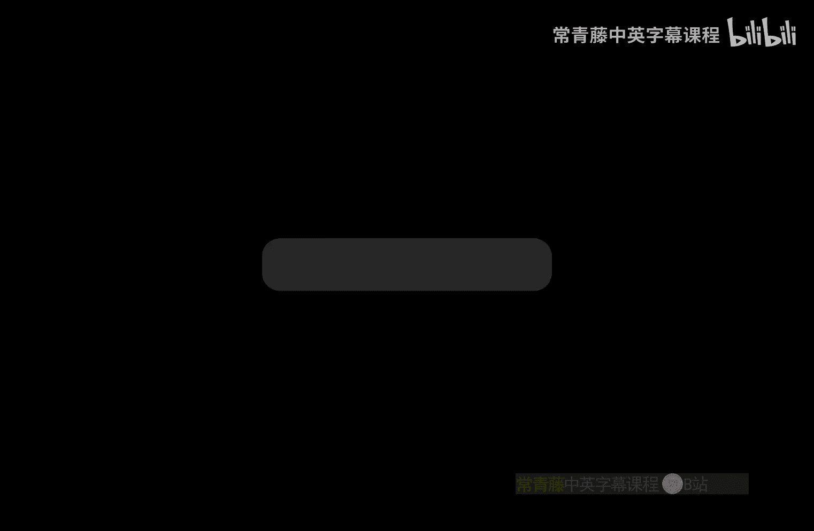
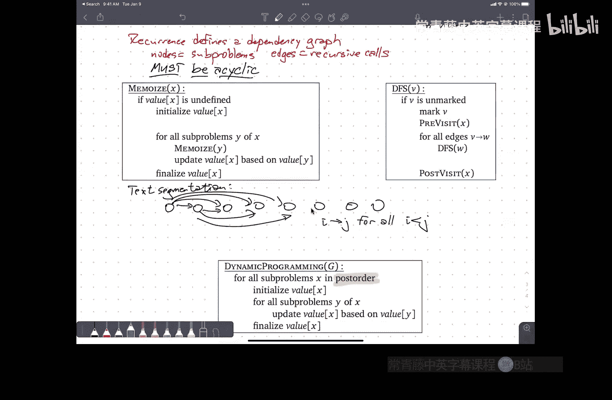

# 伊利诺伊大学【中英⚡算法｜CS473 Fall 2022 Algorithms】 p05 P5 5._Even_more_dynamic_programming_(HD_1080_-_WEB_(H264_4000)) -BV1RdBTBrEdx_p5-

嗯。

嗯。看到我现在。哦。Okay。对。All right。Yes。Let's。Go ahead and get started。嗯。So thanks again。

 everybody for coming。Not much to say in terms of logistics。

TAs and CAAs are about three quarters of the way done with grading homework zero。

Which is good because homework one is due tonight。They just keep coming。

Hopefully homework one will be faster to grade because people are submitting things in groups。

So we're not getting。You know， individual submissions from every student。Homework two。

Which is due a week from today， is up on the website。There will be one more homework。I3。

On the material that I'm covering。This week and maybe a little bit of next week。

That will be the last homework。That covers material that will be on the first midterm at the end of September。

So。There'll be a few more lectures in the middle where we'll start introducing new material， but。嗯。😊。

Basically， midterm one is just going be about recursion and dynamic programming。

We'll start doing a little bit of probability， but mostly just to get warmed up。

And then midterm two will be。You know， cover the material that we。Talk about later。Okay， so。

We're basically already halfway to the first midterm。Just weird how that goes。Right。

 any administrative questions or logistical questions？Yeah。U。

Sor of the question is whether the midterms are cumulative。

The midterm two will definitely focus more on material that you've seen since bid termm one。🤢。

But kind of in the sense that we might ask questions that use techniques from earlier in the semester。

 so we will assume that you know them， but that's not going to be the main focus。

And then the final exam at the end of the semester is just going to cover everything。Okay。So。

Dynamic programming。嗯。So I want to start before I get to。Kind of yet another bit of。

A few new examples， I want to start by trying to give you another piece。

Of the intuition that I use when I'm designing dynamic programming algorithms that I think is。😡。

Helpful。嗯。And that's basically， I'm going to draw sort of little very quick sketches to kind of。

Capture my intuition about how these dynamic。How the recursive。

Problems emerge from the statement of the dynamic programming problem。

And how the evaluation orders and so on emerged without going through the formalism of actually writing down the recurrence or even writing down an English spec。

😡，Just to build up intuition。In your own mind how to break problems down in order to solve them。

All right， so let me just start with the。First problem that we were given。

The text segmentation problem， even a long string， I want to be able to break it up into words。嗯。

I'm trying to make a sequence of decisions。😡，And the decisions ask， you， where do I break up？

This long string into shorter words。嗯。And the guiding question is。You know， what's the first word？

Or really， if you're in the middle of things， what's the next word？

But then a recursse and' what's the second word and a recurs and ask what's the third word。

So I'm making my decisions in order。😡，From left to right， through this array。any given time？

I'm asking the question， what's the first word， but I'm asking that question not about the entire array。

 but only about the portion of the array that I haven't already processed。

 So that means that my sub problems。Are going to be。Suffixes of the original array。

 So if I've already figured out the first three words。

 the part of the array that I haven't figured out how to split up yet， that's going to determine。

My recur is some problem。Now I'm not even going to bother， as I said。

 writing down in English what precisely the problem is or what the。😡，嗯。

The recurrence to evaluate that function is， but I can already develop a bit of intuition about how the dynamic programming algorithm is going to go。

Suffix is， I can specify。😡，Using a single number， so for example。

 maybe I want to specify suffix by the index where the suffix begins。

 it's not the only choice could have also specified the suffix by its length。😡。

But let me just imagine that I'm choosing the index where that suffix starts to represent it。

That means the input to whatever my problem is going to be is one integer between one and n。😡。

So right off the bat， my memmalization structure。What is going to be a one dimensional array。

If I'm using the beginning index of the suffix as my identifier。😡，The original problem is。

The suffix is just the entire original string， so that answer is going to be at the beginning of this memorization array。

And the base cases are going to be at the end at the empty suffix， which means my。😡。

Esvaluation order。Is going to be like that。And。嗯。If you poked at this a little bit further。

 you might even be able to come up with a reasonable guess that yeah。

 I should be able to do this in about n squared time。😡，Because for each suffix。

 I need to look at all possible shorter suffixes。系。

But this is as far as I want to go with this kind of intuition。Where do the subprom come from？

How do I specify them， what does that mean about the memorization structure and the evaluation order？

Now， this wasn't the only way I could have done this。😡，AndInstead ask。嗯。What's the last word？

In which case now my decisions are being made。In order from right to left。

My problems are now prefixes。Instead of suffixes。If I specify the prefix by the index where it ends or equivalent at its length。

😡，The answer that I eventually want。Is going to be at the right end of。The memorization table。

Corsponding to the whole string and my evaluation order is going to be from left to right。

There's this reversal。Between when I start out thinking about the sequence of decisions I want to make。

😡，When I my intuition says， I want to make those decisions in order from left to right。

That means in the eventual dynamic programming algorithm。

 youll be filling in your memorization array from right to left。😡。

This is the difference between the order that you make the recursive calls and the order that you get the answers back。

 pushing versus popping from the recursion stack。There's always this kind of reversal。And。

So second example。Longest increasing subsequent again。I'm making decisions。

In my array from left to right。And if I if I think of my decisions as some things I say yes and other things I say no。

 up to some point。Well， there's still。Suffix that I have yet to process。

 but that's not the only information I need。To specify a sub problem。I also need to remember。

This last thing that I decided， yes， this is part of my longest increasing subence。😡。

So that I know that the next thing I choose is bigger。😡。

I don't remember that one last thing that I can't enforce the requirement that the sub sequenceequence I'm picking out is actually increasing。

This is an important thing to think about because。😡，For some problems。

 you just need to keep around one extra number for some problems you need to keep around two extra numbers。

😡，Some problems you need to keep around 10 extra numbers。嗯。For some problems。

 the information you need to keep out is even more complicated。

So the sub problemsblems are not just going to be specified by the part of the array I haven't looked at yet。

😡，I also I need to remember a little bit about my past decisions。

My subprom in this case is going to be。嗯。呃， sentinel。It's this guy plus。Sufffiix this guy。Again。

 if I specify my Sentinel by an index and my suffix by the beginning index。

I've got some problems specified by two numbers。And so if I。The obvious thing to store them in is。

Two dimensional array。And the answer that I'm looking for。The suffix is going to be the whole thing。

So if I call the Sentinel I in the suffix J。The answer I'm looking for is when J is really long。

Which means the index J is small and I has to be even smaller。

 so the answer I'm looking for is over here。And。So my evaluation order is going to be kind of in that direction。

The specifics will depend on the。What recurrence I write down to actually solve this。

Whether I want to use， you know， I in the outer loop and J in the inner loop or vice versa or whether it matters。

 I need to work further into the problem to figure that out。系。嗯。Then there's the woodcutters problem。

Where now。I'm not making decisions in order from one end of the plank to the other。Rather。

 I'm making kind of a divide and conquer kind of decision。😡。

So I need to decide where to make the first cut。And then that's going to lead to。

To independent subpro， both of which I need to evaluate reerssively。Again。

In both cases I'm going to ask， where's the next cut？嗯。So。

I'm not really making a sequence of decisions now I'm really making a binary tree of decisions。😡，But。

If I'd sort of jump into the middle of growing this binary tree。😡，嗯。The sub problemm。

That I'm going to be left with。Is some interval in the middle of。The original。Aorray。

At the original input。Okay， so some problems。Or intervals。

So some starting index and some ending index。So again， I've got。😡，2。

Numbers between1 and n that specify my sub problemblem。Which means once again， I'm going to be using。

A two dimensional array。IJ and because I is less than J。Actually just like here in the LA。

Thing I could also assume I is less than J， I'm really only going to be filling in the top right half of this table。

And now the answer I'm looking for。Theres spreadit to the interval that starts all the way on the left and ends all the way on the right。

😡，So that's going to be in row1 column N is here。😡。

Which means my evaluation order is going to be kind of in that direction。Yes。

So in the original problem， I'm looking at the interval that starts at index1。😡，I is one。

And ends it index N。 J is N。 So I is my row index coming from the top。

 So I want to be in the first row。J is my column index counting from left to right。

 so I want to be in the last column。嗯。有。😡，You may be used to thinking about your arrays indexed in different directions than this this is sort of。

😡，Pppping the row major order of the way we normally write words in English。😡。

UmSome people find it more natural to have I be across the top and J down the bottom。

 J down the side， it's fine as long as you label where everything is。😡。

Or maybe you want to use X and Y coordinates， which are always pointed。To the right and up。

Instead of to the right and down。嗯。As long as you are clear about the orientation of。😡，Your array。

 the way things are indexed， it doesn't matter which of those you pick。In the end。

 the brightright programmer from 374 is going to look at that cartoon and go， oh。

 I need a two dimensional array， it's indexed by I and J。😡。

You haven't given enough information about the evaluation order yet， so I'll wait for more details。嗯。

So。This is。This really is kind of the first stage sketch that I go through。😡。

When I'm thinking about a new dynamic programming problem。😡。

The beginning is I want to make a sequence of decisions。😡，What do those decisions look like？😡。

Maybe I'm chewing in from left to right， maybe I'm chewing the input array from right to left。

Maybe I'm jumping and supposed to making one step at a time。

 maybe I'm doing a sort of divide and conquer things， which's really a tree and not a sequence。😡。

Maybe I need to keep around one or two bits of information。😡，Maybe there's more than one input array。

😡，And I'm sort of making decisions about how to mix the two arrays or something。

 so I'm eating up consuming a prefix of both and leaving a pair of suffixes is my subprom。嗯。

I find that writing down these little cartoons。Actually does really help me clarify in my own head。😡。

How I want to design the algorithm。It's not， by any means the end。

But I think if its it's a useful way to spend like the first five minutes。

Whenever you're faced with a new problem like this。Okay。So。Any questions about？This。Intuition。

Intuition is a very tricky thing to talk about。😡，Because at a fundamental level。

My intuition only makes sense to me because I've already gone through the hard work of figuring how to do this stuff。

And I'm throwing this at you in the hopes that it will maybe help you shortcut that a little bit。

But at some level， this may not make sense to you until after you've gotten more practice kind of solving dynamic programming problems without this。

😡，And then you can use this kind of as a reminder， oh， I remember。

LastOn the last homework I thought about it this way。

It kind of reminds me of this picture that's just enough to keep the structure in your head to help you solve it。

So if you do find yourself great， if you don't。Talk to me。

 maybe we can figure out something else that'll work。That'll be helpful。Okay。So。So far。

All of the problems that we've been playing with。The input to the problem is an array。😡，And。

Even when the structure that we were building。Was't a sequence， it was a tree。

Still because some problems referred to that original pieces of that original input are right。😡。

They're specified by some small tuple of numbers。The memorization structure also turned out to be an array。

😡，嗯。That's not universally going to be the case。😡，The memorization structure is not always a something dimensional array。

😡，So for some problems， it's more natural to use a different structure because the way that you specify a subproblem isn't just some small tu of integers。

😡，So to give you an example of that。I'm going to look at。Maximum independent set problem。Now。

 some of you might remember from 374。What an independent set in a graph is so you know in general。

 if I have some kind of graph。嗯。An independent set。Is a subset of the vertices。

Such that none of the selected nodes have edges between them。😡。

So the three nodes that I've highlighted here in Pa that defines an independent set in this graph that has size three。

And。Obviously， I haven't like run the entire brute force algorithm in my head， but I think。😡。

It's reasonably clear that there's no independent set in this graph of size4。

So this cycle over here on the side。Any independent set either uses uses it most two。

 and then here this edge， any independent set uses it most one。

 so yeah that gives us it a center for bound of three。ok。Now， of course， the problem with this。Is。

This problem is MP hard。That means unless something very， very strange is going on。

More or less equivalent to discovering that the laws of physics don't work the way we expect。

There is no polynomial time algorithm to solve this problem。😡，Without some restrictions on the input。

So I'm going to restrict the input。Because there are fast algorithms。Or。Some special cases。

And the simplest special case。UIs。When the graph is a tree。

So I'm going to describe a polynomial time algorithm to solve the maximum independent set problem when the graph is a tree。

Right， so。Everybody remembered the definition of a tree？What's the definition of a tree？下个。Sorry。

 I think you said the right thing， can you say it again？你诶。We if we add any ages in the tree。

 we will make a circle and every node in the tree was connected Okay so the tree。Is a connected。

Acycl click。Undirected。Graph。So it has these sort of exreal properties like。😡，If I remove any edge。

 then the graph becomes disconnected， If I add any edge， then that edge creates a cycle。

Any graph that has those two properties is necessarily a tree。

 but the basic definition of a tree is it's a connected graph that doesn't have any cycles in it。Now。

I really want to do something where I can invoke the recursion ferry and in order to invoke the recursion fairry。

 it's really helpful to be able to leverage some kind of recursive structure。

This definition of tree doesn't have any intrinsic。Recursive structure， So I'm going to do。

I'm going to impose my own convenient recursive structure specifically for the purpose of supporting an algorithm。

😡，Right， so I am going to。Choose。Yeah。A root。Noode。Let's take that one。And then I'm going to。

Direct edges。Away from the root。Like， so。No，我睇。This way。And now I don't just have a tree。

 I have not surprisingly， a rooted tree now a rooted tree。😡，You can。Describe recursively。As follows。

A rooted tree is a node。With。A set。Of。Rooted。Trees， which are called the subtes。

There's always at least one node， so it's not like the definition of sequence where you can have nothing。

😡，Orig tree always has a root。'sOtherwise it wouldn't be a rooted tree。On the other hand。

This set of sudden trees might be empty。So if I point to just a single node floating in space。

 say that's a rooted tree， there is the root and here is the empty set of subrees。

 it's a perfectly valid tree。😡，系。Okay。So I've got a recursive structure that I can exploit。

That's good。Because it means that I can focus on the non recursive part of that structure。😡。

For me to make my decisions。😡，And I can let the recursive part of the structure be handled by the recursion ferry。

 At least that's the goal。嗯。So let me。诶。Sorry， I need to move a few things around here。At a page。嗯是。

😔，There。And now I need to take this。Not quite ready for that stuff yet。O。

So now I can kind of redraw my tree。Here's a node， it's got four edges coming out of it。

It goes to there's a subree of size one， there's another sub treee。Of size 3。There's another subre。

 sorry， size four， not three。Yeah。Okay， so by just。

Pulling the root up and letting the outgoing edges point down。So I get established a kind of。

What we normally call parent child relationship instead of just a tail head relationship from the directed edges。

So my job。Is。To figure out。What to do with this route？

Either this root node is in my largest independent set or it isn't。😡。

And then once I figured out whether it is or it isn't。Then I'll ask some question about the subtes。

And each of the subtes I'll be able to kind of deal with independently as its own rooted tree。😡。

eight。收。Without thinking about， you， I'm going to apply the same logic that I did on the previous slide。

嗯。So I'm making a sequence of decisions， my first decision is at the root。

 and then I recursed inside my subtes。😊，For whatever recur means。

So I'm kind of making decisions starting at the top of the tree and working my way down。

How am I at least intuitively going to specify a sub problem？How do we describe？

The chunk of the input that I'm going to pass to the recursion tree。对啊。可以好的。

That's what found directly from you was。Well， we'll get there， right。

 you're jumping a little bit ahead。But I want to say very carefully what you just said。😡。

You want to keep track of whether the node above you is something something。😡。

What does the second word you in that sentence refer to？对。

So the recursion ferry doesn't have any nodes above it。The node above blank。对的。Well。

 there is no note above the route。Okay， sub problemsm aren't no， sub problemsblem don't have parents。

 how do you specify the subproblem？😡，You pass in a vertex。Okay， so what I just went through here。

Again， this is a very common thing that people do， you're grinding through intuition。

 it's very common when you say those things to use pronouns。😡，It。😡，Me， you， we us them that this。😡。

Ask yourself whenever you hear yourself emitting a pronoun。What is its antecedent？

What is it referring to？Because when you're actually turning things into code。😡。

You have to give things names and you have to give them types。😡。

Best to get into the habit of doing that at the beginning when you're talking about this。😡，So。

A subprom。Is specified。拜。A vertex。Initially。The vertex that I pass in is the root of the tree。

But when I recurse， it's going to be one of the children of the root。😡。

And when that recursion ferry recurs， it's going to pass its own recursion ferry。

 some grandchild of the root。And so on。诶y。😊，So。I can use this now now that I kind of know what my subprom is。

 now I'm kind of ready to ask what is the question I want to ask about that vertex。

 so I'm going to define a function。😡，So I'll call MI of V。This is the size of。

The maximum independent set。Where。How do I say that in a way that allows me to finish this？

Definition。Yeah。是。是。对。Yes。😊，In。The subt。Rooutoted。At V， which means， for example， if this is V。😡。

Then I'm looking at this entire subt， V and all its descendants。Right。So again。

 is just this is a fragment of the recursive structure if I start expanding the definition。

 a rooted tree is a node with a set of rooted subtes， well each of those is a node。😡。

With a set of rooted subrees， each of those is a node with a set of rooted subre， I can specify。

That object called a subte by pointing at its root， that's just a node。

 but the node is just sort of a signpost that identifies this whole set of vertices in the tree。Okay。

All right， so。We've got。A function。Let's see if we can come up。With。A recurrence。Yes。

Next note is part of the independent because if the child is part of the independent set。

 then the main cortex cannot be part of the right right so so what we're what you're kind of getting at here is that sub problems may not only be。

Subtrees， they may be subtes plus some additional information about what I did one step above。几。😊，So。

Let me。Let me follow this， okay？So。I'm going to add a second parameter P。😡，嗯。If。啊。Parent of V is。

Included。P is true。And if parents。Of the is。Excluded。P is false。Okay， so。Instead of just saying。

 here's a node giving the largest independent set in the subte。I'm thinking， well。

 I've already made decisions about the parent of this node。

 so let's pass that decision in and I've already made decisions about other ancestors of that node and maybe some uncles and aunts。

😡，But those don't have any influence over the size of the independent set in the subte。😡。

The size of the subt that I've circled there。The size of the independent set in that subt might depend on whether that blue node is in or out。

😡，But it's not going to depend on， say， whether this node down here。😡，8ight。

So I only need to pass in this one bit。Now。You can follow this。To its。Logical conclusion。

 this will lead to a perfectly valid dynamic programming algorithm。😡，But I'm。

A little bit uncomfortable with it。Because it's kind of breaking the obstruction barrier。

I think there is another way that you can say this。

That kind of keeps everything localized to the subre itself without revealing anything outside。Yeah。

So。re going to be two cases there are only going to be two possibilities for the largest independent set。

 either V is in that largest independent set or it's not。😡，So。

Maybe what we should do is keep track of those two cases separately。😡，Right， so。Let me， you know。

 say again。啊。I'm going to cross this out for a second， right？This works。

But it's a little bit awkward。So I'm going to do something else instead， I'm going to define。

I'm going to find two functions， MI， yes of V。And MI I S， no V。This is the size。Of the largest。

Independence that。In the。Subree。Rooutoted。At the。That includes。

And it's the independent set that includes V here。And then the other one is。The size of the。

Largest independent set。In that's subre that excludes the。

And then the largest independent set in the subte is the larger of these two。😡。

If one of these functions gives me the answer five and the other one gives me the answer seven。

 the largest independent set in the subre has size seven。Okay。All right。In particular。

 this means I can now answer the question about the original tree without referring to the nonexistent parent of the root of the original tree。

😡，Okay， so。ok。So， let's see if we can。嗯。Define。Recurrets。For these two things。So， I think the。Well。

 I think the answer no actually is slightly easier to think about。Okay so。

Let's suppose here's my node。And I've got a bunch of subtes hanging down below it。

And let's for the moment， just decide that node is not that node V is not going to be in the largest independent set。

 Little Bie landed on my shoulder and said this isn't there。How do I express？

The size of the largest independent set。In this tree。Given the knowledge of the roots not in it。有。

Sorry。Okay so。It's the sum over all children of the。This is that down arrow means W childil to V。😡。

就是。Completely non standardard but convenient notation。😡，系。Of。The max of。MS， yes of W。And MIS no of W。

Right， so here's the here's here's one of my children， W。

 if I tell you V is not in the largest independent set。

I now know nothing about whether W is in the largest independent set or not。😡。

So I have to try both possibilities and see which one is better。😡。

And I have to do that for every child W of V。😡，And sum up because the different subtrees don't communicate with each other at all。

 I just treat them independently in some of the results。Com。嗯。All right， so now。That's the no case。

Let's think about。The yes case now。So I just said yes。V is in the largest independent set。😡。

So then how do I express the size of that largest independence set as a function of the children。

 yes？好。不是。Okay， so I need to。Take this。Some of all children of V。Of MIS， no W is if V is in。

 then W is out。If V is out， I know nothing about W， but if V is in， then W is out。😡，I'm almost there。

 there's one thing to sing。There's literally。One thing， listen。I have to say， oh， v is in the MIS。

 so one node right there。😡，That I'm definitely going to include。Good。😡，So。😡。

I should maybe maybe say in passing before I go on the original formulation I had where I just said。

😡，What's the largest independent set in this rooted subre rooted here that you could also develop。

By saying， well it's the maximum in two cases， either V is in。

 in which case I take one plus the sum of all the independent sets rooted at the grandchildren of V。

😡，Or V is out， in which case I sum up the largest independence that rooted at all the children of V。

嗯。Slightly different algorithm。Or maybe it's the same algorithm。

 but just computing things in a different order。But it works either way。O。I've got a recurrence。

 I've got an English description。😡，嗯。I stand up。Wash my face。啊。Run around the block。Eat some sushi。

Put on a different hat。Yep。Before say the actual algorithm is back of MI， yes。我好下。Oh， right， yeah。

 so what we need。😡，Just it's always important to write this down we want the max of。I ask。

 yes of the root。And。How might us know of the root。

I could define a third function MI that's at the max of these two。

 and I could have used that third function in here instead of an explicit max。Sure。O。

So once I've got a recursive problem and a recurrence to solve it。😡。

The next question in my checklist is。I need a data structure。😡。

So I need a data structure that allows me to pass in。😡，A node V。

 actually I'm going to need two of them， one for the yeses and one for the nodes。

I'm going to pass in an OV and retrieve some information。I'm an integer。Well， I could use a 1D array。

 but then what am I going to use as my indices？All right， so。There's a bit of a slick。Oh。

 let's open the box a little bit。Do you remember the standard data structure for representing graphs。

 I'll get to you in just a second。The standardard data structure for representing graphs is something called an adjacency list。

So the vertices are implicitly represented by an array and for each vertex you have。😡。

You want to think of it as a linked list of all of the edges， say leaving that vertex。😡。

So in this adjacency list representation。Every vertex is already represented by a number between one and the number of vertices。

😡，And so to put that more briefly。Every vertex is。An integer between one and n。

And so I could use that integer as my。Index into memorization table and build a one dimensional array。

Now。One problem I have with this is。I don't know a priori that this is actually the representation that my graph uses。

😡，It could be that in fact， I've got some dynamically allocated thing for every vertex。😡，With。

 you know， a dynamically allocated linked list pointing to other。嗯。

The linked list of pointers to his children。Maybe this tree isn't an abstract tree。

 but rather it's a data structure， maybe that's an AVL tree。😡。

Shehi means I've got records with pointers to left and right。I don't have。

An integer floating around to necessarily represent。😡，My notes。I could compute。An integer。

To represent the nodes， for example， I could run through the graph in， I don't know。

 some sort of traversal order and just assign every vertex a node in that order。

If it really ist ADL tree， then in order seems like a natural choice。嗯。But， I'd really like。

A solution that doesn't require me to know anything about the data structure that the tree is given to me in。

 I want to think about the tree at the level of。It's this abstract thing where I have children。

And not at the level of I have a concrete data structure。😡，对。对。Yes， that's exactly right。

 I don't know what data structure is representing the tree， but I know there is one。😡。

Whatever that data structure is。😡，I'm just going to add a couple of fields to whatever part of that data structure represents each vertex。

😡，So if it's an adjacency list。😡，Then yeah， I'll add another field to this array。

 which I can think of as just adding two parallel arrays if it's a pointer based data structure。

 then for the vertex。😡，Record， I'm going to add a couple new fields， MI yes and MI no。😡，Okay， so。

Either way。Going to memorize。Into。Be given。Tree data structure。

And I'm going to imagine every node is now going to have an extra field EmilyS yes。

 and another extra field EmilyS no。And again， hand this to somebody in 225。

 so I don't know how your tree is stored， but you need to add two fields to every vertex。

25 students should be able to do that regardless of the actual internal representation of the tree。😡。

Okay。😊，All right。Good。😮，It's a data structure。The next question is。What's the evaluation order？😡。

Yeah。Start at the leaves and go up。😡，So。Every。Some problem value here。😡。

Depends on either one or both。Some problem values at the children of that node。

 So before I can evaluate。MIS yes and MIS no at V， I have to already know MIS yes and MI no at all of the children of V。

😡，So。Cartoon。There's a tree。I'm want to go that way。Children before parents。Now。

Maybe we could be it doesn't really matter how we do this as long as we do children before parents。

 but maybe because you have to pick something when we actually implement it。

 it could be a little bit more concrete。Yeah。Okay， so you you could this。😡，Could。

Could you be more specific？う。啊好。U three down。Add to the level。

 so once you're at the IF level of your VFS， add all of the nodes at that level to the IF index that of your array and then go level by level through your array。

Okay， so I could do this level by level。😡，Yeah。I could take all of the deepest leaves and then all the nodes at the level of the parents of the deepest leaves。

 so I in this specific example。I would evaluate these leaves first and then these nodes and then these nodes and then that node。

And essentially， what I'm doing is。I'm takingak a Bt first traversal of the tree。

That gives me an ordering。And I'm evaluating in the opposite of that order。

I'm just reversing B for search。嗯。That's not the only way to do it。Anybody suggest？嗯。

Something it actually be a bit simpler to implement。他的。Okay， so you gave actually the right answer。

 but for a more general thing。Which is topological sort， but how does one do topological sort？

Deepth for search。Starting。Where。这个。Okay， so depth or search。😡，At the root。And in particular。

 the word I'm looking for here。Is。Post order。Post order literally means。

Recursively evaluate my children and then evaluate me。😡，Now this is normally done。Represssively。

I say。To evaluate this， the the you know， what I want to happen in the entire tree。

 first I'm going to recursively compute the。😡，The values in my subrees。In particular。

 when I'm done with the recursive call in a particular subtree。

 I've figured out the values that are storedd in the root of that subt。😡。

I do that for all of my subtes。And now all of the information that I need to calculate MI， yes， V。😡。

Is right there。 I've already computed。This information， it's just stored in OW。Likewise。

 I've already computed this information， it's just stored in noW。

And so with the second passover my children。I do this computation that I remember that sideways M thing is pronounced for loop。

嗯。Yeah。嗯。What's the running time， this is the last piece。Yeah。😊。

Right the running time is going to be order N where this is the number of nodes in the tree。

Remember that if a tree has n nodes， then it has n minus one edges。😡。

So if you think of the running time of either breadth for search or death first search as V plus E。

 that's the same as。N plus n minus1， which is。And with the big glasses on。Okay。So at every node。😡。

I'm spending time proportional to the degree of that node in order to evaluate this recurrence。😡。

But the right way to think of that is。For every edge in the tree。I'm spending constant time。😡。

So the parent is spending constant time looking down that edge to look up the values at his children and pull them back and then a constant amount of time to fold them into these summations。

😡，So the total amount of time is going to be dominated by the number of edges。😡，In the graph。Now。

At this point。We're done。But there's an interesting philosophical question。😡。

What's the easiest way to do a post order traversal of a tree？😡，Recursion。So。Is this？

A memorized recursive algorithm。Or is this a dynamic programming algorithm？但系我都讲我己听。啊。Okay。

 so if there's a question about the base case， the base case is what happens when V is a leaf？😡。

What happens when V is a leaf is that's the sum over the empty set， which is zero。😡。

So we get the right answer。So the base case again it's really helpful again。

 to be comfortable with nothing when you're summing over a set of non-existent things。

 the answer is zero。😡，Sanity check。The largest independent set of a loan node that includes that node has size1。

😡，Laarrgest independent set of a lo node that doesn't include that node。S's size zero。Good。So。😡。

Is this memized recursion or is this dynamicy programming？Who cares？

The distinction is basically completely philosophical at this point。It really is， I think。

 more a question about how you think about the algorithm。😡。

I'm completely comfortable imagining an algorithm that just says for all nodes V and post order。

 do something， and if I think about the algorithm that way， it's dynamic programming。😡。

I'm doing the for loop。Over the right order and then evaluating the recurrence within that order。😡。

But if I actually wrote the code to do it， I would write it just using a recursive traversal free and memorizing things into the nodes as I go。

😡，That's exactly the same as that is meized recurnce， memized recursion。😡，So is it one。

 is it the other， yeah， it's both？Don't worry about what it's called。😡，嗯。

It's really trying to build up more of a。Intuition about how you would think about it。

And it's useful to have both of those views in mind。

 both the top down level where it's like figure out some order to evaluate and sort of the actual implementation level where you say。

 yeah， I'm going to recursively traverse the tree。Now this。Confusion。

Between memorized recursion and dynamic programming is more general than for trees。

 it comes up all the time with trees， but more generally。嗯。Let's just sort of look at。

The standard recursive specification description of depth for search。I pass in some node in a graph。

If I haven't visited that node before， it's unmarked。

 I imagine everything's unmarked at the beginning。Then I mark the node to make sure I don't get caught in an infinite loop。

I do some。Free computation at that node。😡，This function pre visitit is just some useful thing that I might want to do。

😡，To the nodes in pre order。Then I recursively visit all of my out neighborighs。

And then I do some post processing。😡，Some function that I want to apply to the nodes in post order。哎。

Now。Let's compare that。To a very high level description of。Memmalized forcurs。

I pass in some description of a subprom。If the value associated with that subproblem。😡，Is unknown。I。

 I start computing it。 I initialize。The value， if I'm computing a summation， I set the value to zero。

 so I'm going to start adding things to it。😡，Or for the recurrence that I had here。嗯。

I initialized to one， and then I'm going to start adding to it。😡，系。Then。😡，For every subpro。

 every recursive call that I would make from subproble next to some other subproble Y。

 I go ahead and make that recursive call。😡，I get the value back from that reerssive call and I use that to update。

😡，The value of x。And then at the very end， after I visited all my recursive subproblems。

 I needed to do some final computation to finalize the value of x。😡。

And then I return and from this point on。Value of x is。Defined and it has its final value。so。

Not too surprisingly。These are the same algorithm。U。Now。Deepth research。

You can apply to any graph whatsoever。😡，And it worked just fine。Ps， on the other hand。

Aren't just don't just give you any graph。 So what I'm doing when I have a recurrence。

The recurrence defines a。Dependency graph。The nodes。Are some problems。The edges。Are recursive calls。

But in order for this really to count。As a recurrence。This graph has to have one special property。

Which somebody has already referred to obliquely。But I can't get just any graph as a dependency graph。

😡，Every dependency graph has a really， really important property。😡，Sorry。It's， well。

 it's a directed graph because I always make recursive calls from something to something。😡。

But the second word that you said was acyclic。The dependency graph can't have any cycles。😡。

The computation still has to work if I don't do the memorization。It's going to be slower。

 but that's fine。But I have to be able to remove all the parts about finalize。

 like to pick that finalize and just turn it into forget。😡，Okay。The algorithm still has to work。😡。

Right， so this。This啊。Dependency graph must be a directed acyclic graph。😡。

Were we colloquially refer to as a DAC？So， for example。For the text segmentation problem。😡。

The dependency graph。Basically， had a node。Had an edge。

 you know every node corresponded to a suffix of my original input because those are my sub problems。

And potentially。Every suffix， when I'm evaluating， I might refer to every shorter suffix。😡。

So I'm going to have edges。Pointing from every node。To every other node further to the right。Right。

 so this is。Text segmentation。Yeah。Or the maximum independent set problem。In a tree。

The dependency graph。Is。The rooted directed tree。I have a sub problemm for every node and my dependencies go from parents to children。

那这。系。Now。Other kinds of dynamic programming algorithms are get more interesting looking。

 depend the graph， but they're always going to be Ds。😡。

And so doing a memorized recurrence is literally the same thing。😡。

As running a depth or search in that dag。Now， dynamic programming。😡，Is。Slightly different。

Dynamic programming says。Because it's a dag， I know that I can order the vertices so that all all edges go from。

Earlier vertices to later vertices。It's called topologically sorting。

The way you topologically sort a dag。Is you run depth for search and in that post visit。😡。

You write down the note。The list of nodes that you wrote down is the reverse of a topological order for the graph。

😡，If you don't reverse it， you get something called the post ordering of the Dg。😡。

So post order is both what you get when you write things down in post visit and the reverse of a topological order。

😡，So I know it's a da。So I can specify an order in advance。😡。

And that allowed by specifying that order in advance。

 that allows me to replace every recursive call in memmoize。😡，With just look it up in the subproble。

😡，Yes。江告。不好意思。Have cycle so。 okay。So one of the things that we used。

Several times in the derivation of the algorithm for for maximum independent set in trees is the idea that。

Essentially， a node only needs to communicate with its parent and with its children。

If you've got more complicated graphs。For example， if you've got a dag。

You still have sort of a sense of parents and children。

 but it's no longer the case that different subtes are independent。

A child of this node and a child of that node might actually be the same node。

And so there's other ways for things to interfere with each other。

And so the independence we relied on in right now that sum doesn't work anymore。

And it's exactly this sort of arbitrary nature of this communication between nodes that makes the problem hard。

 at least again， that's my intuition。The reason the algorithm doesn't work is because you can't assume that independence。

😡，It's a little bit harder to say why the problem is hard because。By default， all problems are hard。

So the skeptical response is， why should I believe that would be easy？But in some sense。

 it's this sort of arbitrary communication between quote， unquote， subproblems。That screws things up。

ok。So。I sort of figure out in advance some ordering for the subproble。

 this is equivalent to post ordering in the Dg。😡，And I。Traverse the dag in that order。Requily。

 I topologically sort the Dg， and then I scan in reverse topological order。😡，Same thing。Now。

ACole of differences in the way that thinking about this。

 why I don't present dynamic programming like this at the beginning。😡。

The main one is for most dynamic programming problems。😡。

The graph is the dependency graph is never explicit。😡。

I don't build a dependency graph and then search it I could。😡，It's perfectly valid to do that。

 but when we solved the text augmentation problem， we didn't build this dag。😡，And then search it。

We just dealt with things at the level of recursion and some problems and arrays。

 and there was no recursion in the end at all。嗯。But I can easily pose。Questions where。

The graph is given to you in advance。Right， so。I'm not going to be able in the five minutes I have left。

😡，To go through the solution for this， for some of you。

 this will hopefully be a little bit of a review。But just another。Problem。

Suppose I'm given a directed acyclic graph。😡，And I want to find the longest path in this graph。😡，Now。

 again， if I don't assume that the graph is acyclic。😡。

Depending on exactly what you mean by the longest path。

 it's either going to be infinite because you're going to wander around in cycles over and over again。

 never getting off and so there is no longest thing。😡，Or if you insist on meaning simple paths。

 then this is a version of the Hamiltonian Pa problem， which is NP hard and you can't solve it。

When the graph is a dag， every time you take a step in the path。

 you're going further down in topological order。😡，And so you must eventually run out。

 You must eventually end。Right， so。I could define， for example。😡，A function where LLP of V。

Be the links。Of the longest。Half。From some source node as to thee。Sorry。

 I should go through the steps one at a time。A path is a sequence of edges so I can apply the same thinking that I do with any other sequence。

What's the first edge in the path or what's the last edge in the path？For fun。

 let's look at last edge instead of first。😡，So I'm going to be making decisions kind of at the right at the far end where all the edges are pointing to and working my way backwards。

 here's the last edge， here's the second to last edge， here's the third to last edge and so on。

So a sub problemm is going to be specified by。😡，Where I want some subpath to end。A single vertex v。

And the sub sub problems are going to depend on edges coming into V。😡。

And so when I do the evaluation。I'm going to end up。

Going from the front end of the graph to the end in topological order。嗯。I think I should。

Leave this here in your brain for you to think about。😡。

Rather than trying to stuff anything more in the last 90 seconds， I think that's asking for trouble。

I'll talk about this again on Thursday， but meanwhile， if you have any questions。

 I'm happy to answer them up front。That's it， we're done for the day， thanks。last slide for the next。

我点咩。Thank。're going clever。

