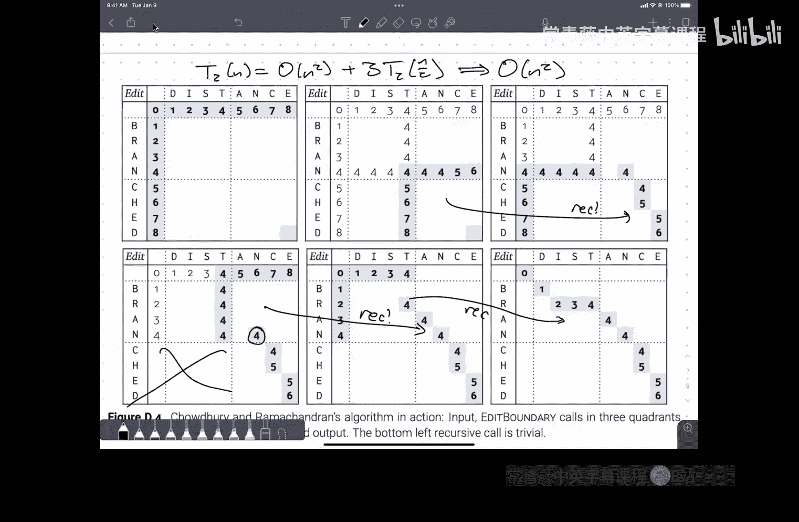

# 伊利诺伊大学【中英⚡算法｜CS473 Fall 2022 Algorithms】 p06 P6 6. Revenge of the son of dynamic programming+ -BV1RdBTBrEdx_p6-

Yes。不。不为其实。Yeah。嗯没。没不人。Oh'll come on。😔，对。再看。嗯。Thank you。请民中。你采访咩意思啊？不好意思。他是。你看没。嗯。但是的。嗯。Hey， finally。

All right， sorry， folks， we had a。The AV system is cranky。Let's put it that way。Hi everybody。

 welcome back， Thanks for coming。😊，嗯。Don't have any。

Um logistical or administrative things to talk about。

 but I'm happy to answer questions if people have any。Okay， if not。Then。

I want to pick up again on talking about dynamic programming there was something that I tried to get to at the end of class on Tuesday that just ran out of time。

 so I want to make sure that we have an opportunity to。To go through that in detail。After that。

Today and maybe Tuesday， I want to talk about like more。

Advanced techniques for doing dynamic programming， these are not going to be things that I expect you to be able to reproduce on homework。

Or reproduce on exams， it's more。That I want to kind of give you an impression that the normal sort of textbook dynamic programming that you see in 374 and that we've seen so far in this class。

Is the beginning of how you start designing algorithms not the end？🤢，Now， for some problems。

 that's the best we know how to do。But if you look， for example， at。

The solutions to homework one that I posted either last night or this morning， I forget。

Problem three on homework one。Can be solved using FFTs and there's a long several stage solution building up to the best algorithm。

 but it can also be solved with dynamic programming and then。

By pushing at the dynamic programming a few times， you can get it to be more and more efficient。

So I'm going to show you。😡，Today， and。Tuesday。At least a high level sketch of a couple of techniques that people use。

😡，In practice in the real world to speed up their dynamic programs that are not as simple as just think of a better recurrence or you know organize your data more efficiently。

 but。😡，Are actually。A bit more involved。But where dont we start？With。嗯。Sort of the last textbook。

UmA portion。This is dynamic programming over DAGs。So。I mentioned this briefly last time that。

Any time you have a recurrence， that recurrence defines a dependency graph。

The nodes of the dependency graph or subproble and the edges of the graph correspond to recursive calls。

😡，And in order for that recurrence to actually really be considered a recurrence。

 you have to be able to like call the recursive function and know that it's going to terminate in a finite amount of time。

😡，That dependency graph needs to have no cycles in it。😡，Now。

 usually most dynamic programming problems。😡，The dependency graph is kind of implicit in the pattern of the way we traverse the memorization structure。

 we never draw it out as an explicit graph。😡，But there are problems that we can define where we're given。

A graph。And the dependency graph either is the graph that we're given or it's derived in a couple of steps from the graph that we're given。

😡，So the。Just to remind people who maybe haven't seen this stuff in a while。

A directed acyclic graph is as the name implies。A directed graph that has no cycles in it。Now you。

Sometimes have things that。Look like cycles， I mean， for example。

 here is a collection of four edges that that。an undirected graph would be considered a cycle。

But it's not considered a cycle in the directed setting because the edges aren't all oriented consistently forward along the cycle。

嗯。嗯。So。Let me suppose that I want to solve。嗯。The longest path problem。

So I'm given the vertices and edges of a dag。And I want to find the longest path in this stag， which。

 you know， in this case might be， know it's probably something along like this looks like that。嗯。

As usual。Whenever I， I。Talk about a dynamic programming algorithm to find a structure。

I'm going to focus on。Finding the cost of that structure。So for example。

 when I talked about the woodcutter problem。😡，嗯。You can phrase that as describe an algorithm that determines the sequence of cuts。

 what order you should make the cuts in or what is the actual tree of cuts。

 but we only ever actually talked about finding the cost of the optimal tree of cuts。😡。

I'm going to do the same thing here。😡，And I'll say a bit more about this in once I get through this example。

 I'm just going to focus on finding the length of the longest path and then。Will。

I'll describe briefly how to actually extract the path from it。嗯。

Maybe I'll make my dag a little bit more interesting here。That probably just changed the answer。

And let me put one more edge。Two more edges like that。Okay。嗯。So a path is a sequence of edges。

And if you remember， that means it's either nothing。😡。

There are no edges or it's an edge followed by a sequence of edges。

 but there's a little bit more structure to it， which is that that。😡，If。

I have two edges in a row in this sequence they have to share a vertex in the middle。

 I can't just pick out random edges all over the place。

But still the recursive structure I'm thinking about is a sequence。😡。

And so the way I want to structure my thought is。Finding。

The first edge and letting the recursionary deal with the rest。

Or possibly finding the last edge and letting the recursion fery deal with the rest。系。So。嗯。

One thing that makes this a little bit complicated to think about。

Is at least the way that I phrased the problem， both endpoints of the path are kind of free to float around anywhere。

And so the natural thing to。Define would be something like。This is the length of。The longest。Oh。

From U to V。And then if I say， I decide what the first edge on that path is。

 it goes from U to some other vertex X。😡，Then I can recursively ask what's the shortest path from x to V？

嗯。But then I'm going to end up like trying to optimize over all choices of U and V。😡。

And that's going to be a little bit less efficient that I want。嗯。

But let's run with this and see where we go。嗯。The question I want to ask。Is。What's the first edge？

Once I've decided on where the first vertex。X。Anyone want to offer some suggestions for？

What it could put here？Let's say， yeah， in this case， this is U and this is V。

And I'm kind of invested in asking， you know， what is the first edge in the path？

How do I formulate that question as a recurrence？Yep。Okay。Right。这人简单。And the L of that actually。Okay。

 so it's the max of the weight of sum edge leaving you。Plus， the length of the longest path。

From that new target vertex。To V。Over you know， all edges。Youd x in the graph。

So they already understand the notation， so I just said， okay。

 I'm standing at W or sorry I'm standing at U， I don't know which edge to traverse first。

 so I'm going to try all possible edges leaving you。😡，Let's name the other end of that edge X。

Bre each edge from U to X， I'm going to ask， okay， what's the weight of that edge。

 If I only care about the number of edges， then that weight is just going to be one。

And then I'm going to ask the recursion fairry， what's the longest path from that new？😡。

Note X all the way to the destination V。Okay。嗯。😊，Well， we've got a recursive case here。

 but we need base cases as well。So can anyone suggest。One or more base cases， yeah。Okay。

 so one base case is there are no edges out of you。😡，That set is empty。😡，In that case。

There are no pads from U to V。And so we should probably return at least some sort of sentinel value that says。

 oh， no matter how I add this to other things， it's going to persist as a bad value。

 I sort of chose a path that wandered away and missed V when it was going by。😡，So in that case。

 I always want to return negative infinity。But as I' written now。

 the recurrence only ever returns negative infinity。Ah so that's the other thing。

If I'm already at my destination。Q equals V。Then。嗯。

What's the length of the longest path in that case？It's the length of the only path。

So this is one of the things about。😡，i。Dags。In a general graph。

There can be more than one path from a vertex to itself。😡，That's what a cycle is。But in a Dg。

 the only way to get from a node to itself is to do nothing。😡。

And so the longest path from a node to itself has weight， no edges。咁。Okay。

 so we've got one explicit base case。If you equals v， then rate zero and one implicit based case。😡。

If there are no edges leaving U and U is not equal to U is not equal to V。😡，All。

 the explicit base case takes precedence。Then I've sort of wandered off。😡。

mInto the woods somewhere and I'm lost and I should just give up and return negative infinity。Now。U。

You notice something about this recurrence。Which is that the second argument here never changes。

So at some level， what I could imagine doing is saying。Okay。

 let's just pretend that we know what V is。And what I mean by that is I have a for loop where I consider all possible Vs。

And then for a given choice of V， this is really a one parameter recurrence now。😡。

Once I've nailed down V， V is no longer a variable， it doesn't vary anymore， it is not able to vary。

😡，So it's not a variable。It's a constant and so really this recurrence only has one input variable。😡。

Namely， the start node。嗯。Okay。Whyhy did I do that because I know if I two start nodes。

 my data structures are going to be more complicated。

 but or two nodes that I need to parameter by my data structures are going to be more complicated。

Let's try to simplify things so I can specify a subproble with only one note。

What sort of data structure should I use to memorize？This。One parameter recurrence。Sorry。Well。

 I could use a 1D array。But what index do I use？😡，For the node you。Okay。

So one possibility is that I could topologically sort the dag。This is not necessarily a bad idea。😡。

So one of the things that I try to convince people to do when in 374。Whenever you see a dag， you go。

 oh， step one， topologically sort the dag。Step two， read the rest of the problem。

Tological sort takes time linear in the number of vertices and edges， V plus E time。😡。

And what it gives you is a numbering of div vertices。😡。

So that every edge points from a lower numbered vertex to a higher numbered vertex。😡，Right， so。

I could。Memor wise。Into an array。Indexed。By。The topological order。Labelling。Of the vertices。

That's one possibility。If I use this， if I decide I do want to memorize into an array indexed by this ordering。

😡，Okay， so I'll draw the usual cartoon， there's my array。What order do I want to evaluate？😡。

Things in the arrayray。So when I'm looking at a particular subprom。Corresponding to some vertex U。

The recursive calls。All involve。Vertices W。Where there's an edge from U to W。😡。

And so by the definition of topological sort， they're indexed later in this ordering than W。😡。

So I don't know， maybe there's a W1 here and there's a WW2 here。The be3 there。

ISince I don't know what the graph is and I don't know what U is。

 I don't know precisely where these w's are， or indeed if there really are any of them。😡。

But I know they're all further to the right。😡，So I need to fill in the array。

In the correct order so that all of the Ws are filled in before you。😡，So。What order。Right to left。😡。

Right， I want to evaluate in this order。So in other words， I want to evaluate。In reverse。

Topological order。Okay， that's one possibility。For how to memorize things。

But claim it's actually a little bit overkill。嗯。I have to like。

 actually compute this explicit labeling of the vertices。 have to store in an array somewhere。

 I have to build mappings back and forth between the actual。

Vertex records in whatever data structure was given and the indices into this ordering。Also。

 I could use a simple for loop。😊，But there's a second choice。Another alternative。

What data structure should I use？😡，To memize this recurrence。

 the input to the data structure is a node， the output from this data structure is。😡。

The longest path from Ne node DV。Or the length of that。The graph itself。

I've got a value associated with every node， so let's store that value at that node。😡，Right。

 so I memorize。Into。G itself。So I store the length of the longest path of UV in some new node u。

llllP and remember he is fixed。That was a little scary。Okay。So there there。The graph I was given。

 there is my data structure， whatever data structure I was using to represent that graph。

 maybe it's an adjacency list and I already have an array。

 maybe it's a pointer based data structure and I don't doesn't matter somewhere in there there's a record that corresponds to a vertex。

😡，Add another field to that record。嗯。Now， what order do I want to evaluate things？😡，Yeah。

From sinks to sources。😡，So what you said is from the sink to the source。

 but a Dg might have 52 sinks and 79 sources。😡，All right。I want to evaluate。From sink。To sources。

 or more generally， I just need to make sure。That before I evaluate a node。

 I've evaluated all of its out neighborighors。😡，Well there's a convenient algorithm to do this called depth first search。

😡，Remember the way depth for search is I want to do a depth for search at you。😡。

I do some pre processing at you， I do a depth for search at each of the out neighborighs of you。

 and then I do some post processing at you。😡，That post processing in that case。

 is computing LLP of U V。 so more generally here， what I really want。Is evaluate in。DFS。P order。

So run it up for search。😡，And whenever in your recursive for research you're done evaluating your out neighborighs。

 at that point， you take the values that you've computed at your out neighborighors and combine them to get the value at you。

😡，How do you compute a topological order？You compute post order and you reverse it。😡。

These are the same order。😡，Yeah。Oh， so in this case。

 I don't actually need to do any pre processingces at all， but in general。

 depth first search allows you。😡，The first time you encounter a node， before you do anything。

 maybe you want to initialize some data。Then you visit all your children。

 and then you want to combine data， you get back from your children in post process into the final value of that data。

Okay。😊，嗯。So for fixed value of V。I'm spending linear time。

 I'm either traversing this array in linear time or I'm doing a depth of research in linear time。😡。

In both of these formulations。😡，The running time。Is。V plus E。For each。Fixed vertex。

 the fixed target vertex V。Now。Or the array formulation。

 it's kind of clear where the V term comes from。😡，The E term is the sum of the number of recursive calls over all vertices。

 so it's the sum of the outgoing edges over all vertices。

 every edge was counted once because it leaves only one vertex。😡，So in this case。

Fillling in U requires me to look up three different W values。😡，One for each edge leaving you。😡。

So if I sum up all those out degrees over all nodes in the graph。😡。

The total number of pointers that I chase is going to be the number of edges。For。

moMemorizing into the graph itself。😡，This is just the time to run depth for search。😡。

And then you're adding a constant amount of overhead。😡，U。Basically to like。AfterAfter every。

 after every recursive call you。😡，You do one of these additions and Mac operations。

 and at the end you record the final Mac。So the running time here is dominated by the running time for depth for research。

So far so good。Now， that means that。The running time overall。嗯。Is going to be v times that。😡。

Because I have V different choices for the target vertex little V。

They claim I don't actually need that overhead。😡，It's a trick。It's a very， very useful trick。Sorry。

You're very close， so you to find a sink。It's the right noun， but not the right verb。Yeah。

 so what you would end up doing is， okay， I about fixV， evaluate this for all you。😡。

Accumulate a max as I'm doing it。😡，That gives me the max value that I would associate with this V。😡。

And then for every other V I'd computed an X value with that， and then I take the max over all those。

😡，系。第二。😡，Yes。😊，I'm going to add a sink。So here's my， here's my。The universal cartoon for a graph。

I'm going to add a sink， which is by tradition always called tea。😡，It's a source。

 it's always called S。And I'm going to add。An edge。From every other vertex， the T。

What I've done is I've taken every path。In the original graph。

And I've allowed it to get one step longer by making it go to T。

So now whatever the longest path is in my original graph。😡，That path is now one step longer。

And I know where it ends。So in linear time， I add an artificial sink。😡。

Then I find shortest all longest paths ending at T。😡。

So I only have to do one depth for search or post one traversal。

And then I subtract one from that result。嗯。So。Actually。Yes。Okay， so linear your time。

How would I change this algorithm if I wanted to compute shortest paths instead of longest paths？

Only two things I need to do。Maybe there's only one thing I need to do。I could use BFS。

If the graph is unweighted。😡，第二。Right， so one thing I could do if I wanted shortest paths is I'd need to change that max into a min and change the sentinel value from negative infinity to positive infinity。

😡，The other thing I can do is just in the gate all the weights。😡。

Now this doesn't work when the graph is not a dag。😡。

We all know that there's this thing called Dyster's algorithm。

 the compute short pads in graphs that have no negative edges。

Dykestar's algorithm also computes longest pads in graphs where every edge is negative。😡。

Longest ti meaning， least negative。 but if you just try to negate the weights and R Dkester's algorithm。

😡，Depending on the formulation， you're either going to get nonsense or it's going to run forever。

This only works because it's a deck。Right。And now you've got longest paths。

 you've got shortest paths， other formulations you could compute the number of paths。

Between two nodes。You could find the best path according to some of their kinds of scoring functions。

And once you've got this， lots and lots and lots of dynamic programming problems suddenly become。

Build the dependency graph and run that algorithm。😡，So if I want to do text segmentation。

 I build the graph。😡，With an edge from here to there， if it representing a legal word。

 and then I look for the longest path that gives me the segmentation into the largest number of words。

 or the shortest path that gives me the segmentation to the minimum number of words。😡，8。

If it's easier for you to think about dynamic programming problems in these terms， do that。😡，Mally。

 it's kind of the same algorithm。😡，The one difference is with the array based stuff。

I don't have to build a graph explicitly and I don't have to think about topological ordering or anything like that。

 I could just think in terms of for loops。Yes， that's exactly right， so longest increasing subence。

I have a node for every index into my array。😡，Say this is move on line9 two and then I have an edge from one node to another。

If and only if。It's going from an earlier number in the array to a later number in the array。😡。

And the later number is bigger。And now longest increasing subence is literally。

The longest path in this stag。The graph has a quadratic number of edges in the worst case。

 so v plus e comes out to be n squared， so it turns out to be exactly the same as the other algorithm。

Okay， yeah。tOh， that's a great question。How do I choose the starting vertex of my depth for search？

Anybody？You've answered a lot， so I want to give other people a chance， no it's fine， yeah。Yes。

I'm going to add an artificial source， S with edges pointing to everything else。

 and I'll start the depth for search at S。😡，I could also。This is not the only way I could do it。

 So there's a wrapper that you could put around up for search where you say。

Try all starting nodes in some arbitrary order。I'll do a depth research from here， blah， blah， blah。

 maybe that didn't reach everything， so I'll do a depth research from there， blah， blah， blah。

Maybe that didn't reach anything， so I'll do that first search from therelah。

So this is how in undergra， you would count components。😡，You say put a for loop over all vertices。

 try put it doing a depths for search from this vertex。

The only times you would ever actually succeed in doing a depth for search。Is when。

The first time you look at that vertex， it's on marked。

Which means it wasn't in a component for some earlier vertex。For a DAg， you could just in a for loop。

 for all vertices， try running a depth search from that vertex。😡。

You still get a post ordering of the vertices， it's still the reverse of a topological order。😡。

In fact， adding a super source。And then running up search from that is equivalent to。

Running a for loop over all the vertices， because what happens when I run depth for search from S？😡。

I say for all just leaving us。Okay， for all vertices。Recursionively called DFS。So again。

 there's this equivalence between， let's modify the graph。😡。

And try to do something simple in terms of the graph。And。😡，Well， actually。

 if we don't need to modify the graph， we can run in a slightly more complicated algorithm。Again。

 whichever way you want to think of it。😡，Think of it that way。Yes。

 S connects to every other node in G。Yeah。I'm sorry。

You're doing a constant amount of work for every vertex。😡，So adding the sync takes orders of V time。

😡，Adding the source takes order of V time that all get swallowed up in the time to run the depth for search itself。

Okay。嗯。So there are more interesting dynamic programming things that you can do in DAGs besides just look for a longest path。

 but it's really helpful to be familiar with this particular。😡。

Dynamic programming algorithm because a lot of things can just be reduced to build the right dag and do this。

Right。And that's kind of what I wanted to say about DAgs。嗯。

There'll be at least one question on homework three where you'll need to do some sort of DAg dynamic programming。

AndYou might see something on the midterm。But， here ends。

The material that will show up on mid Ter one。Okay。

The stuff I want to show you now just showing it to you because。It's cool。All right， so yeah。

 question。是。😡，just even time that， I mean， that like， it doesn't mean things the。Well， okay。

 so adding the source。That really is。How do I want to think about the algorithm。

 I either I'm running a for loop over all vertices or I add this source。

 and I dive started at that one vertex。 It's really equivalent。

Its not actually's not actually making the algorithm either faster or slower。

But the reason I added the sink actually was to speed up the algorithm。😡。

So instead of having to run this dynamic programming for every ending vertex V。😡。

I just add one more step and now run the dynamic programming once using T as the ending vertex。😡，So。

Sometimes it's just convenience。Sometimes it really is。Speed。All。So。There's a。Classical problem。

That talk about in some detail in 374， I'm not going to go through the complete detailed derivation。

😡，But rather， I'm just going to sort of show you the answer。The problem is called edit distance。😡。

And。The idea。Is。I want to turn one word。Into another。By sequence of。

Small editing operations and the kinds of editing operations that I'm allowed to do are I'm allowed to delete。

One of the letters。I'm allowed to insert。One of the letters。

Or I'm allowed to change one letter into another。😡，And so the question is。

 what is the minimum number？😡，Of operations that I need to perform to change the first word into the second word or。

I guess in this case， I was changing the second word into the first。嗯。So。In a single step。

 I can either insert a character， delete a character， or replace one character with another。Now。

The way that this is usually formulated， let me see if I can。嗯。I've got my two strings。As I I。

Build what sometimes called a tableau or a motif or a table。😡。

The idea is that I'm going to line up the characters in the string in a two by N array。😡。

There may be gaps。You either the first row or the second。Oops didnn't want to do that。Right。And then。

Basically， this Tau describes the sequence of a sequence of editing operations。😡，That turns out。

 in this case， algorithm into altruistic。So whenever I see a column that has characters both above and below and they're different。

 this is a replacement。😡，Whenever I see。A column that has a blank above and nothing below。😡。

That's going to be an insertion。Although I think maybe this will be a little bit more interesting if I if I change the。

Okay， so now。Here。I have an insertion。And if I have a column that has a character above。

 but no character below。This is a deletion。So what this tableau tells me is to turn an algorithm into altruistic。

 I should replace the G with the T， I should delete the O， I should insert U after the R。

 I should insert an S after the I， I should change the H into an I。

 and I should change the M into a C。😡，系。So the number of operations。Is the number of columns？Without。

The same character above and below， so in this case I've got one， two， three， four， five， six。Right。

 so。嗯。So computing the edit distance。😡，Between two strings turns out to be equivalent defining the best way to lay out the strings in this tube by whatever table。

😡，嗯。U。So to develop the dynamic programming algorithm。

 the way that at least I'm formulating it in the algorithm I'm going to show you。😡，Is。

TheThe question is。What's？In the last column。What's the last editing operation？

It could be an insertion， it could be a deletion， it could be a replacement。

 but take if I imagine taking the two strings and deciding， well。

 maybe it's going to be a replacement in which case these last two characters I figured out what to do with them。

 delete them and recurse on the rest。😡，If it's an insertion。

 then I know that the last character in the second string has been placed with a blank above it。😡。

So I can recurse on the original first string and most of the second string。

So if you push this a little bit further。You end up with a recurrence that looks like this here。😡，嗯。

Edit of I J。Is the edit distance。Yeah。From。The first eye characters of the first string。

To the first J characters。Of the second string。Because I'm making decisions about what to do last。

 the recursive subproms I have left over are determined by prefixes of my original string。😡。

And I can specify those prefixes by their ending index or equivalently their length。So。In particular。

 if one of those prefix is empty， then the edit distance is the length of the other one。

 so if my target prefix is empty， then I should delete every character in my source source prefix。😡。

If my source prefix is empty， then I should insert every character and my target prefix。

If both of them are empty， I should do nothing， but both of these based cases give me the right answer。

😡，Otherwise， I have a choice between either。😡，Doing this case corresponds。To。Doing an insertion。

 this case corresponds to doing a deletion， and this case corresponds to doing a replacement。

That funny expression in brackets。That means one， if the expression inside the brackets is true and zero。

 if the expression inside the brackets is false。😡，So if the two characters are equal。

 replacing one character with the other is doing nothing， and so this cost over here is zero。😡。

But if the two characters are different， then replacing one character with a different character cost me one。

😡，All right。So。I've got a two dimensional recurrence。😡，Each of the parameters can vary between。

Zero in the lengths of the corresponding string。So the thing that I want to memorize into。

Is a two dimensional array。But one way I can think about this is what's the dependency graph？😡。

Or this recurrence。Well， if I've got two strings of length  five， this is the dependency graph。

Every node corresponds to a pair Ij。And every edge， actually， I've drawn the arrows backwards。

Hang on， see if I can。Can I do this？😔，Yes， I can。Can， honestly， a can。That's better。Okay。Okay。

So there's my， there's my。Depenency graph。Every edge corresponds to a recursive call。系。Now。

If I want to do this completely iteratively。I will build the two dimensional array indexed by I and J。

And I will just you know， fill in the array in。Row major order。And you should be。See。

 hopefully that romage or order。Is a reverse topological order for this graph。I'm always considering。

Nodes that edges are pointing to before nodes that that same edge is pointing from。😡。

So the running time of the algorithm is。😡，M times n。

 if I've got a string of length to M and a string of length n is input。

And what you get out of the algorithm， you write it down。Is a table of numbers。

Now there's arrows in there， let's ignore those for a moment。

What the algorithm actually computes is this two dimensional array of numbers。😡，All， so this。3。

 for example， right here。This is the edit distance from Algoi to Altrui。😡，And。Great。😊。

Most applications vet at distance。😡，Maybe maybe should say many applications at a distance I don't just want。

The number。I actually want the sequence of editing operations。😡。

So that tableau that I wrote up there。It's this is a very。

 very special case of problems that molecular biologists use all the time to compare sequences of amino acids and proteins or sequences of nucleotides in DNA or RNA。

And what they actually want is to， you know show me the amino acids of protein A and the amino acids of protein B lined up in this motif。

 and usually it's more like they've got proteins A through L。😡。

They've got a whole bunch of these things that need to line up。

 but they're interested in the structure。Of things， how these two proteins are similar to each other。

 not just how similar they are。Canonical example from when I was a kid。Terminals used to be slow。😡。

Like actually printing the characters would be slow and say there would be specialized hardware built in that would allow you to say。

😡，At this cursor， move all the text on this line to the right of the cursor， one step to the right。😡。

Or one step to the left。Or insert a blank line or delete a blank line。

And so when I want to refresh my page when I'm running EMs。😡，I don't want the computer to tell me，16。

😡，I want it to change the picture of page one of my code into the picture of page two of my code。😡。

And I wanted to do it as quickly as it can， using only 16 of these special characters， great。

 but I actually want the effects。So there's a question。😡。

How do you actually get the structure back out？Yes。

So it each of those two to be a constant time operation， yes。

The edit distance is at most the max of the two strings。

The time to compute the edit distance is the time to fill up this whole table。

So don't compute the thing we're computing with the algorithm for computing it。

 the number that we're computing is always going to be most longer。

 the length of the longer strength。😡，But the time to compute it。😡。

I need to consider all possible values of I andJ。So。I need to actually pull the structure out。😡，嗯。😊。

And the way I would do this is to ask。😡，But look at this six down here in the lower right corner。

 this six says the edit distance between algorithm and altruistic really was six。😡。

Where did that six come from？Well， the recurrence tells me it's either。

One more than the thing immediately to the left。😡，One more than the thing immediately above。

 or one more than the thing above into the left。😡，In constant time。

 I can figure out that actually that six came from the five immediately northwest。😡，From the five。

 I can walk back to this four to this four。To this three， to this three。

 Sometimes I may discover that I could have either the last。

Operation I needed to get there was either a deletion or a replacement。' got multiple options。

 I could just pick one。And again， I can just sort of walk back。😡，Along these。Arrows。

 which are not explicitly encoded anywhere， but I can compute on the fly which arrows point into each of those numbers。

😡，And trace backwards。So， once I've got the values。I can reconstruct a path。🎼Through this grid。

That in this case corresponds to replacement， replacement， deletion， replacement， replacement。

 insertion， replacement， insertion， replacement， replace replace。It gives me an actual。Edit sequence。

Okay。Okay， this is why I say when you're trying to build the structure。

 just concentrate on finding the optimal cost。😡，Not on the optimal structure itself。

 because you can pretty much always reconstruct the optimal structure from the memorization table after the fact。

😡，On the other hand。If I'm doing this thing with nucleotide sequences。😡，Nucleotide sequences are big。

These are strings that may be。A million characters long。I invite you。

To attempt anywhere in any system on the planet to allocate a million by million array。😡。

A ain't going to happen。So you can't afford to use this much space。😡，So what do you do？Well。

 remember the way that I filled in this table。Was I filled it in in row major order。

Once I'm done filling in row3。I will never need to refer to row2 again。😡。

So I can use what's sometimes called the sliding window technique。😡。

When I'm actually filling in the numbers。😡，I only need to keep track of。

A linear amount of space in the table。At any given time。Is that right。

 no I should have drawn that the other way， sorry。I only need to keep track of。Yeah。

So now if I want to， you know， when I fill in this four， I can forget that for。

So I only need a linear amount of space。😡，And again。

 this is a fairly standard optimization that can be applied to lots of different dynamic programming algorithms。

 as part of the reason why we don't worry about space so much is because when this space saving idea applies。

 it's usually completely straightforward。😡，If I'm going through the right layer by layer and only referring one layer back。

 that means I only ever needed to keep around one layer。😡，But now we have a problem， yeah。嗯。Yeah。

 so I just told you two different things on the one hand。😡。

All I need to do is compute the cost because once I've got the whole memorization table。

 I can backtrack through it to reconstruct the optimal structure。 On the other hand， I said， yeah。

 we can't afford to use that much space， only keep around one row at a time。😡。

I can't do both of these at the same time。So。What do I do？

I actually want to both save space because a million by million is too much。And I want to build。

The optimal structure。So。What do I do？Well。There's a couple of different ways to do this。

 there's a fairly classical algorithm by Hirschberg from the 1970s。

That he was the first person to figure out。Kind of divide and conquer strategy。😡。

Where you basically figure out， okay， the optimal path is going to go through column six in the middle row。

 and then I sort of need to recursively build up the first half in the second half。😡，嗯。

But I think there's a。嗯。A really nice algorithm by。嗯。I think this is 2005。

Chaedri and Ramachhandandran。Vijaya Ramachandran is a professor at UT Austin。

 I'm afraid I've forgotten Chdurri's first name was her PhD student。嗯。So they saw。

 they describe an algorithm that。😡，Solves the edit distance problem。😡，In quadratic time。

 using linear space。😡，And you actually get the structure。😡。

And it's a div and conquerunker algorithm on top of。😡，A dynamicynite programming algorithm。Now。USo。

Let me just write this down。We don't。Need。Sorry， we can。We can construct。The optimal structure。From。

The complete。Memorization table。Yeah。We can save space。By keeping。Only one row。

Of the memorization table。Okay。So。Im going to start with or we have this recurrence for edit distance。

 so I'm going to memorize into two dimensional table。This is is all fine。

But then the next question is。What order？Should he fill in the table？And Tur Ramachandran。

Chose an ordering that looks really weird。😡，And I'm probably not actually going to be able to get all the way to the end of this algorithm today。

 but we'll finish up on Tuesday。It turns out that the ordering that they chose。

Has other nice effects， one of the other things that happens when you're dealing with megabytes of data is cash effects start to overwhelm CPU time。

😡，So the ordering I'm about to show you is actually the best possible ordering with respect to。😡。

Multile memory。Provided that you know we're sitting in the theory classroom。

 I don't know how big your L1 cache is， I don't know how many registers you have。

 I don't know how big your page tables are。😡，But。😡，Given that ignorance。

 this is the best ordering you can possibly use。😡，And the ordering is。That。

We'm going to take the table。Split in half by rows and columns， just for simplicity。

 I'm assuming the table is square， both strings have the same length。

I'll recursively evaluate the upper left quadrant。Then I'll recursively evaluate the upper right quadrant。

 then I'll recursively evaluate the lower left quadrant。

 and I'll recursively evaluate the bottom right quadrant。😡，The base case is a one by one array。

 which I can evaluate in constant time by doing one step of the recurrence。Given the input data。Okay。

So。If I。You know。Without knowing anything else at all about the way this algorithm runs。😡。

If I define T of n to be the running time to compute the edit distance between two strings of LinkedIn。

😡，I've already gotten to a state where I can say， well this running time is going to be governed by a recurrence。

 the time to compute an n by n edit distance is for n over 2 by n over two edit distances。

 plus some overhead， which will turn out to be linear。😡，And。Well， we've seen this recurrence before。

 this was the same as the recurrence that Komogorov came up for the divided conquer algorithm for multiplication。

😡，And of course， it comes out to be uns squarered because。😡。

I visit every cell in the grid somewhere during this traversal， it's just in this weird。

 fractally recursively defined order。😡，Why does this work well for caches？

Is it some level of recursion？One of those blocks fits into your cache。

And everything is nice and local。And then the next block fits into the cache。

 but I only have to talk to two other blocks。Right。Okay， so。

What does this really look like when I run it？So here's an example， again。

 I chopped off the M in algorithm so I could get two strings at the same length。😡，Um， so。

The edit distance algorithm begins。By filling in all the base cases。

 this is not really part of the table that I'm recursing on。😡。

Just computing the border of the table that says the top row。😡，Is。

All the edit distances between prefixes of algorithm to the empty string。😡。

So to get from Algo to the empty string， I need to delete ALGO4。😡，The left column。

Is at a distance between the empty string and prefixes of altruist。😡，So to get to alt。

 I need to insert a， insert L， insert T。😡，So I'm going just fill in the top row and the leftmost column。

😡，Right off the bat。The first recursive call。I'm going to compute。The right most column。

 and the bottom row。Of the Northwest quadrant。This happens by magic because that's what recursion do。

😡，The recursion ferry fills in those numbers in this pink area here。😡。

Now those actually correspond to the real numbers for this particular problem。Right。Now。

When I look at the Northeast quadrant。😡，I've got numbers。In the row above。😡。

And in the column to the left。😡，This is all the information I need to fill in this column because remember every cell only depends on the cells immediately above。

 immediately to the left and above and to the left。

 so everything that I need to fill in in this square is right there on the boundary。😡，Yeah。借不关系。可以。

那个。Kind of， yeah。So I mean， this is so this technique really only works when you've got local dependencies between。

 you know， cells in your memmalization structure and nearby cells in your memorization structure。

It would not work， for example， for the woodcutterters problem。

 where you've got long distance dependencies， or for that matter for longest increasing subence where you've got longer dependencies。

But for things like edit distance， which is exactly the kind of thing that shows up in computational genetics。

This technique actually does get used。嗯。So。This。Is。Recursion。And then this。Is recursion？

And then I need to fill in the bottom left quadrant， but notice before I do。

 I've got everything I need in the row just above and everything I need in the column just to the left。

😡，So this gets filled in by recursion， and then that gets filled in by recursion and lo and behold。

All of the numbers that I wanted in the bottom row and then the rightmost column have been computed。

😡，So the goal of the algorithm is start with a square that has data in the row above and the column to the left。

😡，An end with data filled in in the bottom row in the left column。😡，In particular。

There's my edit distance for those two strings， it's a five instead of a six because I cut off the M。

系。嗯。And the running time of the algorithm is。Set up the base cases that's kind of an preproces。

 recur， re， recursed， recur， there it is。ok。😊，Here isn in code。

Not much more enlightening sort of there's the base case up there。

 use the edit distance occurrencence。 and there there's a bunch of complicated notation that means。

Northwest corner， northeast corner， southwest corner， southeast corner。And then。

Concatenate things together that in order to get this row along the bottom。

 I need to concatenate the row I get from the bottom left and the row I get from the bottom right。😡。

All right。So I got an n squared time。 Yeah， question。收过。That's right。

 so at this level of recursion actually what am I actually keeping in memory？😡。

In the top left recursive call。😡，I forget anything about the interior of that top left quadruprant。😡。

So the way that the space gets used is。I used the results of my recursive calls。

But then I forget the stuff in the middle。😡，So the space I'm using at the top level of recursion is。

😡，Three rows and three columns。The top row input， maybe I shouldn't count that， but fine。

 I'll count it。The middle row that I get from the intermediate results and the bottom row。

 which is my output。😡，Similarly left column， which is input， the middle column。

 which is kind intermediate results and the right column， which is my output。So if I look at my。

Space bound。The non recursive part of my space is only linear。😡，Now。

 space we analyze slightly differently from time。😡，Time when we go into a recursive call。

 my watch moves， I go into the next recursive call， my watch moves some more。😡，Space。

 when I make a recursive call， that recurive call allocates some space。

And then throws it away and returns the value。So， in fact， at any given time。

I'm making only one recursive call。I don't count all four。

There's only one recursive call that's active at a time。And so。

While the Northwest Procursive call is in force， I'm using S of n over two space。

 but then it pops back up and I'm done with it， and then northeast I'm using S of n over two space。

 then it pops back up and I'm done with it， so the total amount of space I'm using for a problem of size N is linear plus the space for problem of size n over two。

😡，This gives me a geometric series。😡，And N number two， and number four， and number eight， and so on。

 so the total amount of space that I'm using。😡，Is in the end。

 about  six rows at about 6 columns of the table， no matter how big the table is。Okay。Great。

So this gives me a different way of doing quadratic time in linear space that's way more complicated than the sliding window。

But in the end， what do I get？😡，I just get this list of values on the boundary。

 and that's not what I wanted。I wanted the whole mess。

I wanted the actual structure going through the thing。Now， as I said。

This recursive stuff has much better cash behavior。😡，Then the sliding window idea。

 you've ever written if you've ever done anything with parallelizing compilers。

 your compiler is probably already doing this。😡，For you。

Only with the right parameters because it knows what machine you're compiling for。Uh but um。

 now what do I want to do？So this is the first half of Chadurin Ramachchdron's algorithm。😡。

It's enough to tell me what the right value is。And I know， like， where。That value。嗯。Lands， but。

So I'm just going to show you the cartoon。😡，Because we were almost out of time。sorry。

 I changed the words because。It led to a better result。

So this is the real algorithm that actually constructs the sequence。😡。

So the blue stuff is my original input。😡，I'm going to propagate it through。The top two quadrants。😡。

And through。The bottom left quadrant。😡，Just enough to get the input。😡，To the bottom left quadrant。

Then。By recursion。I'm going to compute。😡，The path。That leads to that bottom right corner。So。

 it's acting as though。The recursive call is behaving exactly like fill in that entire bottom right corner of the table with all of the numbers。

 trace back the arrows until you reach the boundary of that bottom right quadrant。😡。

Remember that path and forget everything else。系。U。Then I say， oh， okay。

 now that path is either going to lead me up to the top right quadrant or over to the bottom left。😡。

If it leads to the top right， like here。I actually don't care what goes on in the bottom left anymore。

And just throw it out， I don't need to do anything。But in the top right。

I have a new recursive subproblem。😡，Find the best path that leads to that cell。😡。

In the upper lift quadrant。Again， fill in all the numbers and then trace the path back。

And so I'll get here。Rese。And that'll give me a path back to the boundary。

 the left or top boundary of the top right corner。😡。

And now I'm set up for the recursive algorithm again。😡，For the top left。Corner。Okay， so。

What you should really think of this as。Is。Let's call that T2 n。

This is order n squared because I have to run the algorithm to compute the optimal value。

Plus three recursive calls。Because the actual path only goes through three of those four quadrants。

The quadrant that it doesn't go through， I don't do a recursive call。😡，And well。

 what does this give you， you pump it into a recursion tree。Heive gives U squared time。

What's the space？Well， the space is essentially the same as the space that I did previously。

 only now I'm also have to remember this output path， but that's only a linear amount more。

So in the end， I get quadratic time in linear space。And。Yeah， the algorithm is not simple。

But I got everything I wanted out of it。8ight。I'm happy to answer questions about this upfront。😡。

I might go through this as a little bit more detail on Tuesday if people want me to。

 or I might just let you read the notes， but we're done for the day。 I' happy to take questions。

 If not， have a great weekend and see you on Tuesday。😊，Yeah。

