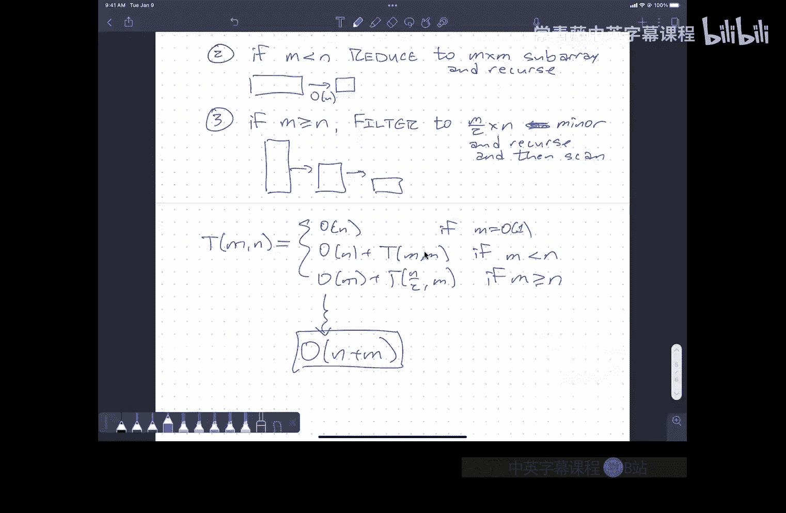

# 算法课程：P7：加速动态规划


在本节课中，我们将学习一种称为 **SMAWK** 的算法，它可以显著加速一大类动态规划算法的运行时间。我们将从理解问题本身开始，逐步介绍算法的核心思想，并最终看到如何将其应用于实际问题。

## 概述

动态规划是解决许多优化问题的强大工具，但其时间复杂度有时可能较高。本节课将介绍一种技术，能够将某些动态规划算法的时间复杂度降低大约一个线性因子。我们将通过一个具体的例子——**木材切割问题**——来展示这种技术的威力，并深入探讨其背后的算法原理：在满足特定结构（单调性）的矩阵中高效地寻找每行的最小值。

---

## 问题引入：木材切割问题

首先，我们回顾一下木材切割问题。假设我们有一块长木板，上面标记了多个需要切割的位置。每次切割的成本等于被切割木板的长度。我们的目标是找到一种切割顺序，使得总成本最小。

这个问题可以形式化为一个动态规划问题。设 `cost(i, k)` 为切割从第 `i` 个标记点到第 `k` 个标记点之间木板的最小成本。其递推关系如下：

```
cost(i, k) = min_{i < j < k} [ (x_k - x_i) + cost(i, j) + cost(j, k) ]
```

其中，`x_i` 和 `x_k` 是标记点的位置。这个递推式自然地导出一个时间复杂度为 **O(n³)** 的算法（三层嵌套循环）。

然而，通过观察这个动态规划中内层循环所执行的操作，我们可以将其重新表述为另一个问题：在一个特定的二维数组（或矩阵）中，为每一行找到最小值。如果我们能更快地解决这个“寻找行最小值”的问题，就能加速整个动态规划过程。

---

## 核心问题：在矩阵中寻找行最小值

现在，我们聚焦于这个核心子问题：给定一个 `m` 行 `n` 列的矩阵 `A`，找出每一行中最小元素所在的列索引。

如果没有关于矩阵 `A` 的任何额外信息，我们只能使用暴力扫描，时间复杂度为 **O(m * n)**，即检查每一个元素。可以证明，在没有额外信息的情况下，这是最优的。

但是，许多从动态规划中产生的矩阵具有特殊的结构。接下来，我们将定义这种结构，并展示如何利用它来设计更高效的算法。

---

## 矩阵的单调性

算法的关键在于矩阵所具有的 **单调性**。

### 单调矩阵

一个矩阵是 **单调** 的，如果其每行最小值的列索引随着行号的增加而单调不减（即向左或保持不变）。

**示例**：
假设一个5x5矩阵中，第1行最小值在第2列，第2行最小值在第2列，第3行最小值在第3列，第4行最小值在第4列，第5行最小值在第5列。那么这些最小值的列索引序列 `[2, 2, 3, 4, 5]` 是非递减的，这个矩阵就是单调的。

仅仅利用单调性，我们就可以设计出一个比暴力法更快的算法。

---

### 完全单调矩阵

然而，为了应用更强大的SMAWK算法，我们需要一个更强的条件：**完全单调性**。

一个矩阵是 **完全单调** 的，如果它的每一个 **2x2子矩阵** 都是单调的。这意味着，对于任意两行 `i < j` 和任意两列 `p < q`，都不可能出现以下“坏”模式：
- 第 `i` 行中，`A[i][p] > A[i][q]`（即第 `i` 行的最小值在右侧）
- 第 `j` 行中，`A[j][p] < A[j][q]`（即第 `j` 行的最小值在左侧）

换句话说，在任意2x2子矩阵中，最小值的分布只能是“左上-左上”、“右下-右下”或“左上-右下”的模式，绝不能是“右上-左下”。

令人惊讶的是，木材切割问题中产生的矩阵满足完全单调性。这使得我们可以应用接下来的高效算法。

---

## 算法一：FILTER算法（针对单调矩阵）

首先，我们介绍一个针对**单调矩阵**的行最小值查找算法，称为 **FILTER算法**。它有两种等价的视角：自顶向下（递归）和自底向上（迭代）。

### 自顶向下视角（递归）

1.  **找到中间行的最小值**：在具有 `m` 行的矩阵中，找到第 `⌊m/2⌋` 行的最小值，设其位于列 `h`。
2.  **递归求解子问题**：
    *   由于单调性，第 `1` 到 `⌊m/2⌋-1` 行的最小值一定在列 `1` 到 `h` 之间。递归求解这个左上子矩阵（`⌊m/2⌋-1` 行， `h` 列）。
    *   同理，第 `⌊m/2⌋+1` 到 `m` 行的最小值一定在列 `h` 到 `n` 之间。递归求解这个右下子矩阵（约 `m/2` 行， `n-h` 列）。

**时间复杂度分析**：
每次递归调用，我们都需要 `O(n)` 时间来扫描中间行。递归树的深度是 `O(log m)`，因为每次行数减半。每一层递归的所有节点所需的扫描时间总和也是 `O(n)`。因此，总时间复杂度为 **O(n log m + m)**。当 `m` 远小于 `n` 时，这比 `O(mn)` 要好。

### 自底向上视角（迭代）

这种视角更清晰地展示了算法如何工作：

1.  **递归求解偶数行**：首先，递归地找出所有偶数行（第2, 4, 6, ...行）的最小值位置。
2.  **推断奇数行范围**：利用单调性，对于任意奇数行 `r`，它的最小值一定被“夹在”其上方和下方偶数行最小值的列索引之间。
3.  **扫描奇数行**：在每个奇数行限定的这个列范围内进行线性扫描，找到最小值。

**关键观察**：所有需要扫描的“范围”总长度之和是 **O(m + n)**。因此，步骤2和3可以在线性时间内完成。递归部分则处理规模减半（行数减半）的子问题。

无论哪种视角，FILTER算法都利用了单调性来避免检查整个矩阵。

---

## 算法二：REDUCE算法（针对完全单调矩阵）

FILTER算法在矩阵“高而瘦”（`m > n`）时表现良好。当矩阵“宽而扁”（`m < n`）时，我们需要另一个工具：**REDUCE算法**。它能在 **O(n)** 时间内，将一个 `m x n` 的完全单调矩阵“缩减”为一个 `m x m` 的矩阵，并且保证原矩阵每行的最小值一定出现在缩减后的列中。

REDUCE算法的核心思想是维护一个**栈**，用来存储“候选”的列索引。算法通过比较栈顶列与当前列中特定元素的大小，利用完全单调性的性质，决定是丢弃当前列（弹出栈顶）还是将当前列加入候选（压入栈）。

**算法伪代码概要**：
```
函数 REDUCE(A, m, n):
    初始化空栈 S
    对于 k 从 1 到 n:
        当 栈非空 且 A[栈顶索引, 栈的大小] > A[k, 栈的大小]:
            弹出栈顶
        如果 栈的大小 < m:
            将 k 压入栈
    返回栈 S (即保留的 m 个列索引)
```

**理解其工作方式**：
每次比较都发生在当前列 `k` 和栈顶列 `s` 的某个特定行（由栈的大小决定）。根据完全单调性：
*   如果 `A[t, s] > A[t, k]`，那么栈顶列 `s` 中，从第 `t` 行往下的所有元素都不可能是该行的最小值（因为 `k` 列对应位置更小，且单调性会保持）。因此可以安全地丢弃列 `s`（弹出栈）。
*   否则，列 `k` 中，第 `t` 行以上的元素都不可能是最小值，列 `k` 成为一个新的候选列（压入栈）。

由于每列最多被压入和弹出栈各一次，总比较次数为 **O(n)**。最终栈中恰好保留了 `m` 列，它们构成了我们需要的 `m x m` 子矩阵。

---

## 完整的SMAWK算法

现在，我们将FILTER和REDUCE组合起来，形成完整的 **SMAWK算法**，用于在**完全单调矩阵**中寻找行最小值。算法采用分治策略，根据矩阵的形状选择不同的操作：

**算法步骤**：
1.  **基础情况**：如果行数 `m` 很小（例如 `m=1`），直接暴力扫描该行，时间复杂度 `O(n)`。
2.  **宽矩阵情况 (`m < n`)**：调用 **REDUCE** 算法，在 `O(n)` 时间内将矩阵缩减为 `m x m` 的方阵。然后递归地在缩减后的方阵上求解。
3.  **高矩阵情况 (`m >= n`)**：调用 **FILTER** 算法（自底向上版本）。递归地求解所有偶数行构成的大小为 `(m/2) x n` 的子问题。得到偶数行的答案后，在 `O(m+n)` 时间内推导出所有奇数行的答案。

**时间复杂度分析**：
算法在“宽”和“高”两种情况下交替进行。REDUCE步骤将宽度降至与高度相等，FILTER步骤将高度减半。整个过程的总工作量是一个收敛的几何级数，最终时间复杂度为惊人的 **O(m + n)**。这比最初的 `O(mn)` 有了巨大的提升。

---

## 在动态规划中的应用

回到最初的木材切割问题。其动态规划的内层循环本质上是在一个隐含的、满足完全单调性的矩阵中寻找每行的最小值。我们并不需要显式地构建这个矩阵，只需要能够根据下标 `(i, j)` 在常数时间内计算出矩阵元素 `A[i][j]` 的值（即递推式的一部分）。

因此，我们可以将SMAWK算法“嵌入”到动态规划中，替代原来的内层循环扫描。这样，整个动态规划的时间复杂度就从 **O(n³)** 降低到了 **O(n²)**，节省了一个线性因子。

这种方法可以应用于许多具有类似结构的动态规划问题，例如最优二叉搜索树、某些字符串对齐问题等。

---

## 总结

本节课我们一起学习了一种强大的算法技术，用于加速动态规划。

1.  **我们首先** 通过木材切割问题，引出了在动态规划中寻找行最小值的子问题。
2.  **接着**，我们定义了**单调矩阵**和更强的**完全单调矩阵**，这是算法能够高效运行的关键前提。
3.  **然后**，我们介绍了 **FILTER算法**，它利用单调性，通过分治在 `O(n log m)` 时间内解决问题。
4.  **进一步**，我们介绍了 **REDUCE算法**，它利用完全单调性，能在 `O(n)` 时间内将宽矩阵缩减为方阵。
5.  **最后**，我们将两者结合，得到了 **SMAWK算法**，它能在 **O(m + n)** 的线性时间内，解决完全单调矩阵的行最小值查找问题，从而将一类动态规划算法的时间复杂度降低一个线性因子。



这种将问题转化为具有特殊结构的矩阵查询，并利用该结构设计亚线性查询算法的思想，是算法设计中一个非常深刻和优美的范例。