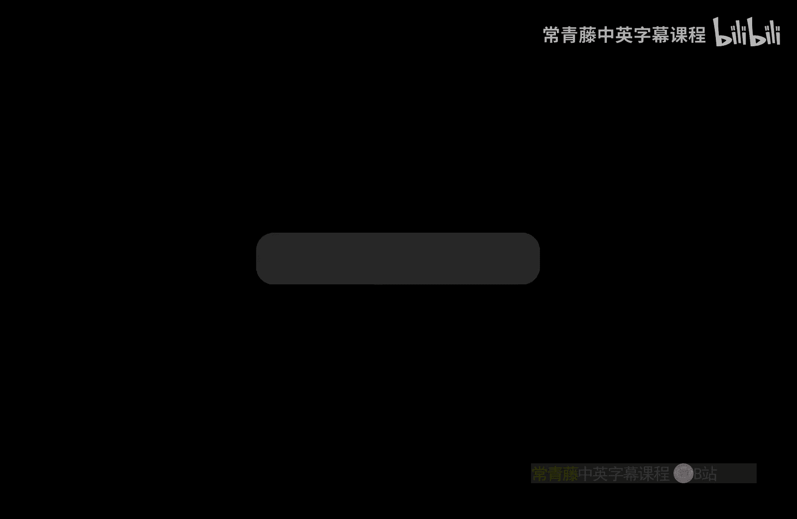
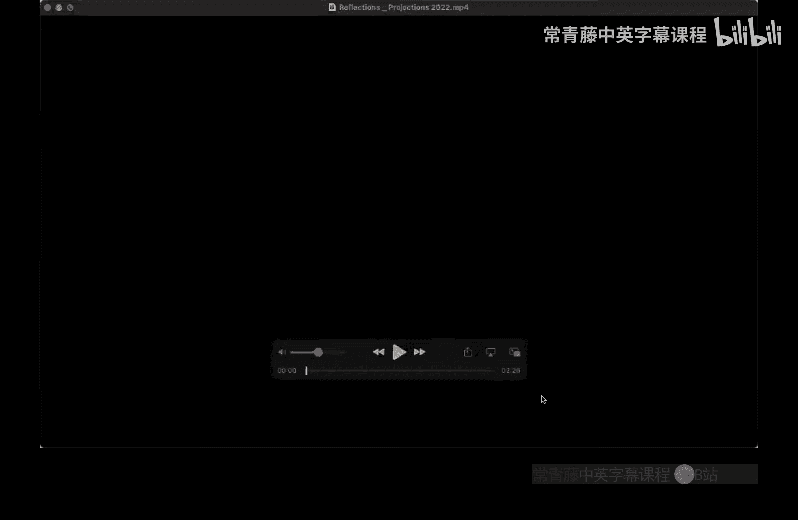
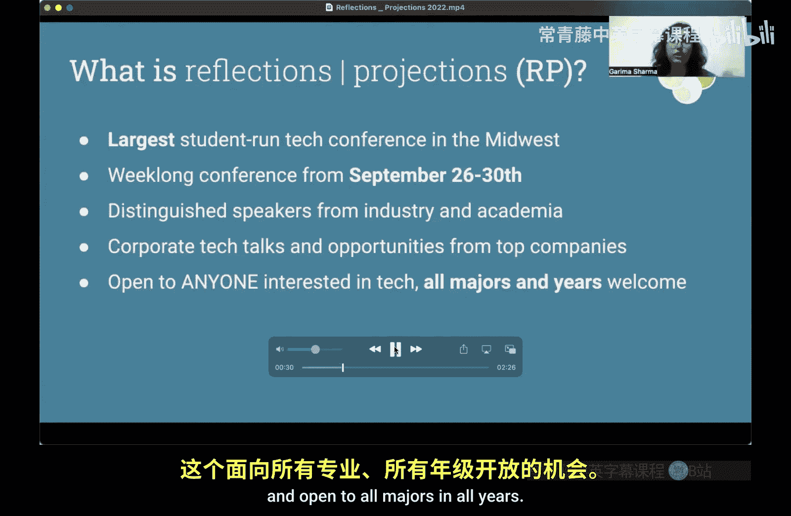
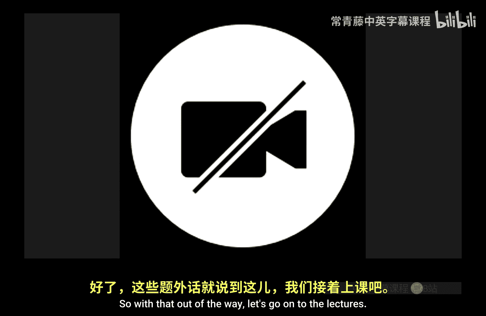
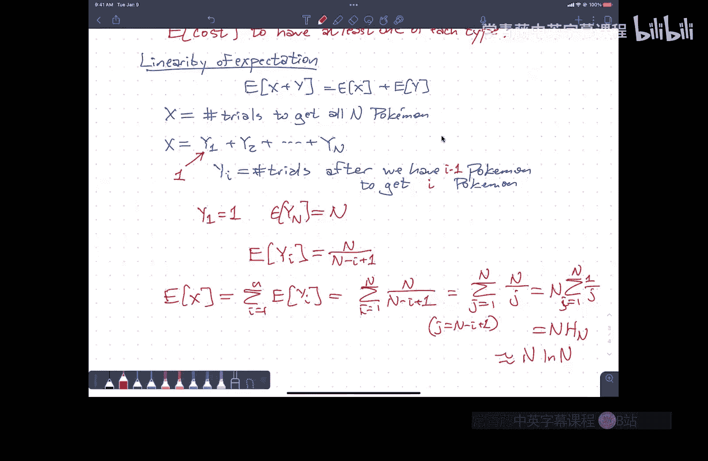

# 伊利诺伊大学【中英⚡算法｜CS473 Fall 2022 Algorithms】 p08 P8 8. Discrete probability review+ -BV1RdBTBrEdx_p8-

Yeah。

All right。I guess let's go ahead and get started。Thanks again for。Forre coming。

 it's a really nice day and it would all be rather be outside。Ho today will be。At least painless。

Before we get started in the class， ACM， at least the student in ACM asked me to play this video advertising the Reflections Projections conference。

One thing I want to say about the conference before the video starts。

 this has been running for a very， very long time， we have the oldest student chapter of ACM in the country and one of the largest。

 this is a completely student organized conference。😡，But it is。Honestly。

 one of the best run conferences I have ever seen。This is a real feature of the University of Illinois so please take advantage of this this is not you don't get this anywhere else。

Alright。Yes。I从。好。So。We bring distinguish speakers from industry and。On the other hand。

AV setup sucks everywhere。So I'm not sure why I'm only getting the sound out of this little speaker here。

As opposed to upstairs。So。Hopefully there's a public place like on YouTube or something where we can see this。

 but just in case there isn't。嗯。Right。😔，S。I'm not sure what's going on network top companies with our career fair this opportunity is open to anyone interested in technology and open to all majors in all years。

Now， we're bringing companies such as cash。 Just be quiet。Yes。No。Yes。How will like this。

But the beginning， we're offering not only career fair which allows you to network with these top companies。

 but if you're someone who's interested in academia。

 we're able to let you talk to top professors and academic professionals in addition to these speakers。

 Now， why exactly should you attend selection projections。

 networking opportunities with top companies like foreign Dataverse with many of these companies in fact recruiting from internships as well as new grad rules。

 So if you're someone interested in entering industry， that is an opportunity that is available。

 if you're interested in learning from industry leaders we feature speaker talks throughout the entire week ranging from company tech talks to topics such as AI and M to topics such as broadening participation in computing。

Finally， we have our own beginner friendly AI hackathon known as Memania。

 which takes place on the Friday and Saturday after reflection projections。

 So if you're interested in creating， that is the place for you。

 we also have our own weeklong puzzle competition known as puzzle bank。

 which features our own escape room as well。 Finally。

 we offer free food every single day during the event as well as free。

 And all of this takes place in the C building of computer science。 Now。

 if you're interested in attending reflections projections。

 feel free to scan this QR code and register at the link above。

 We also have our own Instagram account at Uiuc_ Rp and learn more on reflection projections org。

 We hope to see you there。 Thank you。😊，O。I'll let the QR code sit up there for a little bit in case you want to scan it。

What oh， the QR code doesn't work okay so。嗯。Yeah， they may need to pay for it Thank you Oh is that what it is all right so the I'm pretty sure the Instagram account still works you can Google for probably should say ACM reflections projections otherwise you're going to get a bunch of tutorials on projective geometry。

😊，Which is is also cool and you should totally do that， but not what I was asked to advertise。😡，AC。

inoacm。ilinois。edu， okay， awesome。

Okay， great。So。With that out of the way。嗯。

Let's go on to the lectures so。We're not going to talk about dynamic programming today。😡。

We're going to talk about something much more basic。😡，And or many of you。

Everything I say today will be review。😡，But for enough of you。

 it won't be that I do feel the need to give this sort of warm up lecture before we start talking about randomized algorithms。

 which is really the next chunk of this class。😡，So。The idea behind a randomized algorithm。😡，Is。

That we imagine。In addition to the usual operations that algorithms can perform like。

Memory and direction， I can chase pointers where I can look things up in as by by index four loops。

 while loops function calls， larger abstractions like stacks and cues and priority cues and things like that。

Recursion scope， we're going to add one more。Which is the ability to generate random numbers and use them in the algorithm。

😡，Now， we can。There's a whole philosophical debate to be had here about whether computers can actually generate random numbers。

😡，Without going to loveran dot org。Where they actually I don't think they actually use a lot of lamps。

 but they they might， but they definitely use。Video capture and then there's noise in the sensors that capture the video and they run it through a bunch of statistical hashing stuff to generate something that looks an awful lot like random noise。

And then you can download megabytes of random bits as you need them。

For most purposes that have nothing to do with security。Yeah。

 your pseudoran number generators are close enough to random to work。

You get it into security there's a whole different discussion to be had。

 and I will defer to the professionals who know what they're talking about。😡。

I'm just going to assume。As an aximatic part of my model of computation。

 that I have a library function。😡，Called。嗯。Random。Now feed it in integer K。

 and it will return one of the numbers， one， two， three， up through K。Uniformly at random random。So。

Random six。Is a role of a fair six sided die？啊。I believe。One of my pockets。I have random 54。Yes。

This is random 54 because there are two jokeers in here。嗯。Those of you who are。

Bans of stranger things or independently geeks。Understand how to generate random 20 or random 100。

UmOr if you're really geeks random 24。Things like that。

Now I'm just going to assume that the algorithm does this。😡，You have access to this random bits。Now。

Why would you want to do this， why would you want your algorithms to generate random numbers？😡。

So I've mentioned。😡，You know， one of the residents of the Pantheon that I believe in。

 the all powerful malicious adversary。And so the adversary。Read your code。😡。

And then just despite you。😡，Gives you whatever input will break your code if it can be broken。

Or if your code's always correct， we'll give you the precise input that will make your code run really。

 really， really slowly。😡，And this is where worst case time balanceuns come from。

So a sort of standard example of this。Is the sorting algorithm Quick sort？Choose a pivot element。😡。

Partition the array into the part that's smaller than the pivot。

 the pivot itself and the part that's bigger than the pivot。

 recursively sort the two subs on either side， that's the algorithm。😡，Now， in the worst case。

If you use any simple deterministic method to choose your pivot。😡。

You might choose the smallest element in the array is the pivot。😡。

In which case you're going to recurse on a subet of size0 on the left。😡，That's good news。

 there's no work to do。And you're going to recurse on an array of size n minus1 on the right。

That's bad。So Quicksort runs in n squared time。And I don't want to say for any deterministic pivoting strategy。

 but for any reasonably simple。Pivoting strategy like there's a standard heuristic that I should choose to pivot as the element that's currently in the center of the array。

😡，But that could still be the smallest element。Or I should look at the two ends of the array in the center element and take the median of those three elements。

😡，Well， I know I'm not going to get the smallest element in the array。

 and I know I'm not going to get the biggest element in the array。

 but I can still set up an array adversarally so that you'll always get the second smallest element in the array and you'll still get a quadratic running cut。

😡，系。So。U。How do you defeat the adversary？😡，Well， the adversary is going to read your code and say。

 I know how you're going to choose your pivot， so I'm just going to arrange for the worst possible element to be at that location。

 whatever your pivoting strategy is。😡，So how do you defeat the adversary？Merd sort， very cute。

You yeah pick the pivot randomly， you don't tell the adversary in your code how you're going to choose the pivot basically。

😡，You say I'm going to choose my pivot randomly， I'm going to take out a big insided die and I'm going to roll it and it comes up 17。

 I'm going to choose the 17th alumins with pivot and now so the adversary is has to like arrange the data in advance but you haven't rolled your dice yet。

 you only roll your dice once the algorithm starts。😡，Um。And so， if I。Pivot。Randomly。

Then I get a running time drops down from n squared to n log n and to be。😡，Formal about this。

This is the expected running time of the algorithm because now if you remember。

It's some probability of vocabulary。😡，The running time now is no longer purely a function of the input。

 it's a function of the input and the random numbers that you generate inside the algorithm。😡。

And so the running time is no longer just a number。😡，It's a random distribution of numbers。😡。

And so you want to talk about what's the average running time over that distribution。

 that's what we call the expected running time。You can also take this further and say with more careful analysis。

嗯。That the running time is N log n with high probability。😡。

Which means that the probability that it's the failure， the probability algorithm is slow。

 is some function of n。😡，That's like one over n or one over n squared。

Meaning larger arrays are more likely to make the algorithm fast。😡。

And the exponent in that polynomial depends on what constant you put in front of that big O。

So if you're sorting really large arrays。😡，Then you can say things like either。😡，It is more likely。

That。My computer will spontaneously turn into a kitten。😡。

Then it is that this algorithm run longer than 10 N Logan steps。😡，嗯。So morally。

This algorithm now runs in N log N time。😡，系。Now it's not the same。

 the worst case time is still n squared， the worst case time is。

 you know you max over all possible rolls of the dice。😡。

But youre never the probability of seeing the worst case is now vanishingly small。Okay。

Now I want to distinguish this story from another story you've probably heard， which is。😡。

If I assume the input is uniformly distributed， then QuickSo runs in and log in time on average。

 and that's great， except for one thing， the input is never uniformly distributed。😡。

It's not a reasonable assumption that you even know what the distribution of the input is if you can assume that it's generated by some random process。

 this is literally the entire field of statistical machine learning， what is the distribution。😡。

You can't walk in and say， I'm going to assume it's random， I'm going to assume it's uniform， no。😡。

The all powerful malicious adversary has control over the data coming into and in particular。

 it's like no， it's not going to be uniform， it's going to be skewed really badly。😡。

You have no control。Over how your input data is randomized。😡，But。You have complete control。

Over how your algorithm uses random numbers that it generates。😡，Okay。

 so this is making a statement about I don't care where the input came from。😡。

I can still argue that my algorithm will run in analog N time with high probability。😡，咁。So。

What we usually would say is。So if I say that。T of x is the running time of my algorithm。On input X。

Then。Max over all inputs of size N。T of x， this is usually what we call T of n。

That's what we call running time， but really I should call this worst。😡，Hs。Running time。

And now it's just a function of n， not a function of particular inputs。😡，Um。

What I'm interested in when I talk about randomized algorithms is now。😡，T of x is no longer。A number。

 it's a random variable。And I want to take its average， its expected value。😡。

With respect to the random choices that the algorithm makes。

 but then I'm still going to take the max。😡，Over all inputs of a certain size。

And this is what is usually referred to as。Ex。No， sorry。Let's get this right。

Worse case expected time。We'll it and put things in the right order。

So this expectation is over randomness。In the algorithm。Now。

 Quicksortt is a bad example in one respect。😡，Which is there is。

 in fact a linear time deterministic algorithm to choose the perfect pivot。

 the one that goes right in the center of the sorted array。😡，It's not a nice algorithm。

 the constant factors are。😡，You know， non trivial it's like like 20 n comparisons to get that middle element and so you end up with a quick sort algorithm that runs in 20 n log n time。

As opposed to randomized Quick which runs in four n log N time on average。😡，Or mergear。

 which runs into two end log end time。So even when it's possible to get deterministic algorithms that match the randomized running times。

 the randomized algorithms tend to be simpler。😡，And there are algorithms where provably you can do better with randomization than deterministically。

 and there are other problems for which we。😡，We know how to do better randomly than we do deterministically。

 and we don't know whether that's because randomness makes things easy and we just haven't figured out the deterministic algorithm or if there really is a gap in the fundamental complexity of the problem。

😡，Yeah。我就。of the algorithm what would there be a situation where the greed algorithm is a very high chance of protein so we say that it's not required in A is not I have the gra algorithm。

Very good。 And we say that。So。Yeah。Probabilistic modeling of greedy algorithms， again。

 it depends a little bit on where the probability is happening。😡。

If you're assuming anything about the input being random， you're in the wrong class。

 that's over an AI。😡，Okay。On the other hand。There are greedy like algorithms where the algorithm itself makes random choices。

😡，With when I get to the end of the shelf flip a coin heads goes on the same shelf tails。

 it goes on the next shelf right that that kind of thing typically with those randomized algorithms。

 you're not going to get an exact optimum。😡，But you can often get good approximations to the optimum。

Like I know that I'm going to use at most twice as many shelves as I need。😡，嗯。

When the exact optimum would be NP hard to compute。😡。

And you get those approximation guarantees more easily by doing things that are randomized than by doing things deterministically。

😡，Or in some cases， provably， you can get better approximations with randomized algorithms than you can with the termministic algorithms。

ok。So this is the story for the next。Few weeks。嗯。This is not the part that I thought was going to be review。

Um。The part that I need to make sure that every we're all on the same page about is。Well。

 there's that funny E symbol there for expected value and what does that mean uniformly and for that matter。

 what does it mean random？😡，Um， so。The lecture is basically going to be an introduction or a review。

😡，Of。Discrete probability。可以。Some of you are going， I know all this， cool。

Then when we get to the parts where we ask， hey， what's the answer to this， you'll be able to answer。

Yeah。Okay。😊，Now， some of you have taken real probability courses。😡。

They talk about Sigma algebras in measure theory。😡，We're not going there。Okay， it's beautiful stuff。

 but it's outside outside the realm of what we need for algorithms we're going to start。

Very simple with a thing called sample space。 This is either a finite or in some cases。

 maybe you want to go countable。S。So。This is a sample space that 54 elements。

I drew an X across one of the jokers to make it look different from the other one。

Hopefully most of you are familiar with this sample space。系。And。When I talk about probability。

Typically I have some sort of probability mass function。😡，That assigns a real number。

To every element in the sample space。With two properties one。😡。

The probability of a sample element is。Positive or non negative。And two， the sum over all。

Elements of the sample space。Of that probability is equal to one。 and so in particular， that means。😡。

The probability of each element is between zero and one。😡，嗯。Now。

 the standard probability mass function for this particular sample space that I'm holding in my hand。

 manufactured by the United States playing card company。

 the standard deck of bicycle playing cards with two jokers is every card has probability 1 over 54。

😡，But。😡，Random does not always mean uniform。Random just means this and nothing else。😡。

So in particular， there's a discrete probability space。😡，Called for the space of Rock paper scissors。

😡，And it's the probability space that。😡，I think it's Homer always uses。Rock has probability one。😡。

Paper has probability zero and scissors has probability zero。

There's a perfectly reasonable probability space。It's kind of stupid is Homer， but good old rock。

 nothing beats rock is still。Formerally probability。喂。嗯。So now an event。😡，Is any subset？Of。This。

Sample space？And likewise， you know， I can define， you know。

 the probability of an event just to be the the sum of the probabilities of the。😡。

Elements in that event， the elements of the sample space are sometimes called elementary events or atoms。

嗯。We're quickly going to leave behind the formalism here and we're just going to think about events more generally。

😡，But all the spades is an event。😡，All the fours is an event， all of the red face cards is an event。

嗯。And。At least intuitively， we think of this as。A condition or a proposition。

A statement that we want to make。In the context of a deck of playing cards。

 a condition that holds or does not hold if I choose a random card。😡，So the event， all the red cards。

😡，Is really morally the same as I picked a random card and the condition is that card is red。😡。

Or I pick a random card and that card is four。I picked a random card and it was a red face card。

So I want to think of these things as propositions。

And then I'm going to manipulate them formally as though they were propositions。

 so in particular I can talk about。😡，The union of two events。😡。

But I'm usually just going to write that with an ore rather than a union because I think about this as a proposition。

 A is true or B is true， that's really the same as it's an element of a union B。😡。

So I can do a and B， I can do not A， I can do， you know a implies B and so on。Okay。

They're not really propositions， they're really sets。

 but the way we talk about them is closer to the language of logic than it is set theory so we're going to use。

😡，Logical notation。Right。嗯。So right， so if I have a。Just as an example。If I have a。A blue sixd dye。

 and I have a red Ssided dye。Then I can say things like。

The probability when I roll these two dice that I get at most。1，5。 that's the same as。

The probability that I don't get。Two fives。Um， whichch is by just looking at the。

The sets one minus the probability that I get two fives。

2 fives is an atom in the probability space that I'm working over。😡。

The probabilities face that I'm working over is。😡，ordered pairs the first number is between one and six and the second number is between one and six。

😡，First number is blue， second number is red。Two fives is a single element。😡。

Of this probability space and since we're assuming that this is these are fair dice。

 the probability distribution assigns， the same probability to everybody。😡，And so this is 35 over 36。

Okay。But when I started out， you know at most1 five that that。That's really a sentence。

 it's a condition。Um， I didn't write out the set of all pairs that included at most15。😡，All right。嗯。

Okay， so this is。The probability of an event。The next most complicated thing we need to think about is conditional probability。

So if A and B are both events。The probability of a conditioned on B or the probability of a given B。

😡，This is the probability of A and B divided by the probability of B。😡。

So I can ask things like when I draw a random card。What's the probability。

That I get a queen given that I got a face card。What's the probability that I got the three of clubs given that my card has a prime number on it？

😡，Okay， now。Conditional proities only defined when the condition has a nonzero probability。

 so it doesn't make sense to even talk about the conditional probability of drawing the aid of diamonds given that there's a giraffe in the room。

😡，That didn't happen。Or given that I drew a skip card。It's a different。Probability space。Okay。

So again， with the red dice and the blue dice， I can talk about things like what's the probability that I got a red five given that I got at least？

One， five。And this turns out to be six over 11。Or what's the probability that I got at least one five？

Sorry， let me write that in English that didn't come out at roll。At least。One， five。

 given that I got at most。1， five。And this is the probability here is two over seven。Yeah。Yes。

 I'm rolling six sided dice。And I'm generating probabilities that don't have sixes in the denominator。

😡，It have sevens and1s and weird things like that。U。😊，There's a lovely。Puzzle that confuses people。嗯。

And。Just to give you， you know one of the ways that probability is。😡。

Deeply counterintuitive for many people， and I include myself in that。So。I have two children。

The probability of any child being。Let's simplify assigned to either male or female at birth。😡，Is 50。

50 independently of other children？One of my children。Is a girl。

What is the probability that both of my children are girls？It's one third。

There are three universes in which the condition at least one of my children as a girl holds。

 and in only one of them， both of my children are girls。😡，Now。

One of my children is a girl born on a Tuesday。What's the probability that my other child is a girl？

It's not one third anymore。I'll let you think about it yourself。呃。对。All right。

 so just some adjectives that we want to。Be able to use。We say that two events are disjoint。

 if as subsets， they are disjoint the probability they have no intersection。

 so this is the same as the probability of A and B is zero。😡，So the event。

 I got a red card and the event I got a black card are disjoined。

 the event I got a five and I got a seven are disjoined。😡，Okay， on the other hand。

 A and B you're independent。😡，If the probability of getting both A and B is the same as the probability of getting A times the probability of getting B。

 and the standard example of that is the probability that I got a red5，😡。

Let's say the five of hearts。Is equal to the probability that I got a heart times the probability that I got a five。

😡，The suits and the ranks in the stack。Turn out to be independent。Right。

It's important to keep these two things in distinct。😡。

It's a fairly common mistake to use one of these words when you mean the other。😡，And in particular。

 it's a very common mistake to assume that all events are independent。😡。

But that's not actually the case， so。The probability that the events。😡。

I got a red card and I got a heart。😡，Are not independent。😡，If I didn't get a red card。

 then I did not get a heart。还有。Okay， so independence again。

 is not something random that events always have。It's something you have to kind of。

Either explicitly assume and enforce when you generate the random values or you have to prove。

All right。So these are events， probabilities， conditional probability questions so far， yes。对。Yeah。

 one。From an intuitive standpoint， take your intuition and throw it in the garbage。

Your intuition is wrong。Just do the math。Okay， all right。So I'll。

I think there's a concrete example here。😡，Probably most of you have heard of the Monty Hall problem。

 so I'm not going to use that one how many of you have heard of something called the hot hand fallac sym？

So this is the theory。That when basketball players or other athletes。

They take shots or they try to perform some other task。😡，It's fairly standard to model。😡。

Somebody going up for free throw。As a random process。

 they have some probability of getting the ball into the hoop。The hot hand hypothesis says。

If they're getting if they've gotten more free throws。

 they're more likely to get the next free throw。😡，So there's psychological theories that， oh。

 I'm warmed up， I've trained my muscles a bit better during the current game。

 I've got more confidence， I'm more relaxed， that improveds my performance。

 and there were there have been dozens of statistical studies of sports performance that came to the conclusion that the hot hand hypothesis was false。

😡，That if you model free throws as a random variable。

 it's just a quirk of statistics that's fooling your intuition that the hot hand effect exists。😡。

Until somebody pointed out。That there's a subtlety in the statistics that implies that no， in fact。

 all of those statisticians were fooled。😡，And in fact， the hot hand effect is real。😡。

So's here's the experiment I want you to think about， I'm going to flip。😡，A fair coin。

Over and over again。诶。嗯。Now it's a flip of fairco n times。

What do you think the expected number of heads is？😡，And number two。

 right fair coin means I get heads half the time， I get tails half the time。

 the probability of heads or tails as a half， the different in flips are independent at this point you can do the math if you want okay。

 so the expected number of heads。😡，Is and over two。Okay。

 so let's think about heads as I got the free throw and tails as I didn't get the free throw we're interested in the probability of getting a heads immediately after another heads。

😡，Okay。So。嗯。The expected number of heads that have another coin flip immediately after it。😡。

Is n minus1 over  two？That last flip doesn't contribute anything no matter what each of the other flips contributes a half。

 so the expected number of head followed by something is n minus1 over two。😡。

And now the successful event that we care about。😡，Is we get a ahead followed by a head。Okay。

 so this is a successful。Event and so is this。Okay so then it turns out that the expected number of heads followed by heads is n minus one over four I look at every adjacent pair and theyre n minus one of them and each one has probably one over four of being head head。

And now。The statistical analysis of the hot hand fallacy is looking at the expected value of the ratio head head over head blank。

 given that the number of head blanks is positive。Because if the number of head blanks is zero that that faction goes away。

 so given that you made at least one free throw。😡，And then had another free throw attempt。

What is the expected fraction？😡，Of shots after free throws that you make。😡。

Everybody in the world says said。Oh。Well， even if you ignore like this condition。

 the expected value of the numerator is n over two and the expected value of the denominator is n over four。

That number？Is not one half。It is slightly smaller than one half。

Which means if you watch a basketball player。And they make shots half the time。

And they make shots immediately after a successful shot half the time。😡，That they're doing better。

After a previous shot， then the statistics suggests。Which means the hot hand thing works。Right， so。

This number is actually strictly less than one half。

So if you do the statistics and you observe a frequency where that ratio。

 the data says that ratio should be a half。😡，The probability says it should be less than a half if things are really independent。

😡，So they're not。Okay。What's going on here is you can't treat random variables like variables。😡。

You can't just pretend their numbers and divide things and expect them to work。😡。

That isn't how probability works。😡，系。If n equals three。

 that expected value comes out to five over 12， for example。😡，Just just enough to be significant。

Okay。Okay。Our。I'm sure I'll throw out some other。Maybe。There's， oh okay。

 so I'll do the Rosen Crans and Gilddensterern one。

Here's another puzzle just to think about if you've seen all this vocabulary before and you just want a puzzle to break your brain。

😡，Here's a puzzle to break your brain Rose and cramps and Gilden Stern each have a fair coin。😡。

Roose and Ks flips his coin over and over again until he gets tails。嗯。Let's see。Is this right。Then。

Gilden Stern flips the coin over and over again until he has more heads than Rosencrrants。

 is that right？You know I better not try to predict this puzzle up for memory。

 it'll just show up in the homework。그あ。😊，All right。嗯。Okay， we're going to play with things。

 so this was expected values， the thing that we're taking expected value of that's not an event。

 it's something called a random variable。😡，Okay， so a random variable is。

Not random and not a variable。😡，The random variable is a function from the sample space to a value set。

😡，Now often this function is just the identity， so if I draw the five of hearts。

 I want to say five of hearts， but sometimes that function is something else like I draw off five of hearts。

 I just want to say five， I draw the king of Spdes I just want to say 10。

 so I get you know the value in blackja of drawing that card。😡，U。

U so this is the lovely thing about mathematics vocabulary is something called the red herring principle。

In mathematics， a red herring is not necessarily red and it's not necessarily a herring。

The random variable， we call it a random variable， but it's not random and it's not a variable。

 we treat it like a variable that represents a random value formally that's just not what it is。

 but we'll pretend we pretend that these things are variables。😡，Okay so in particular。

 when we have a random variable where the value set is the set of integers。

 we often call this a random integer。😡，Or an integer random variable。Similarly。

 if the value set is the set 01。😡，Then we refer to this function as a random bit。

If the value set is the set of real numbers， refer to this as a random real number。😡。

If the value is the set of all graphs， we refer to this as the random graph。😡，嗯。

If the value set is a set of execution， possible execution traces of an algorithm。

We refer to this as our random execution trace。嗯。And we kind of。

Treat this as a variable in the sense that we can do you know comparisons。😡，嗯。Either。With other。

Elements in the same value set are with other random variables。

 so I can reasonably talk about for a random integer。

 what's the probability that random integer equals a particular integer little x。😡。

What's the probability that if I draw a card from here， the rank of that card is a five？😡。

The rank is a random variable in compared to five ors probability rank is bigger than five。

 or if I draw two cards， what's the probability to have the same suit？😡，Right。

This is really if you dig in the formalism， playing games with functions and so on。

 but we're just going to pretend that that capital X。😡，Is an element of。

The value set typically the integers。😡，Whose value we don't know。

 it's uncertain but obeys some certain laws of probability。8ight。嗯。

And then probably the most important thing we want to think about random variables。

I expect is the at least random numerical variables。ItEx， expected value of x。

This is the sum over all possible values， the value times the probability that the variable takes that value。

😡，Okay。So。If I have a six sided die。And know so I have a random element of this set。

Uniformly random element of the set， meaning the probability of any particular value is the same as any other。

😡，The expected value。That I get when I roll affair excited to die。

Is one times a six plus two times a6 plus three times a6 and so on is three halves。

The expected value of a random secd die sorry， is three and a half， seven0s。And again。

 this is something that violates people's expectations。😡。

It is not possible to roll a three and a half。😡，The expected value is not necessarily one of the outcomes。

 in particular， it's not the most likely outcome。😡，It's not necessarily one of the outcomes at all。

Right。It's just some other number。Now， when we get to thinking about。😡。

Random variables where the value set is not finite night， you talk about random random integers。😡。

That summation is over an infinite set。😡，And then you have to worry about some things like。

Does that sum converge？So there are random variables that don't have expectations。😡。

Because the sum that you get when you write out the definition doesn't actually converge。

 or even more confusingly， it only conditionally converges。😡，The probably won't get into that。

 but if you remember the difference between converges and conditionally converges。

 it really has to absolutely converge。Probabilities are all positive。

 so that's usually not a problem。咁。So not every random variable has an expectation。

 but almost all of the random variables that we care about do。😡，All right。Good。Oh， then slightly。

More subtle。Conditional expectation。The expected value of x given some event A。

This is the sum overall values， the value times the conditional probability of having that value。So。

What's my expected rank if I don't draw a face card？Five and a half。嗯。Again。What's my expected rank？

😡，If I draw a draw4， well， though that doesn't exist。

Because Draw four isn't an event that can happen with this deck。And with that。

 I think we have most the vocabulary that we need to talk about a couple of experiments。😡。

But I want to stop now and make sure there are no questions。Okay。Yeah。So。Let's start with。

One of the 50，000 people that deserves the title， Father of Computer Science。John Bon Neuiman。

So John Boon Neuumman was， you know， the person who came up with。You know。

 the architecture for every computer in this room。He was an early pioneer in what's now known as economic game theory。

 but as part of his study of game theory he。I thought a little bit about sort of nice probability puzzle。

 suppose I have a biased。Coin。So I'm going to say the probability of heads。

Is sum number P and therefore the probability of tails。Is1 minus P， but just to cut down a notation。

 I'm going to call that cube。So if I have a biased coin， I know the coin is biased。

 but I don't know the value of P。Is it still possible。To generate。Uniform， independent random bits。

 Is it possible to simulate a fair coin。With a biased coin。系。😊，嗯。

So I think before we get to the simulation。Let me ask。嗯。A simpler question。How many flips。

 how many times do I need to flip this coin？嗯。Until we get the first。headd。

Now I remember the Rosen crrant skilled into through puzzles。 So if I flipped the coin once。

And it comes up heads。The value that I attach to that experiment is one。

 I flipped the coin once and I got one head。If I flip tails， tails， tails， tails， heads。😡。

Then I flipped the coin five times， so the experiment gave me the value five。

 so run the experiment that gives you a random integer。😡。

What is the expected value of that random integer。Yeah。😊，It's going to be1 over P end。Okay。

 so the expected number of flips。Is1 over P。How do you prove that？No， no， no。

 that's how you restate it。So the answer is oh， it's a geometric random variable。

 I know the expected value of geometric random variables one over p great okay。

 how did the person who wrote the textbook prove that？😊，All right， so let define。

 let me just call this expected value x because I don't want to keep writing out expected flips。😡。

Um so。Expected number of flips。Well， I can split this up。😡，Using a bit of conditional probability。😡。

Okay， so this is the expected number of flips。Given that the。First flip is heads。

Times the probability that the first flip is heads。Plus， the expected number of flips。

Given that the first flip is tails， times the probability that the first flip is tails。

All I've done here is take the definition of the expected value and the definition of expected conditional expectation and move some terms around。

😡，Reshuffled some terms。系。诶。Okay。So I've got four things， let's start with the easy ones。

What's the probability of the first flips of heads？😡，P， by definition。

What's the probability that first flipped his tails？2。By definition。

What's the expected number of flips if the first flip is heads？1。😡。

Because if the first flip is heads， the experiment is over。

Every experiment where the first flip his heads ends after one flip。😡，Okay， so this is one。

Now for the more interesting one。What's the expected number of flips if the first flip is tails？Well。

 I did one flip。So let's write that down。😡，But then what's the expected number of remaining flips？😡。

That's right， it's as though I've never flipped anything。

 I just start the experiment over from scratch。😡，This is just the expected number of flips。Recursion。

Yay。We love recursion。Except it's not really recursion。Because I'm not progressing towards anything。

 I'm not making something smaller， except maybe what I'm making smaller is the probability of being in this particular branch of the multiverse。

😡，Except it's never actually going to ever go to zero。😡，It just goes to， you know。

 I can I can you know do the expansion the way that I would normally solve a recurrence and what I'll end up with is an infinite geometric series。

 but it's just easier to say， oh x equals1 plus sorry1 times p plus。😡，1 plus x times 1 minus p。

 and this implies that x equals 1 over p。And now how do you prove that， well， it's just algebra。😡。

Okay。贵。So how do you simulate a fair coin？😡，With an unbiased， with a biased coin。

 when you don't know the bias。Somebody already said yes。

 which means somebody's seen this puzzle before， but that's fine。How would I do it？Sir。Itね。

呃 feel你好你TM片不。Okay， so。Exactly right， here's how the algorithm works。I flipped the coin twice。If。

TheIf the flips come up different。Then I'll use the first flip as the actual value of the fairro coinin flip。

 so if I get head tails， I'll say heads， if I get tails heads， I'll say tails。😡。

If I get headsheads or tails tails。I just quietly restart the experiment and I don't say anything。还有。

So if I forget headheads， I say heads。I say tails， tails， then I say tails。And if I get headstails。

Or tails heads。restart。You're right， of course。More。

So one way to visualize this is I'm going to draw the probability space。😡。

Here's P and here's 1 minus p。Here's p and here's1 minus p。

So you should imagine that flipp the two coins is the same as throwing a dart at that square。😡。

This probability P of being above the horizontal line adds probably 1 minus P being below tails independently has probability P being left of the vertical line。

 probably  one minus P of being to the right。😡，So if I land in this box。Then I say heads。

If I land in this box。Then I say tales。And the areas of those boxes are the probability that the dark。

😡，Landed in that box。P times1 minus p。For either the red box or the green box。

 the probabilityba is the same。So even though。😡，It's an unbalanced decomposition of the square。😡。

Those two rectangles have the same size。😡，系。Now。What this means is。When the experiment sorry。

 I should say this carefully if the experiment stops with me speaking a word。😡。

That word has exactly the same probability being heads and tails。😡。

It just depends on the outcomes of the last two flips， so if this algorithm halts。

 it will return a fair coin。😡，But how many times do I have to do this。

 What is the running time of this algorithm as a function of P。

So what is the expected number of flips？Well， to say the expected number flips to the end of the experiment。

Sam。What's N？不是。The only variables in this picture is P。😡，And P is less than one。okay。😊，Good。

 you'll enjoy the next few weeks。Okay， so I'm going to think about。

 I'm going to think about the how I think about expected number flips is I'm doing an experiment which succeeds meaning I actually say something。

😡，U。Uh， with probability two times p times1 minus p succeeds means I either say yes or no。

And it fails。With public1 minus that。Oh。I have an experiment that has two outcomes。😡。

One that happens with some probability and one that happens with some other probability。

 and I'm interested in the number of times I need to run that experiment until I get the outcome I want。

😡，That's a biased coin。So the experiment is itself a biased coin。😡，That heads corresponds to。

 I emit an answer and tails corresponds to didn't work try again。😡，So the expected number of trials。

😡，Is now a trial succeeds or fails with those probabilities。

 the expected number of trials by our earlier analysis is one over the probability that the trial succeeds。

😡，Right so the expected number of times I need to flip coins is one over Pq so you'rere really close you're really close something that looks quadratic so in particular if it turns out。

😡，That at。Johnny's coin is actually fair， but he just didn't know it was fair that on average。

 he needs to flip that coin four times in that case， P is a half and Q is a half。😡，Okay。嗯。Okay。

 so a little bit of comfort with like。Coins and expected expectations and conditional expectations and probabilities and so on。

If you happen to know。What P is you can do better than this algorithm。😡。

Because there are more interesting ways of cutting up that square in that case， where in particular。

 if you happen to know that P is one third，嗯。Then a better way of cutting up the square is。

This this big thing down here in the corner should be heads。And either of these two。Should be tails。

And you only recurse one out of nine times。But。That algorithm only works when P is a third。

Whereas Von Nehman's simulation works no matter what he is。嗯。There's a whole thing about this。

Which would be lovely to talk about somewhere else。Sigma。😡，Sigma。

 this would be a great talk for Sigma。Yeah。All right。嗯。I think we have time to at least mention。😡。

One more problem。Pocket monsters。Everyone know what Pokemon is？It's a cartoon， yes。

 but it's a cartoon meant to sell certain things。😡，They look like this， but they're more expensive。嗯。

What's the catchph？I catch them all， okay， so here's the experiment。

 there are n types of Pokemon cards。😡，For a dollar。

 you can go to the Pokemon store and buy a random Pokemon card。How many dollars do you need to spend？

Before you have all the Pokemonons。不。Hint， it's more than N。This is the business model okay。

 so are you。And by。The random。Pokemon card。For a dollar。What's the expected cost？😡，To have。

Um at least one。Of each type。So you have N types。Of carts。Now， unrealistically。

 I want to assume that every card， when you buy a Pokemon card。

 you're equally likely to get each type of card。😡，Okay， so Pikachu has a probability one over n。😡。

In reality， that's not true， some Pokemons are more common than others。

 this only makes the Pokemon company more money okay。Um so。U。Let's。

ThisSo the analysis here uses one of the most。Powerful tools we have。With probability。

Call linear of expectation。😡，This says that if I have two random variables。

 two random numerical variables， x and y， the expected value of the sum x plus y is equal to the sum of the expected values。

😡，This works for sums。This also works for differences， works for like。

The expected value of twice the value of random variable is the same is twice the expected value。

 the random variable， but it does not work for other operations like multiplication or division。😡。

That was the hot hand fallacy。Expectation is linear， meaning it survives addition。

 commutes with addition， because the definition of expectation is just a weighted sum。😡。

This is something I'd like to refer to as the fundamental theorem of combatorics。😡。

Addition is commutative。😡，系。This is just， I'm just rearranging the sum when I write this。

 and it works for larger collections of random variables as well。😡，嗯。😊。

Even infinite collections provided the sums actually converge。So let me write x to be the number of。

啊。Let's see the number of trials。To get。All in。Pokemon。I'm going to write this。

As the sum of a bunch of。Random variables。Where y sub I is the number of trials。After。嗯。We have。Ae。

 Co on。To get。I+1。Pokemon。So。这意思是。Yeah， I should start at zero。Actually。

 I should shift this down by one。After we have I minus1 until we get I。So everybody， what is y1？

How many cards do I have to buy to get my first card？One， okay， good。U。Maybe just to be。You know。

Y1 is equal to 1， what is Yn？The answer is a natural number。嗯。😊，So why Saend。

 this is I've got every Pokemon except Pikachu。😡，How many more cards should I expect to buy until I get Pikachu？

And the probability of getting Pikachu is1 over n， the probability of getting anything else is one minus that this is an unbiased coin。

😡，Im sorry， this is a biased coin， heads for Pikachu tails for anything else。

So the expected number of trials is one over the expected value of a good trial。😡，This is。

 I should really say， the expected value here is going to be added。嗯。

What's the expected value of y sub I？So I think it's going to end up being。This。

I already have I minus-1。Pookemon's in my hand。So the probability that I'm going to get a new Pokemon if I draw one at random is the number of Pokemons I don't have divided by the number that I do。

😡，That's the probability of a good outcome， so the expected number of trials is one over that。😡。

And so bi linearity of expectation。I equals one to n of n over。Minus i plus1。

 let me rewrite this j equals1 to n。Of n over j here， j equals n minus up plus 1。

This is n times the sum of1 over j and j equals 1 to n。This is n times the enharmonic number。

 which is approximately the n natural log of n。That H ofn， the anharmonic number。

 will see that a lot。😡，And so。In particular， when I said that the expected running time of randomized Quicksort was N log N。

 that log was not really a base2 log， it was really a natural log。😡。

Somehow natural logs grow out of probabilities。Okay， I'm happy to answer any other questions。

 but we are out of time。If not， hopefully I'll see some of you in office hours or I'll see you。

On Tuesday， have a good weekend。打开蓝行。大就 three发 minutes。好 o我对。Unniformly distributed。

