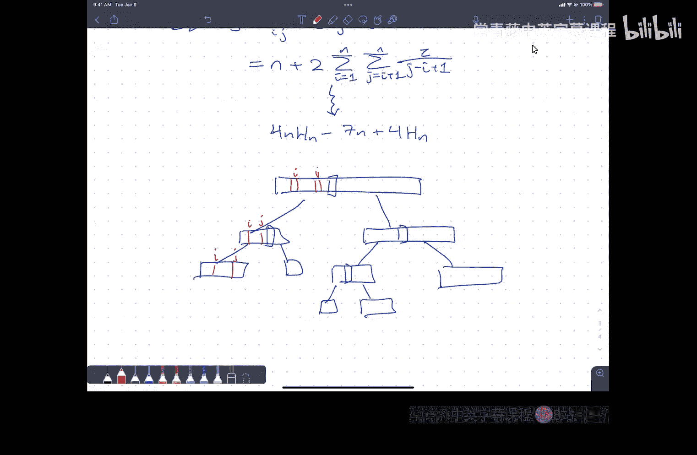

# 算法课程：P9：匹配螺母与螺栓 🧩


在本节课中，我们将学习一个经典的算法问题：匹配螺母与螺栓。我们将探讨问题的定义、一个简单的暴力解法，并重点分析一个高效的随机化快速排序解决方案及其期望运行时间。

---

## 课程概述

首先，我们处理一些课程管理事务。期中考试将于下周一晚上7点至9点举行。考试地点在指定的报告厅。本周四的课程将改为复习课，我会讲解一份由历年考题组成的样卷。考试内容涵盖课程材料以及作业0、1、2和3，包括分治法、快速傅里叶变换和动态规划等基础知识，但不涉及最近两节课中复杂的动态规划内容。

考试形式为闭卷，但允许携带一张手写的“小抄”纸。其目的是帮助大家整理思路，而非鼓励死记硬背。对于因时间冲突或特殊情况无法参加考试的同学，请填写网页上的冲突考试登记表。

关于作业，特别是较难的问题，请大家不要过分焦虑。作业的目的是练习和巩固知识，为考试做准备。即使没有完全解决所有问题，思考的过程也极具价值。

---

## 问题引入：螺母与螺栓匹配

现在，我们进入今天的核心内容。上次课我们开始讨论随机化算法。今天，我们将探讨一个由Gregory Rollins在90年代初提出的有趣问题：**匹配螺母与螺栓**。

假设你有一个袋子，里面有 **n个螺母** 和 **n个螺栓**。每个螺栓都恰好有一个与之匹配的螺母，反之亦然。螺母和螺栓的尺寸各不相同。但是，环境很暗，你无法通过观察比较两个螺母或两个螺栓的大小。

你唯一允许的操作是：拿起**一个螺母**和**一个螺栓**，尝试将它们拧在一起。结果有三种可能：
1.  螺栓太小（螺母松动）。
2.  螺栓太大（穿不过螺母）。
3.  完美匹配。

你的任务是：使用尽可能少的“测试”操作，将每个螺母与其对应的螺栓匹配起来。

---

## 暴力解法与思路转化

一个最直接的暴力算法是：拿起一个螺栓，逐个尝试所有螺母，直到找到匹配的那个。然后拿起下一个螺栓，在剩余的螺母中寻找匹配项。在最坏情况下，这大约需要 **n²/2** 次测试，即 **O(n²)** 的时间复杂度。

我们能否做得更好？如果我们能预先知道螺栓（或螺母）从小到大的顺序，那么对于任意一个螺母，我们可以用**二分查找**在 **O(log n)** 次测试内找到其匹配的螺栓，总时间就是 **O(n log n)**。

实际上，**排序**和**匹配**在这个问题是等价的。因为一旦所有螺母和螺栓完成匹配，我们自然就得到了它们的排序顺序。反之，如果我们能对它们进行排序，匹配问题也就迎刃而解。标准的比较排序算法（如归并排序、堆排序）时间复杂度是 **O(n log n)**。

然而，问题在于我们无法直接比较两个螺母或两个螺栓。我们唯一的操作是：
```python
def compare(nut, bolt):
    # 返回: ‘nut_larger‘, ‘bolt_larger‘, 或 ‘match‘
```

这导致像**归并排序**这样的算法无法直接应用，因为递归的第一步——将数组均匀分成两半——要求我们知道哪些螺母和螺栓应该被分到同一侧，而这在初始时是无法做到的。

---

## 随机化快速排序解法

虽然归并排序行不通，但**快速排序**的思路可以很好地适应这个问题。算法的核心是“分区”操作。

以下是随机化快速排序解决螺母螺栓匹配问题的步骤：

1.  **随机选择一个枢轴螺栓**：从袋子中随机取出一个螺栓 `pivot_bolt`。
2.  **用枢轴螺栓分区螺母**：将 `pivot_bolt` 与每一个螺母进行比较。根据比较结果，将所有螺母分成三堆：
    *   比 `pivot_bolt` **小**的螺母。
    *   与 `pivot_bolt` **匹配**的螺母。
    *   比 `pivot_bolt` **大**的螺母。
3.  **找到匹配的枢轴螺母**：在上一步中，我们找到了与 `pivot_bolt` 匹配的那个螺母，记为 `pivot_nut`。
4.  **用枢轴螺母分区螺栓**：将 `pivot_nut` 与剩下的每一个螺栓（除了已作为枢轴的 `pivot_bolt`）进行比较。同样地，将所有螺栓分成三堆：
    *   比 `pivot_nut` **小**的螺栓（即比 `pivot_bolt` 小）。
    *   与 `pivot_nut` **匹配**的螺栓（即 `pivot_bolt`，已匹配）。
    *   比 `pivot_nut` **大**的螺栓（即比 `pivot_bolt` 大）。
5.  **递归**：现在，我们得到了两个独立的子问题：
    *   所有“小”螺母和“小”螺栓的集合。
    *   所有“大”螺母和“大”螺栓的集合。
    对这两个子问题递归地执行上述步骤。

**一次分区操作的成本**：步骤2需要 **n** 次测试，步骤4需要 **n-1** 次测试（因为 `pivot_bolt` 已匹配，无需再比）。所以，一次分区总共需要 **2n - 1** 次测试。

---

## 算法运行时间分析

设 **T(n)** 为匹配 n 对螺母螺栓所需的期望测试次数。在随机选择枢轴的情况下，枢轴是第 k 小（1 ≤ k ≤ n）螺栓的概率是 **1/n**。

分区后，我们会得到规模为 **(k-1)** 和 **(n-k)** 的两个子问题。因此，期望运行时间满足以下递归式：
```
E[T(n)] = (2n - 1) + (1/n) * Σ_{k=1}^{n} ( E[T(k-1)] + E[T(n-k)] )
```
我们可以通过一些技巧（例如使用递归树或指示器随机变量）来求解这个递归式。分析结果表明：
```
E[T(n)] = O(n log n)
```
更精确地说，期望测试次数约为 **4 n H_n**，其中 **H_n** 是第 n 个调和数，近似于 **ln n**。因此，期望时间复杂度为 **Θ(n log n)**。

---

### 指示器随机变量分析法

另一种更简洁的分析方法是使用**指示器随机变量**和**期望的线性性质**。

定义指示器变量 **X_ij**：
*   **X_ij = 1**，如果算法在运行过程中比较了第 i 小的螺栓和第 j 小的螺母。
*   **X_ij = 0**，否则。

那么，总测试次数 `T(n)` 就是所有 `X_ij` 的和：
```
T(n) = Σ_{i=1}^{n} Σ_{j=1}^{n} X_ij
```
根据期望的线性性质，总期望测试次数为：
```
E[T(n)] = Σ_{i=1}^{n} Σ_{j=1}^{n} E[X_ij] = Σ_{i=1}^{n} Σ_{j=1}^{n} Pr(X_ij = 1)
```
现在，问题转化为计算任意一对 `(i, j)` 被比较的概率。

**关键结论**：在随机化快速排序算法中，第 i 小的螺栓和第 j 小的螺母被比较，**当且仅当**在算法执行过程中，第一个被选为枢轴、并且其排名在区间 `[i, j]` 内的元素，恰好是排名为 `i` 或排名为 `j` 的那个。

因为在区间 `[i, j]` 内总共有 `|j - i| + 1` 个可能的枢轴候选，而只有两个（i 和 j）会导致比较发生。因此：
```
Pr(X_ij = 1) = 2 / (|j - i| + 1)   (当 i ≠ j)
Pr(X_ii = 1) = 1                   (自身必然匹配比较)
```
将这个概率代入双重求和公式，经过推导，即可得到 `E[T(n)] = O(n log n)` 的结论。这种分析方法清晰地揭示了概率如何依赖于两个元素在排序序列中的“距离”。

---

## 总结

本节课我们一起学习了“螺母与螺栓匹配”这个经典问题。

*   我们首先明确了问题的约束：只能通过螺母和螺栓的配对测试来获取信息。
*   我们分析了一个简单的 **O(n²)** 暴力解法。
*   我们认识到，通过**随机化快速排序**的思路可以高效解决该问题，其核心是利用随机选择的枢轴进行分区，并递归处理。
*   我们详细分析了该随机算法的**期望运行时间**，通过递归式求解和指示器随机变量两种方法，都证明了其期望复杂度为 **O(n log n)**。



这个例子展示了随机化算法如何巧妙地绕过确定性算法难以处理的问题（如无法直接比较同类物品），以简单的逻辑和高效的期望性能解决实际问题。