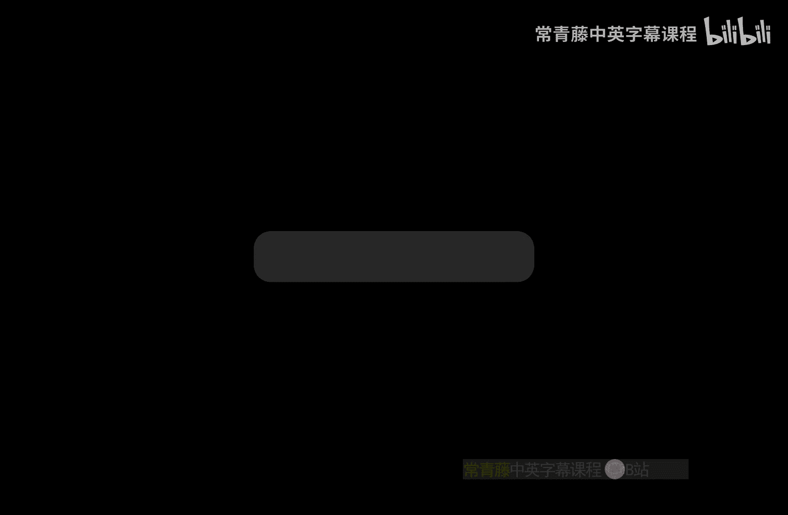
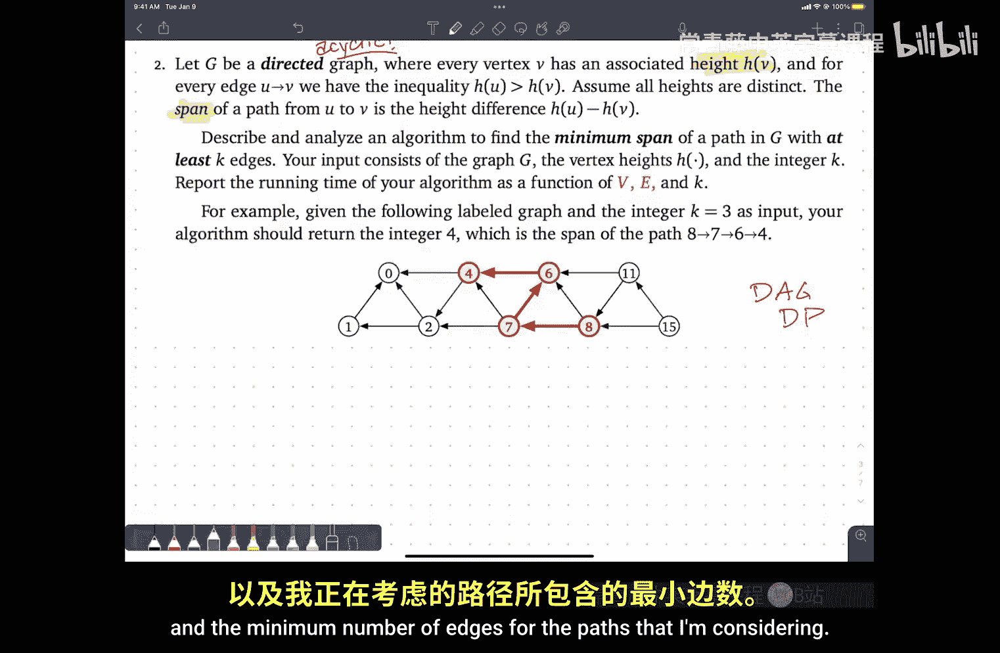
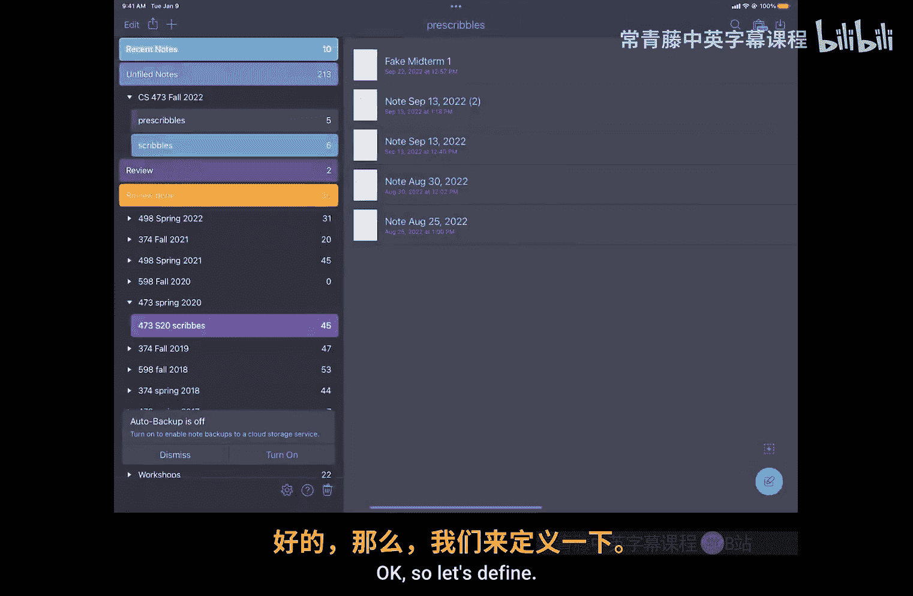
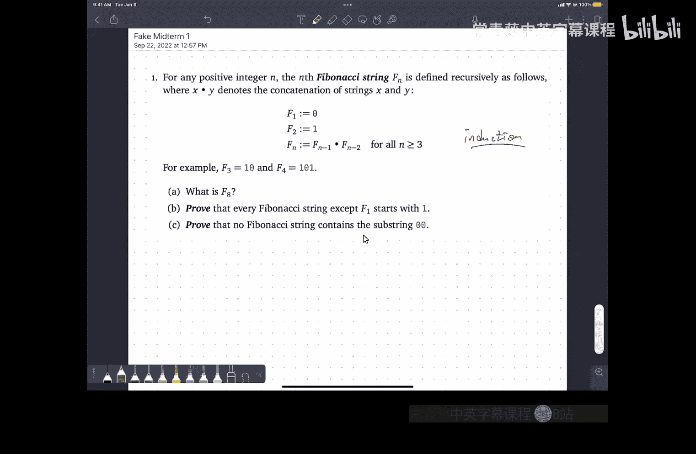

# 伊利诺伊大学【中英⚡算法｜CS473 Fall 2022 Algorithms】 p10 P10 10. Midterm review session+ -BV1RdBTBrEdx_p10-

Okay， thanks everybody for coming。So。Today I want to go through a few problems that have。😡，Either。

Been on previous exams in 473 or in a couple of cases， maybe 374。

Or are what I think of as exam level problems that haven't used on an exam yet。

 but I think are reasonably calibrated。Um。Just to give you an idea of what the exam is going to look like。

 now I've deliberately chosen more problems than will' be on the actual midterm and that also means that we will probably not have time to go through all of them。

😡，Um， but。Part of this is to sort of get used to the mechanics of how I'd like to run exams。😡。

At the beginning of the exam， once everybody is seated and quiet in the and the time starts。

 I will hand out or the TAs will hand out a single sheet of paper that has all the questions on it。

Then we'll give everybody a couple of minutes to read all of the questions。😡，And then we'll ask。

 does anybody have any questions about the exam？And we'll pause and then we'll say， in particular。

 does anybody have any questions about problem four。

 recorders of you will turn over your exam to look at problem four for the first time。😡。

And then when there are no more questions， we'll pass out answer booklets。

 and that's when the time starts。😡，So you'll have two hours to write everything into the answer booklet at the end of the exam。

😡，We're going to ask you to turn in all paper， so that's the question sheet， the answer booklet。

 your cheat sheet， any scratch paper that you use， so if you rip off blank pages off the back of the answer booklet and use them as scratch paper we want you to hand those in。

😡，Please put everything inside the answer booklet。😡。

So that it's just one packet that we can grab from you。嗯。

But then the strategy that I really want you to adopt。

 because I think it's actually just good exam strategy in general is do not answer the questions in the order that they are presented。

Rather， figure out which question you think you can make the most progress on quickly and do that one。

😡，And the other thing I would recommend is if you ever find yourself staring at the same problem for more than。

 say， four or five minutes without making any progress。

Write three words down to remind you what you were thinking about and turn the page and go onto a different problem。

 come back to it。😡，Your brain is really good at processing things in the background。

And stepping away and coming back is often the best way to disengage yourself from you know you're stuck on something because it's not going to work。

 you come back to it with a fresh perspective， your brain's been processing in the background all that time and you're more likely to make more progress。

So to that end， what I want to start with is just go through the list of problems。😡。

And then I'll ask you， which problem should we work on next？

And then we'll get through as many problems as we can。

The PDF with just the problems is already on the course website。😡，So。You want to。

Not watch now and practice with the problems and then watch the video later。 That's fine。 Okay。

 so first question。UIs。About Fibonacci strings， so the definition of the Fibonacci string。

 it's a string of bits， the first Fibonacci string is the single bit zero。

 sorry the zero Fibonacci string is theit the single bit zero。😡，Yeah， okay first。

 the second Fibonacci string is the single bit one and for any larger n。

 the n Fibonacci string is the n minus1 Fibonacci string concatenated with the n minus2 of Fibonacci string and as an example。

 f3 is 10 and f4 is 101。So first sanity check， what is the eighth the beacci string？

And then prove a couple of things about Fibonacci strings。😡，And you can probably already guess。😡。

How these proofs are going to go。What is the one word I should write down？Yeah， okay， so yeah。

 this is going to be an induction problem。Okay， great。Let's try the next question。

The original verse this question， there was a whole story， but we don't have time。

So you're given a rooted tree。T。😊，It's input， okay， so it's an algorithm question。

And what you want to do is find a way of labeling。The nodes of the tree， so each label。

 each node is labeled either one， two， or three。😡，And every node has a different label from its parent。

 so in the example you see this node is labeled three and its parent is not labeled three。😡。

And the cost of labeling。This is the thing that's a bit weird is the number of vertices that have labels that are smaller than their parents。

So if you look at all of the nodes that are indicated in red。😡。

Every one of those has a label that's smaller than the parents label。

The root isn't in red because it doesn't have a parent。😡，Um， but for example， you know。

 this node is red because two is smaller than three。

 this node is red because one is smaller than two， this node is not red because three is bigger than two。

And then it asks for an algorithm to compute。😡，The minimum cost of all labelings of the tree。

There's an explicit example， here is a labeling， there are nine nodes in bold red。

 therefore the cost of this labeling is nine， but this is not actually the best labeling for this tree。

your algorithm would return a number smaller than nine。Should I write a couple of words down。

 what is this kind of problem is this？It' this is probably DP。Okay。So let G be a directed graph。😡。

Every vertex v has an associated height。😡，It's just a number attached to the vertex。And every edge。

We have the property that the height of the tail of the edge is bigger than the height of the head of the edge。

 so in the picture， every arrow is pointing from a larger number to a smaller number。

What word do I now write down？So this is a。嗯。Sorry。啊。This is a directed acyclic graph。

Because I can't have any cycles because the heights are always going down as I follow the edges。

Assume all the high stinks， thank you that was actually important for getting it to be acyclic the span of a path。

😊，From U to V is the difference of the height of the start of the path and the height of the end of the path。

 so here's an example down at the bottom， this path 8764， the span of that path is four。

8ight minus four。Describe and analyze an algorithm to find the minimum span。😡。

Of a pathogene with at least K edges。😡，So there's some tension here。

 longer paths should have bigger spans， so I want to keep both spans small。

 but use at least a certain number of edges。Your input is the graph， the heights and the integer K。

 I want the running time as a function of V and E， the number of vertices and edges in the graph and the integer K。

😡，For example， given the labeled graph below and the integer K equals3。

 your algorithm should report the number four， which is the span of this indicated path。

 it has length three because it has three edges。Yeah。

Notice this is a slightly different definition of length than for the palinderme problem where there we were interested in number of vertices。

Okay， maybe Dg is enough， do you want to write anything else down here？Yeah， maybe this is Dp。O。嗯。

P2 sets of integers。😡，There's this thing called the Mowski sum， x plus y。

 that is the set of all pair y sum， so little x plus little y where little x comes from the set x and little y comes from the set y。

So。Describe an algorithm to compute the number of elements in this sum in Ncord log end time。😡。

Now naively， you might think， oh， it's always going to be the product of the。😡，The two set sizes。嗯。

But there may be more than one way to add numbers up to get the same sum and these are sets so that would only count once。

And then the second question says。😊，Describe an algorithm that compute the number of elements in x plus y in。

😡，M log M time where M is the largest absolute value of any element in the sense， so that means。😡。

Every element is an integer between minus M and M。Notice there's no mention of the size of the sets in part B。

 and there's no mention of the size of the numbers in part A。So。

Some of you have seen this before because you've asked me about this in office hours。

 but for people who have not seen this problem before。Does it remind you of anything？FftTs。

And if nothing else， one reason to think why it might be an FFT problem。😡，Is the running time？

But another reason is that I'm like。Thinking about matching everything at X with everything in Y。😡。

And I've got collisions that now my hands are starting to do this。

 this is the universal signal for I should probably be using an FFT。嗯。

Suppose I have two sorted arrays containing distinct dinners。😡，It's just like the last problem。

But it's not describe a faster algorithm to find the median。

 meaning the n smallest of the union of those two arrays。 So I've got two n numbers altogether。

 I want to find the n smallest of those numbers。😡，嗯。😊，All the integers are distinct。

 so no collisions， no ties given this particular input。😡。

I should return the number nine because that is the eighth smallest number on that line。😡。

And then there's a hint。What can you learn by comparing one element of A to one element of B？😡。

What does this smell like？对。This maybe a little bit like bird sort。

 so that's one thing to think about but。You know。Probably。

Sorting the union is not what I'm going for， that would be too。Simple。对。Somebody said a magic word。

Pinary search。Maybe we can like search through their sortdid arrays and we want to find a particular element。

 maybe maybe there's some sort of binary search thing， I mean if nothing else， you know。

 maybe you'd write down the word recursion， maybe you'd write down the divide and conquer。

 binary search is a good signal for both of those things。And then the last thing。

 you and your eight year old nephew decided to play a card game。The way the game is set up。

 you lay cards out in a row。😡，Each card is worth some number of points。After the cards are dealt。

 you and Elmo take charts at each turn， whoever the current player is。

 either takes the leftmost card on the table or takes the rightmost card on the table。😡。

And they get that many points。And the game is over when all the cards are gone。😡，Yes。

 you can see all the all the。You can actually see the number of points the cards are worth。

The winner of the game is the player that gets the most points。Emo' is only eight。

And so Elma uses a greedy strategy if the log card on the left is bigger。

 he takes the card on the left， the card on the right is bigger， he takes the card on the right。

Your task。Is to find a strategy that will beat Elmo at this game。对。Don't worry。

 Elma hates it when grownups let him win。So part A is prove that you should not also use the greedy strategy。

😡，Meaning you need to come up with a game that it's possible for you to win。😡。

But if you follow the greedy strategy， Elma wins。Remember， Elmo's always greedy。And then part B is。

Beat elbow。As badly as you can。Describing algorithm did this。嗯。What should I write down？Yeah。

And what was the signal that this might be dynamic programming problem？The word greedy。

The moment the word greedy pops into your head。You should say， oh， greedy， a。

 must be dyn and programming。😡，Instantly， every time。All right。So you've got dynamic programming。

 you've got some sort of recursion binary research thing， you've got an FF problem。

 you've got another dynamic programming problem with a Dg。

 you've got another dynamic programming problem with a tree and we've got an induction proof now the real exam will have four problems not six and the real exam will have two hours。

 not one。😡，So。Oh。Don't don't don't don't be worried about that which problem do you want to start with could somebody nominate。

😡，对。The third problem with the dag， I heard one vote for tree。还我。FftT， all right。

More my brain is saying FFT。😡，All right， so let's get part A out of the way first。嗯。

N squared log end time。Yeah， that could be n squared insertions into a balanced binary search tree。

Or said equivalently。😡，Build the list of pairs and sort them。Okay， so。A。

For I goes from1 to the size of x for well， no， actually let's let's。

Let's pretend to be Python for all X in X。For all Y and why。Add。X plus y to my set S。

 which I initialized to be empty。Sort S。嗯。呃。And at this point， I can remove duplicates。

And then count。So this part takes n squared time， this part takes n squared log n time。

 everything else takes at most n squared。But u。There's the dominating term in the running time。

Complete brute force。Except for this sorting。哎对。系。So。What about part B？

So I have this idea that I should be using an FFT and FFTs are good for computing convolutions。😡，嗯。

If I want， I can think about as computing products of polynomials。

 but I think it's simpler just to think about convolutions of sequences of numbers。U。

But what am I competing convolutions of？Yeah。It could have because with like poison numbers。安灯。一不行。

So I write one point next to the bar I where I make sum next to the eye where I and never added。Okay。

 so just just so we don't end up confusing ourselves， if we're going to do it with polynomials。

 I'm going to use the formal variable Z because I don't want to use the formal variable X because there's already too many x's on the screen。

All right， so what I could do is represent X as the polynomial。

Some overall little x in capital x of Z to the x。Remember every one of those little exs is an integer。

Now， this is weird。 It's a polynomial with。Possibly negative powers， you know， if that bothers you。

 you can probably get rid of it by adding them but it won't actually matter in the end。🤢，On。

And I need a name for this polynomial， I'm just going to call it P for polynomial。And similarly。

 I'm going to represent y as the sum overall。Little Y of。Z to the Y， and if you want plus M。

 and I'm going to call that Q because that's the first letter of quanomial。

Y comes after x in the alphabet， Q comes after P in the alphabet， that's a good enoughphneonic。Okay。

So。I actually don't think I need this plus so I'm actually just going to ignore it。

 but if you don't like polynomials with negative powers， you can put it in。And then， well。

 I don't know， maybe I want to compute。You know， p times Q and that'll be some new polynomial R for result。

嗯。啊。And the amount of time that it takes me to compute that is only going to be M log M because I'm multiplying two polynomials。

 each of which has about two m coefficients。😡，To the the max。

 the difference between the largest and smallest power is about to。

So the input to my multiplication algorithm is going to be an array of coefficients of length to M。😡。

One for P， one for Q。OkaySo this takes M log M time。V FFT。Now what？有没有。行。Yeah。

 so then I want to return。The number of。Non zero coefficients。Right， the idea is that。

R is going to be the sum of let's call this integer I from minus2 m to 2 m。Of。嗯。

Let's see a sub i z to the I a sub i is going to be the number of different pairs， x and y。

 such that x plus y equals I。Right every different way of adding to numbers are getting the same result。

Is going to contribute。😡，That corresponding term to the product of those polynomials。Yeah。

 I know I probably should have called that Z and then used it different or whatever。

So if a coefficient to zero， that means that there's no way to make that number as the sum of an element of x element of y。

😡，There's no monoomial NP P and no monoomial in Q that multiplly to the right power。

But if there is a way to do it。The coefficient tells you the number of different ways to do it。嗯。

And well， this， everything else is order， so we're done。

If you prefer to think about this in terms of coefficients instead of polynomials。😡。

The way that polynomial is actually represented。Is really， I have an array， let's call it。

 I guess P from M。2M where either zero or one。For each。Yeah。You know。

 particular element of the array is equal to zero that indicates that。😡。

That index is not an element of this FX。😡，And if P sub I is equal to1。

 that means the index I is an element of the synax。😡，And so really。

 I'm doing a convolution of these two bit vectors。But it's the same algorithm you're just calling it different things a different notation。

Okay， so the trick with these FftT things。😡，First， the moment you see your hands doing this。

You should be doing an FFT， but then you should ask， what are my hands？😡。

What are these things that I'm moving against each other and you can think of them as as vectors or you can think of them as polynomials。

 but somehow。The way you're matching up your fingers needs to correspond to。

Multiplying the two values。O。😊，Next， yeah， sorry。😡，Is this all we need to show full credit yes？

This is what you need for full kind。I mean， you describe the algorithm。

Compute this return the number of not you know， I mean， there are details like I assume。

That you know that I know that， you know that I know that you know that you can do this with a for loop。

So I do want to say one thing about this。There is a judgment call here about how much level of detail to include。

😡，The way that I want to think about this is if I hand this to a student in 225。😡。

Can they figure it out in a matter of。Seconds。Right， so long。Okay。

Long complicated bit's a pseudocode with no English no English explanations is confusing right one line if I pointed at this and go yeah。

 I can do that one line with for loop， that's great long complicated things with no intuition。

 no explanation， no description about what's going on no high level overview that starts to get unclear so whenever possible describe your algorithm as like bullet bullet bullet bullet and then expand。

😡，Okay。Yeah。Yeah， I think that would be a。Easy 225 M。This line。Yes， okay。Next question。Trees， dags。

 ares。Oh。Elmo。This one。This one， trees。Okay。other this one okay？Okay。

So I have a tree and I want to do dynamic programming on it that means。😡。

I want to do something to the root and I want the recursion training to do everything else。Okay。

 so the question that I need to ask is， you know， how do I label？The root。嗯。And well。

 I don' know it's either one， two or three， I've got three options， I'm going to try them all。

And then I'm going to go down to my children。😡，But when I'm。

Recursively trying to figure out the best way to label。This sub tree。

Is that a completely independent subproblem？😡，这是见。Right the the I need to remember the label of my parent to make sure that my root doesn't get the same label right so whenever I consider a subt。

 I need to carry back some information about。😡，What's forbidden behind me by my parent？Um。

That's one way to think of it。 Another way to think of it is。😡，Well。

 maybe what I could do is just tell the node what its label is。😡，And。Like。

What I need to figure out is what labels to give to my children and then let the recursion fairy figure the rest out。

It。We can do it either way。😡，Either the label is the thing I'm choosing。

 my label is the thing I'm choosing， or my parent tells me what my label is and I label my children。

😡，Which one of those seems more。Intuitive。LabelHow many people want to label yourself？

How many people want to be labeled by your parents？Okay， so。How do I label the route？All right。

 so my subproblem。😡，Is going to be something like。嗯。啊。Best score of V comma C。 This is the。

Is it maximum score minimum score？Minimum score。Or。Subre。Rooted at the， if。Aarent of the。Is labeled。

四。Um。What do we need to compute I mean， if we suppose we implement this recursive function。😡。

How do we get the final answer for the whole tree？The root doesn't have a parent score。Right。

 so I'll just pretend that there's the root has a parent。😡。

And so what we need is the min of the best score of root one。

 the best score of root two and the best score of root three。Okay， so。Good。U。All right。

So let's just imagine we're here and。We remember the label。Of our parent。嗯。Its。

We need to come up with a recurrence。You know to keep this simple。

I'm just going to think about one particular number here because otherwise I'm starting to think this is going to be a notational nightmare so let's simplify things and just focus on one possible value so in this case i'm not this isn't the sub problem i'm actually thinking about I'm really thinking about say this sub problemble right or now。

That's going to be too。Okay。So I'm going to have three choices for what my color can be no actually I'm only going to have two choices for what my color can be。

😡，It's going to be the minimum of。Well， two things。My label。Is one or my label？Is three， oops。

If my label is one。How do I rehearse？Yeah。Right， so I'm going to sum up over all children of the best score of that subte with the label one。

But then I need a plus one because my label is one， my parents label is two。

 and remember the score is when I get one point every time I see a node with a label smaller than its parent。

😡，On the other hand， when label of V is 3， how do I rehearse？😡，It's almost the same。对。

There's no one plus， I had just write zero there to remind myself of that。

And then the same summation。But now I passed three down。嗯。Am I done？With the comma2。

Is there a base case？What would the base case be？When there are no children， okay， so if V is a leaf。

😡，What is this return？And is which one？是。It returns the minimum of one in zero so it returns it returns zero right so right off the bat you can see in the example right at the top of the screen。

 there's that one there with a parent of two that was one place where I can improve the coloring if I change that one to a three my score drops。

So there's not， I don't need any additional cases here to handle leads。

 the base case is implicit already in the recurrence。😡，So yeah， I can get rid of this。U。

And maybe it won't be so bad to look at the other possibilities， so best score。Of the comma1。

Is again， the minimum of two possibilities。One is。嗯。I colored。The two and the other is I color V3。

In both of those cases， I recursively call my children with whatever my choice of label is。

Do I make any adjustments in front here？In these cases。No。😡，I can emphasize that if I want。And then。

啊。Best score the three equals min and in this case。Wait， is that right？Did I get that right？

If I'm going to score one。Then I am always going to be smaller than my parent。No。

 one is the color of my parent， okay， got it。It's always important to remember， you know。

 this is part of the reason why I tell you to write the English description down。

 so if you get confused and go， now what am I doing， oh。

 read the documentation that you helpfully wrote for yourself five minutes ago。😡，m。

 so on the other hand， if I'm trying to color V and my parent is labeled three。

 no matter what V gets labeled，m I'm going to get one point。😡，So again。one。And theres some to。

 at this point， I think we know what we mean。Great。So we have a recurrence。

How do we memorize the recurrence？I'm going to store these three values in each node of the tree。😡。

Right。UInto the tree， so V dot bs1， v dot bS 2， v dot bS3。Valuate in what order？Post order。

 bottom up， yeah。Or if you draw this picture。U。And the running time。So是。Number of nodes， yeah。

Number of nodes， number of edges are almost the same， so call it in。Order V would be fine。

 order V would be fine。Okay。So the'll finite number of choices at every every vertex that only depends on things at my children。

 so post order or work and。Um。Oh， then now。Draion。Wait a minute。

 I can't evaluate each one of those subproblem in constant time because there's a summation on the other end。

😡，How did I get order end？Right， so I'm counting the total amount of lookups that I do on the right side of these recurrences is proportional to the number of edges。

😡，Each value BS comma WC gets looked up by its parent。😡，At most twice。

So don't get you know when you're summing over the number of neighbors of a node。

 remember that the total number of edges in the graph is only order E， not order V to v squared。

 and in a tree the number of edges is one less the number of vertices。

 so it all boils down to order n good and no， I don't need to write that down。😡，For full credit。系。

All right。Next question。Induction。Daag。Bary searching thing or Elmo。Dag， okay。So I've got a dag。

 every node has a height， that's what the label is called minimum span of a path with at least hay edges。

All right， so this is going to be some sort of dynamic programming thing。But。嗯。

So paths are sequences， so I want to think what's the first edge， what's the next edge。

 what's the next edge and so on。But whenever I。I'm doing that。It's not just。Like some DAg problems。

 the subproblem is just specified by where you are an Ag。

I kind of have the feeling it might not be enough。嗯。Okay。

 so I need the start point and the minimum number of edges。😡。

For the paths that I'm considering。Okay， so oops。

Let's。Define。Let's call this MSVK， well let's not reuse K， let me call this L。

This is the minimum span。Of a path。Starting。At the。With。At least L edges。And what we need。

Is the maximum？Over starting points of Max minpan of the Com。And I can kind of。

Hopefully kind of see where this came from right I need to know where I am and I know how many more edges I have to use so。

😡，嗯。You're right， I want men。Thank you。Okay， so let's。See if we can。I get this out。Well。

 the general question is always going to be， what's the next edge？😡。

Or what what's the first edge right so thats。嗯。Oh。So let's look at the most general case where V is somewhere in the middle of the graph and L is reasonably large and we don't have to worry about boundaries and we'll figure out what the boundary cases are in a moment。

So I want the minimum of something。🎼嗯。嗯。Just in the minimum span。嗯。

I really kind of want to break down。Myike。Cost function。

In a way that is consistent with the recursive structure。

 so I really want to be able to ask for the minimum span starting at some child of V。

And then make the adjustments so that I actually get the minimum span starting at V。So。嗯。

I kind of get the idea that I should be looking at the minimum over all edges。

From v to W of something。And this probably involves minimum span of WL minus1。But what goes in front？

Suppose a little birdie landed on your shoulder and told you is the next this is the right edge V toW。

 that's the one you want， and this minimum span over here， this is eight。

 What do I need to do with that information to compute the minimum span of this path starting at V？😡。

Value。Of the edge of that brain because your to sub to。Well， I mean， one thing I could do is return。

What is the value， minimum height that I can reach from V？😡，Using it most L steps。

Or what's the largest value that I can reach using at least L steps and then subtract that from the high to V？

So I could start over with a different recurrence。The span is the difference between the height at the source and the height it the sink。

The height at the beginning minus the height at the end， yeah。Add the difference of heights。

 so I'm going to increase by height of V， and then I'm going to decrease by height of W。😡。

 so this is measuring。This difference。1。And then the recursive call is measuring the remaining difference。

 three。So I get what's called a telescoping sum。A minus B plus B minus C plus C minus D plus D minus E is a minus E。

Okay。All right。That seems to be a reasonable。😡，General recursive step。

 but I can already see that there's some boundary issues。 One is I don't know what it means to use。

What does it mean to use at least negative one edges that's a bit weird。

 so there seems to be a boundary case there when L is small。So。

What's the answer when L is equal to zero？The answer is an integer。So it can't be the empty set。Yeah。

It's zero。So what is the minimum span of？😡，A path that uses at least zero edges that starts at this node here。

😡，对。Zero， the path that starts there and ends there。😡。

The at least zero is a red herring using any edge would add more span because all the heights are distinct。

😡，And in fact。All the way through。You can reason that using more edges is only going to make your span bigger。

 so the at least was a red herring all along。😡，You're actually finding the answer to that problem is all。

😡，Ath that has exactly K edges。嗯。All right， there's another case that I need to worry about。😡。

What happens when there are no edges leaving V， so what's the minimum span among all pads leaving this node that use at least three edges？

There are no such pads。😡，So the minimum of the empty set。😡。

Is reasonably defined to be infinity well in that in this case。

 I've got minimum over no edges of something so。😡，I'm getting the right thing。

 but if you I want to be absolutely sure。And write down here， minimum。The empty set is infinity。嗯。

At this point。I think we're done。So basically I needed to make sure that when I did the recursive call。

 the arguments made sense and I needed to make sure that when I'm doing something with edges that those edges exist or that I'm sensitiveibly doing something when they don't。

 we seem to have passed those tests， so it looks okay。😡，Got a recurrents。How do I memorize it？

That's an evaluation order， but what's the data structure？对。Well。

 I think you need to be more specific， so in the case where we're computing a single scalar value for each vertex。

😡，We can just add a field to that vertex， that was the tree coloring problem。All right。

 so one way that we can memorize this。UIs。To memorize into an array。The dot M S of0 through K at。

Every node。😔，Yeah this is a little awkward another possibility is it was a dag I should topologically sorted at the beginning even before I read the problem now I've labeled every vertex with an order and topological order and I could use a two dimensional array with one axis indexed by vertices in that topological order and the other axis indexed by。

😡，L number of colors。But this will work。嗯。How do I evaluate？What's the evaluation order。

And let's stick with this。Memmalization thing because。Oh we can manage。

So what order do we need to visit the notes？Every recursive call。Involves a node。Later。

In topological order。So we need to go and reverse topological order。😡，诶。So。For all the in。

Reverse topological order。Otherwise known as post order。

And what order do we need to consider the number of edges？😡，Every time we recur。

 we recurse with a smaller budget of edges。So in our evaluation order。That number needs to go up。

Does it matter？How these two four loops are nested。I want to make sure I didn't swap them。

What do you think？I mean。Just to get some intuition here。Here's V in topological order。

 here's L increasing order， what we're basically saying is I need to evaluate columns this way and I need to evaluate rows that way。

And the reason is that。This is going to depend on things that are in the previous column and in somewhere in the later rows。

Does it matter which of those is the inner loop and which of those is the outer loop？听到。No。😡。

When I recurse， I'm never recursing on the same vertex。😡。

I'm always recursing on a later vertex when I recurse。

 I'm always recursing with a strictly smaller budget of edges， never with the same budget of edges。😡。

So the picture it sort of intuitively looks like this。

 I'm always looking back at things that are strictly to the left and strictly below。

 so it really doesn't matter whether I'm coming up from below in the inter loop or coming over from the right in the inter loop。

😡，Either order works。嗯。Time。What's the running time of the algorithm？对。Yes。So。I'm。

So inside this intermost loop， I'm doing a constant amount of work。

The amount of work that I need to do to process that outer for loop。😡。

That's going to be proportional to vertices and edges。

The amount of work for each V that I need to perform。😡，Is proportional decay。So altogether。

 it's going to be。This。So I'm mixing two kinds of dynamic programming here。😡，The outer loop。

 I'm doing the graph search that takes v times z time， the inner loop。

 I mean this is standard four loop up to K。😡，So just like any other nested loops。😡。

The time for the whole thing is the product of the amount of work in the outer loop and the amount of work in the inner loop。

对。Analysis might be a little bit easier to think about if we swap the order of the loops。

 so just a simple loop over all values of L， okay， and for each one of those I'm doing a depth for search of the D。

But it's the same either way。不可。嗯，F系等。Okay。So generally I want to think about sets recursively。

 so the way that I would compute the minimum of a set is I pull out one element。

And it's the minimum of this element and the minimum of whatever's left。

The only way to make that work with a one element set。😡，Is。Whenever I do that minimum。

 the element I pull out is always smaller than the recursive minimum of the empty set the only value that makes that work is the minimum of the empty set must be infinity。

😡，该好的。don talk to water for。嗯。So I indexed in topological order。

 but I want to evaluate in reverse topological order。不。我随时在州。I'm sorry。

 was visitor zero moderate right？I first visit the sink。

And I walk my way back to the source topological order starts at source and moves towards sync。Yeah。

Because dad's going have science saying anything but that。

That's a good question the dags don't have cycles， so can we bound the number of edges。

 unfortunately no。When the graph is。Undirected。You can because then it' just a tree。

 but you can have a dag with a quadratic number of edges， so integers。

 the vertices are integers of1 through n， and there's an edge from every smaller number to every larger number。

Then there are things that look like cycles， but the edges don't all point in the same direction so they don't count as directed cycles。

Yeah。Havebodyed a protest with anything。Yeah， so if you want to implicitly assume that the graph is weakly connected。

😡，Then you know that v is at most e minus e plus1， or at least， yeah， it's at most e plus one。😡。

The number of edges at least to v minus one in order for the graph hang together otherwise you consider the component separately and it all adds up anyway。

 so yeah if you just report e times k that's perfectly fine。Yeah。I'm sorry。Well， I've got two loops。

 the out one or uses order re work and the inner one uses orderK work done。

What I've written down is enough for full credit。On an exam。Yeah。こで時が。呃，其他证据。没有。

So I actually did define it as at least Legs， but I observed that the answer is always the span of a path with exactly Legs。

😡，That wasn't the definition， that was an observation because and it comes inductively from the base case。

 when L is zero answers is always the span of an empty path。And you build up one at a time。

So if you didn't notice that， you didn't cross out at least it's still correct， it's still fine。😡，呃。

没事，不好意思。可以。I'm sorry。This， what I have written。😡，Is full credit？

I've given you an English description of the function， I've given you a recurrence。

 I've told you the memorization structure and the evaluation order。

 and I've given you the running time， that is what you need for full credit。😡。

If you write down the recursive pseudocode， you still need to give me English。

 you still need to give me running time， but then you don't need to separately give me a recurrence and separately give me an memization structure and separately give me an evaluation order because all of those things should be clear from your pseudocode。

😡，so no， you do not need to write out full fledged pseudocode unless you are more comfortable thinking in those terms。

😡，But then you do need to make sure that the components that we're looking for are clear in your studio code。

Okay。U。Finacci numbers。Meedians。Or Elmo。对。要不是。I'm hearing more medians than Elmo。

 but we're going fast enough that I think we might be able to get through both of these。Okay。

 so here's my array A and here's my array B， and I want。

The hint suggests that I should compare one element of B to another element of。A。嗯。

Any particular elements？不用。The middle one， okay。So let's look at the middle element of A and the middle element of B。

 and let's suppose we learn。That the middle element of A is smaller than the middle element of B。

Right， so let's think about this blue region here。Can the median be in that blue region？

I claim the answer is no。And the reason is， well， I know that it's smaller。😡，Then。These。

And over two elements。And I know that it's also smaller than these and over two elements。Well， okay。

 maybe there's like one element here that could be there。Okay， but most of the stuff on the left。

Is smaller than too many things to be the media。😡，So I can get rid of that。Similarly。

 if I look at this red stuff up here on the right side of B。It's bigger than the bottom half of B。

 but it's also bigger than the bottom half of A。😡，And altogether， that's an elements。

So it's bigger than n things， so it can't be the median， the median is the n smallest thing so。😡，嗯。

Those get knocked out。嗯。So that's great， I seem to have cut the arrays A and B in half。But。

You need to think of now what am I actually looking for？In there。

 So I was looking for the nth smallest thing， but I threw away。

And over two things that were too small。So。What rank in the remaining arrays am I looking for？😡。

And number two。So' the n over two in the parts of the arrays that are still alive plus the n over two things I threw out in that blue thing that gives me a total rank of n so it seem to be on the material trail of recurrence so let's。

Just start。嗯。 something like this。Well， I'm going to be maybe a little bit fast and loose with the off by one errors here。

嗯。I really don't want to think。About the off by one errors。

 and I do apologize for doing the magic pencil Lasso thing。

 which you won't be able to do on the exam。So this。

 these off by one errors are going to start being a problem when my array size gets small。

 so let's deal with small array sizes。😡，X。Yeah。good。

 now I don't have to worry about off by one errors。😡，Okay。Yeah， it's small， it's a constant。

 whatever， okay so。嗯。But so the idea is that I'm throwing out。

About n over two elements of A that are smaller and about n over two elements of B that are bigger。

That leaves me with these two arrays of size and over two。😡，I think if I were really being careful。

And how would I do this？😔，You know what， I'm not going to try to be careful。Just。We'll work out the。

 you know。I'll just right here。Beware of oboes。There are only two really hard problems in computer science。

Anyone know what they are？啊。Cash synchronization。Naming things。And off by one errors。嗯。

What do I do in the other place？Anyone have。the big half of a。And the small half of B。Okay。

Aside from working out the off by one errors。Which I'll do in a second because I have other questions on the exam to think about。

 that's probably only going to be one point anyway， even if it matters。

 this seems to be a complete algorithm。I've got recursive cases， I've got a base case。

What's left to do？There。They're not equal。哦。Yeah。It's a good question， like。

 but what if they're equal？😡，Go read the question， oh good they don't have， they can't be。

 so move on。I mean， if they're equal， I mean， basically the answer is I could do this and it'll be fine。

Yeah。嗯。嗯。No， actually。嗯。If they're equal， do I know that it's the meat。

 do I know that that values the median？Actually I do， you're right。So yeah。

 if a of n over two equals B of n over two， again， modulo off by one errors。嗯。

You know there's some like plus this is fine if n is odd and I round up， I think。😡。

Because if those two elements are equal。Both of them are larger than exactly the small half of A and the small half of B。

 so they're right in the center of the array。😡，I'd probably be a little bit uncomfortable doing this because of those off by one errors。

So instead， what I would probably do is if I got that case where they're equal。😡，I pull out。

The central megabyte of entries of A and the central megabyte of entries of B and use brute force on that。

Because I know the median is going to be close to the middle。

But I could just leave the red stuff out completely and it'll be fine yeah。是。Oh， yeah。Sorry。Good。

Let's remember the you know。Off by sign errors。😡，Off by sign errors are just a boolean type of off by one error。

What's left？The case for。No， it's single element is small。

 notice the arrays are always the same size。So I don't have to worry about things getting unbalanced。

U。So wait there's something I have to do whenever I describe an algorithm。😡，Rananging time， good。

 what's the running time of this algorithm？😡，Againin。😡，Because cutting the problem in half。

 if you want to be absolutely sure you could write the recurrence。But we don't need that。On the exam。

Yeah。那个。When it science that character often。あ这他个都。系のさ。

So I mean so this is an interesting question which I can answer because we only have five minutes left and that's not really enough time to do another exam problem。

If you have more than two arrays。It is true that you could at constant number。

 it is true that you can still find the media in the log end time。😡，But。😡，Every comparison。

 you're only going to throw out half of two arrays。You're not going to throw out half of every array。

So the algorithm isn't as simple， so you sort the medians of the arrays you have left。

 and then you can get rid of the smaller half of the smallest one and the biggest half of the biggest one and some things like that。

😡，And then to avoid off by one errors， whenever any one of your arrays gets to be smaller than 100。

 you put it over to the side and you keep recursing。😡。

And when all of your arrays are down to only 100， then you pull them back out and use brute force。

Okay， in general， when you've got k arrays that are all sorted and you want to find the meetingn of their union。

 you need K log at in time because in each iteration you're cutting one of the arrays in half。And so。

After K log n times。All of your arrays have constant size。

Yeah and off be off and you cannot return off and to because it's possible that the previous elements in A and both are same。

 but the next office is different for A and group。Like1251256210 and 10 to 1 Yeah so this this is this is what I mean by off by one errors。

 so the problem is that this means the median is close to that。

 but it might be the next higher entry in either A or B or the next lower depending on how you do rounding how you define the the middle element when n is even things like that which I don't want to think about。

So if you figure out the details for the off by one errors， you can make that middle line work。😡。

I think when n is even， you have to look at the lower median of a and the upper median of B or something like that。

😡，U but u。Since I don't want to think about about off by one errors， I'm just going to rely on。

This to cover all those up。Yeah。So I think it's it's。So。Let me， let me go back to。😡。

The this question。Here。If you left off the one plus over there in the recurrence。😡。

That's an off by one error， but it's really fundamental to the question so no we wouldn't let you get rid of get away with that what I mean is things like when you're cutting an array in half。

We typically say just for purposes of talking about the algorithm assume n is a power of twos so you don't need to worry about how you're rounding。

That kind of assumption is okay because we kind of know it can be worked out。

If you're explicitly adding something to computer score。Then it's a bit less defensible。

But good question。We're officially out of time。Do think about the OMmo problem？😡。

Do think about the induction problem， Both of these are old exam problems。诶。

I'm happy to answer questions up front until we get kicked out。

 but we're out of time if you are taking a conflict exam。

 please register by tomorrow otherwise we don't know you're taking a conflict exam。😡，Okay。好。啊。あともそ。

