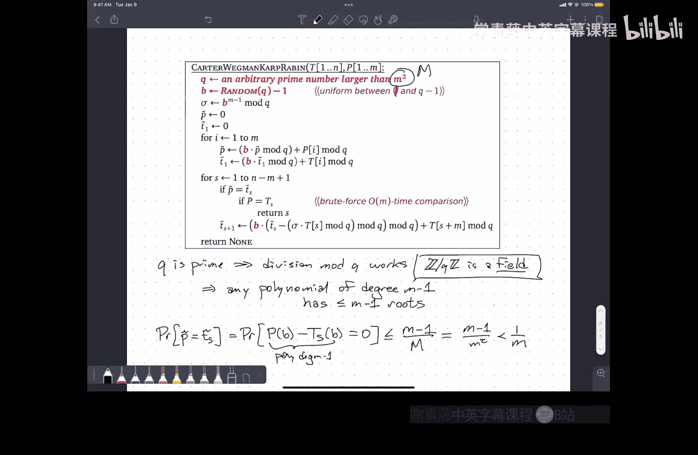

# 算法课程：CS473：字符串匹配与滚动哈希


在本节课中，我们将要学习如何使用滚动哈希技术来解决字符串匹配问题。这是一种高效的方法，能够在期望的线性时间内完成匹配，尤其适用于处理长文本和模式的情况。

---

## 概述

字符串匹配是一个经典的计算问题：给定一个长度为 `M` 的模式字符串 `P` 和一个长度为 `N` 的文本字符串 `T`，我们需要判断 `P` 是否是 `T` 的一个子串。本节课将介绍一种基于哈希的算法，它通过巧妙的数值计算和滑动窗口技术，避免了逐字符比较的高昂成本。

---

## 问题定义

基本字符串匹配问题定义如下：我们被给予两个字符串，一个称为**模式**，其长度为 `M`；另一个称为**文本**，其长度为 `N`。我们想要问的问题是：`P` 是否是 `T` 的一个子串？

例如，如果我想在美国宪法中搜索单词 “militia”，答案是肯定的，它出现在第二修正案中。如果我想搜索单词 “internet”，答案则是否定的。

---

## 暴力解法及其局限性

最直接的暴力解法是扫描文本的所有可能起始位置，并与模式进行逐字符比较。

以下是暴力解法的伪代码描述：
```python
for s in range(0, N - M + 1):
    equal = True
    i = 0
    while i < M and equal:
        if T[s + i] != P[i]:
            equal = False
        i += 1
    if equal:
        return s  # 找到匹配
return None  # 未找到匹配
```

该算法在最坏情况下的时间复杂度是 **O(M * N)**。例如，当模式是许多个 ‘A’ 后跟一个 ‘B’，而文本全是 ‘A’ 时，算法会在每个位置都几乎比较完整个模式后才失败，导致性能低下。

在实践中，对于像英文这样的文本，由于不匹配通常发生得很早，这个算法可能很快。但在某些领域（如基因序列分析，其中可能存在很长的重复字符段），这种最坏情况会频繁发生，使得暴力解法不可行。

---

## 数值化直觉与滑动窗口

为了改进算法，我们首先建立一个直觉：将字符串视为数字。

我们可以将模式 `P` 解释为一个十进制数字：
**P = Σ (10^(M-i) * P[i])**，其中 `i` 从 1 到 `M`。

同样，对于文本中从位置 `s` 开始的长度为 `M` 的子串，我们也可以计算其数值 `T_s`：
**T_s = Σ (10^(M-i) * T[s + i - 1])**，其中 `i` 从 1 到 `M`。

如果能在常数时间内进行任意精度整数的比较和算术运算，我们就可以设计一个线性时间的算法：
1.  预先计算模式 `P` 的数值。
2.  计算文本第一个子串 `T_0` 的数值。
3.  从 `s=0` 开始，比较 `T_s` 和 `P`。
4.  使用滑动窗口公式更新数值：**T_{s+1} = 10 * T_s - 10^(M-1) * T[s] + T[s + M]**。
5.  重复步骤3和4，直到找到匹配或遍历完文本。

这个算法的核心思想是维护一个在文本上滑动的“窗口”，并利用前一个窗口的数值快速计算下一个窗口的数值，而不是每次都从头计算。

然而，问题在于任意精度算术本身需要 `O(M)` 时间，因此我们并没有节省时间。

---

## 引入模运算与哈希

为了真正实现常数时间的窗口更新和比较，我们转向模运算。我们选择一个素数 `Q`，并对所有数值计算取模 `Q`。

现在，我们计算的是哈希值：
*   **P_mod = P mod Q**
*   **T_s_mod = T_s mod Q**

关键的滑动窗口更新公式变为：
**T_{s+1}_mod = (B * T_s_mod - B^M * T[s] + T[s + M]) mod Q**
其中 `B` 是我们的基数（之前是10）。为了确保结果在 `[0, Q-1]` 范围内，在编程实现取模运算时需要特别注意处理负数。

通过模运算，我们确实可以在常数时间内完成更新和比较。但引入了一个新问题：哈希碰撞。即，两个不同的字符串可能具有相同的模 `Q` 哈希值。

---

## 处理哈希碰撞：过滤与验证

为了解决哈希碰撞导致的误报，我们将哈希值用作一个快速过滤器：
1.  如果 `P_mod != T_s_mod`，那么子串肯定不匹配，我们可以安全地跳过。
2.  如果 `P_mod == T_s_mod`，则可能是一个真匹配，也可能是一个巧合（碰撞）。此时，我们需要进行一次**暴力验证**，逐字符比较 `P` 和 `T[s:s+M]`。

算法的总运行时间变为：**O(N + F * M)**，其中 `F` 是误报（碰撞）的次数。
我们的目标是控制 `F`，使得 `F * M` 与 `N` 同阶，从而整体保持 `O(N)` 的期望时间复杂度。

---

## 随机化以确保低碰撞率

为了从理论上保证误报的期望次数足够低，我们需要引入随机性。如果固定模数 `Q`，对手可以精心构造产生大量碰撞的输入。

拉宾-卡普算法采用了以下随机化策略：
1.  固定一个足够大的素数 `Q`（例如大于 `M^2`）。
2.  随机选择一个基数 `B`，范围在 `[2, Q-1]` 之间。

**为什么这样有效？**
当 `Q` 为素数时，将字符串视为以 `B` 为基数的多项式：**H(P) = Σ (B^i * P[i]) mod Q**。
两个不同字符串的哈希值相等，意味着 `B` 是某个非零多项式（次数最多为 `M-1`）的根。
根据有限域上的代数基本定理，一个 `M-1` 次多项式最多有 `M-1` 个根。
因此，在 `[2, Q-1]` 范围内随机选择 `B`，发生碰撞的概率至多为 **(M-1) / (Q-2)**。
通过选择 `Q > M^2`，我们可以将这个概率控制在 **O(1/M)** 以内。
这样，误报的期望次数 `E[F]` 就是 `O(N/M)`，代入总时间公式得到期望时间复杂度为 **O(N)**。

---

## 算法总结

本节课我们一起学习了基于滚动哈希的字符串匹配算法（拉宾-卡普算法）。其核心步骤总结如下：
1.  **预处理**：选择一个素数 `Q > M^2`，并随机选择基数 `B ∈ [2, Q-1]`。
2.  **计算模式哈希**：计算模式 `P` 的哈希值 `hash_P`。
3.  **计算初始文本窗口哈希**：计算文本前 `M` 个字符的哈希值 `hash_T`。
4.  **滑动窗口匹配**：
    *   如果 `hash_P == hash_T`，进行暴力验证。如果匹配成功则返回位置。
    *   使用公式 **hash_T = (B * hash_T - B^M * T[s] + T[s + M]) mod Q** 更新下一个窗口的哈希值。注意处理负数的模运算。
    *   滑动窗口，重复此过程直到文本末尾。



该算法在期望情况下具有 **O(N)** 的时间复杂度，并且易于实现。它巧妙地结合了数值哈希的快速性和随机化带来的理论保证，是解决字符串匹配问题的有力工具之一。在下节课中，我们将看到另一种不依赖于随机化的经典字符串匹配算法。