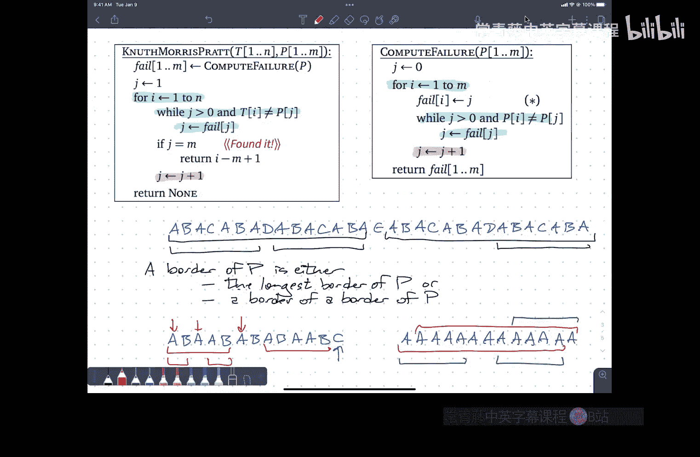

# 算法课程：第16讲：通过精心设计的失败函数进行字符串匹配


在本节课中，我们将学习一种确定性的字符串匹配算法——KMP算法。我们将探讨如何避免暴力匹配中的冗余比较，并介绍一个关键的“失败函数”来指导匹配过程，从而实现线性时间复杂度的搜索。

---

上一节我们介绍了使用滚动哈希的随机化字符串匹配方法。本节中，我们来看看如何确定性地解决这个问题，并深入理解KMP算法的核心思想。

## 算法动机：避免冗余比较

考虑在文本中搜索模式“abracadabra”。暴力算法会尝试每一个可能的起始位置，并进行逐字符比较，直到发现不匹配。然而，这种方法存在浪费。

例如，当模式的前几个字符与文本匹配，但在某个位置（比如第五个字符）出现不匹配时，暴力算法会将模式向右滑动一位，并重新从模式的开头进行比较。但我们已经知道文本中那个位置的字符（比如是‘B’）与模式第一个字符（‘A’）不同，因此这次比较是多余的。

核心思想是：**利用已经匹配成功的部分信息，智能地跳过那些必然会导致不匹配的起始位置**。

## KMP算法核心：失败函数

KMP算法通过一个预计算的“失败函数” `fail[j]` 来实现智能滑动。这个函数定义了当在模式的第 `j` 个字符处匹配失败时，下一步应该尝试与模式的第 `fail[j]` 个字符进行比较。

失败函数的定义基于“边框”的概念。一个字符串的**边框**是指一个既是其真前缀又是其真后缀的子串。对于模式 `P`，`fail[j]` 的值是：**子串 `P[1..j-1]` 的最长边框的长度加1**。

用公式表示，即寻找最大的 `k < j`，使得：
`P[1..k-1]` 是 `P[1..j-1]` 的一个后缀。
那么 `fail[j] = k`。

## 算法流程

以下是KMP搜索算法的主循环伪代码。假设我们已计算出失败函数 `fail[1..m]`，其中 `m` 是模式长度。

```
function KMP_Search(text T[1..n], pattern P[1..m]):
    j = 1 // 指向模式的指针
    for i = 1 to n do // 指向文本的指针
        while j > 0 and T[i] != P[j] do
            j = fail[j] // 匹配失败，根据失败函数回退j
        end while
        if j == m then
            return i - m + 1 // 找到匹配，返回起始位置
        else
            j = j + 1 // 字符匹配成功，两个指针都前进（i在for循环中前进）
        end if
    end for
    return "Pattern not found"
```

**算法工作原理**：
*   指针 `i` 在文本上单向向前移动。
*   指针 `j` 在模式上移动。当字符匹配时，`j` 前进；当不匹配时，`j` 根据 `fail[j]` 回退。
*   当 `j` 回退到0时，意味着当前文本字符 `T[i]` 与模式的任何前缀起始都不匹配，`i` 前进，`j` 重置为1。
*   当 `j` 等于 `m` 时，意味着找到了完整匹配。

## 计算失败函数

失败函数本身也可以用类似KMP的方式在线性时间内计算出来，这体现了算法的自引用之美。

以下是计算失败函数的伪代码：

```
function Compute_Failure(pattern P[1..m]):
    fail[1] = 0
    j = 0
    for i = 2 to m do
        while j > 0 and P[i] != P[j+1] do
            j = fail[j]
        end while
        if P[i] == P[j+1] then
            j = j + 1
        end if
        fail[i] = j
    end for
    return fail
```

**直观理解**：这个过程相当于**将模式串本身既当作文本又当作模式**，进行自我匹配，从而找出每个位置前缀的最长边框。

## 时间复杂度分析

KMP算法的时间复杂度是线性的。

*   **搜索阶段**：在 `KMP_Search` 函数中，`i` 从1增加到 `n`。虽然内部有 `while` 循环，但注意 `j` 的值变化。每次成功匹配（`T[i] == P[j]`）会使 `j` 增加1，这最多发生 `n` 次。每次失败回退（`j = fail[j]`）会使 `j` 减少。由于 `j` 每次增加1，它减少的总次数不可能超过增加的总次数。因此，总比较次数为 `O(n)`。
*   **预处理阶段**：`Compute_Failure` 函数使用相同的分析，其时间复杂度为 `O(m)`。

因此，KMP算法的总时间复杂度为 `O(m + n)`。

## 总结



本节课我们一起学习了KMP字符串匹配算法。我们首先指出了暴力匹配的冗余性，然后引入了“失败函数”的概念来指导模式滑动，从而跳过不必要的比较。我们详细讲解了算法的流程、失败函数的定义及其线性时间的计算方法，并分析了算法整体的线性时间复杂度。KMP算法是一个经典且高效的确定性字符串匹配算法，它巧妙地利用模式本身的信息来加速搜索过程。