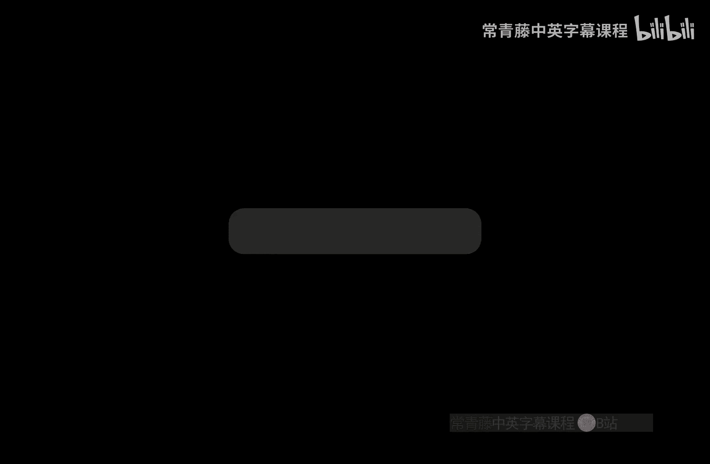
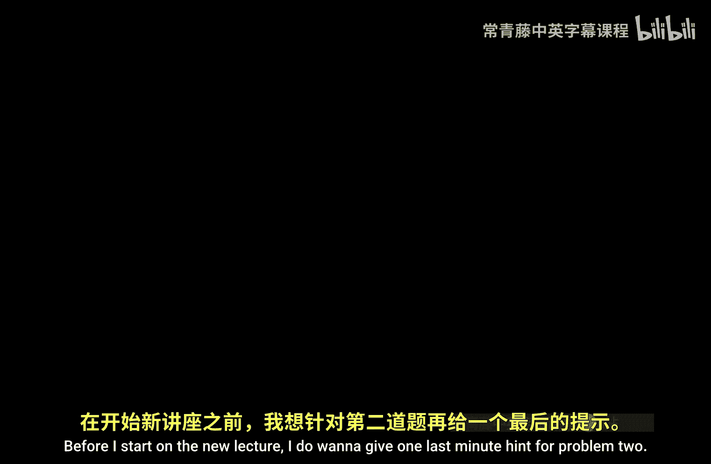
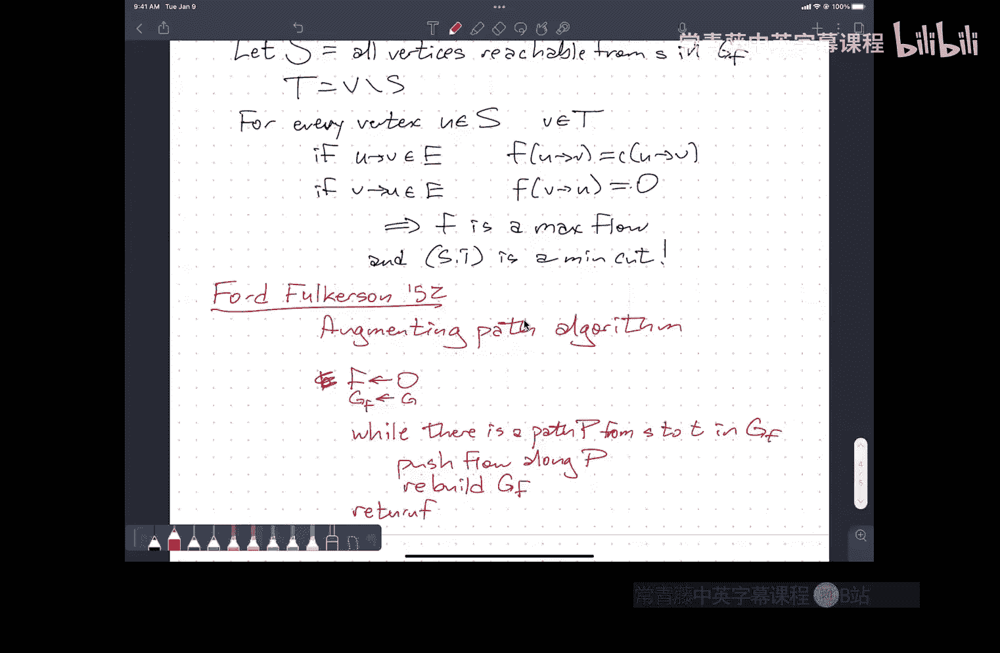

# 伊利诺伊大学【中英⚡算法｜CS473 Fall 2022 Algorithms】 p17 P17 16 max flow -BV1RdBTBrEdx_p17-

。

Okay， let's。Let's go ahead and get started。Before I start on the new lecture。

I do want to give one last minute hint for problem 2。

So a lot of you have come up with the idea to solve problem two by modifying the Kthmore's failure function。

There is a correct solution that does that that uses a modified failure function。

But you also will need to compute the original failure function。

So if you try to build the modified failure function in terms of itself。

 the way the failure function is defined in terms of itself， that actually won't work。

So even if your code looks like build the fail。😡，And you try to like change one line。

I don't believe that will work anymore， it's instead you'll compute the failure function and this new function at the same time。

That's not the only way to solve the problem。😡，嗯。U you can also。

 there's a way to solve it where you just compute the failure function as a whole and then do some linear time post processing。

but either Weley， you are going to have to compute the original failure function in order to get a linear time solution for that。

 as far as I know。😡，Right。Yes。嗯。Write down the end log n time solution first。Okay。Okay。嗯。

That's as much as I wanted to say about homework problem too。

Are there any other administrative or logistical questions？Okay， so。Humwork seven is out。😡。

It's about flows。Which we're going to talk about over the next three lectures。

This will be the last homework before midterm two。😡。

Midterm two will cover the same material as homeworks， four， five， six， and seven。

More or less the same structure as。Oh。Midterm one。Only the problems will be numbered  one，2， four。

 and 5。To avoid having a problem three。You just won't have a problem three。On the turn too。Um。

There have been some adjustments to the grading rubrics for midterm one。

 you may notice small upward creep in your midterm solutions， even if you didn't submit。😡。

A re request。嗯。That。Is likely to continue happening over time as people submit re grade requests and we reevaluate how we graded things。

Okay。So flows。U。So。Where're。Going to go back to somewhat more familiar territory。

Where you're given a thing as input and you want to compute a thing as output。😡。

And the thing that you're given is a graph with some data attached to it。

 and the thing you want to compute is some structure within that graph。😡。

So you've seen examples of this in。Several prerequisite courses， so 225。

 you probably saw minimum spanning trees。And Dkester's algorithm 374， it's a Dexter again。

 Bellman Ford， another shortest path algorithm， Floyd Warshad， all pair shortest path algorithm。U。

Those structures that you're computing。Shortest paths， minimum spanning trees。Those are subgraphs。

 You're trying， you're given a graph and you want to pull out some subset of the edges。

And they're connected vertices that satisfy some optimality property。U。

That's not exactly the kind of structure we're going to be looking for here。

 We're going to be looking for something a little bit more。Fluid。

So before I give you the concrete definitions。Let me。Giving you a history lesson。

 so this is a map of Eastern Europe。So in the 1950s， coming out of World War II。

 the United States government realized during World War II， actually。

 that really we don't trust those people over in Moscow。😡。

And over the 1950s it became we don't trust to we hate and fear and we're going to build atomic bombs to defend against those people over in Moscow this is a map of the Warsaw pact countries somewhere up in here。

😡，Each of these cities represents。Well， really each of these cities represents a region。

 but usually the circles are placed over population centers so here is East Germany。

Helpefully placed directly on top of Berlin。嗯。Here is。no。Here's Russia somewhere over here。U。

I don't know my Russian geography well enough somewhere over here there's a circle that means St Petersburg somewhere over here。

 there's a circle that means Moscow。😡，I believe this bee over here on the left is Budapest， maybe。

But。These circles represent cities。The numbers are just labels， they're just identifiers。😡。

Now the edges between。These cities are labeled with two numbers。😡，The number in the box。

Is the number of trains that go from one city to the other in a single day think of it as the capacity of the rail system。

 so 23 trains， there's like 23 rails going between these two cities so in principle 23 trains a day can go between city B and city M。

😡，嗯。The numbers outside the boxes and the arrows。Show a particular schedule for trains。

To move some sort of material。😡，Which I suspect may be。Oh， come on， soldiers。There we go。

 why is this acting up？Coming from over here on the right side where it says origins。😡。

That's where the soldiers are mined out of the soldier minds。😡，Sorry。

 that's where the crystal gems are mined out of the kindergarten。嗯。

And then theyre sent over to East Germany。😡，Where there's a small little pocket of Western Europe。

Inside a wall that has now been broken down。Turned into tourist attractions with major sections。

 a completely covered chewing gum。It's really quite odd。So I want to ship。嗯。

H grenades or pornography or something from Moscow to Berlin。So I'm going from 2 S to 4E on the left。

 I could send 30 trains down that line in either direction。😡，But to be concrete。

 I'm going to send 22。😡，Trains going west southwest。😡，Now。

 if you look closely at any particular city that isn't one of the origins or the destination east Berlin。

😡，You'll notice that the amount of stuff。Flowing into that city。

Is equal to the amount of stuff that flows out of that city。 So if I look here at city 7。

Going into the city。I have 22 units here， I have 10 units here， I have six units here。

 and I have four units here。That adds up to 42。And I have 13 units flowing out there and 29 units flowing out there。

 that also adds up to 42。So we're trying to get all of the stuff over to East Berlin。

 it doesn't make any sense to have extra stuff flowing into this intermediate city and by definition。

 all of the stuff is produced at the sources， so it also doesn't make sense to have more things leaving this city than come in。

😡，Thanks。So。This is an example of。Maximum flow problem。系。😊，So the input consists。😡。

Of the directed graph。Typically with two special vertices， a source labeled S and a target labeled T。

Each edge has a number attached to it that's greater than equal to zero called its capacity。😡。

And you want to compute a second number attached to every edge。😡，Called the flow value。

That satisfies this conservation constraint。😡，So whatever flows into an intermediate vertex also flows out。

😡，So in this simpler example， the first number attached to the edge is the flow and the second number attached to the edge is the capacity this is just sort of standard notation。

😡，Not my standard notation， everybody's standard notation for describing a flow in a flow network。

So the edges on the left leaving S， the top one has capacity 20。

 and it has 10 units of flow going down it， the bottom one has capacity 10。

 it has zero units of flow going down。😡，So we're given。A graph G。That's directed。嗯。We are also given。

Sorry， let me see if I can move this guy。Yes， good。We're also given a。Capacity function。

Which is usually called C， this is a function from the edges to the non negative reels。Um。

 although it turns out it doesn't really make much sense to have edges with capacity zero。

 it's just like the edge isn't there。😡，And。Two vertices。sourceur。S and。Target T。Okay。😊，We want。Well。

 what we want is what's called the flow。This is another function。

From the edges to the non negative reels。Um that。Satisfies。AConservation constraint。

Just it every vertex V。The float。Interve。Equals。The flow out of thee。

That's not going to be necessarily true at。😡，The terminal veres S&T。

So any function that satisfies this conservation constraint。诶。

Or what's sometimes called a balance constraint is a flow。嗯。

I also need that the flow along every edge is。Between 0 and its capacity。I guess since I'm。Defining。

My target to have these constraints， I don't need to put the non negative in the definition。

 so a flow that satisfies these constraints is said to be feasible。So this is。Conservation。This is。

Seeaible。And we also want to。Maximize the value of the flow。So the value of the flow is。

The total amount of stuff that leaves the origin leaves the source S。😡。

And because everything else is balanced， this is also going to be equal to the total amount of stuff that gets to the target gets to the destination。

😡，Right， so。This is how many trains we can send per day。

 our flow says this is how many trains we're going to send every day。

 the value of the flow is how many train trainfuls of stuff。😡，Enter East Blet。Yeah。Okay。

 so the value of the flow。isSometimes we're going to use the notation absolute value of F。

 this is defined as the total net flow out of S。😡，Okay， so this is the sum overall W。

 the flow from S to W。Its not doesn't appear in this example。

 but it is possible for a flow network to have edges going into S S is not a source in the same way that you have a source in a Dg。

 it's just the source of the flow to where the flow is produced。😡，Likewise。

 T is not necessarily a sink， it's just the target of the flow。😡，So to really be pedantic about this。

 I have to subtract off。😡，Any flow that might go into the source。So， this difference。

Is the total amount of extra stuff that's produced at the source？😡，Most of it goes out。

 some of it might come back in。Cancel out stuff that left。咁。And again， because of conservation。

 this is also equal to。The total net flow。嗯。Going into。T， and again。

 there might be non zero flow leaving T， but it just cancels out stuff coming in。😡，So。The inputs。

Are not that different from other kinds of things that you've seen before in particular。

 if I just use the word weight or length for that capacity function。😡。

That's the same input that you might use for a shortest path problem。😡，exceptcept there。

 the thing you're looking for is a single path， say from S to T with a sum of the weights。😡。

Is as small as possible。Now I'm really looking for some function that smears out over the entire graph。

So you should one useful。Physical analogy is think of the edges。As pipes carrying water。

Every pipe has a rating， I can push so much water through this pipe per second before the pressure exceeds the structural capacity of the pipe and the pipe breaks。

So I can push through this edge going upwards from S。

 I can push say 20 liters a second if I try to push any more water through that pipe。

 it's going to break。Um，And at any， any junction between pipes。That isn't the source of the sink。

Any water that goes in has to go back out， otherwise I'm either going to have a buildup of water pressure and something's going to explode or I have a buildup of vacuum。

 anti water pressure somehow， and it's going to implode。😡，嗯。And I've attached a hose over here to S。

And I have an outflow thing at T， and I want to know how much water I can push through the system of pipes。

😡，So every pipe。We'll have every individual pipe willll have a certain amount of water that goes through it。

And how much water goes through is under my complete control。 I've got like weird。

 controllable valves here at the junctions that say， oh，10， come in。

 send five north and five northeast。😡，If you try to do this with real water and real pipes。

Different things will happen。U。If you prefer to think about， you know as an electrical engineer。😡。

You can kind of think of flow as current。And then you have Kerrkch's laws that say current into a node has to be equal to current out of that node。

Um， there's some problems with that analogy in that you don't get at every node to decide how the current is split。

😡，Current naturally distributes itself to the network to minimize energy loss through heat dissipation。

That's a different problem。😡，But at least if that's a way to understand the conservation constraint。

 then it's a good thing to keep in mind。Okay， so this is a rather heavy definition。嗯。

Do people have questions？😡，So just a sanity check。What's the value of this flow？

10 there's 10 units of flow coming out of S， no units of flow coming in， 10 of0 is 10。

There's 10 units of flow going into T。And no units of flow going out。So 10 minus zero is 10。

Now I'm going to ask a more subtle question。😡，Is this a maximum flow？对。Okay。

 the correct answer came from over here。😡，It's not a maximum flow。

 And part of the reason for that is。😡，When somebody standing in front of the classroom says。

 are we done， the answer is probably no。But I'll see shortly why this is not a maximum flow。😡。

And how to get from here to a maximum flow。😡，But before we do that。

 I want to introduce the maximum F problems Evi twin。😡，Okay， so this is sparkock without a beard。😡。

哈哈。😊，这你手机。So if you look very closely at the map。You'll see。The bottleneck。😡，Now。

 Harrison Ross were old military men。 I'm sorry， I've forgotten their first names。

 They prepared this particular map。As part of a technical report at RandD。

 Rand was a government funded in particular military funded research lab slash think tank。

 where a ridiculous amount of algorithms research happened in the years between 1952 and 1956。😡。

This is where Dyexter's algorithm came from， this is where Belman Ford came from。

 this is where I believe Kescoll's algorithm came from， this is where dynamic programming came from。

 this is where linear programming came from a lot of stuff happened in a very short time。

 this particular map and the technical report that was attached to it was classified。😡，Until 1999。

When an optimization researcher named L Schhriver in Amsterdam wrote to the US government said。

 " I know this map exists。Could you please declassify it so I can use it？And they said， okay， fine。

The walls fallen。They're not our enemies anymore。But the bottleneck is this line。

Going through the map。And the question that the bottlenek is， the answer to is。

What is the minimum amount of rail capacity that we would have to destroy？You're right。

 so that you can no longer send stuff from Moscow to Berlin。So I want to break these edges。😡。

And the edges that cross this red line and the cost is one for every unit of rail that I destroy。

 so I'm breaking， for example， down here between Romania and Hungary I think I said that with Budapest that can't be right Romania and Hungary。

 there's 19 units of rail capacity here， so breaking this connection requires 19 bombs。😡。

Bobbs are expensive， so I want to use as few of them as possible。😡。

But I also really don't want stuff to get from Moscow to Berlin。Okay。嗯。So。This is。

What's called the minimum cut problem。Okay， so the input is exactly insane。

You're given a directed graph with capacities on each of the edges。

 there's a special vertex S and special vertex T。But now what you're trying to do is you're trying to separate the vertices into two subsets。

😡，A subset capital S that contains the source and a subset capital T that contains the target。Okay。

 so this is called a cut。So， a cut。Is want to。Partition。V into Ss disjoint Union T。

Every vertex is in one of these two sets and only one。😡，Now， the capacity of a cut。

Is the amount of stuff that you can push from one side of the cut to the other。But specifically。

 it's the amount of stuff that you can push out of capital S and into capital T。

 so the capacity of this cut。😡，Which I'm going to write as double bar S commee。

This is the sum over all edges。Where U is in S and V is in T of the capacity of this edge from U to V。

So。On the screen， there is a。Cut with capacity 15， the two red edges are going out of capital S and into capital T。

 The fact that there is another edge going from capital T to capital S is completely irrelevant。😡。

The train is going in the wrong direction。Moscow doesn't need more soldiers。😡。

So the fact that if I blow up the red lines。😡，U I can still， in principle。

 send stuff from this part of the world to that part of the world doesn't matter because I'm trying to get stuff to teeth。

😡，嗯。The edges are directed because it simplifies talking about it。

Right when we start talking about residual graphs and I start reversing edges。sI mean。

 you can do all of this with undirected graphs， but really then you need to think of every undirected edge as two directed edges。

😡，One going forward and one going back， but then when I start。

 you'll see why in a second when I start doing residual things。

Having reverse edges already there just makes things more complicated。😡。

I'm being nice to you by making the edges directed。😡，诶。Yes， in the original graph。

The edges were undirected。The directions were part of the flow assignment。

So I'm assuming for our purposes that the directions of the edges are already given。😡，O。All right。

 and I want this to be as small。As possible。so maximum flow。

 I'm trying to assign flow values to the edges that satisfied this weird conservation constraint。

 and I want the value of the flow to be as big as it can possibly be。😡，For the minimum cut problem。

 I'm just trying to decide for every vertex whether it should be on the source side of the cut or the target side of the cut。

😡，And I want to make that choice so that the capacity of the cut is as small as possible。😡。

The number of bombs I need to blow up the edges is minimized。😡，系。Now。

Really powerful theorem attached to these two problems is that they have the same answer。

And by the end of class today， we'll actually see proof of this。

The so called max flow Min cut theorem， the value of the maximum flow through any flow network and the capacity of any minimum cut in the same flow network are identical。

😡，They're exactly the same。Maximizing one thing is the same as minimizing the other thing。😡，Right。

So I'm going to approach this slowly， but before I do that I need again to stop and make sure that people understand the definition of the thing that we're looking for。

😡，Okay。Yeah， where are we saying。You want to ensure a cut mix it so that there's no pet to see or is this to mean that's the definition of it that's the definition of a cut right Oh sorry no。

The definition of a cottage is just a partition of the vertices。

TheWhen I say the edges that cross the cut， I mean the edges that go out of capital S and into capital T。

 those are the edges in red。😡，If I delete those edges from the graph。😡。

Then there is no way for stuff in S to get into T， so that means there's no way for stuff starting at little S to flow all the way to little T。

😡，Okay。So。The infamous。Max flow。Min caught theorem。Says that the。Max。Valid flow value is the same。

As the E minimum cut。So the maximum value among all feasible flows。

Is identical to the minimum capacity among all cuts。😡，For the same flow network。嗯。😊，And。😡。

The proof of this theorem。Ends up showing you an algorithm for computing both maximum flows and minimum cuts。

😡，系y。And the only way that I know to prove that that algorithm works is by proving this theorem。😡。

You mightight as well introduce them at the same time。嗯。So what I'm gonna do first。Is。

Show the easy direction。So I'm going to show that。😡，If I pick my favorite flow F。

 favorite feasible flow F， and my favorite cut ST that the value of F is less than or equal to the capacity of T。

 yes。😡，This one is not the right said。Yes， so this is an example of there's a flow and a cut and the flow has smaller value than the cut's capacity。

It would typically be only for the next。So the cut here has no， this is just a function of the graph。

😡，It's not a function of any particular flow。The flow values aren't in the picture。

Now it turns out that once you have a maximum flow in hand。😡。

You can immediately extract a minimum cut from it。Um it turns out this is a minimum cut。

And therefore， by the max F and cut theorem， there is a flow with value 15。Through this flow network。

嗯。And you might even be able to find it if you just sort of stare at the graph for a little bit。Okay。

 send。Send 10 units to flow this way， five units to flow that way and ignore the stuff in the middle。

That's a flow with value 15。Um， so I've found a flow in a cut that have the same values。

Then I have a maximum flow and I have a minimum cut according to this theorem。Okay。So， but let's。

 you know， it's always easy to be distracted by small examples。

 so let's walk carefully through the proof because not because you enjoy watching me do algebra。

 but because the proof well pieces of the proof will jump out，And， and。Show you something about。

The algorithm later on。Okay so pick。Any feasible flow。F and。Any cuts？St。Okay。

 and so I'm going to start by saying， okay， what's the value of this flow？Well。

 the value of the flow is。The total amount of stuff flowing out of us。You2 us。All right。Now。嗯。

Other vertices in capital S have flow going into them and flow going out of them， but。

Those flow in and flow out some to zero because F is a flow I conservation， so I could add。

Over on this left sum， instead of just considering all the flow that comes out of little S。

 I consider all the flow that comes out of any vertex in capital S。😡，And in the second sum。

 instead of only thinking about flows that go into little S。

I could write all the flow that goes into any vertex in capital S and I've added and subtracted the same amount of flow so that the net effect of this is going to be no change to the expression。

😡，So I can write this as some overall V in capital S。Some of her W flow from S to sorry。

 V to W minus。Some of V in capital S。Some over you。😔，Slow from U to V。This is just conservation。嗯。

But now I'll notice that。Any edge。That's inside us。Completely。That flow value shows up。😡。

Once in this thumb on the left。😡，And once in the sum on the right， and they cancel each other out。

The only edges that contribute anything interesting to this summation are edges that have one vertex in capital S and the other vertex in capital T。

😡，Hey。😊，So that means。I can change。The limits。Instead of being over all vertices。

 W in the entire graph or all vertices U in the entire graph， I only need to think about。

Vertices in capital T。嗯。All right， so the first sum is counting all of the flow that's going from capital S to capital T。

 and the second is counting all of the flow that's going from capital T to the capital S。😡，Okay。

So first。Inequality。We'll leave this step alone。Stop。😡。

Every one of these flow values over here in this right summation， because the flow is feasible。

 every one of those flow values is greater than equal to zero。😡。

So that sum is greater than equal to zero， and I'm subtracting it off。 So if I just delete this。😡。

I'm adding some non negative value to the expression。😡，All， so this is。啊。

Because flow is greater than equal to zero， I get this inequality here。That inequality becomes tight。

 it's an equality， it's an equation， if and only if all of the edges that cross the flow backwards have flow value zero。

 which happens sometimes。😡，But not always。Second， inequality。This is going to be the sum over VNS。

 sum over W。In T of the capacity of the edge going from V to W。 And this is because。

Flow is less than equal to capacity， that's the other half of the definition of feasible。

Every edge that crosses the cut in the right direction has a flow value that's less than or equal to its capacity。

 because the flow is feasible。And this is the definition of the capacity of the cut。

That second inequality is an equation。If and only if。

Every edge flowing forward across the cut is saturated。

 meaning the flow value is equal to its capacity。😡，Okay。😊，So。

One of the things I get chasing follow the bouncing ball through the inequalities。

 I used actually every piece of the definition。So here I used conservation。呃。

Here I use the definition of the value of a flow， here I use the definition of the capacity of a cut。

So every piece of the definition went into this proof。U。

But one of the things this already implies is。If I find a flow。😡，And a cut that have the same value。

Then the flow is a maximum flow， there's no bigger flow because if there were。

 then I'd have a flow whose value is bigger than some cut。😡，And this must again。

 if those two things are equal， the cut must be a minimum cut because if I had a smaller cut。

 it would violate this inequality as well。😡，But the only way I can have a flow and a cut that have the same value is if these two inequalities。

Are both equal。Every edge going forward across the cut is saturated。

 every edge going backward across the cut is empty。😡，Okay。

 so this gives me a way of at least noticing when I have a max flow and a min cut。😡。

So let me actually write this down。So one implication is if the value of the flow is equal to the capacity of the cut。

Then。F is a。Max flow。And ST is a min。Cut and F of UVv equals C of UVv。For all you in S。V and T。

And F of U V equals 0。For all U in T B in S。These are all just consequences of that previous theorem in its brief。

Okay。At this point， again。I need to stop。Because this is a lot to absorb。

Make sure there are any questions that I can answer about this。Yes。

So look at the first inequality in this proof。😡，The first inequality。

 I took the flow values on the edges going from capital T to capital S， and I said。😡。

Those are at least zero。So I can remove this term from the expression and value would go up or stay the same。

In order for it to stay the same， every term in that expression must be equal to zero。😡，Yeah。Okay。😡。

So when I went from line one to line two。Right so。This is the part where I'm using conservation。

So the first line， what I have is all the flow out of this one vertex minus all the flow into this one vertex。

😡，What I've done in the second line is I've added in。

The flow out and subtracted the flow into other vertices in the set capital S。😡。

But by conservation for each of those vertices， the flow in equals the flow out。

So by adding the flow in and subtracting the flow out， I've added zero。😡，Right。

So that's why there's always a quality here。No。No， this only proves that max flow is less than or equal to Min cut。

😡，It's still possible。😡，That there's a gap between the maximum flow and the minimum cut and in fact。

 there are variants of the max flow problem where there is a gap， so in particular if you insist，😡。

That you only care about。Um u。Blows that have integer values。

But you allow your capacities to include numbers like a half and a third。

Then there is a gap you can't actually close the gap between the flow and the cut or if you allow two different kinds of。

😡，Resources。I want to send missiles and I want to send guns on one train and bullets on another train。

And I insist that they go on like different paths。This can also be phrase thiss kind of a max flow problem it's called multi commodity flow。

 again， there's a gap between the flow and cut values that would get out of that。

So this is something special about this particular problem that you get a match。あパ。可。

How do we know in the next equation the the edges would be capable enough to add those edges I'm not sure I understand。

