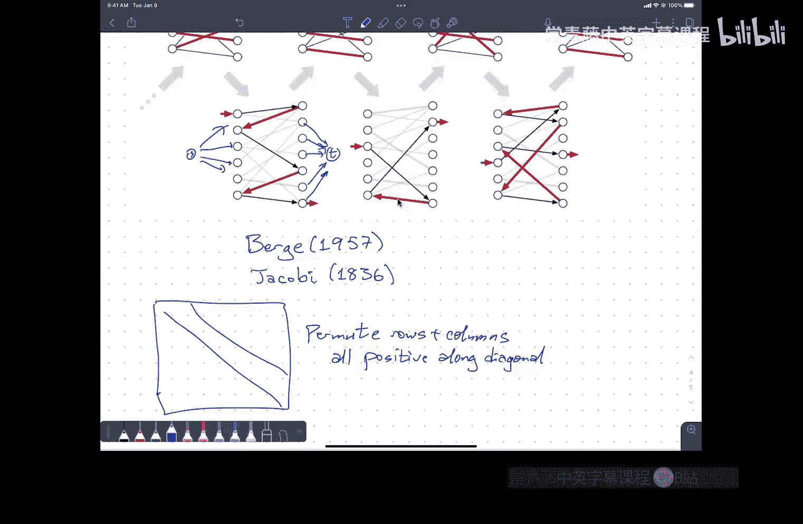

# 算法课程：第19讲：最大流应用


在本节课中，我们将学习如何将最大流算法作为“黑盒”工具，来解决其他看似不相关的问题。我们将重点探讨两个经典应用：边不相交/顶点不相交路径问题，以及二分图最大匹配问题。

---

## 课程概述与期中考试安排

下一周一是期中考试二。考试将涵盖自期中考试一以来课堂上学到的所有内容，具体包括作业四、五、六、七。尽管我们今天要讲的内容尚未出现在作业中，但由于这部分内容易于出题，因此也会被纳入考试范围。

考试结构与期中考试一相同：共有四道题目，允许携带一张单页（可双面手写）的“小抄”，考试时长为两小时。考试地点与期中考试一相同。考试时，我会在答题册背面提供公式表。

关于考试安排的重要信息：
*   考试时间为下周一。
*   周四没有常规课程，将进行考前复习，讲解模拟试题。
*   如需参加冲突考试，请在周二参加。请务必在周五前通过课程网页上的表格登记。
*   如需任何考试便利安排，请确保我已收到相关证明文件。

---

## 应用一：边不相交路径问题

上一节我们介绍了最大流问题的基本框架，本节中我们来看看如何用它来解决一个具体问题：在有向图中寻找从源点 `s` 到汇点 `t` 的**边不相交路径**的最大数量。所谓边不相交，是指任意两条路径不共享同一条边。

### 问题建模与算法

解决此问题的核心思想是将原图转化为一个流网络。

以下是具体步骤：
1.  **构建流网络**：给定有向图 `G`、源点 `s` 和汇点 `t`。将 `G` 中的每条边的容量设置为 **1**。
2.  **计算最大流**：在这个新构建的流网络上，计算从 `s` 到 `t` 的最大流的值 `f`。
3.  **提取路径**：最大流的值 `f` 就等于边不相交路径的最大数量。要获得这些路径本身，可以对计算出的整数流进行**流分解**。

### 算法原理与复杂度分析

为什么这个方法是正确的？
*   由于所有边容量均为整数（1），因此存在整数最大流。
*   在整数最大流中，每条边上的流量值只能是 0 或 1。
*   流量值为 1 的边构成了从 `s` 到 `t` 的路径。因为每条边容量为 1，所以这些路径必然是边不相交的。

关于算法运行时间：
*   使用 Ford-Fulkerson 算法时，每次增广需要 `O(E)` 时间。
*   最大流的值 `f` 最多为 `min(deg_out(s), deg_in(t))` ≤ `O(V)`。
*   因此，总运行时间为 `O(V * E)`。
*   流分解同样需要 `O(V * E)` 时间。

所以，整体算法的时间复杂度为 **`O(V * E)`**。

### 扩展到无向图与顶点不相交路径

**对于无向图**：只需将每条无向边替换为两条方向相反的有向边，并为每条有向边设置容量 1，然后应用上述算法即可。如果算法产生的流中包含了方向相反的一对边（形成一个 2-环），可以安全地移除这个环，这不影响流的值和最终路径的数量。

**对于顶点不相交路径问题**：我们希望路径除了端点 `s` 和 `t` 外，不共享任何顶点。这可以通过引入**顶点容量**的概念来解决。

我们修改流网络，为每个顶点 `v`（除 `s` 和 `t` 外）设置容量 `c(v)`，表示流经该顶点的流量上限。为了在现有算法框架内处理顶点容量，我们使用一个经典的图变换技巧：

**顶点拆分**：将每个顶点 `v` 拆分为两个顶点 `v_in` 和 `v_out`，并添加一条从 `v_in` 指向 `v_out` 的有向边，其容量即为该顶点的容量 `c(v)`。所有原图中指向 `v` 的边，现在指向 `v_in`；所有从 `v` 指出的边，现在从 `v_out` 指出。

通过这个变换，顶点容量约束就转化为了这条内部边的边容量约束。之后，我们就可以在变换后的图上运行标准的最大流算法。

对于顶点不相交路径问题，我们只需为所有中间顶点设置容量 **1**，然后进行顶点拆分并计算最大流即可。

**更一般的情况**：如果我们要求每条边最多被 `a` 条路径使用，每个顶点最多被 `b` 条路径使用，只需在构建流网络时，设置所有边容量为 `a`，所有顶点容量为 `b`，然后进行顶点拆分并计算最大流。

---

## 应用二：二分图最大匹配

本节我们来看最大流的另一个重要应用：在**二分图**中寻找**最大匹配**。二分图是指顶点集可以划分为左右两个部分（`L` 和 `R`），所有边都连接一个 `L` 中的顶点和一个 `R` 中的顶点。匹配是边的一个子集，其中任意两条边没有公共顶点。最大匹配是包含边数最多的匹配。

### 通过最大流求解匹配

我们可以将二分图最大匹配问题归约为顶点不相交路径问题。

以下是构建流网络的步骤：
1.  **添加超级源点和汇点**：添加源点 `s` 和汇点 `t`。
2.  **连接源点和汇点**：从 `s` 向 `L` 中的每个顶点添加一条有向边。从 `R` 中的每个顶点向 `t` 添加一条有向边。
3.  **处理原图边**：将原二分图中所有无向边，定向为从 `L` 指向 `R`。
4.  **设置容量**：将**所有**边的容量设置为 **1**。

在这个新流网络上计算从 `s` 到 `t` 的最大流。最大流的值就等于原二分图中最大匹配的边数。匹配中的边对应于那些从 `L` 指向 `R`、且流量为 1 的边。

### 交替路径视角

如果我们观察在此特定流网络上运行 Ford-Fulkerson 算法的过程，可以得到一个直接在原二分图上操作的等价算法，即**交替路径增广法**。

定义：对于当前匹配 `M`，一条**交替路径**是一条路径，其边在属于 `M` 和不属于 `M` 之间交替，并且路径的起点和终点都是未匹配的顶点。

算法流程如下：
```
While 在二分图 G 中存在关于当前匹配 M 的交替路径 P:
    M = M ⊕ P  (对称差操作：将P中的边加入M，同时移除P中已在M里的边)
```

每次找到一条交替路径并执行对称差操作，都会将匹配的大小增加 1。当不存在交替路径时，当前的匹配就是最大匹配。

这个算法的运行时间是 `O(V * E)`，因为最多进行 `O(V)` 次增广（每次增加一条匹配边），每次寻找交替路径需要 `O(E)` 时间。

### 不同的视角与历史注记

最大匹配问题可以通过多种视角理解：流网络、交替路径、甚至是更古老的组合数学方法。例如，早在1836年，数学家 Carl Gustav Jacobi 就在研究微分方程组时，描述了一个本质上等同于交替路径法的算法来解决一个相关问题。

这些不同的视角揭示了算法背后统一的思想，也为我们提供了灵活解决问题的工具。选择哪种视角取决于个人的直觉和问题的具体情境。

---

## 课程总结

本节课中我们一起学习了最大流算法的两个经典应用：
1.  **边/顶点不相交路径问题**：通过设置边容量为 1（或进行顶点拆分处理顶点容量），将问题转化为标准最大流问题。
2.  **二分图最大匹配问题**：通过添加超级源汇点、设置所有边容量为 1，将问题转化为最大流问题。我们还探讨了与之等价的交替路径增广算法。



关键在于，许多看似不同的问题可以通过巧妙的图变换，规约到我们已经掌握的最大流/最小割模型上，从而利用现成的算法黑盒高效求解。这种建模能力是算法设计与分析中的重要技巧。