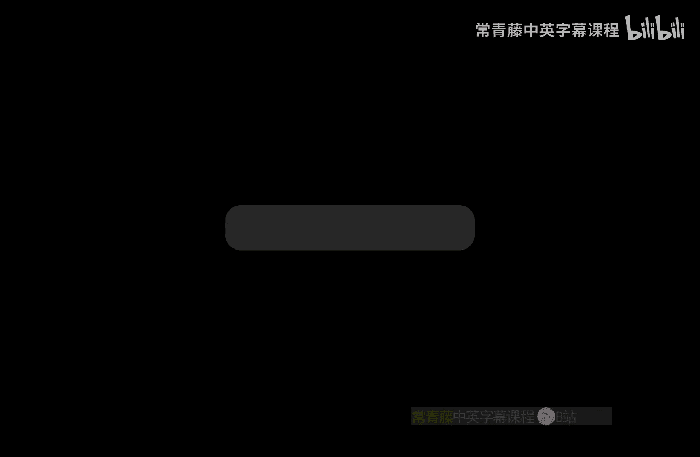
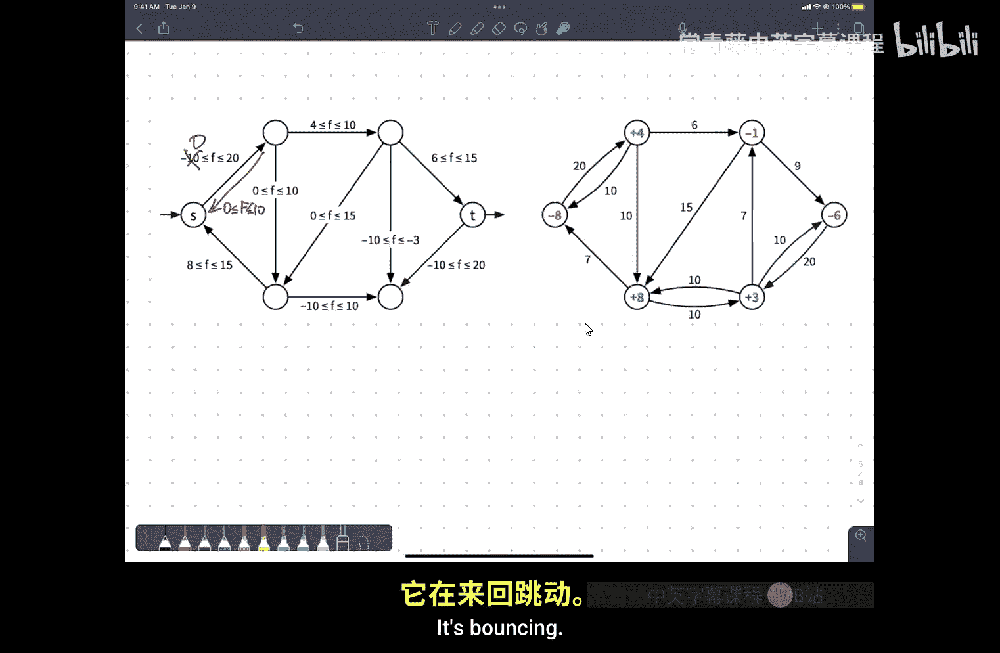

# 伊利诺伊大学【中英⚡算法｜CS473 Fall 2022 Algorithms】 p22 P22 21 more more and application -BV1RdBTBrEdx_p22-

Record to the cloud。Har me， I have to make the zip zippery wine noise。Um。

Just to put this out because we I forgot the record button next Tuesday is a university holiday go vote if you can go vote homework nine。

 which will be released next week and will be due just before Thanksgiving break will be the last graded homework。

We'll put out a homework 10 and maybe even a homework 11， but that'll just be for practice。

I'm trying to talk about applications of minimum cuts now， not just maximum flows。😡，So。U。

The simplest version of the minimum vertex cover problem is here's a graph。😡。

Find me a subset of the vertices that is as small as possible that touches every edge。😡。

Now you'll notice the selected vertices I have over here on this graph on the left。

That's not overtex cover， is it？Okay。Right， I need u。I need one more。I need two more。Okay。

There's a vertex cover。Well， okay， so we'll have to pretend that the example works because I screwed up the figure。

 Okay， so this is a vertex cover， it has six vertices。Now。

 this is not a minimum vertex cover because I didn't need to mark that vertex over here。嗯。And。

For reasons that， well， let's just say that's overtex cover okay。Yeah。Now。

 the vertex cover in general graphs is NPR。😡，This is one of the first problems that was proved NP hard by Dick Kp when he wrote his paper about 23 NP hard problemsble that are all equivalent to each other that won him the Tring Award。

 it's one of the first examples that you see in 374 of an NP hard problem。But in bipartite graphs。

 it turns out to be solvable。😡，In polynomial time using clothes。So a。Vertex cover。Equals a subset of。

Verstices。That。Touch。Every。Ech。Okay。More generally， I would like。2。U。But waits from the vertices。

So the numbers that you see on the vertices right now are weights。

 and I want to minimize not the number of vertices in the vertex cover。

 but the total weight of the vertices in the vertex cover and again。

 in general graphs this is clearly NP hard because the special case where all the weights are equal to1 is NP hard。

😡，还。Okay。So it's NPR in general。For non bipartite graphs。

But there's a way to solve it quickly using minimum cuts。4。嗯。😊，Bypartite graphs。

 so the reduction is to build a flow network。😡，And this is very similar to the flow network that you would build for the maximum matching problem in fact。

 if all the weights are one， this is in fact identical to the flow network that you would build for the maximum matching problem so I put a new vertex s。

😡，That's going to act as my source， I'm going to add edges from S to every vertex in one of the two parts。

😡，Of my bipartite graph。And the weight that' going sorry。

 the capacity that I'm going to attach to those edges is equal to the cost or the weight or the value of the vertex that the edge is pointing towards。

😡，In the middle， I'm going to direct all of the edges from the part that's connected to S to the other part。

😡，And I'm going to give those edges capacity， infinity。😡，And finally。

 I'll add a target vertex t and edges coming from all of the vertices in the let's call it the right part。

 again， with capacity equal to the cost or weight or value of the nodes that I've attached those edges to。

😡，So this edge has capacity five because its target vertex has cost five。

 this edge has capacity five because its source vertex has cost five。系y。Um。Now。

I'm going to compute a minimum cut， but of course。I've screwed up the figure。

Because I chose this badly。So。Yeah。I want to compute a minimum cut。

 Well it so the figure gives the right intuition， but it's not can't possibly be a minimum cut because I've got edges going forward from S to T that have capacity infinity。

So the capacity of this cut is actually infinite。So it can't be the minimum cut。

And that's actually going to be important in the development of the proof。

 so I'm going to delete this。I'm going to copy。That。

Paste and we'll try to figure out a different minimum cut。So。What I want to argue。Is that？Cuts。With。

F out。Capacity。Are sort of in direct correspondence。With vertex covers。Okay， in particular。

 if I have。Any cut。Any ST cut？Capital S capital T， that's finite。😡。

That's going to correspond to a subset C of the vertices where the total cost of the the vertices in C is equal to the capacity of that cut。

 so the cost of vertex cover is defined to be。The sum over the vertices of the costs associated with that vertex。

😡，Okay， so I need to figure out a way to draw。A cut is that no edge。

 none of those green edges cross from the S side of the cut to the T side of the cut。😡，Right。

And I want to try to make this。Somewhat interesting。So， I mean。

 so I could always define my cup like this。是。No edge crosses from the S side of the cut to the T side of the cut。

😡，The capacity of this cut is 4 plus2 plus5 plus1 plus7， whatever that is。

 the corresponding vertex cover is these five vertices and sure enough that's a vertex cover。😊。

So I choose all the vertices in one part of my bipartite graph that gives me a cover。

And the cost of that vertex cover is indeed equal to the capacity of that cut。😡，Okay。

 but the more general situation is going to be a little more interesting than that。

So pardon me while I hunt here for a second。Yeah。So I want to， I don't want to do that。

 I want things to possibly go backwards across the cut。It'From the T side to the S side。

So I suppose this could be。On the S side。Okay， I think this works。Okay， so if I look at。

This partition of。The vertices into two parts。The part that I'd circled in red。Is S？Red。

That's capital S and the part that I've circled in green is capital T。

Now there are edges that go between S and T。😡，But they all go backwards across the cut。

 they all go from the T side of the cut to the S side of the cut。The green they're sorry。

 the green edges that cross that cut， so those don't contribute to the capacity of the cut。😡。

Which means the capacity of the cut is actually finite， so in particular。

 the vertices that cross the cut are these。5。Okay those crossed the cut in the forward direction。

 so the capacity of this particular ST cut is four plus two plus5 plus3 plus5。对。So in this case。

Equals。4 plus2 plus 5 plus 3。Plus five， which as everybody knows is 19。Yes。

The corresponding vertex cover， I claim。Is。This set of courteses。Okay。嗯。Which in the example。

 it's clear that these two things correspond， what's not necessarily clear is that I always get a vertex cover when I do this。

😡，I look at the edges that coming directly out of the source vertex that cross the cut and the edges that go directly into the target vertex that cross the cut and those tell me the vertices of my vertex cover and conversely maybe it's not clear that if I start with any vertex cover。

😡，I get an ST cut by reversing this direction Okay， so let me。Sot of give a proof of this。

 so pick your favorite ST cut。I can divide。MyThe vertices into four subsets。😡，L intersect S。

L intersect T， R intersect S and R intersect T。Now， because this cut has finite capacity。

There are no edges。😡，Within LnR within the bipartite part of the graph from S to T。

 so there can't be any edges from left to right or sorry there can't any edges from left to left。

 there can't be any edges from left to right and I just said there can't be any edges from S to T so the only thing that rules out。

😡，sThere are no edges from left S vertices。😡，I except I did this。Yeah。

 left S vertices to right t vertices。I think to be consistent with the figure。I'm going to。

I'm going to flip these upside down， then this will confuse me less。Okay， now there are no。

There are no edges going like this。诶。So I'm taking。

The vertices in L intersect T and the vertices in R intersect S as my cover。😡。

So in order to show that this is a vertex cover。😡，I need to consider every edge and argue that at least one of its endpoint is in this set C Okay。

 so one possibility is that I go from L intersect T to R intersect t I I'm on the T side of the cut at both ends well then the left end point of that edge。

😡，Is in the cover。Another possibility is that both endpoints are on the S side of the cut and again。

 the right endpoint of that edge is going to be in the sense Sea。😡，The third possibility。

Is that there's one endpoint in each。But then the left endpoint must be in T and the right endpoint must be in S。

 and in that case， in fact， both endpoints。😡，Are in the cup。ok。😊，So。That gives me。You know。

 cut with finite capacity implies that I get a ver text cover。And then similarly。

 I could just chase definitions to argue the only edges that crossed the cover in the forward direction are the ones leading into the left nodes in the cover and leading out of the right nodes in the cover。

 sove got a correspondence between capacity and cost。And I can go the other way as well。Um。

 by saying well， if I。Have any。U。Vertex cover C， I can define S to be the left side but not C。

Union the right side。Interssect C。union。The less and T to be everything else。And again， case by case。

 I can chase this down and argue that this ST， as I've defined it here， is a little ST cut。

 it has finite capacity， and in fact the capacity is the same as the cost of this cut。

What this means is if I want to find。A vertex cover with minimum total cost that is exactly the same as finding an ST cut with minimum capacity。

😡，Which is the same by the Maxloman cut theorem who's finding a flow。😡，With maximum value。

so I can find this minimum cut。Right， so I can compute。The min cuts。S T。In say， order V time。

Using Orleans's algorithm。And this is the bottleneck， everything else is a sort of bookkeeping。

And that gives me the minimum weight vertex cover。This is not the minimum weight vertex cover。

 I just picked a vertex cover。嗯。Okay， questions about this。Yeah。😊，I'm sorry。はです。Yeah。

 the weights on the vertices are given as part of the problem。Yeah。Breaks out him。T判。Yes。😡。

For tripartite graphs， this ends up。Instead of looking like maximum matching in a bipartite graph。

 it would end up looking like three dimensional matching。

 which is one of the classical imp hard things。Yeah。U。嗯。Well， okay。

 so we got the min cut out that gave us a vertex cover， what does Max flowlow do？In this network。

 what， what problem is Max flow solving。If I compute a maximum flow in this network on the right。

What am I actually solving in this network on the left？🤢，It's essentially maximum matching。

If all the weights on the vertices were one， this would be maximum matching。😡。

But now I've got higher weights here， June I've got capacity more than one coming into these vertices on the left and capacity more than one coming out of these vertices on the right。

😡，So now what you're getting is not maximum cardinality matching。😡，But rather。

A kind of weighted version of maximum matching where。

You're allowed to use the same edge in the bipartite graph more than once。😡。

And your constraints are this vertex in the bottom left。😡，Um。

 I get to use it most seven times this vertex in the upper right， I get to use it most three times。😡。

Okay， so I'm like choosing one way to think of it is I'm choosing like a generalized matching。

 I could choose edges， I can choose the same edge multiple times。

 as long as I don't use this end more than a certain number of times。

 as long as I don't use that end more than a certain number of times。😡，What's even weirder though。

 is those numbers don't have to be integers。😡，So， I might。

A single edge squared of two times and another edge pi times。Um that's fine right。

 but it's kind of morally a kind of relaxed version of the maximum matching problem where you allow vertices to be used more than once and you allow edges to be used more than once。

😡，Okay。So。When we start talking about linear programming。😡，The way to summarize this conversation is。

😡，The minimum cut and maximum flow problems。😡，Are duals to each other in the formal sense that every linear program has a dual linear program。

😡，And the vertex cover problem and the maximum matching problem are also LP linear programming duals each other。

m we'll come back to that next week that doesn't have to make any sense right now。Okay。

Questions about vertex covers， yeah。😡，Yeah。嗯。So you can extend it to independence debts。😡。

The complement of a vertex cover is an independent set。

 so if I want to find the maximum weight independent set。

 that's the complement of the minimum weight vertex cover。If the graph is bipartid。Cleeks。

 on the other hand， a clique in a graph is an independent set in the complement graph。😡。

So this lets you find maximum cliques in graphs that are the complements of bipartite graphs where every pair of vertices on the left has an edge。

 every pair of vertices on the right has an edge and some edges between left and right are missing so two cliques with a few edges in between them。

 you can compute maximum cleaiques quickly。😡，Okay。So。Let's try this again。嗯。So this is a problem。

Called。Project selection。The input。Is a dag？And that will turn out to be important。

The vertices correspond to projects。And the edges correspond to dependencies。

So an edge from U to V means you can only。Be done。After。Z。嗯。So。

There's an arbitrary choice to be made about whether edges should point forward in time or backward in time。

😡，For reasons I no longer remember that the edges now point backward in time。

 I think it makes the mnemonics for S&T work out a little bit better。Um， every vertex。Has。A。

Val you attached to it。😡，Which is you can think of as profit。😡，If the value is positive。

And cost negated if the value is negative， so if I want to perform， say， this task。😡。

I want to choose this project that will earn me 3 million。😡。

The only way I can do that is by also doing those two tasks， which will cost me $13 million。😡。

Obviously， I don't want to do that。Okay。嗯。So if you want， think of this as。The nodes are classes。

 the arrows are prerequisites， the value attached to a particular class is some combination of the amount of sleep that you use and its effect on your salary when you graduate。

Some classes are really worthwhile， other classes not so much。

 but the not so much valuable classes are sometimes prerequisites of the ones you really want。Okay。

 the question is， which classes do you take， which projects do you choose？Obviously。

 the goal is to maximize my total profit。So I have。呃。I think I just called it。Let me call it value。

 I think that makes more sense。Okay， so my output。Is some subset the。Maximizing the total profit。咁。嗯。

So I'm going to solve this by turning it into a flow network again。

 and this is going to look remarkably similar to the one that we saw earlier。

 except I didn't with the vertex cover thing， I didn't start with， I started the bipartite graph。

Here。😡，Just for purposes of illustration。The vertices fall into two categories。

 there's the top row that is is all things you don't want in the bottom row， all things you do want。

😡，That's not a requirement of the problem。😡，That's just for purposes of illustration and the actual problem you're given the vertices with positive value and the vertices with negative value can be mixed up however they like。

 there can be arbitrarily long chains in this thing。

 the only thing that's really important is that this is a dag。😡，嗯。So again。

 I'm going to set up a flow network where I attach a source for T S with edges going to all of the projects that have positive value。

😡，And I put a capacity on those edges equal to the value of the project I'm aiming for。

I add a target vertex T at the top。😡，With edges from all of the vertices with negative value。😡。

And now assigning the capacity of that edge to be the negation of the value of the node that it's coming from。

 so this edge has capacity8 because this project has value negative eight。Yes。

And I set the capacity of every edge that I started with to infinity。😡，Now。

 the infinity here is going to play exactly the same role that it did last time。😡。

An infinity edge means when I compute a minimum ST cut or in fact。

 an ST cut with any finite value at all， any finite capacity at all， I cannot have。😡。

Internal edges coming from the S side of the cut to the T side of the cut。😡。

That would make the capacity of that cut infinite。😡，Right， that's。

So breaking the rules cost you an infinity dollars。As opposed to making a bad choice。

 which might only lose you 10 million。😡，And。So I'm going to set it up so that breaking the rules means you just immediately explode。

That's what the infinities are for。And then the claim。Is that if I take。诶。Let's say any。

S T cut S comma T。With。Finite capacity。Gives me a valid selection。Okay， and that's an if and onlyF。

So if I choose any subset of the projects。😡，That satisfy all the precede's constraints。

 so if I choose a node， I also choose anything that node points to。

That's going to be the S side of my cut。😡，And everything else is going to be the T side of my cut。So。

Because I followed all the pointers， any any infinity edges are only going to point into my selection means I might be prepared to do other unpleasant things。

 but I'm satisfied all the peroxs constraints myself and vice versa if I have an ST cut with finite capacity finite capacity means that any infinity edges that cross the boundary only cross it going into S and so the set of vertices inside s give me a valid selection so that's S minus。

😡，The source protect text。Yeah。But I want to claim further。

That the minimum cut actually gives me a project selection with the maximum total profit。😡。

so when I want to claim。😔，Is that？The total profit。From S， well， I'm just going to write this way。

Yeah。Is equal to p minus the capacity of this cut。Where he is sort of。The ideal。Gross profit。

 if I P is sort of like。If I wish for a pony， okay， all prerequisites， all dependencies go away。

I'm only going to do the stuff that makes me money and I'm going to do all the stuff that makes me money。

😡，Okay，This is an upper bound on the amount of profit that you can actually get out of the system。😡。

I'm going to call that upper bound P。😡，And then the claim is that for any ST cut。😡。

The profit that I actually make is less than this ideal profit by exactly the capacity of the cut。😡。

I guess I could say this differently P is。The profit。From this choice plus the capacity of the cut。嗯。

😊，So let's prove this。Okay， I'm going to just。Look at any subset。Of the vertices。

I'm going to define a couple of things， so the cost。😡，Of that subset of vertices。

This is going to be the sum over all vertices that have negative value。

Of the negation of their value。嗯。Yes， that's right。So it has negative value。

 the negating the value gives me cost， I want to think of positive values as income。😡。

Okay so the cost is just。😡，The penalty that I have to pay， all the bad stuff。

 how much did I have to pay for that？But this is going to be also equal to。😡，This is a。

Just choices of V and X。The cost of sorry。The capacity of the edge from V to T。

So if S is this highlighted thing， the cost is taking the negated sum of these three nodes。😡。

That's going to be the same as the sum of the capacidities of these three edges。

So the cost is just taking into account bad things。Then income。Is it is the mirror image of that。

 so it's the sum of vertices。Who have a positive value of the value。That's the same as。

The capacity of the edges coming into those vertices through s。

These three nodes have value totaling 12， so the income from this subset of the verticesis 12。

 it's also equal to the capacity of those three edges。嗯。And then finally。Profit of X is income。

Of x minus cost of x。Um。Which I can write as。Yes。That's the total value of all the nodes。

 this is the thing that I'm trying to maximize。😡，On the other hand， P。Is well。

 this is the same as income。Of S。Or sorry， not income of S， income of V instead of all vertices。

Which I can write as。Income on the S side of the cut plus income on the T side of the cut。A。

And then finally， the， I said finally twice， didn't I？Okay。Okay。

So at this point I just need to do some math at the end， so the capacity of the cut。Is。

Equal to the income that I get from things on the T side of the cut。😡，That includes this edge。plus。

 the cost of things that are on the S side of the cut， that's these blue edges。

The magic profit that I would get if there were no capacity constraints， well。

 that's the income on the S side of the cut plus the income on sorry。

 the income on the S side of the cut plus the income on the T side of the cut。😡。

So if I play with this。😡，Do a little bit of arithmetic here。嗯。

Basically income of T shows up on both sides so that gets canceled， income of S shows up in P。

And that I'm subtracting off cost。Of tea。Which is exactly what I said。Here。Yeah。

 sorry the right to states even idea situation， let's say also negative number to zero。

 we would know that the min cut would have zero clause。

 it would mean we would have the maximum department pocket。Yes， that that's exactly right。

 So if all of those， if there were no negative cost， anything。

 if I just set all those costs from whatever negative numbers they were to 0。

Then the minimum cut would just separate everything from tea。And in that case。

 the amount of profit that you actually make would be equal to this ideal profit capital P。😡。

Every time you reintroduce something negative， you're either going to decrease the amount of profit by that amount。

😡，Or you're going to pull that node out of the set of jobs that you're selecting as along with anything that depends on that。

😡，So as the values up there go increasingly negative。

 you're pulling more and more stuff out of the selected set S of jobs， yeah。Yeah。U。You're right。

 that should be cost of us。Yeah。So this cost of us。This comes from here。对。So this is sometimes。😡。

Forulated as。The open pit mining problem。As part of the reason why it's in this sort of vertical order with the negative stuff on top。

 I want to dig up some gold， but there's a bunch of dirt on top of it。😡，Well。

 I have to pay to dig up the dirt before I can get down to actually dig up the gold。

 so the question is where do I dig？😡，U。The same formulation you set up a flow network like this。

And you look for a minimum S cut。Yeah。can't get from SG with like the least amount of companies here。

 we still get to achieved by the three negative。So minimum an ST cut minimizes。

TheMinimum SD cut minimizes the cost of edges crossing from the S side to the T side。

It doesn't have to be zero， just has to be as small as possible。Now， in order to be finite。

 I can't have any infinite capacity edges crossed for S to take。😡，So those black edges in the middle。

 I've only got one crossing in a cut and it's crossing going in。

 crossing from the T side to the S side。The yellow stuff is us。

Any other way of partitioning these vertices？😡，You're going to have edges crossing from the S side of that partition to the T side。

😡，But the capacityacities as saids， is going to be bigger than the capacity。

 the ones I've shown you here。Okay。The punchline is。If I only figure out what classes to take。

I should give you the flow network。😡，1。😡，Orland's algorithm or Fort Fkerson。

A Orleanss algorithm if I want the bigger running time for Foguson， if I actually want to finish。

In a finite amount of time and can you know， once I find a maxflow。

 use that to determine a minimum cut， do a little bit of arithmetic。

Anything on the S side of that minimum cut， those are the things I want to take that are going to maximize my profit。

ok对你。I'm sorryYes， so in order to calculate your optimum class schedule。

One of those nodes is take 473。😡，And it has an arrow pointing to。

 now I know how to compute the optimum class schedule。😡，Yeah。Okay。So。

The last things I want to talk about here are modifications to the definition of what a flow is。

 what a max flow is。😡，And argue that this is really okay。

 you can there's a bit of flexibility in the definitions that we haven't allowed ourselves so far。

 but we can allow ourselves。And then take that more general problem and reduce it back to the standard。

Ford Fkerson formulation。And solve it with the right amount of time so the。

The first generalization I want to think about is。😡，Let's play with the conservation constraint。😡。

So I can imagine。Defining。嗯。A balance parameter。At every vertex V。And the balance is。

Zero in the normal flow formulation， the amount of flow that comes in is exactly equal to the amount of flow that goes out。

😡，嗯。So。Let's see I want。I me make sure that I get this right， flow in I want to flow in or flow out。

嗯。Positive means demand， so flow in minus。Flolow out。So instead， I could imagine that certain nodes。

Produce。The resource that we' flowing through the network and other nodes consume。

The resource that were flowing through the network。Notdes that consume。😡，Have a positive balance。😡。

So this node here with value2 means I want two more units of flow to go into this vertex than come out。

😡，This node here with value negative5 means I want five more units of flow to come out of this node。

😡，Then go in。So balance is a form of demand。In fact。Okay， balance means consumption。

Negative balance means production。OkayNow this is a slightly different version of the problem。

 now it's not immediately clear that it's possible to meet all of these demands。

 to match demand to supply。😡，And so the question now becomes。

At least one version of the question becomes。Is there？a。Feaible。Flow。

So feasible flow is still means that along every edge。

 the flow value is between zero and the capacity of that edge。😡，But now。

 instead of my normal conservation constraint， I want the flow into each vertex minus the flow out of that vertex to be equal to the balance at that vertex。

😡，Okay， and its it's extremely easy to set up examples where it's just not possible。😡。

To meet all of the demands。Okay。So there's a note on the left that produces five units a day。

 there's a note on the right that consumes three units a day。

 and they're connected by a road that can ship two units a day。😡，No， you can't do that in fact。

 it doesn't even matter if I you know increase this capacity to 12。

 it's still not possible to have a feasible flow here。😡。

Because there's more stuff being produced than is being consumed。😡。

I'm going to have imbalance either the production end on the left or at the consumption end on the right。

😡，Yeah。So one of the considerations that's required here in order for there to be a feasible flow is all of the balances have to add up to zero。

😡，Okay， so a necessary condition。Is the some overall balances？Is equal to zero otherwise。

If the total balance is positive。That means the demand outstrips the supply。😡。

And there's not going to be any way to achieve equilibrium if the total balance is negative。

 that means the supply is exceeding the demand and again there's no way to reach equilibrium。

 but flow， the balances being equal to summing up to zero is also not sufficient。

Here is a flow network。Where all the balance is sum to zero， it has four nodes， two edges。

I can't make this work。 even if the graph is connected。So I could send one unit this way。

That doesn't help even if the graph is strongly connected。

 I mean you can build bad examples of flow networks where there's no feasibleable flow。😡。

That have whatever structure you want。In terms of the graph structure。

Just a question of assigning the right numbers to the vertices。嗯。😡。

So the way that I'm going to solve this problem is by reducing to the standard maximum flow problem where I've got a source。

 I've got a sink， and I have conservation at every vertex except the source in the sink。

 and the transformation is up here on the screen。😡。

And it's fairly reminiscent of the same kind of thing that I did for project selection。😡。

I'm going to take a source vertex， add it to the graph。😡。

And have edges pointing to every supply node。😡，Now what I'm really doing here is I'm imagining instead of having lots of supply nodes spread all over the graph。

 I really have only one supply node S。😡，And that supply node can produce at whatever rate you want。😡。

And so instead of。四。😡，This factory over here on the left， producing five televisions a day。Actually。

 I've got over here at S， a factory that can produce however many televisions you want。

 but it can ship five televisions a day to this factory， which is now just a warehouse。😡，出。Okay。

Similarly， I put in a target T and I have edges going from every consumer node。

 every node with balance that's positive going to T and again the analogy you want is instead of having lots of little consumers spread out through the graph in fact。

 I just have one insatiable consumer over here on the right。😡，They will eat whatever you feed it。

But so instead of this one consumer that buys six televisions a day。

I've got this target node that can buy as many televisions as you want。😡。

But I can only get six Ts a day from that particular address。And。So。In effect， what I've done is。

Any node that had a positive balance， more stuff is flowing out。😡，Oh sorry。

 positive balance means more stuff is flowing in， I took all that stuff that flowed in and rerouted it to T。

😡，Anything with negative balance has more stuff coming out。😡，That created a vacuum。😡。

I essentially reroute that vacuum to S， so stuff comes in from S and then comes out of the note。😡。

So if I have a feasible flow on the left。😡，That turns into a feasible flow on the right。😡。

Where all of the red and green edges were saturated。😡。

Every supply is producing at full rate that means every one of the supply edges is is completely full。

 everything's being consumed at the full rate， that means every one of the the consumption edges are saturated so a。

Feaible flow。F in my original graph G。Produces a。Well， let me say。U。Feaible flow。F prime in G prime。

With。Value。Well， it's going to saturate all the edges coming out of us。So。

It's the sum of all the positive balances or the sum of the negation of all the negative balances。

Right。So。Now。Because this flow saturates every edge coming out of us。

And there are no edges going into us。There must be a maximum flow。Yeah。Okay。

 so I take this network on the left， I add this scaffolding on the left side and the right side。

 and I compute a maximum flow。😡，If that maximum flow saturates all the edges coming out of S。😡。

And therefore， because the balance is sum to zero， saturates all of the edges coming into T。

Then I can pull it back and get a feasible flow in the original network。😡。

If the maximum flow in G prime does not saturate all those edges。😡。

Then there is no feasible flow in the original network。😡，AsThey urgent。Well， okay， so right now。

 I don't have a sense of what value means。😡，What am I maximizing if I want to think about maximum flow in a network like this？

Okay， now I can extend this by adding just let's。Instead of specifying a balance at one of those nodes。

 just say， this is a source。You have it can have whatever negative balance you need and have another node that says。

 this is a target， I can have whatever positive balance you need。

And then there's a similar reduction that now lets me compute a maximum flow within that network。

In fact， I think。Yes， in fact， I'll talk about that in the next slide but。But for right now。

 this is just to find me a feasible flow。😡，Can I achieve balance at all？Okay。So。嗯。Okay。

 so let's do what I just said， now let's think about restoring the existence of a source in a target。

😡，m，I'm。Producing。I've got a factory that's producing some resource over here。

 I've got a target that's consuming some resource over there， and I've got intermediate nodes。😡。

That either add more of that resource or take some of that resource away。😡，Okay。

So I've got a set of pipes。😡，But they're either leaky， some of the water leaks out。

 but at a known rate。Or there。Anti leaky。Some of the water leaks in， but at an own rate。嗯。

And I want to compute a maximum flow through this network。

 so I want to push as much stuff into S as I can and pull as much stuff out of T as I can now subject to this modified conservation constraint。

 it's not that the total flow into the every vertex is equal to its flow out。

 it's flow out minus flow in is equal to say you know。😡，Negative four。Okay。😊，嗯。So。

There are two steps。That I need to follow。And I claim， in fact。

 Ford Forkson already followed these two stages， it's just that the first stage was trivial。😡。

So let's suppose I want to compute。Maximum flow。In a network。With。Non zero balances。All， so step one。

Find a feasible flow。And then step two。Maximize it。So the first thing I'm going to do is to say。😡。

I need to find a feasible flow in this network。😡，Now there's a slight problem here that now those balances might not all come out to zero。

😡，Okay so the way that I'm going to find a feasible flow through the network is I'm going to temporarily connect T back to S with one extra node that makes the balances all come out to zero。

 given that there there's conservation at S and conservation at T so this is just meant to create a network where I can say in that network on the right。

 if I find a feasible flow through this network， I can pull it back to the original network and it will still be feasible and it will still satisfy the balance constraints。

😡，In the original fold focusingson problem。All of the balances are equal to zero。

So if I did this reduction， I would could get a graph where all the balances are equal to zero。😡。

If all the balances are equal to zero。😡，The flow that has value zero everywhere is feasible。😡。

The zero flow， the vector， 00，0，0，0，00。Is a feasible flow？And so step one in my two step。😡。

Algorithm is completely trivial。 The empty flow already satisfies this feasibility constraint。

In our case now where we've got these weird unbalanced nodes that no longer works。😡。

I have to do extra work to compute that feasible flow so what do I do I reduce it to this flow network where there isn't a source in the sink and then I further reduce it to this flow network that now again has a source in the sink。

😡，If theax flow here， I pull it back to get a feasible flow here。😡，Right。So this is。

I build this auxiliary network G prime。😡，First， by adding this return edge with the nexttro vertex in it。

 then by adding a source that goes to all the production nodes。

 then by adding a target to all the deficit nodes， all the consumption nodes。😡。

And then trying to saturate all those extra edges tuned from S&T。I pulled that back。

Eventually I get some sort of feasible flow in this network。Okay， so this gives me。

A feasible flow that I'll call F。😡，What do I do from here？Once I've found a feasible flow。

In this network。How do I modify it。😡，To maximize its value while keeping everything feasible and while keeping everything balanced。

😡，Yeah。Yes， you run ford focus it。You compute the residual graph。😡。

You look for a path from S to T in the residual graph。😡，And then you push flow along it。😡。

And when you can't do that anymore， you're done。Okay， so what you're looking at here is。😡。

Computing a max flow F double prime in the residual graph of the flow that I computed in step one。

And so I break the problem of computing a maximum flow in this weird network。😡。

To two instances of computing a maximum flow in a not weird network。😡，First。

 to set up the balances the right way。😡，Once the balances are right， then in the residual network。

 all the balances are going to be zero。Right。So it just looks like I'm doing Fort Volkerson again。

 and then in that normal residual network， again， I push flow through residual pads until I can't anymore。

😡，系。And so the final flow that I return。Is F prime plus F double prime？

This is a fairly standard architecture for various kinds of optimization problems。😡，So I want to。

Compute， in this case， a flow that satisfies two conditions。

 one that it's feasible and the other that it has maximum possible value。😡。

Rather than trying to tackle these simultaneously。😡。

The first thing I do is just computer flow that satisfies one of them。Ignore the value of the flow。

 I don't care， just make sure it's feasible。And then modify that。😡，By keeping it feasible。

Keeping it balanced until it has maximum value。It's also possible to do this in the opposite direction。

😡，It's possible to first compute maximum flow， ignoring the balances。😡。

And then once you've got something with maximum value， close off the pipelines at S&T at this point。

 I know what the value is supposed to be。😡，And then modify the flow to make it satisfy the weird balance constraints。

😡，By finding a residual path that goes from some node that's producing too much to some other node that's consuming too much。

😡，And then say， oh， you've got some extra Ts， he wants some TVs， so pipes and Ts through the network。

So you could maximize the value and then restore the balance。😡，And that would also work。

 and in the end it would come out to be equivalent to running Ford Foson twice。系。But again。

 this is general strategy for solving this kind of problem。系。So。嗯。

I've only got a couple of minutes left。So I'm only going to show you the picture。

 explain what it means， but not write down any details。

 so this is another way that you can modify the definition of what a flow network is。😡。

In addition to having capacities on the flow value， which are upper bounds。

 the flow value cannot exceed this value。😡，And it has to be positive。You can just say， look。

 I'm going to put an upper bound in the lower bound on every edge。😡。

The flow value and this edge along the top。😡，Needs to be some number between4 and 10。

The flow value on this edge going up into the left。

That just needs to be some number between negative 10 and 20。😡，Now。

 the flow being between negative 10 and 20， what you should maybe think of this as， okay。

 the flow in that direction has been between 0 and 20 and flow in this direction has to be between zero and 10。

😡，So negative flow going this way is the same as positive flow going that way。😊，Similarly。

 this edge that's vertical here， this flow value must be between negative 10 and negative 3 going down。

It's really the same as the flow value must be between three and 10 going up。😡，系。Okay。So。

How do you now I want to compute a maximum flow in this。

 I've changed the definition of what it means to be feasible。

 not by changing the constraints at the vertices， but now by changing the constraints at the edges。😡。

Okay， and so roughly what I do is I try。If I can send zero flow through the edge。

 then I do and I split the edge into two parts， right so that's what I did to this edge here。😡。

I took that negative 10 to 20 and there's 20 going forward and 10 going back， that's great。

Here I couldn't do that， the zero flow doesn't work。😡。

So what I'm going to do is I'm just going to send four units of flow along that edge。😡。

And now the residual capacities are between zero and six。😡。

But I've now produced an imbalance of four。At this vertex on the left， an imbalance of negative four。

 this vertex on the right。So I basically tried to fix every edge。😡，To its lower bound。

 if it's positive or to its upper bound if it's negative。

Doing the reverse direction and figuring out what the effect of that is on the balance at every vertex。

 I just throw numbers at it。😡，Until all my capacity constraints are normal again。😡。

But that has an effect on the balance in the residual graph。😡。

And there's a residual graph that I've drawn over here on the right。

So now if I want to a compute a maximum flow in this graph on the left。😡，First。

I compute a flow that has normal lower bounds。😡，But that screws up the balances。

 so then I compute a feasible flow that has normal balances。😡，Okay。

 now everything is nice and then finally I push flow through the residual graph to maximize value。😡。

So three different things that I want to satisfy， I do one at a time。So this becomes three。

Maxflow computations instead of only two。Okay。That's as much as I want to talk about flows。😡。

Next Thursday， we'll start talking about linear programming。Have a good break。

Please vote on Tuesday if you can， I'll see hopefully some of you in office hours。佢等。

