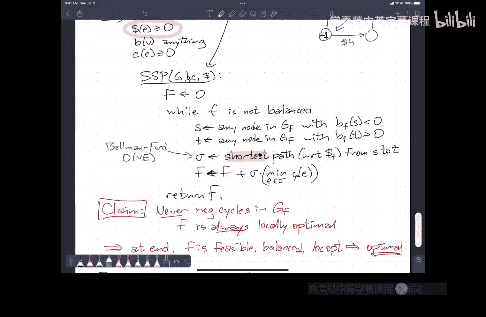

# 算法课程：CS473：最小成本流

在本节课中，我们将学习网络流问题的一个重要扩展：最小成本流。我们将从基本概念入手，逐步介绍两种核心算法：**环消除法**和**连续最短路法**，并探讨如何将更一般化的问题（包含供需、下界等）归约到标准的最小成本循环问题。

---

## 概述 📋

我们之前学习的最大流问题，目标是最大化从源点 `s` 到汇点 `t` 的流量。现在，我们为网络中的每条边引入一个新的参数：**成本**。我们的目标不再是最大化流量，而是在满足流量平衡和容量限制的前提下，找到总成本最小的流。这被称为**最小成本流**问题。

---

## 最小成本循环问题

首先，我们来看一个更基础的问题：**最小成本循环**。在这个问题中，没有特定的源点和汇点，流可以在网络中循环。目标是找到一个满足所有顶点流量平衡的流，并且总成本最小。

**输入**：
*   一个有向图 `G = (V, E)`。
*   每条边 `e` 有一个**容量** `c(e) >= 0`。
*   每条边 `e` 有一个**成本** `cost(e)`（可正、可负、可为零）。

**输出**：
*   一个流函数 `f: E -> R`，满足：
    1.  **可行性**：对于每条边 `e`，有 `0 <= f(e) <= c(e)`。
    2.  **平衡性**：对于每个顶点 `v`，流入量等于流出量。
    3.  **成本最小**：总成本 `sum_{e in E} f(e) * cost(e)` 最小。

**核心公式**：
总成本 = `sum_{e in E} f(e) * cost(e)`

如果所有边的成本都是非负的，那么零流（所有边流量为0）就是最优解。因此，问题只在某些边成本为负时才真正有趣。

---

## 环消除法

上一节我们定义了最小成本循环问题，本节中我们来看看第一个求解算法：**环消除法**。它的思想与Ford-Fulkerson算法类似：从一个可行流（如零流）开始，不断在**残差图**中寻找可以改进当前流的“增广环”。

### 残差图与负成本环

在残差图中，我们不仅需要记录每条边的**残差容量**，还需要定义其**残差成本**：
*   对于原图中的正向边，其残差成本等于原成本。
*   对于新增的反向边（对应减少正向边的流量），其残差成本等于**原成本的相反数**（`-cost(e)`）。

**关键观察**：如果在当前流的残差图中存在一个总成本为负的环（**负成本环**），那么沿着这个环推送流量（在容量限制内）可以降低总成本，同时不破坏平衡性。

以下是环消除法的步骤：

1.  **初始化**：从任意可行流开始（例如零流 `f = 0`）。
2.  **寻找负环**：在残差图 `G_f` 中，寻找一个负成本环 `C`。
3.  **增广**：如果找到负环 `C`，则沿该环推送尽可能多的流量。推送量 `delta` 是环上所有边残差容量的最小值：`delta = min_{e in C} r_c(e)`。更新流：`f = f + delta * flow_along_C`。
4.  **循环**：重复步骤2和3，直到残差图中不再存在负成本环。

**算法终止与最优性**：当算法终止（残差图中无负成本环）时，当前的流 `f` 就是一个最小成本循环。

### 算法效率与改进

一个简单的实现是使用Bellman-Ford算法来检测负环，每次迭代时间复杂度为 `O(VE)`。如果所有容量和成本都是整数，每次增广至少使总成本减少1，因此迭代次数以初始流成本为界。但这在最坏情况下可能是指数级的。

为了提高效率，我们需要精心选择增广的环。以下是两种策略：
*   **最小平均成本环**：选择平均成本（总成本除以边数）最小的负环进行增广。这可以在 `O(VE)` 时间内找到，并能将总迭代次数降至 `O(V log V)`，从而实现 `O(V^2 E log V)` 的总时间复杂度。
*   **最负环**：选择总成本最负的环。然而，寻找这样的环本身是NP难问题。

---

## 推广：带有供需和下界的最小成本流

上一节我们介绍了基础的环消除法，本节中我们来看看一个更一般化的问题模型。实际问题中，顶点可能有**供应**（产生流量）或**需求**（消耗流量），边可能有**流量下界**（必须输送的最小流量）。

**推广问题的输入**：
*   有向图 `G = (V, E)`。
*   每条边 `e` 有容量上界 `c(e)` 和下界 `l(e)`（`0 <= l(e) <= c(e)`）。
*   每条边 `e` 有成本 `cost(e)`。
*   每个顶点 `v` 有**供需值** `b(v)`。`b(v) > 0` 表示需求，`b(v) < 0` 表示供应，且所有顶点的供需值之和必须为零。

**输出**：
*   一个流函数 `f`，满足：
    1.  **可行性**：`l(e) <= f(e) <= c(e)`。
    2.  **平衡性**：对于每个顶点 `v`，`(流入 v 的流量) - (流出 v 的流量) = b(v)`。
    3.  **成本最小**。

我们可以通过一系列归约，将这个推广问题转化为我们已经知道如何求解的**最小成本循环**问题。归约遵循一个清晰的优先级顺序：**可行性 -> 平衡性 -> 成本最优性**。

以下是归约步骤：

1.  **满足下界（实现可行性）**：
    *   对于每条边 `e`，直接令初始流 `f(e) = l(e)`。这自动满足了所有下界约束。
    *   副作用：这会改变顶点的净流量（即供需值）。我们需要更新每个顶点 `v` 的**残差供需值** `b'(v) = b(v) - (从 f 中计算出的 v 的净流出量)`。

2.  **满足供需平衡（实现平衡性）**：
    *   现在，我们有一个满足下界（即可行）但可能不满足供需平衡的流。
    *   我们在当前的**残差图**中操作。将所有 `b'(v) < 0` 的顶点（供应点）连接到一个虚拟源点，将所有 `b'(v) > 0` 的顶点（需求点）连接到一个虚拟汇点。
    *   在这个新网络上运行**最大流算法**（如Edmonds-Karp），将供应点的多余流量输送到需求点。这得到一个既可行又平衡的流 `f'`。

3.  **最小化成本（实现成本最优性）**：
    *   此时，流 `f'` 在原始问题的残差图中，对应一个**可行且平衡**的流。更重要的是，在这个残差图中，所有边的下界都变成了0。
    *   我们现在面对的正是一个标准的**最小成本循环问题**（顶点供需均为0，无边下界）。对此，我们可以直接应用**环消除法**。
    *   运行环消除法，得到最终的最小成本流 `f*`。

---

## 连续最短路法

上一节我们通过“可行性->平衡性->最优性”的优先级来解决问题。本节中我们介绍另一种重要算法：**连续最短路法**。它采用了不同的优先级顺序：**可行性 -> 局部最优性 -> 平衡性**。

### 算法阶段

1.  **满足下界与处理负成本边（实现可行性并趋向局部最优）**：
    *   **处理下界**：与之前相同，令 `f(e) = l(e)`，更新残差供需。
    *   **处理负成本边**：对于所有成本为负的边，我们**饱和**它们（推送流量至容量上限）。因为使用这些边能“赚钱”（减少总成本）。这会在残差图中产生成本为正的反向边。
    *   此阶段结束后，我们得到一个可行流，并且**残差图中所有边的成本均为非负**。这意味着残差图中**没有负环**，即当前流对于其残差图是**局部最优**的。

2.  **满足供需平衡（在保持局部最优的前提下）**：
    *   此时我们有一个可行且局部最优，但可能不平衡的流。所有残差边成本非负。
    *   核心操作：只要存在供应点（`b'(v) < 0`）和需求点（`b'(v) > 0`）：
        *   在**残差图**中，以边成本作为长度，计算从某个供应点 `s` 到某个需求点 `t` 的**最短路径**。
        *   沿这条最短路径 `sigma` 推送尽可能多的流量。推送量 `delta` 是路径上残差容量的最小值与 `|b'(s)|`、`b'(t)` 的最小值。
        *   更新流和顶点的残差供需。

### 正确性关键：保持无负环

为什么在推送最短路径流量后，残差图依然没有负环？以下是证明思路（反证法）：
*   **假设**：推送流量后，新的残差图中出现了一个负环 `C`。
*   **推理**：这个负环 `C` 必须包含至少一条新出现的边，即我们刚才推送流量的最短路径 `sigma` 上某条边的反向边。
*   **构造矛盾**：我们可以将负环 `C` 和最短路径 `sigma` “组合”起来，通过抵消公共边（方向相反），得到另一条从 `s` 到 `t` 的路径 `sigma'`。
*   计算 `sigma'` 的成本：`cost(sigma') <= cost(sigma) + cost(C)`。因为 `cost(C) < 0`，所以 `cost(sigma') < cost(sigma)`。
*   这与 `sigma` 是**最短路径**的假设矛盾。因此，假设不成立，推送后仍无负环。

**算法效率**：寻找最短路径可以使用Dijkstra算法（因为残差成本非负），但每次增广后需要更新潜在距离函数以维持非负性，或者使用Bellman-Ford算法（`O(VE)`）。迭代次数与总供需量有关。通过精心选择供应点和需求点对，可以得到更高效（如 `O(V^2 log^2 V)`）的实现。

---

## 总结 🎯

本节课我们一起学习了网络流的高级主题——最小成本流。
*   我们从**最小成本循环**这个基础问题出发，理解了成本、容量、平衡性等核心概念。
*   我们学习了**环消除法**，它通过不断消除残差图中的负成本环来逐步优化流，其思想是“在保持平衡的前提下优化成本”。
*   我们探讨了更一般的、带有**供需**和**流量下界**的最小成本流问题，并学会了通过分步归约（先满足下界，再平衡供需，最后优化成本）将其转化为标准问题。
*   最后，我们介绍了**连续最短路法**，它采用了不同的策略（先处理负成本边达到局部最优，再通过连续推送最短路流量来满足平衡），并理解了其保持“无负环”这一关键性质的原因。

这两种算法是解决最小成本流问题的基石，理解它们有助于你应对各种复杂的网络流优化场景。