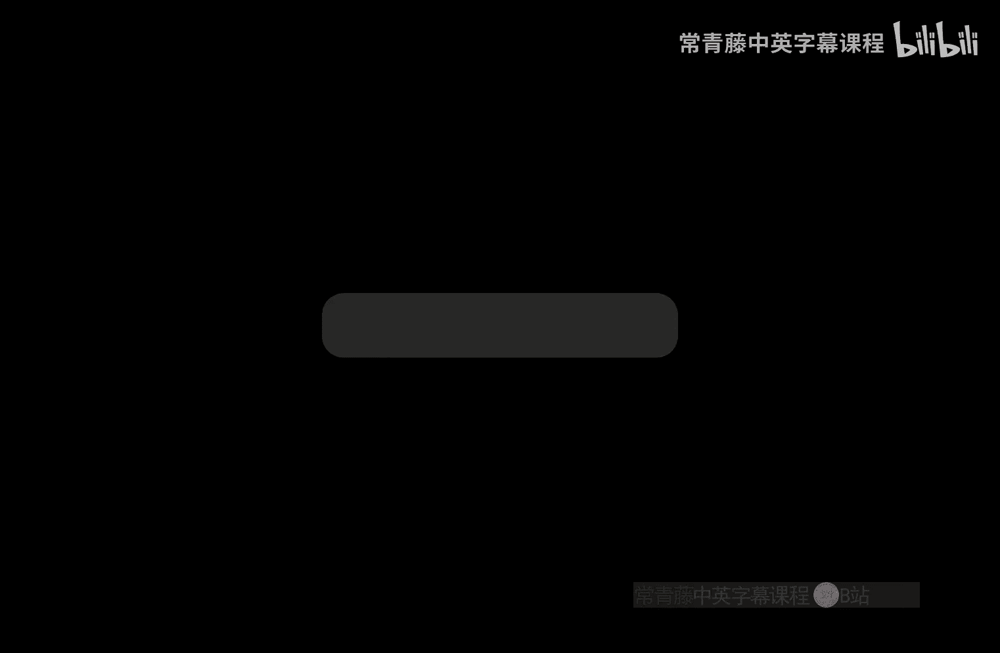
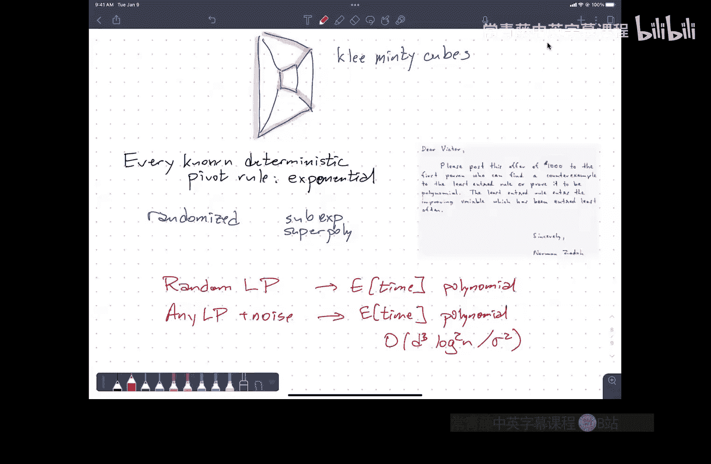

# 伊利诺伊大学【中英⚡算法｜CS473 Fall 2022 Algorithms】 p25 P25 24. LP duality and the simplex algorithm+ -BV1RdBTBrEdx_p25-

嗯。

Oh。Okay。Let's。Go ahead and get started。The。嗯。Most significant administrative thing。

Some of you have already noticed。The term two's graded。

This is the same plot that I gave after midterm one。

So the orange curve is everybody's overall average in the course。

Crudely computed beating I took midterm one， midterm two。

And the top 18 out of 24 homework score up to through homework seven。嗯。

Computed a numerical average from that。Use the cutoffs advertised。

On the course webpage to get letter rain cutoffs and the blue dots are corresponding。

Midterm scores for the students ranked by overall average。

Dots above the orange curve indicate lower homework averages。

 dots below the curve indicate higher homework averages。嗯。This is。

Homework this is midterm one versus midterm two。The letter grade cutoffs here are assuming 90% homework averages after only taking the file 18。

So this is very crude because the homework averages vary quite a bit up and down。

So if your homework average is over 90%， you should imagine your dot shifting up and to the right。

 it's below 90%， you should imagine the dot shifting。啊，这样之外。嗯。This is。

This level of correlation is unfortunately typical because the stuff that we did in the first chunk of the class the stuff that we did in the second chunk of the class are significantly different。

嗯。But this is all more or less consistent with past pre pandemic semesters of the class。

 both in terms of the overall score distribution。And in terms of。This correlation。

Now this was all finished。Sometime yesterday afternoon。

 and so I still am making passes through the exams to make sure that things are graded consistently and I believe fairly。

啊。So some of these midterm grades may still go up。Nobody's midterm grade will go down from the point。

So even if you've submit regrade requests。G regular request can only make your grade go up。嗯。

Regrade requests are normally due three weeks after grades are released。

I'm not counting Thanksgiving week as one of those weeks。

So basically regret grades are due until the end of final week。

That's what three weeks turns into if we need more。So as usual。

 by the time we get these three grade requests。It may be the case that we already have。

Taken the final and we've already。Great at the final。

 we've already computed at least preliminary grades。

If a successful regrade request would not change your letter grade。We may decide to just say this。

 we're not going to bother reing this because it's not going to make。

I don't think we'll be in that state until actually exams exams actually starts。But if we do go into。

Finals week and re requests are still coming in just be aware this doesn't mean that。

Your reg Buquest is in any way invalid or that you know you' wrong。

 it just means we're trying to get。Other stuff done and we need to prioritize it。到。

So the earlier you can get the delivery break about sooner。嗯。I'm happy to answer questions。

Either after class today or in office hours。There will be office hours tomorrow。😡，Um。

 although I realize that many of you are probably， well。

 if you realize that many of you are already gone。But。If you are watching this online。

 my morning office hours are still on Zoom。啊。There will not be office hours over Thanksgiving break。

 but they'll pick up again as usual the week after。😡，哦。诶。😊，あ。Yeah。That's sorry。

That should be 70% mid3th。好的。What。好的好的。X axis is from one。Yeah。这是。I will be points， six questions。O。

So。Linear programming。啊。What I want to do today is。

Stri to provide at least a little bit of intuition about what。😡，Dity means。And to。

Describe the most common algorithm。😡，For solving linear programs on the simplex algorithm。

And give you two different geometric interpretations of it。

 depending on whether you're working on the original linear program or whether you're working for school。

啊。Nothing that I'm talking about。Ex maybe if the intuition is helpful。

 but nothing specifically technical that I'm talking about today。

 I don't think it's going to be relevant for the homework。

Believe all of the tools that you need to finish the homework that's due this evening you saw on Tuesday。

😡，好，不。嗯。啊。I'll try to leave time at the end of the lecture to answer questions。

Particularly that might be relevant to especially problem three。

 since that's the one that requires reality。对。So。That is a huge vegetable linear program。

There two variables。There are a bunch of linear constraints。The linear programming problem is。

Find the lowest point that is on the correct side of all of these lines。😡，More generally。

 this is not happening in two dimensionals。Space but in some of an empty dump dimensional space where instead of lines。

 you have hyper planes。And you just just imagine why that'll give you the right information。

But the idea is still the same。You're given a bunch of planes and you're given one side of those planes you want points to be on。

😡，Those constraints define as。Easible polylohedrrons。

 this lobby thing in the center that's in yellow here。😡。

you want to find the point furthest in some direction。You mayy as well assume it's down。

Inside that is all。系。So。programming。Find the lowest points。With the correct definition of low。In a。

Convex。Orhedron。And you know in higher dimensions， this convex polyhedron might look something more like you know。

I dimensional。啊。So that took huge。That's the feasible region of the three dimensional linear program that has six。

Interesting constraintss。One founding each face of the cube。

And the thing that I'm interested in finding is this vertexality。嗯。Now there's this other。嗯。

The evil twin of this linear program is something referred to as the duall。Again， really this。

This is just a relationship between two different linear programs with the relationship called dualities。

 the primal is the one that I happened to pick up first。😡，U。

Because I just happen have a max final with upper bound， then I end up with a in fuel wither bounds。

But duality works for arbitrary linear programs。But in general。You've got this correspondence。tween。

嗯。The primal。Some number of variables and some number of matrix constraints。

 so those are the ones involving the make of pay。There are also some sign constraints。

 they're actually you know always exactly D of those and might as well light those in。

Assuming the LP is in this canical form。When that's dualized。I'm going to have n variables。

D matrix constraints。And sign constraints。So。The roles of these two。Setets some constraints。

So the second line with the matrix。That's the interesting structural part of the problem and the third line。

 it just says everything is not negative， and is this sort of there because it has to be。啊。

So I've got end line， any constraints in the first。Electction Bcon in the second on the left。

On the right， those tumors lie。For every variable on the left。

 I have a matrix on the right or every matrix con on the left。

 I have a variable on the right and we have this dictionary。😡，For transforming。

One linear program into the other。And the reason we like want to do this。

 the reason why we might care about this is。😡，Primarily because of this fundamental theorem。

 it's a generalization of the max floodman cut here。The solutions to these two linear programs。

at least the value of the solution， the objective value that we're trying to compute。

 they're the same。At some level， you can actually say these two linear programs have the same solution。

That same is a bit looser there， means given the solution for one。

 I can compute the solution for the other really， really fast。We go back and forth really。就。

This primal linear program over here， I've got two variables。😡，And N plus two constraints。

The plus two， because I've kind of buried the。😡，And then when I。When I doize。Well。

Have a really hard time。Drawing and dimensional space。

But the dual problem for this is some weird thing that happens in inventions。

Where I have exactly n plus two inequalities。My recommendation is not to even try。😡。

Just think about young。You get a different way of looking at things。gives us， I think。

 the right intuition。好。嗯。But still， I have。嗯。This fundamental theorem that says。The prim one duel。

Have a。啊。If。They have optimal solutions at all。Then the objective items。In fact。

 the theorem is one of them has an optimal solution， meaning it's feasible and it's bounded。😡。

Then the other one has an optimal solution meaning the dual is also feasible and bounded and the two objectives。

嗯。So I'm not going to attempt to give a fullproof of this。😡。

But I want to give the proof of the easy direction， so this is like。

The proof of the easy part of maxloid cut。It says the value of any flow is less than the capacity of any cut。

哦，都好靠。So this is what I'll call the weak duality theorem。系。So if x is。Feaible。

For the primal linear program。And why is feasible？For the dual linear program。Then。

C dotx is at most y times a times x， which is at most y dot B。Go even C dot x， pro， iss at most Y B。

U。And the proof is， you know。Really fairly straightforward。So x is feasible。

Implies that Ax is at most B。Right。That's one of the constraints on the one of the sets of constraints on the。

The final new program。はい make itまさ。On the other hand， why is feasible？😡，Implies that。嗯。

Why is at least zero？Every every variable in the dual program for a the solution is not negative because that's one of the constraints of the program。

And so if you just sort of push these together。Y times ax。

is less than equal to y dot b if I take this inequality ax is smaller than the B and I multiply it by a positive vector on both sides of theality。

I maintain the inequality。And by taking inequality， I multiply both sides by the same policy thing。

 the sense of uniqueequality of the thing。So。These two together。

 they have to be a little bit careful because this is a late a。

This is in inequality vectors happens at every coefficient。This is an inequality vector。

This is really the大 product。But still the inequalities go through because why is all my negative？

And then。Well。The symmetric argument。Implies。That。C x is at most YAX。Basically。

 because x is feasible in the k， I know that every coefficient of x is non negative。

Because y is equal to dual， I know y A is C， so I multipied those to。Weal together。

That that's the end of the group。系。The blue stuff history is the second name quality the hereem right theified Christian。

The left inequality。And。😊，So the intuition that。You should have here。

So there's this you know spectrum of possible values for the objective functions of the primal and dual linear program。

 so the primal linear program。😡，There's some minimum value。

I guess they wanted the prim linear program to be maximizeimizing。Let's do it that way。

Prial linear program has。Now some range of possible values。That the objective value you can have。嗯。

It goes up to some of it。And that's the opt trying to maximize。对。

Essentially what I'm doing is I'm taking this convex polyhedron， and I'm just saying， okay。

 project that computed shadow down onto the Y axis。In any place where。哦。

For any point in that polygon， just look at his wife。It's a little confusing。

 I'm sorry because ology's down。As my geometric direction， but I'm talking about maximizing。

 so I changed the up。The duel。There's some other range。Of objective。

It it has some minimum value that I'm trying to achieve。And what the weak theorem says。Is。

All possible objective values that you can get from the primal review program are less than or equal to all possible objective values that you can get in the fuel in your book。

嗯。So this is the set of all possible。Why dot B such that？YA is C and is negative。This is the set of。

All C dot X where。A x is it most b and x is greaterd than equal to zero？嗯。And in the end。

The main duality theorem。Says。There's actually no gap。

I've drawn a gap in there because the weak theorem tells me there might be a gap or there might not。

😡，But those few ranges are not going to overlap。The main theorem says nope。

 they exactly put themselves。So really。The real picture。嗯。Looks like that。嗯。Yeah。对。没白。

So the blue stuff we're trying to maximize。The value that we're trying to maximize could be below that upper bound。

 but the maximum is that black。嗯。So one other piece of intuition about what these dual variables mean。

Is。Let me imagine that I've got。Linear program here。I've got these two black lines。

 those are the ones that are actually going to determine my optimal solution。All。

 here's my optimal value here。And here's my feasible region。Hey， there's my objective function。

This is the standard picture that I involved。Now， in the dual linear program。

 there are exactly two variables。😡，One for each of those lines。喺。😊，And so I have a。A dual variable。4。

Bch。嗯。Matri comestrain。Let me just ignore。Deign constraints for the moment。嗯。So what's the？You know。

 here's my optimal objective optimal solution for this the program。

 what can I say about the corresponding optimal solution for the dual program？Well。

 it's got n different variables， exactly two of them are not equal to zero。Namely。

The two that don't correspond。SoThe two constraints define the optimal prim。so if。Crimeal constraint。

Is not part。Let's say is not。Tight。For the optimal solution。Then the corresponding dual variable。

Is zero。So only two of my dual variables are now not equal to zero and there's a physical interpretation of what those dual variables mean。

 so I'm going to think of the objective direction as gravity。

 the physical force pulling things downward。And I'm going to think of that red dot as a marble resting on two solid blockss of wood。

 two solid flks of wood。😡，Now， the marble's not moving。😡。

But it has a downward force being applied to it。So somewhere there must be an upward force being applied to it。

😡，And if you imagine an actual marble resting on an actual table。

 the force of gravity is being countered by， turns out electromagnetic force going in the back opposite direction。

😡，Forces are applied in a direction that is normal。😡，2。The object。Wing the horse。

So that line with negative sort。The black lineve slope is applying the force kind of often a little bit to the right。

And the line with positive slope。Is applying a force up and kind of to the left。

And the sum of those two forces。Has he exactly cancel out， rather？Otherwise， the model would move。

Okay， so the non zero。嗯。Dual variables。This turns out to be。嗯。The coefficients。Of。

I think it's actually minus c。In the coordinate frame。UDefined。By the normals。

To the type constraints。Right。So。😊，This physical interpretation extends to things like in your homework。

😡，So。Or probably the two a， you're trying to find。The largest square that fits inside。😡。

The polylohedron， call a convex polygon。if you one way to do this involves a linear program with exactly three variables。

Which means in the duel。You're going to get a solution with exactly three non zero dual variables。

And what those are going to correspond to。If I draw my largest square that fits inside here。

That square is going to touch the polyhedron in three different places。

And those dual variables are going to correspond to free force vectors that keep the square from moving or growing。

so kind of a this physical interpretation gives you away and at least when you have got things that are low enough。

Kind of inspecting a solution going。Imagine that the square physically growing。

 is there any way that it could turn or？😡，But is there any way can slide and make this go bigger if not then some forces must be canceling out must be preventing that growth those forces are the in a sense the dual variable。

嗯。嗯嗯嗯。不是。Okay。啊。So any constraintst that？就是分包就是。There's only three constraints that matter。你 some三。

All the other constraints。You want。啊。There are waves of kind of analyzing if I tweet one of the concerns that made this very tough。

不在在这。That bullet variables， I'm a little fuier in details。被告意。But there are ways of doing。O。

So I'm not going to try to justify this intuition， but if you ever find yourself going what the hell is dual program。

 that's sort of what's going。嗯。对。But this does give me away a kind of read in hopefully you'll see some。

Some things that kind of remind you of this intuition as we go through the formulation of this simplex algorithm。

Before I do that， though， are there any questions about， you know？What this intuition actually means。

 what dualities。Le leastase the relationship between the prim and dual the near program。Yes。

 this suggests that our deal program often have very little。Well。

 that all depends on what you mean by useful。But here， are just hoping think to。啊，那个呢 thank大见。Yeah。

So remember the actual duality here is。I'm changing variables for matrix install。

And then I still have sign constraints in the background。

So just the dual of this two dimensional thing。I still have I've got n variables。

 only two of them are not going to be equal to zero， but I still have a whole bunch。

Which is most of them are greater but something greater than equal is0。嗯。

The way that I tend to think about these things geometrically， the number of constraints is much。

 much larger than the number of variables。😡，And so in the dual。

 the intuition has to kind of go the opposite way。The number of constraints is only slightly， very。

 very slightly larger。Which is hard to think about I haven't figure out how to think about it so I don't。

I try to just interpret everything in terms of this original geo。Okay。

 so I'm going to describe an algorithm for solving the new programs。But I need to before I do this。

 I need to define a couple of terms here。O。So the main object that we're going to be playing with here is something called the basis。

A basis is a set of delinely independent constraintss out of my linear code。

So in this two dimensional setting， a basis is a pair of lines that cross。系。

Now things are going to get kind of complicated and confusing， so I'm going to assume。😡。

That there are no。Degenies。In my linear program， and among other things。

 that means every subset of the constraints is literally intended。😡。

I never have three lines that go through a single point。

 I never have two lines that are parallel in higher dimensions。

 I never have three planes that go through a common line I don't want to spend a lot of time talking about exactly what this means。

In all dimensions， but the thing to remember is whenever I say constraints。

That gives you a system of D linear equations and D variables。

It has a solution and that solution is unique。So every pair of lines in the picture defines a unique point of intersection。

That's called the location of the constraint or the location of the basis。

So the location is the what you get when you。Solution。Of the D by D linear system。Or geometrically。

 it's the intersection。Of。D constraint plans。Okay。The location is the thing that we're trying to optimize。

 it's just a point in the plane。😡，That happens to lie on these two lines and where the goal here is to find the lowest point in the plane that happens to be in that beautiful region。

So the first observation is。There is always an optimal solution that is the location of the basis。

There's always a corner of vertex of the feasibleasible region that is optimal and again。

 if I assume no con degenies， there is always a unique optimal solution and that optimal solution is the location of a basis。

There is a unique basis that determines the solution。So in this particular example。

Here is my optimal basis。喺。😊，嗯。So。So the value。Of the basis is the objective vector times dotcal location。

This is the objective value that we're trying to make as large as possible。😡，Okay， so。

If the location， for example， in the flow linear program。

 the location is the assignment of low values to every edge。The value is the value of the flow。

 the thing that we're trying to maximize on the first line of。Okay。Now。

There are n plus D constraints。😡，So that means there are exactly n plus D choose D different bases in this linear program that's about end to the D。

In the planer case， that's about n squared。😡，系 and。Not in squared over two。嗯。U。

Then we'll say that a basis is。Feaible。If。Well， Ax is at most B and x is greater than zero。

Where x is the location of the basis。So the feasible bases are the ones that define the vertices of the feasible region。

So here's the algorithm。😡，Compute all bases。For each one。

Solve the system of linear equations get its location。

the dot product of that location is the objective vector。

That gives you a set of n plus featuress being standard values。就是这个。喂。This runs in， you know。

 the n to the D if I， which is not so bad when D is only two。Three。But in practice。

 linear your programs are applied to， you know， n is 10，000 and G is 5，000。

That's terrible right this is in the worst case that's exponential because one of the two main terms is up in the exponent。

What。One thing to notice also about duality。嗯。How many dual bases are there？Well。

 and when I dualize the linear program， I swap the roles of N& D。😡，So instead of n plus D choose D。

 I have D plus n choose n。Except that's the same thing。

Five n plus D things and I color D of them red。😡，That's the same as I have n plus D things and I color all but n of them red。

😡，Okay， so this is actually the same thing。As what's going on in the dual， and in fact。

 there is a one to one correspondence of fijection between bases in the primal linear program and bases in the dual linear program。

It turns out that the value of a basis in the dual linear program is exactly the same as the value of the corresponding basis in the primal linear program so really for purposes of intuition I'm just going to stick with this picture。

😡，And say your basis is two lines。I'm not going to think about the dual picture where the basis is n hyperplanes out of n plus two in a space with n dimensions。

😡，And I have to solve an n by N system of linear equations and dot products with an n dimensional vector。

 because I know in the end， the value I'm going to get is the same as the y coordinate of the intersection of Q1。

对。Now。嗯。There's another condition that I need to satisfy。For a basis。

And that is that a basis needs to be locally optimal。What this means is。The location is optimal。嗯。

For a linear program with。Only。The basis。Constraints。呃。And the same objective。

So to give a concrete example here， let's look at this。Point here。That blue point down at the bottom。

That's the location of a basis defined by two lines。The basis is not feasible。😡。

But those two constraintss both say， I only want to think about points that are above or on both of these lines。

😡，If I take away all of the other constraints。😡，And just look at the linear program that says find me the lowest point that is on or above those two lines。

 that is the point that I will get。That means that point is locally often。Now。

 if instead I look at say。This basis。On the far left， that's not locally up。😡。

Because I can slide along one of the lines。😡，And make the deive out bigger without violating either of those species。

Okay， so in general。嗯。Locally optimal。Assuming I want to be above these lines。

Locally optimal looks like this。And。嗯。This is not。我不要什。

Okay so I just look at the constraints on the basis。😡。

And if there's a way to like locally improve things without violating either of those the any of those constraints。

 it's locally optimal， otherwise it's not。😡，So locally optimal， not locally optimal。

 maybe the right way of saying this is obviously not optimal。

Right now this is not locally optimal doesn't say anything about feasibility。😡。

That blue thing down there， that is locally optimal， even though it's not feasible。In fact。

 more generally。There's a bunch of locally often things， here's one， here's one， here's one。

 here's one， here's one， and here's one。Now， locally optimal is the same thing as feasible in renewal。

😡，So most。Linear programming books well use we'll call this。Dual feasible。

But I want to think as much as I can in terms of the original LP。😡，But you can already see。

Weak duality showing up。😡，Notice all the things thevertices there that I marked in red。

As above all of the vertices that I marked in were。😡，That's because。

The value of any feasible solution to the original L。😡，Is above。

We equal to the value of any feasible solution do L。The original LP feasible solution by marked red。

😡，The dual LP solutions I've marked in blue， and there's only one place。Where these line up。

And that is at the actual optimal solution to both of your program。😡，喂。

The primal linear program is trying to find the lowest optimal basiss， the lowest feasible basis。😡。

Yeah。😊，Dual linear your program is trying to find the highest。Basis that's feasible in the duel。

highest locally optimal basis。😡，诶。😊，So。嗯。The simplex algorithm ultimately will be。😡，啊。

Pick a feasible basis。If it's locally optimal， you're done， if it's not。

 then I can improve it by walking to a nearby nearby feasible basis in。😡。

I can walk around that yellow holiday。The duel。The simplex algorithm is picked your favorite locally optimal basis。

😡，And if it's feasible， you're done， otherwise I can push it upward to a neighboring locally optimal basis that's further up。

😡，So when you're dropping the marble inside that feasible region and it falls down until it reaches bottom。

😡，The other is you have a bubble that shows up in the middle of this what's called an arrangement of hyperplans。

 you put a bubble in at some locally optimal thing and it bubbles up until it does barely leak。😡，嗯。

So。嗯。Okay。You've got this correspondence here。呃。Basis， so let me again。

 kind of draw this dictionary here。Primal。对我。Basis。Responds to basis value。Worresponds to value。啊。

N plus D choose D， of course puns to D plus n choose n。

 because course these two numbers are equal because that's how binno coefficientsymmetric。嗯。嗯。

AFeaasible basis。Dualizes to a locally optimal basis。

A locally optimal basis dualizes to a feasible basis。

A linear program that doesn't have any feasible bases is infeasible。😡。

A linear program that doesn't have any locally optimal bases。😡，Is unbounded。

So infeasible and unbounded are also duels of each other。Even though geometrically。

 they look very different。😡，They're actually intimately related through this cloud。嗯。And of course。

The primary you know thing。Is that an optimal basis on the left is the same as an optimal basis on the right。

喂。😊，So again， this dictionary about how you think about。

The dual linear program goes to the lens of always choosing the basis now there are linear programming algorithms that don't just consider basiss。

😡，There's something called a family of so called interior point methods where the algorithm actually says。

 here's a nice feasible point， let's make it better and it goes。

I don't know how to think about that in the。Because I'm not doing things that are like combatorial and just choosing the subset of constraints。

 I just pick up point。😡，That doesn't actually correspond to anything。😡，Concrete in the dual of that。

So duality is really just something that I use to think about。嗯。你信走。Yeah， always。No， no。

 definitely not。You'll have the same number of feasible bases in the primal as locally optimal bases in the dual。

 because that is the same thing。😡，But。For example， if I have an infeasible linear program。😡。

I could still have lots of locally optimal bases， just none of them will be feasible。ok。

So what's the simplex algorithm？So I'm going to wave my hands at the first three lines for a moment。

Just imagine for the moment that you know how to do this， I'll explain how shortly。

The simpleimx algorithm says。Start with any feasible vertex。

 so vertex just means the location of the basis。Really， I should probably be right here。嗯。

Basis location。Or really， really， I just pick a basis。While that basis is not locally optimal。啊。

Then there are two possibilities。If it is locally optimal and done。

 I found a thing that is feasible and locally optimal， that's optimal。😡。

But there are two possibilities for what might happen。And it's not located up。

 one is that if I look at all of the neighbors of x， all bases that differ from x by exactly one con。

😡，If's none of them。Or better。This means the LP is unbounded。

It means I'm standing next to an infinite rag going down into the hell。😡。

There's no basis down there for you to go to。Right。

 but all my other bases that all my other neighbors are higher up， they're worse。So it's unbounded。

 I'm off to hell。系。The other possibility is I can I have a neighbor that is lower。

 that means that there's a better objective value and I replace X with that neighbor。

 so this is this picture。😡，So I start with， you whatever feasible basis I want。

In this two dimensional picture， every basis has exactly two neighbors or sorry。

 every feasible basis has exactly two feasible neighbors。😡。

Namely the next vertex and the previous vertex city。Sickical order around the polygon。

If one of those is lower， I just go to that one。In three dimensions。Every feasible。

Bas has three neighbors， so imagine that that cube standing up that vertex at the top it had three edges coming down。

Generically that that's kind of always what happens， but among those three edges。

 maybe two of them go up if one goes down or one goes up and two go down。If something goes down。

 just take the road downhill。U improveve， improve， improve， improve。

 improve so you can't improve anymore or until you realize you're about do following your bottom。😡，系。

😊，Now。For now。This part is magic。Okay。Okay， I will explain this， I will explain this。

 but for now I just want you to imagine somehow I can find a starting point。😡。

And then I just greedily improve。喂。Pivoting， so this step here。😡，It's called a pivot。So I replace。

One constraint。With。Another。So again， if you imagine looking at this picture。

And start here at this basis， that's the intersection of two lines。When I move to my neighbor。

 I'm staying on one of those two lines and letting the other one go。😡。

Then I stay on one of those lines and let the other one go and I stay on one of those lines and let the other one go in higher dimensions。

That vertex says at the intersection of D constraints， I let one of them go。

 I slide along the line down until it hits another constraint。

So I'm always following edges of a graph whose vertices are the locations of these equal bases and these edges connect bases that differ by exactly one piece。

😡，So in the cube。It's this graph。咋。系。So that's part of the reason why I'm referring to sometimes as a vertex。

There really is a graph there。😡，Yes。嗯我。Oh。Yes。So。Okay。

 this is an excellent question this works precisely because of policy degree conduct。

The convex them have two points that are feasible in the entire line segment between them and。😡，系。

So this is the intersection of。嗯啊可。Every cash space is fund thats。

The only way you know how line cross I can find only once。

So if have two points in the same size the hyper plate， you have a line。

So it got two points that are on the same side of theland5。

Then the entire line segment is on the same side of con line， the same side of and so on。Okay。

 so this is a convex thing and that's why this blue creep works。

When you start doing nonlinear things？😡，If the nonlinear things that you're doing are convex。😡。

Life is good。If the non linear things you're doing are not convex。

 congratulations you're doing machine learning。😡，Yeah。And。Things look good。

 but nobody knows why or things are just horrible。😡，系。So that's a simplex algorithm。

Now I'm going to go into you know the parallel universe， this spot has a beard。

 here's the simplex algorithm。😡，So I'm going to start with my favorite locally optimal basiss。

For now， I'm just going to imagine that this is magic。嗯。Its magic。For now。Um。

 if there is no locally optimal basis， then u that I otherwise I pick a locally optimal。😡，Basis。

And then if that basis is feasible， I'm done， if a basis is both feasible and only optimal it's optimal。

 so that's the answer， I can stop。😡，But if it's not feasible。

 then there are two different things that can happen I look at the neighbors of this basis that means。

😡，All other bases that differ from this one by exactly one constrain。嗯。And。

There's no locally optimal basis。😡，That's again。Yeah。

 all of my locally optimal neighbors are below me。That actually means that the linear program is in feasible。

系い。If you want to proof of that。Pve it here， apply the duality dictionary to works here。嗯。Otherwise。

There's some locally optimal labor that's higher up。😡。

There may be more than one locally optimal labor that's further up， that's fine， pick one。😡。

Right now the neighbor relationship here is a little bit more subtle than the one for the feasible bases。

 but the feasible bases it always you to walkwise counterclockwise around the polygon。

 it's only really that simple because the picture is two dimensional。😡，In higher dimensions。

Or in the dual， this， for example， this locally optimal basis。Has several locally optimal neighbors。

Like any locally optimal basis that's on at least one of those two lines is a neighbor。

And I just picked one。系啲系。No， because it made a picture of us。诶。😊，So。

Pick a locally optimal basis if it isn't feasible。😡，Make it better。Again。

 making it better always involves swapping out one constraint and swapping in one con。可。😊，So。

It's the same algorithm。I just， you know， if I put on primbal glasses。

 I can move it one if I put on dual glasses the other way， but the underlying linear algebra。

 the underlying solving linear equationions underlying comparing objective values and so on is absolutely。

 I。嗯。The only question is whether I'm really thinking about the linear program that gave me a picture or I'm thinking about the dual of the linear program。

😡，So。Both of these versions of the simplex algorithm started with the magic style。😡。

The original simplex algorithm in the primal， somehow I needed to pick the feasible basis。

And for the dual linear program。The duals then and somehow I need to pick up or work out basiss now of course I could do this by trying all bases until I find one that's feasible。

😡，Trying all bases and probably find one that's totally optimal， but that's in the worst case。

 just trying all bases at the end of the beginning。

So I'm going to do something that I've done before with flows。

I'm going to massage the problem until I can use something I already know how to do。

so here is how I start。The simplex algorithm。Yes。Remember， I needed to find feasible basiss。😡。

We're going to start with any basis at all。Now， that basis isn't necessarily feasible and it isn't necessarily locally optimal。

😡，But whether a basis is locally optimal or not。😡，Depends on the objective value。😡，So that basis。

 it's not locally optimal because if I you know， put a marble here， it would slide down。😡。

Okay inside that local beautiful region， but if I just turn gravity 90 degrees。😡，不是。

It becomes what will。And the funny thing about this is I can turn gravity 90 degrees because gravity is just a vector in my computer memory。

 it's not really gravity that was just a metaphor。😡，Okay， so I changed the objective vector。😡。

Until my favorite faces。Is locally open。But now that I have a locally optimal basis。

I know how to improve it until it becomes feasible。😡，And feasibility does not depend。😡。

On the objective direction。So once I use the dual simple algorithm to find a feasible basis。😡。

And then I restore gravity to its normal direction and I still have a feasible basis。

 so from this point I run the normal simplex cell。So I modify the problem by changing the objective value。

😡，That allows me to take any basis I want and make it locally often。😡。

Then I can improve that with respect to my weird gravity function。😡，Until it's feasible。

 and then I have a feasible thing that I can apply to the original objective。😡。

So I run simplex in the duall。And then I run said what's in the primal。

And so the algorithm looks like。This and among other things。

 this means if there are no feasible bases， the dual part of the simplex algorithm at the beginning will figure that out。

😡，Okay， so I take。Any vertex in my arrangement of constrained hyperplanes？😡。

Then I rotate the entire world until that basis becomes feasible， in other words。

 I change my objective function。😡，Yeah。I run the dual Splex algorithm to bubble that up。

 but now sideways。😡，很 so it' simple。And then I were sore grabbing the normal。

I have something feasible， I let the marble fall down。Yeah。

 cor hertex is like in the dead middle and animals not be then we can't choose an auditor gravity。

Remember， a vertex means the location of the basis in the picture， the intersection of two lines。

If I， well， I did， I started， well， okay， fine， where should I start？Let me start。Here， but okay。

 then I'll set my gravity to be this way。我听钟出嚟嗯。Then I bubble now up， meaning that way。

 until I reaches the feasible region and now I have something feasible。😡，俾。

Or I can do it the other way。Okay， I can pick my favorite basis。

 I say I want to run the dual simpleplex Ob， but I need to start with a locally optimal basis。

All right sorry， I need to， yeah， I need to start people look up and we'll better on how to find that。

But if I take any basis at all。And then I translate those。

Basis constraints toward the origin and I translate all the other basis constraints away from the origin。

😡，That basis becomes feasible。😡，The feasibility of a basis only depends on the offset that。😡。

Not on the objective value， the objective value。So。I can。Start with my favorite basis。

Take those two lines and just translate them inward and then take the other lines and translate them outward until I get this modified。

😡，Easible thing。But now I've got an easy basis， that's great， I know what to do with a people basis。

 I improve it until it becomes locally optimal。😡，And then when I translate that locally optimal basis back to the original positions。

 it's still locally optimal if I take two lines and the point sitting and resting in them is locally optimal。

 then I'm translating those two lines， it's still going to be resting there in beinglocable。😡，嗯。啊。

So now when I undo that translation， life looks very weird and the path of the basis token is is weird around and up and down stuff。

But that's just because in the first phase， I did it with respect to this weird translation of science。

And then when I pop the constraints back， that perfectly normal looking be have。Now looks weird。

So the algorithm is。Pick your favorite vertex of this arrangement。

Apply some translation so that that vertex becomes feasible with those constraints in and the other can out。

😡，Then improve that feasible basis until it becomes locally optimal。

Or until you preach that you can' because the L is un down。😡，If it's not unbounded。

 you'll eventually find a locally optimal basis， I can snap everything back to their original positions。

 still have a locally optimal basis。😡，And now I can apply the dual S algorithm to bubble that up into the real physical。

系。This is exactly the same algorithm。😡，As this。Just depending on whether I'm thinking about solving。

This LP or its dual。我以。Um， it's just the language that I use translate the linear algebra into descriptions of what's really going on is different one way I have feasible one way I have local one I have unbounded one I have infeasible。

 one I have up the way I have down。One way I have basissis and the other way I have basiss。系。

This is not the only way to do this， but for my money。

 this is the easiest way that I can remember when people solve linear programs in the real world。

 typically what they do to get their first，😡，Pasible solution is they add a variable and a dimension in such a way that they can just identify。

😡，A feasible basis right off that。So it makes the linear program more complicated。嗯。

It you know whether that's actually more efficient or not item。All right。

Now you notice I haven't said anything at all about running time。😡。

But there's something else I haven't said anything about。Do you remember？Ford Foolson。

Ford Fkerson is look at the residual graph if there's an augmenting path push flow along it。

 if there's not you're done。If you can improve it， improve it， if you can't improve it， you're done。

😡，Exactly the same thing going on here now this doesn't have that feature that Ford Fguson has that it can run forever this will always terminate in a finite number of pivots because there are only a finite number of bases。

😡，You're always improving。finite。This algorithm will always terminate in a finite amount of time。

 but the worst case running time is horrible。😡，Okay， so。嗯。Okay， not into the deep。Now。

 if you look at the primal simplex algorithm and let me ignore the dual one start。😡。

If you're a little bit more careful。You can cut the。嗯。The exped in half。

So in two and three dimensions， linear time。😡，In three and four dimensions all that in time。So on。

 basically you can just build the complete。Feaible polyhedron。😡，And do a brute forcecraft search。

Or you can realize that your simplex sovereign is doing a walk implicitly through this feasible polyhedron。

Unfortunately， if I don't do anything smart about how I choose my pivots。😡，Um。

 this is the worst you can hope for， this is the best that you can hope for。So the worst case for。

Prial simplex。Is in fact， theta of n to the four of d over 2。If I don't say any。

 if I don't do anything smart about how I choose my pivots and the most interesting sort of worst case example is something called。

😡，There a family of apolyhos called the Cl Minicus。Okay， so this is a picture of a cubegue。

 but it's kind of distorted。But the interesting thing is that if they just improve， improve， improve。

 improve， improve， I end up hitting every single vertex I follow Hamilton pile。

Now this cubebe has two D constraintss， but it has two to the D vertices。

And so this Hamiltonian path has exponential length。Now， you can reasonably ask。

 why did you go that way instead this way？😡，And so there are lots of heuristics for how to choose the best pivot。

 you can choose the pivot that improves your solution the most。You can improve。

 I mean there are weirder ones that actually turn out to be really good。

 you can choose the pivot where the constraint you release is the one with the smallest index。😡。

This actually turns out to be really good because among other things。

 when you have degen is one problem with some simplex pivot rules that you get stuck in cycles。😡。

But if you always choose the lowest investor'll never be。So u。Every known。Deterministic pivot rule。

Requires an exponential number of pivots。Over here。

 Norman I was one of the normally researcher in linearure programming。

 he proposed a rule that says you should throw out the constraint。That。巴啦啦。

you should add the constraint to the basis that has been used the least number of times in previous pivots。

 and I bet you$100 this is polynomial。That note that be sum the world $1000 that was written in the early 1960s。

He was proved wrong in 2020。😡，Really， it's exponential。Okay， there are randomized pivot rules。

If you have several neighbors that work， go pick one at random， these are generally sub exponential。

But super polynomial。Now this doesn't mean that there isn't the polynomial number of pivot rule。

 it just means that we don't know that one exists。😡，嗯。

There are polynomial time algorithms for solving all programs。

Provided that all of the input data is made of integers。There's something called the Woodoid method。

But if you work in the sort of normal model of computation。

 which is they just number just think of the numbers。This is the best meal on how to do。In practice。

It's fast。We don't really know what。But we have a couple of things that we can say。

If I have a completely random linear program， then the expected running time of pretty much any simplex variant is polynomial。

😡，If I have any LP and I add a small amount of noise。

This is I think one of the biggest results and when you're programming in the last 50 years。

 the expected running time。Is polynomial。And what I mean by that is I add a small amount of Gaussian noise through every coefficient year program。

😡，And you get running times that look something like D cubed。

Log squared n divided by sigma squared where Sigma is the。Normalize variances of noise。

So the intuitive thing is real world data is noisy。That noise is usually assumed to be Gaussian。

 so any LP that you get from the real world has Gaussian noise in it already。

 and that's why linear programming is fast in the real world。😡，Yes。U。

Whether LPs are really can really be done in polynomial time using the simplex algorithm。😡。

This is a big huge wide open question， this is Turing award level open question。

This is not quite the rename the turning Award after you。😡，系 yeah。That gives you the tury Award。

 that's as far as on us。😡，The most bizarre thing though， is。For some pivot rules。

Even asking the question， hey， if I applied this pivot rule to this linear program。

 will I ever go through that basis？😡，Is he space hard。

Which is weird because you just run the dam program and see。

But it's saying that like even doing weird tricks， like there's no way to like implicitly speed things up。

 you're kind of， of forced to be exp。Um， so this is a huge big open question for theory people。

 for people in practice。😡，You plug it into CX and it works。You plug it into Spppy and it works。

And good thing too， because otherwise machine learning would be spur。We're a couple minutes over。

 I apologize for not having time to talk about other stuff related to the homework。

 but I'm happy to stick around after class if you have questions， thanks everybody。谢。

Have a great break。

Thank。