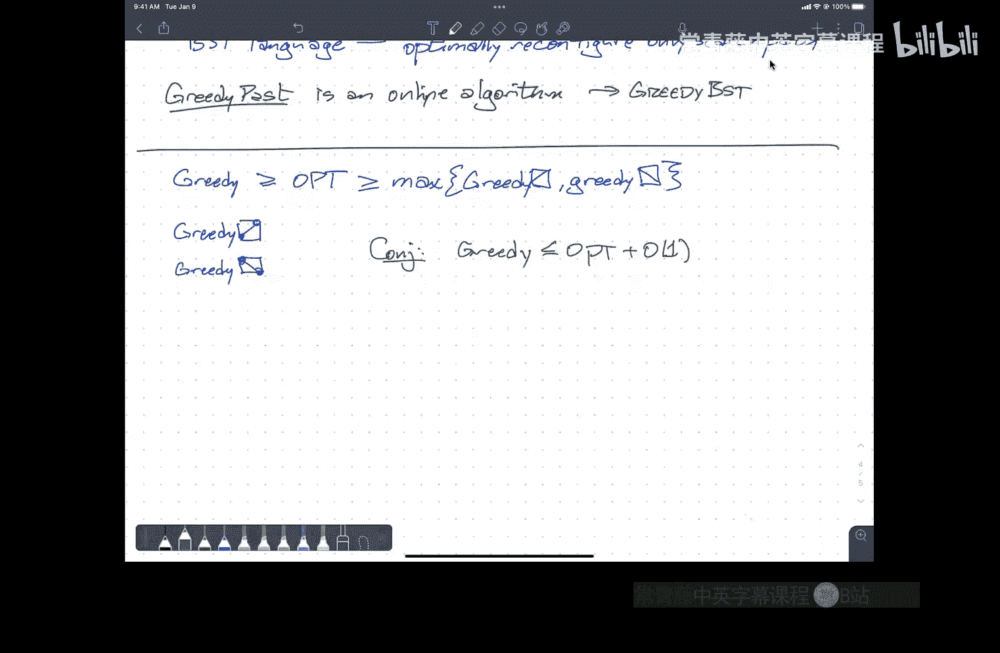

# 算法课程：CS473 Fall 2022：P27 Splay Trees


在本节课中，我们将学习一种名为伸展树（Splay Tree）的动态二叉搜索树数据结构。我们将了解其基本操作、工作原理，并通过势能分析法理解其平摊时间复杂度。最后，我们将探讨关于伸展树动态最优性的一个著名猜想及其相关的几何视角。

---

## 概述

伸展树是一种自调整的二叉搜索树。它不保证每次操作后树都是平衡的，但能保证一系列操作的总时间开销是高效的。其核心思想是：每次访问一个节点后，通过一系列称为“伸展”（splay）的旋转操作，将该节点移动到树的根部。这种策略利用了“局部性”原理，即最近被访问的节点很可能再次被访问，从而使得频繁访问的节点靠近根部，提高后续访问速度。

---

## 二叉搜索树与旋转操作

在深入伸展树之前，我们先回顾标准二叉搜索树的更新操作。最核心的操作是**旋转**，它能在保持二叉搜索树性质的前提下，局部改变树的结构。

旋转操作图示如下，它通过改变节点 `x` 和其父节点 `y` 的关系来调整树的高度：

```
    y                         x
   / \                       / \
  x   C   --右旋(y)-->      A   y
 / \                           / \
A   B                         B   C
```

**代码描述**：
旋转操作只涉及常数次指针修改。例如，右旋节点 `y` 的伪代码如下：
```
function rightRotate(y):
    x = y.left
    y.left = x.right
    if x.right != null:
        x.right.parent = y
    x.parent = y.parent
    // 更新 y 父节点的子指针
    if y.parent == null:
        root = x
    else if y == y.parent.left:
        y.parent.left = x
    else:
        y.parent.right = x
    x.right = y
    y.parent = x
```

上一节我们回顾了基础操作，本节中我们来看看伸展树如何利用旋转进行自调整。

---

## 伸展操作

伸展树的核心是 **伸展（splay）** 操作。每当访问（查找、插入、删除）一个节点 `x` 后，都会执行 `splay(x)`，通过一系列旋转将 `x` 移动到根节点。但简单地重复单旋转将节点上移可能导致树退化成链。因此，伸展操作使用两种**双旋转**模式，确保树的深度能有效减少。

伸展操作根据节点 `x` 与其父节点 `p`、祖父节点 `g` 的位置关系，分为以下三种情况：

1.  **Zig（单旋转）**：如果 `x` 的父节点是根节点，则只需对 `x` 进行一次单旋转。
2.  **Zig-Zig（同侧双旋转）**：如果 `x` 和其父节点 `p` 都是各自父节点的左孩子或都是右孩子（即同侧），则先旋转 `p`，再旋转 `x`。
3.  **Zig-Zag（异侧双旋转）**：如果 `x` 和其父节点 `p` 是异侧的（例如 `x` 是 `p` 的右孩子，而 `p` 是 `g` 的左孩子），则先旋转 `x`，再旋转 `x`（此时 `x` 已处于新位置）。

**伸展操作伪代码**：
```
function splay(x):
    while x.parent != null:
        p = x.parent
        g = p.parent
        if g == null:          // Zig 情况
            if x == p.left:
                rightRotate(p)
            else:
                leftRotate(p)
        else if (x == p.left) == (p == g.left): // Zig-Zig 情况
            // 先旋转父节点
            if p == g.left:
                rightRotate(g)
                rightRotate(p)
            else:
                leftRotate(g)
                leftRotate(p)
        else:                                   // Zig-Zag 情况
            // 先旋转 x
            if x == p.left:
                rightRotate(p)
                leftRotate(g)
            else:
                leftRotate(p)
                rightRotate(g)
```

伸展操作的效果是：不仅将 `x` 移动到根，而且使从根到 `x` 原路径上大部分节点的深度大约减半，同时其他节点的深度最多增加 1 或 2。

---

## 伸展树的基本操作

基于伸展操作，我们可以定义伸展树的基本操作：

以下是插入、查找和删除操作的简要描述：

*   **插入**：使用标准二叉搜索树插入法找到新节点的位置并插入，然后对新插入的节点执行 `splay` 操作。
*   **查找**：使用标准二叉搜索树查找法。无论是否找到目标键值，都对查找路径上最后到达的节点执行 `splay` 操作（例如，如果未找到，则对其前驱或后继节点执行 `splay`）。
*   **删除**：
    1.  对要删除的节点 `x` 执行 `splay(x)`，使其成为根。
    2.  删除根节点 `x`，此时树被分裂为左子树 `L` 和右子树 `R`。
    3.  在左子树 `L` 中找到最大值节点 `w`（即 `x` 的前驱），对 `w` 执行 `splay(w)`，使其成为 `L` 的新根。由于 `w` 是 `L` 中的最大值，其右子树必为空。
    4.  将右子树 `R` 作为 `w` 的右子树连接起来。

每个操作的时间复杂度都取决于一次 `splay` 操作。

---

## 平摊分析：势能法

伸展树的性能保证是**平摊的**。单个操作可能耗时 `O(n)`，但任意 `m` 次连续操作的总时间复杂度为 `O(m log n)`，因此单次操作的平摊成本为 `O(log n)`。我们使用**势能法**进行分析。

首先定义几个概念：
*   **节点大小 `size(v)`**：以节点 `v` 为根的子树中的节点总数。
*   **节点秩 `rank(v)`**：`rank(v) = log₂(size(v))`。可以理解为该子树若为完全平衡树时应有的高度。
*   **树的势能 `Φ`**：当前树中所有节点秩的总和，即 `Φ = Σ rank(v)`。

**平摊时间定义**：
对于一次操作，其平摊时间 `a` 定义为：
`a = t + Φ_new - Φ_old`
其中 `t` 是实际耗时，`Φ_new` 和 `Φ_old` 分别是操作后和操作前树的势能。

如果对一系列 `m` 次操作求和，总实际时间 `T_real = Σ t = Σ a + Φ_initial - Φ_final`。
如果我们从空树开始，初始势能为 0，且势能始终非负，则 `T_real ≤ Σ a`。因此，只要我们能证明每次操作的平摊时间 `a = O(log n)`，就能证明总时间 `T_real = O(m log n)`。

分析的关键是证明以下**访问引理**：
> 对节点 `x` 执行一次伸展操作的平摊时间最多为 `3 * (rank(root) - rank(x)) + 1 = O(log n)`。

由于伸展后 `x` 成为根，`rank(root_new) = log₂(n)`，而 `rank(x_old) ≥ 0`，因此平摊时间为 `O(log n)`。该引理的证明需要细致地分析 Zig、Zig-Zig、Zig-Zag 各情况下的势能变化，此处略过。

这个结果意味着，即使树暂时不平衡，伸展操作也能以平摊 `O(log n)` 的成本自我修复。

---

## 静态最优性与动态最优性猜想

伸展树不仅平摊效率高，还具有更强的性质：

*   **静态最优性**：如果每个节点 `x` 被访问的频率为 `f(x)`，那么伸展树执行一系列访问的总平摊时间在常数因子内逼近于**最优静态二叉搜索树**（即事先知道访问频率并构建的哈夫曼树）的成本。这表明伸展树能自动适应不同的访问模式。

更引人入胜且未解决的是 **动态最优性猜想**：
> 伸展树在常数因子内是**动态最优**的。即，对于任何访问序列，伸展树的总操作成本在常数因子内不超过**最优离线动态二叉搜索树**的成本。这个最优算法可以预先知道整个访问序列，并可以随时任意重组树（但重组本身有成本）。

这个猜想由 Sleator 和 Tarjan 在 1980 年代提出，至今仍未解决。它是数据结构领域最重要的开放问题之一。

---

## 几何视角：将BST问题转化为点集覆盖

为了研究动态最优性，研究者引入了二叉搜索树的**几何模型**。它将访问序列和执行过程转化为平面上的点集问题：

1.  **输入点集**：对于一个访问序列 `(t, key)`，我们在平面上点 `(key, t)` 处放置一个点。
2.  **执行点集**：当算法在时间 `t` 访问键值 `key` 时，它必须触及搜索路径上的所有节点。我们将这些被触及的节点 `(touched_key, t)` 也标记为点。

这个模型有一个关键性质：执行点集是 **Arborally Satisfied** 的。这意味着，对于该点集中任意两个不在同一行或同一列的点所确定的矩形，该矩形的边界上至少存在该点集中的另一个点。

反之，任何包含输入点集并满足上述性质的超集，都对应一个有效的动态二叉搜索树执行过程。因此，寻找最优动态BST等价于寻找包含输入点集的最小Arborally Satisfied超集。

---

## 贪心算法与开放问题

基于几何模型，研究者提出了离线贪心算法（Greedy Future）和在线贪心算法（Greedy Past）。例如，Greedy Past 算法在访问一个节点时，根据节点**最近被访问的时间**来重构搜索路径。这非常直观：最近刚被访问的节点应该放在更靠近根的位置。

**动态最优性猜想** 等价于猜想这些贪心算法（以及伸展树）是常数竞争的。有大量实验证据支持这一猜想，且已知这些贪算法的成本与理论下界（如独立矩形集大小）非常接近，差距通常只是个位数。然而，严格的数学证明仍然缺失。

---

## 总结



本节课我们一起学习了伸展树这一重要的自调整二叉搜索树数据结构。我们了解了其基于旋转的伸展操作，并使用势能法分析了其 `O(log n)` 的平摊时间复杂度。我们还探讨了伸展树更优的静态最优性质，并深入了解了计算机科学中一个悬而未决的难题——动态最优性猜想，以及如何通过几何模型来逼近这个问题。尽管尚未得到证明，但伸展树及其相关研究展示了在线算法与最优离线算法之间可能存在的紧密联系。