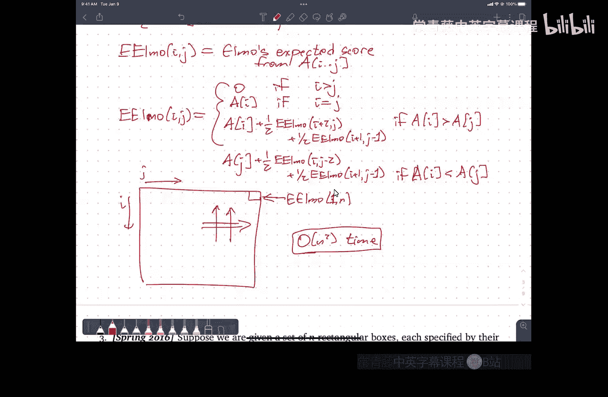

# 算法课程：期末复习课：期末考试样题讲解

在本节课中，我们将一起复习期末考试可能涉及的几种典型算法问题。我们将逐一分析样题，理解其核心概念，并学习如何设计高效的解决方案。

---

## 帕累托最优点问题

上一节我们介绍了课程安排，本节中我们来看看第一个算法问题：计算平面点集中的帕累托最优点。

### 问题定义与算法

给定平面上一个点集 S，其中所有点的 X 坐标和 Y 坐标均互不相同。一个点被称为帕累托最优的，当不存在另一个点同时具有比它更大的 X 坐标和更大的 Y 坐标。我们的目标是计算 S 中帕累托最优点的数量。

以下是计算帕累托最优点数量的一个高效算法：

1.  将点集 S 按照 X 坐标从大到小排序。
2.  初始化一个变量 `y_max` 为负无穷大，计数器 `count` 为 0。
3.  按排序后的顺序遍历每个点 `(x_i, y_i)`：
    *   如果 `y_i > y_max`，则 `count` 加 1，并将 `y_max` 更新为 `y_i`。
4.  遍历结束后，`count` 的值即为帕累托最优点的数量。

该算法的运行时间为 **O(n log n)**，主要由排序步骤决定。

### 随机点集的期望数量

现在考虑一个变化：假设每个点都是从单位正方形中独立且均匀随机选取的。那么帕累托最优点的期望数量是多少？

提示：考虑按 X 坐标排序后，第 k 个点（从左到右）是帕累托最优点的概率。

**分析**：
对于按 X 坐标升序排列的点，第 k 个点是帕累托最优的，当且仅当它是前 k 个点中 Y 坐标最大的点。由于 Y 坐标是独立均匀随机生成的，每个点成为前 k 个点中最大值的概率是 **1/k**。

因此，帕累托最优点的期望数量是所有点概率之和：

**E[数量] = Σ (k=1 到 n) (1/k) = H_n**

其中 **H_n** 是第 n 个调和数，其值近似为 **ln(n)**。

---

## 线性规划与点集分离问题

上一节我们讨论了组合计数问题，本节中我们来看看一个可以建模为线性规划的问题。

### 问题建模

我们被给定三个点集：R（红色）、G（绿色）、B（蓝色），每个集合包含 n 个点。目标是判断是否存在一对平行线，能将红色点全部置于下方，绿色点置于中间，蓝色点置于上方。

我们需要为此问题写出一个线性规划。

**变量定义**：
设平行线的方程为 `y = a*x + b`（下线）和 `y = a*x + b'`（上线），其中 `b' > b`。变量为 `a`, `b`, `b'`。

**约束条件**：
以下是确保点集被正确分离所需的线性约束：

*   对于每个蓝色点 `(x_i, y_i)`：`y_i ≥ a*x_i + b` 且 `y_i ≥ a*x_i + b'` （蓝色点在上线及以上）
*   对于每个红色点 `(x_i, y_i)`：`y_i ≤ a*x_i + b` 且 `y_i ≤ a*x_i + b'` （红色点在下线及以下）
*   对于每个绿色点 `(x_i, y_i)`：`a*x_i + b ≤ y_i ≤ a*x_i + b'` （绿色点位于两线之间）
*   明确顺序：`b' ≥ b`

**目标函数（第一部分）**：
第一部分只需判断可行性，因此目标函数可以任意设置，例如 **Maximize 0**。

**目标函数（第二部分）**：
若要求最小化两条平行线之间的垂直距离，则目标函数为 **Minimize (b' - b)**。

该线性规划具有 **O(n)** 个变量和 **O(n)** 个约束。

---

## 树形结构匹配问题

上一节我们使用了线性规划，本节中我们来看看一个关于树形模式匹配的问题。

### 问题与暴力解法

给定两棵二叉树：一棵较小的模式树 P 和一棵较大的文本树 T。我们需要判断 T 中是否存在一个根子树（即一个节点及其所有后代）与 P 完全相同（仅结构匹配，节点无数据）。

一个直接的暴力解法是：
对于 T 中的每个节点 v，检查以 v 为根的子树是否与 P 相同。每次检查需要 **O(m)** 时间（m 为 P 的大小），总时间为 **O(m*n)**。

### 优化思路：字符串匹配

我们可以将树结构编码成字符串，从而将树匹配问题转化为字符串匹配问题。

**编码方法**：
一种可靠的方法是使用带空节点标记的先序遍历序列。例如，用特定符号（如 `#`）表示空指针。这样，每棵树都能被唯一地编码为一个字符串。

**算法步骤**：
1.  使用 DFS 将模式树 P 编码为字符串 `str(P)`。
2.  使用 DFS 将文本树 T 编码为字符串 `str(T)`。
3.  在 `str(T)` 中寻找子串 `str(P)`。这可以使用 KMP 或滚动哈希等算法在 **O(m + n)** 时间内完成。

此方法将总运行时间降低到了 **O(m + n)**。

---

## 箱子嵌套问题

上一节我们处理了树匹配，本节中我们来看一个关于空间嵌套的优化问题。

### 问题建模为图论

给定 N 个长方体盒子，每个盒子有长、宽、高（均在 10 到 20 厘米之间，且所有尺寸互异）。一个盒子可以旋转后放入另一个更大的盒子中。目标是尽可能嵌套盒子，使得最后可见（未被嵌套）的盒子数量最少。

我们可以将此问题转化为一个有向无环图（DAG）上的路径覆盖问题。

**构建图 G**：
*   每个盒子是一个节点。
*   如果盒子 U 经过旋转后能放入盒子 V 中，则添加一条有向边 `U -> V`。

**问题转化**：
在最终的嵌套方案中，每个嵌套序列形成图 G 中的一条路径。我们希望找到一组顶点不相交的路径，覆盖尽可能多的节点。未被路径覆盖的节点就是可见的盒子。因此，**最小可见盒子数 = 总盒子数 - 最大路径覆盖的节点数**。

### 通过二分图匹配求解

在 DAG 中，最小路径覆盖可以通过二分图最大匹配来求解。

**构建二分图 H**：
*   创建两个副本：左集 L 和右集 R，各包含所有盒子节点。
*   如果盒子 `U_i`（在左集）能放入盒子 `V_j`（在右集），则在 `L_i` 和 `R_j` 之间添加一条边。

**求解**：
在二分图 H 上计算**最大匹配**。最大匹配的大小就等于可以被嵌套（即位于某条路径中间）的最大盒子数。
因此，**最小可见盒子数 = N - (最大匹配的大小)**。

可以使用 Hopcroft-Karp 算法在 **O(E√V) ≈ O(n^2.5)** 时间内求解最大匹配，或者通过最大流算法求解。

---

## 网格逃逸问题

上一节我们使用了匹配算法，本节中我们来看一个网络流建模问题。

### 问题与流网络建模

给定一个 n x n 的网格，其中有 m 个标记为终端的顶点。逃逸问题要求判断是否存在 m 条顶点不相交的路径，将这些终端分别连接到 m 个互不相同的边界顶点上。

这是一个典型的顶点不相交路径问题，可以通过最大流算法解决。

**构建流网络**：
1.  将网格中的每条无向边替换为两条方向相反的有向边。
2.  为处理“顶点不相交”的条件，需要对每个顶点施加容量为 1 的限制。标准技巧是：将每个原始顶点 v 拆分为入点 `v_in` 和出点 `v_out`，并添加一条容量为 1 的边 `v_in -> v_out`。所有指向 v 的原始边改为指向 `v_in`，所有从 v 出发的原始边改为从 `v_out` 出发。
3.  添加超级源点 s，并添加从 s 到每个终端顶点入点 `v_in` 的边，容量为 1。
4.  添加超级汇点 t，并添加从每个边界顶点出点 `w_out` 到 t 的边，容量为 1。
5.  网络中所有其他边的容量设为 1（或无穷大，只要不小于1即可）。

**求解与判断**：
计算从 s 到 t 的最大流。如果最大流的值等于终端数量 m，则说明存在满足要求的 m 条顶点不相交路径，答案为“是”；否则为“否”。

该流网络的顶点和边数量均为 **O(n^2)**，使用 Dinic 等算法可以在 **O(V^2.5)** 时间内求解。

---

## 卡牌游戏期望得分问题

最后，我们来看一个涉及概率的动态规划问题。

### 问题与状态定义

两个玩家 Elmo 和 Daisy 按顺序从一排卡牌的两端取牌。Elmo 总是取两端中数值较大的牌，Daisy 则随机选择左端或右端牌（各 50% 概率）。给定初始牌序列，假设 Elmo 先手，计算 Elmo 的期望得分。

这是一个可以使用动态规划解决的期望值计算问题。

**定义状态**：
令 `dp[i][j]` 表示当牌堆只剩下第 i 张到第 j 张牌（闭区间），且当前轮到 Elmo 取牌时，Elmo 能获得的期望得分。

**基础情况**：
*   如果 `i > j`，`dp[i][j] = 0`（无牌）。
*   如果 `i == j`，`dp[i][j] = value[i]`（只有一张牌，Elmo 取走）。

**状态转移**：
当 `i < j` 时，Elmo 会观察两端牌 `value[i]` 和 `value[j]`。
*   **情况 A：`value[i] > value[j]`**。Elmo 取走左端牌 `value[i]`。
    *   然后 Daisy 取牌：
        *   以 0.5 概率取左端（即 `value[i+1]`），之后状态变为 `dp[i+2][j]`。
        *   以 0.5 概率取右端（即 `value[j]`），之后状态变为 `dp[i+1][j-1]`。
    *   因此，此情况下的期望得分为：`value[i] + 0.5 * dp[i+2][j] + 0.5 * dp[i+1][j-1]`。
*   **情况 B：`value[i] < value[j]`**。Elmo 取走右端牌 `value[j]`。
    *   然后 Daisy 取牌：
        *   以 0.5 概率取左端（即 `value[i]`），之后状态变为 `dp[i+1][j-1]`。
        *   以 0.5 概率取右端（即 `value[j-1]`），之后状态变为 `dp[i][j-2]`。
    *   因此，此情况下的期望得分为：`value[j] + 0.5 * dp[i+1][j-1] + 0.5 * dp[i][j-2]`。

最终 `dp[i][j]` 取上述两种情况的对应值。

**计算顺序与答案**：
需要按区间长度从小到大的顺序计算 `dp` 表。最终答案为 `dp[1][n]`。算法共有 **O(n^2)** 个状态，每个状态转移为 **O(1)**，故总时间复杂度为 **O(n^2)**。

---

## 总结

本节课中我们一起学习了期末考试的六类样题及其解法：
1.  **帕累托最优点**：通过排序和扫描解决计数问题，并分析了随机情况下的期望值。
2.  **线性规划**：将几何点集分离问题建模为线性规划，定义了变量、约束和目标函数。
3.  **树形匹配**：通过将树编码为字符串，利用字符串匹配算法优化子树查找问题。
4.  **箱子嵌套**：将三维嵌套问题转化为 DAG 上的最小路径覆盖问题，并通过二分图最大匹配求解。
5.  **网格逃逸**：将顶点不相交路径问题转化为带有顶点容量的网络流问题。
6.  **期望得分 DP**：使用动态规划计算在随机对手策略下的期望收益。

希望这些分析和思路能帮助你为期末考试做好充分准备。祝你好运！