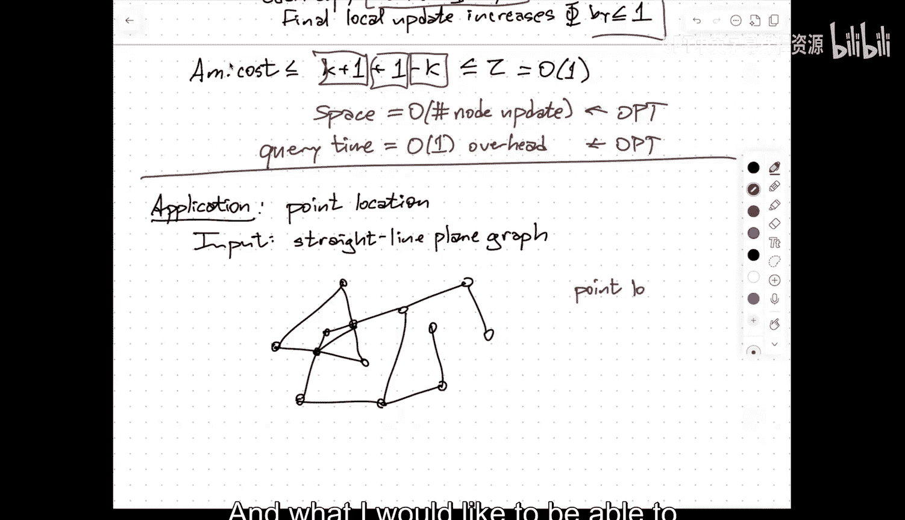
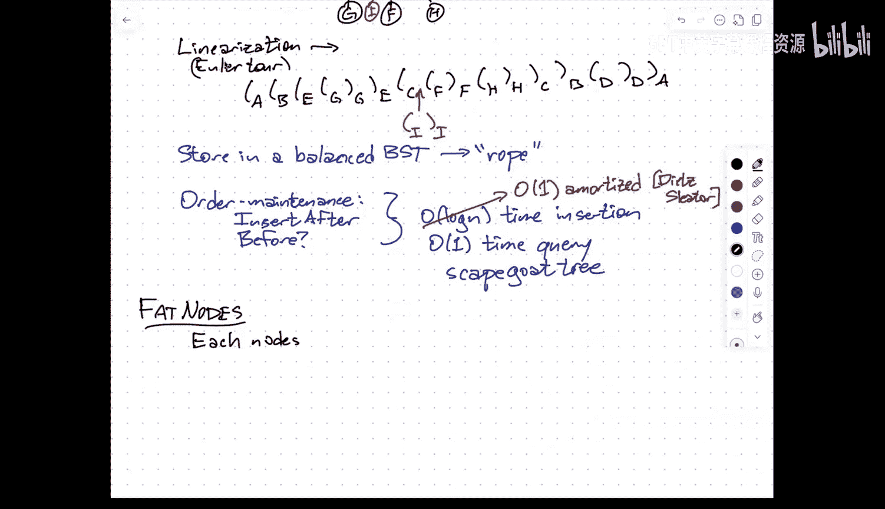
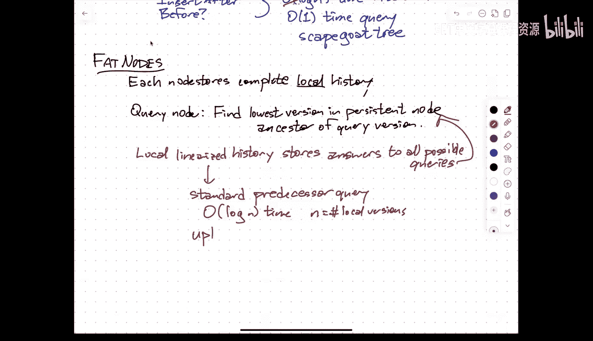
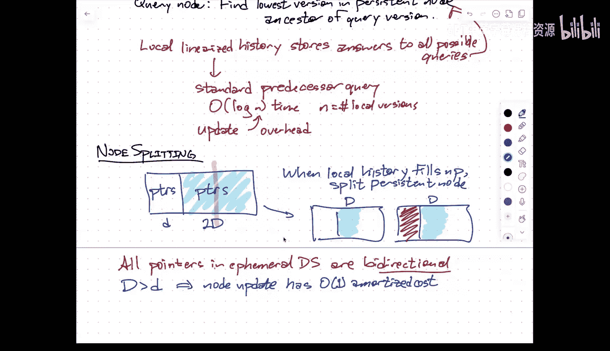

# UIUC《高级数据结构｜CS 598 JGE Advanced Data Structures — Spring 2025》中英字幕 p14 -09-Mar 12： More persistent data structures.zh_en -BV1kWFGzsEmN_p14-

But do appreciate here。嗯。Don't think I have any any new administrative things。去啊。就找不到了。嗯。

So just jump right into the lecture unless people have questions。Okay， so。

Last time we started talking about persistent data structures。The idea being that。Of。

We're not only designing about the we're not only seeking the data structure where we can do queries and updates and only do queries and updates in the most recent version of the data structure。

 but in some sense we have a record of history and。In the simplest version of persistence。

We're allowed to perform queries in。Past versions of the data structure。

And so this version of persistence is usually you referred to as。Partial persistence so we can。

Query pass versions。嗯。And we can update and modify。Only the most recent version the current version。

And。Rather than recreate a new copy of the data structure completely from scratch every time we perform enough。

The idea is to do local modifications。Create local copies of portions of the data structure。

 but share portions of the data structure between merchants。So。

When we insert something into even a balanced binary search tree the idea is hopefully most of the tree hasn't changed most of the pointers coming out of most of the nodes are the same before and after the insert and so we couldn't need to store both an explicit copy of。

Most nodes in the old version and a different copy of the newverk。

I only want to copy this much information we need to。

To make it act like there are two independent data structures。😡，嗯。And we talked about。啊。Two methods。

One is called path copying。This is specifically restricted。To。Rooted forest structures。

And the idea is whenever I form an updates as people node。嗯。I duplicate。

The entire path from the root of the tree containing that node down to the node。And then later。

 if I want to access that version of the data structure in particular I've created a new version and a new independent copy of the root so dials might access into that version of the data structure and then from that point on everything behaves as though it were an ephemeral data structure Okay so in terms of。

You know。The query time。Into any past。Version， so maybe I should say the persistent。

Query time is big O of the。Thephemeral。Querery time。

And I think actually in the most direct inlin of this。

 I can delete the video from this expression and just is that assuming that you have a pointer directly to the route that you want for every version of the data structure。

 maybe there's some plus log n or plus log goin on top of that。

 if I like only have a timestamp that I need to locate the corresponding route。The downside。

Is that the space。What I would like ideally is for the space bound to be proportional to the number of times during the history of the data structure that I needed to modify in one of the cells in memory。

That I need to change the search key or change a left corner or right under or something like that。

But。Instead。The right way to say this is the space is up to big O。Sort of the sum of the depths。Of。

Let's call the note updates。And in particular， if you're doing this with a binary search tree。

This is going to be。Something like。If it's a balance binary search tree。

 this would be something like log n times the number of updates。The的。Again。If you do it blindly。

 the number of no doubt。That's。Actually， quite a bit bigger than the sum of the ephemmoallyptic times or can be。

This is assuming that just let me write this down。This is assuming that this is like a balanced。

Bary research Street。So in terms of query time， this is， perfect。

In terms of both update time and member use， this is a little bit wasteful。

Now there are more careful ways of implementing ca copying for specific native structures that can lower that data usage。

 but as a black box technique， this is the best we can hope for。With this method。

 the other possibility is to use something called fat notes。

Here the idea is every node that ever appears in the structure。Keeps a complete copy of this history。

系。嗯。So now。Querries。Have， you know， if I implement that。Local history is just an array。

The problem is every time I want to access a particular version of a node。

I have to do a binary search。Over the list of all versions of that node。

To find the predecessor in time order of the version I'm querying。

 so I want to find the last time before the version I care about that this node was updated。Right。嗯。

With。A little bit of help from you know more advanced data structures。

 I can take advantage of the fact time timets are just integers and I can reduce that log n down to a log log n by by being a bit smarter about my data structures and something I'll talk about later。

 I can reduce the multiplative overhead down to additive。U。But at its baseline implementation。

 I do get this logarithmic overhead in the query time on the other hand。

The space is proportional to the number of rights。To the Marine。

So the only time I add anything to the data structure is when I modify some the data in the most recent version of the fe data structure。

Right， so。This。Is optimal。This is optimal， but this is okay and。This is okay。嗯。啊。

So the first thing I want to talk about today is a more complex method that。U。

Gets both of the optimal results， so query times are going to be within a constant factor of the ephemeral query time and the space is going to be proportional to the number of proemeral rights。

嗯。And that。Is。Called the node。Splitting。Method。嗯。Any questions about the stuff that we covered from Tuesday for？

Yeah。So very into。NoSo the。I guess going say when talk about walk with overhead。Okay。

 so is supposed to be ephemeral data structure answers to where we can swear to？Then with that notes。

In based on communication。Accessing an old version of the structure and answer the query。

 we take shorter than times to log out。With slightly more advanced center structures just answer these prey queries in the right version could be square then b b。

And then with another trick fraction of cascading， get that down to sort of sort of the time log n square than plus log end so the log end damage which good。

I'm not sure whether you can do both。Additive overight and the blah， bla stuff that's the。O。

So the idea of node splitting is。Each node doesn't store。😡，So each persistent node。Doesn't store。

A conency of underfeeral node， but it only stores a constant number of versions。Of。An ephemeral note。

In。Actual description of this in the paper by。Driscoal saracax ster and tarn it turns out that that big0 over one could just be two in fact it's enough to keep one full copy of the node plus one extra field that stores a modification for one field inside that note so maybe i'm allowed to change one pointer and that just stored there or i'm allowed to change one certificate that should stored there the analysis a little bit。

More transparent， I think if you think of that big of one， it's like four or three。啊。

But the precise value isn't that important as long as it's strictly larger。

And so when I want to do a node update。There are。So initially， when I create the node。

 I'm only creating its initial version。And the other slots in the persistent node that store other versions are just empty。

Okay， so if。Some。Version st。Is empty。Just。Add the new version。

To the appropriate persistent the persistent node。Otherwise。I will create。A new persistent motive。

That contains only the most recent version of the ephal node。

And the old persistent node where I was filling in new versions becomes dead it's it's frozen。

 It's never going to be changed again， Okay， so otherwise create。A new。Persistent node。With。

Only the current。V神。And now for the part that's sort of a bit nontrivial。

 now I'm going to recursively。嗯。Update。The parent of this note。Now I'm going to。

For purposes of discussion。Here。I'm going to assume that the data structure is a tree。But in fact。

 this method works for any pointer based data structure provided that any node in that data structure has a constant well node defined something that takes it a constant amount of space that implies that it has a constant number of outgoing pointers。

But it also this method also requires to have a constant number of incoming partners。

So the example of a data structure where I can't use this technique blindly is the standard up tree data structure that's used for a union find。

I going to maintain disjoint sets with the operations。

 what set is this item in or particular are these two items in the same set and replace these two sets with their union。

The usual data structure for that is there's a node for every element that has a pointer upwards to a parent。

 but there's no limit。On the number of nodes can have the same nodes as their parents。

 the number of children of node is not bound。So number of pointers going into a node could be arbitrarily large。

 that's going to fail here because when this reive update now is things are going to explode。

So as long as the number of parents is constant。This technique will work。

 you'll need to change that big o of one to be larger than the number of parents。

 but I'm just going to assume that for right now this means。Every。Noode。Has at most one。Incoming。

Pointer。嗯。嗯。So notice here that it's possible that by updating a single node。That might。

Forced me to create a copy of that node request personally updated the parent that creates a new copy of the parent I have a personally grandparent and so I get this cascaded。

哎，啊。So in principle， updates can cascade。So in the worst case。This devolves into Pa cup。Okay。

 so it's possible that I do take every node on the path from the node I want to update all the way up to the root with the tree that contains it。

But in an amortized sense， I would argue that that doesn't happen。Okay， so the idea is。You know。

 I'm going to argue that this takes amortized constant。Time and space to do the single note update。

And。Okay， so I'm going to use this do this using a potential function。

 so I'm going to define the potential of the data structure。To be the number of full nodes。

In the most。Recent。Version。Of the data structure。And these are nodes where if I try to update I will have to do。

 I'll have to make a copy and cascade， but and I'm only counting full nodes in the most recent version so a node that's already undergone a copy the old version is now dead。

 it's not counted here。Okay， so let's。supposeose。A。Noe update。Induces k copying k copies。俾。

So I need to update， I need to copy that node and its XK minus1 ancestors before I get to a note that I could just write the new version in or I fall off the top data structure。

 so this means I'm essentially going to be doing Kless one operations。

K of those operations are companies， one of those operations is a local update。Okay， each copy。

Reduces。There's potential by one。And then the the。Final local update。If it happens。Increases。

The potential by at most one。Okay， it's lost that that final version of it doesn't fill that node and so it doesn't change its control。

So the overall amortized cost。Is it most the actual cost？啊。Plus， the increase in the potential。

Which in this case is at most1 minus k。So this K plus one operations that's here。

And this reduced k by one， that's the minus k。And the increase by one， that's this plus one。

But this is， you know， at most two。So it's constant。So in an anergized sense。

Every time I do an update in the most recent version of the ephemal structure。

That is going to induce a constant amount of work。Both in。

Time to execute the update and space in order to restore the results of the update。Okay right。

So overall， that means。That。Space is proportional to the number of node updates。Which is optimal。

On the other hand。Very time。When I read a particular or node。嗯。

Because whenever I create a new copy of the node， I update the parent to point in with a new version of the pointer going into that node。

 if the query algorithm reaches a particular node， that node actually is the correct version of the node for the query that I'm performing。

And then I have I don't know two or three different versions of that node that I want to test。

 so in constant time I can figure out which version of the node is the one that is relevant for my query again it's like which of these is the most recent version that is before the version of data structure that I think I'm asking about。

So that's the last time this particular node was modified。And so at every node in thephemeral。

 is not sure。That the G album visits。In persistent data structure。

 you spend a constant amount of time to figure out which version to look at。

 but then the pointers down to my children are actually correct。

They actually correctly point to the correct burdens。

To the correct persistent nodes that contained the information relevant to the version of the overall data structure that I care about。

So this is a constant amount of。Overhead over the ephemeral query time。Which， again， is awful。嗯。

So again， the only changes here if I've got more than one pointer coming into a node。

Is that if I say dot d pointers？Coming into a note most de pointers coming into each node。

 I need to keep at least d plus one different versions。That is going to change。

The amortized analysis slightly， but I think in the end。

 the advertisetized cost that you'll get here is something in order D and simple one and if you just do groupte force within each local node。

 you're going to get order D overhead you organize those internal local versions using something more interesting like a binary research tree this with be order block D but hopefully D is a constant anyway。

 so that doesn's what Yeah also we need D plus a little local variance because every single two quickly that's going to trigger a D because every time we duplicate we're instating。

GSomeone bank enough local version to not be that to offer。You want to make sure that you。

The in effect， the easy updates。Pay in advance for the more complicated rehes。Art。So。嗯。

Before I jump into how to make this all work。With。Fuold persistence。

 I think may be stepping aside a little bit and talking about one fairly common application for this。

嗯。Which is something that comes out of computational geometry， this is the point location problem。

Okay， so the inputs。I think the easiest way to say this is it's a。嗯。Straight line。Pen。Gra。

Think of this， if you like as a collection of line segments in the plain that have disined interiorrirogs。

So or no。They might have shared endpoints。They might cross in the middle。Actually。No。

 they won't cross in the middle that's what that's what that's what straight line plane graph means Okay。

 so I've got some decomposition of the plane by line segments。And what I would like to be able to do。

Is answer a point location query。

Which basically says。

You know， where is？Point。Given a point Q where is it so'm to i'm going to be you know sort of specific about this given a point Q the way that i'm going to encode where it is so I'm going to imagine shooting array in some fixed direction let's say downwards and ask what is the first segment of this。

In this particular case， but that point Q， that ray only hits one point。

 but you can easily imagine at this point Q primeed， I've got several candidates that that might。

I might consider。可以。😊，So。The first question is。嗯。You know， I want， I really want to think about。

Data structures in particular， but the persistent data structures is kind of like the record of the execution of the algorithm。

嗯ello。And the way the family of algorithms that I'm thinking about is something called a sweepbl algorithm。

So what I'm going to imagine。Is that I have a vertical line。

That is sweeping over the points end lines from left to right。

And as the line moves across the line segments。I'm going to maintain。

A data structure that would allow me to do point location queries if the query point happens to lie exactly on the line。

Okay， so。Over time， my data structure is going to change， but let's say I get to this point here。Now。

 at this point。If I ask。Given a point on the green line， what's the line segment below it？

This is the same as doing a predecessor sensoror query for a set of， in this case。

 three y coordinate。嗯。So all right， so the idea again is。The intuition is move。A。Vertical line。

From left to right， and maintain。And ephemeral structure。To answer。Point location queries。Or。Points。

On。The line。Okay。😊，No。One thing that is a little bit counterintuitive we' in fact run into decision forward is。

If I just say I want to balance binary surgery tree over the Y coordinates。So intuitively。

 you can think of it as， okay， I've got a validfin search for at these three y coordinates and as the line moves to the right。

Those Y coordinates are continuously changing。don't really have a good model for continuously updating the data structure。

 but the thing to observe is that this data structure only changes structurally when the sleep line passes over a vertex。

So。And think of this now as。A binary search tree over the intersection points。And I update。At。

Pertices。Okay， now。What am I actually going to use it as my search pieces inside this binary search tree？

Is not the， I'm not going to store the Y coordinates explicitlyly。

What the sword said is the identity of this people。Of those three seconds。

And then when I'm asked the point location query， at that point， I'm given an explicit X coordinate。

And so given say the XY coordinates of a query point and the XY coordinates of a line segment that I know lies on the of the line through that query。

It's not that hard to determine in constant time whether the point is above or below that mindset。

I can compute the think of that green line as the y axis。

 that can compute the y inter sets of that line segment and then compare it to the y coordinatelucor point。

the usual way of doing is actually plugging a three by three determinant where six of the entries are the coordinates of the segmenting points and the coordinates of the query point。

 but the details aren't really important。The query， the question am I above or below that segment。

Is a question about six numbers， the X and Y coordinate of the query point and the X Y coordinates is the two second end points。

 so any question about six numbers can either be solved in constant time or can't be solved at all。

And in this case， hopefully easier to see but it can be solved，嗯。So indirectly。Bye。呃。

segmentment indices。可以。So if I want to build。If I know all of my very points in advance。

Then I would sort the query points by their exords and left to my order。

And have query events when the sweet line hits one of those query points。

I then do the query in the ephemeral data structure that the suite line is maintaining。

 get the answer to that point location query and then continue on。

 so get this mixture of queries and updates。But hopefully it's clear each of the queries is going to be answered in log n time。

Because it's just a balanced binary search tree。So。Thephemeral brewries。That takes log in time。

And the ephemeral updates。That's going to take。Log n time times the degree of the vertex that I'm sweeping over。

So if I'm sneaking over a vertex， it has five segments incident into it on the left。

 then four segments is into it on the right， then my data structure I'm going to do five weeks and I need to do four inserts。

哎。嗯。So the total time for all of those queries。Is N login？Because the sum of the degrees。

Is equal to twice the number of edges。Every edge is insert once one insertment onevoltion and the number of edges in a layer graph that has adverly is to go down。

And so some of the degree just comes up to the govent log in。Now。

 if I then make this sleep line structure persistent。

Then I need perhaps log in time given the X coordinate of a query point。

 I may need to do log in time to figure out you know， which version of the day structure do I want。

To query， that's the same as asking， find me two vertices。That scrabbled like query point。

 one and left one on the right so that's a simple predeor query。

But would the virus with period take a while at of time？

Then once I've identified the correct version of the ephemeral data structure。

 persistence allows me to query it as if it were the only ephemeral data structure。😡。

So if I make this persistent。Then my， you know。Query， the past。

 which is the same as my point location query， this takes log n time。And the total amount of space。

Is Mgan。Because。If I use search for， I guaranteed the total amount of space。Is。哦。

Equal to the number of changes I need to make to the data structure。

 which is upper bounded by the total time to do those updates。

If I'm actually a little bit more careful。嗯。啊。If I use the right data structure。

 the right balance signary search tree。😡，嗯。I can get rid of this log factor。

So the thing to the way you think about this is。The number of times that I need to write into the data structure to execute and update is at most the depth of the update in the binary search tree。

But could be less so in particular， if you a carefully。

carefully architected red black tree or something on the weak AVL tree or rank balance tree。

 even though the update time is log in， the number of times that you actually need to change data in the data structure is only order one。

So the number of node updates is constant for each insertion and deletion into one of these balanced binary researchers。

And so that's going to reduce。It's time to reduce the total update time。

 but it is going to reduce the space because the space only takes into account rights。Not breeds。

So these。The use。A weak AVL tree。诶。Constant number of rights。P。Insertion or deletion。可。😊。

And so the persist allows me to just say， okay， I want to do something this to structure。

Aances are pretty good but I'm going to need to do this sweet point thing anyway to answer sort of global questions about the data。

 but as long as I do that I might as well make my data structure persistent。

Which I can down to use black box technique。And do it quite efficiently if I use right underlying by box。

 and then I get this automatically in this two dimension。对。不。This， by the way。

 took a long time for the data instruction community to converge on。

There were a lot of different data structure for this point location problem that got you know n squared space and log n query time or but just literally sort every version。

Or linear states but log squared in in query time and there was in another linear space block rather than in query time structure before this。

But this was sort of like just simple。Drisal Starak Ser Har did all the work。

To make things persistent not just kept done。Yeah question this are pretty much optimal， right。

 just you can't be old in space and kind of need log in search time for anything as the person base。

Yes， for anything comparison that now there's there there。

As long as you're in the realm of pointer based comparison based data structures。Then yes。

 this is optimal。If you want to take advantage of that。That。

Say the coordinates and vers are small integers。Then you can actually repeat this using the same kinds of things we haven't talked about yet for doing predecessment ques and blah。

 blah out。So。啊。Timothy is one of the people who sort of drove that particular body of work it's like hey。

 we have all these problems and we know they're optimal because they all run an in end time where they have linear space logithmic query time yeah。

 but we can take advantage of，Things that we can do with on the word Ram that we can't do in sort of the abstract real realm。

 which is where most computational geometry works。That can reduce not the space because it's already linear。

But you can reduce the query time below login。And you can reduce the overall time to do the sweep。

From and log in down to something smaller。And a related question so like from this perspective。

 we can kind of see a persistent data structure as really a way to have a lot of different like basically a collection of data structures seems to run space efficient thing Yes。

 as long as the data structures there are kind of continuous in way like theyre like Yeah I mean I think of it more as as I can plan a bunch of data structures together provide differences between basic data structures in that sequences all Yes exactly yeah。

And we saw this again earlier， both the same sort of intuition of making modeling。

An algorithm by continuous change， the multiple source charges path problem。

 we continuously drag the source cortex around the outer boundary of graph。But in fact。

 we only do updates when there's a structural change。

 and we needed to do all the design the tree itself to find those and execute structural change quickly。

But then provided you use the right underlying dynamic forest structure。

 you just go banned the persistence hammer。And now I can retroactively query any pass version of that shortest path tree to find the distance from any node on the outer boundary to any node in the graph in log end time。

And again， same in tuition， those shortest past trees are not changing by very much from one version to the next。

So I can pack them all into a compact。Overall data structure。哦。No。

Something that I'm not going to talk about too much。

There's also a notion of what's called a retroactive structure。Which is。

The hot tub time machine version of persistence。So actually， you know what？

Go back in time to eight o'clock this morning and insert five。And now in the presidents ask。

 what's the predecessor of six？And because of that change I made back in the past。

 my answer now to what's the predecessor of six is it might be different。And in fact。

 I could go back to 430 this afternoon it's after the retroactive update and now I ask to saying。

W that I've asked before， but now I'm going to get a different answer because I've changed history story。

And so using retroactivity。I can actually exit and make this persistent data structure。表面。

But I can say actually don't do the insertion at that left end point and don't do the deletion at that point。

 a modified that's the same you' saying that that second doesn't。And now by retroactivity。

 I updates I make find persistent day structure。本院。But then made that。

Diament persisted data structure。Reist。And now what I've filled is any three dimensional data。

And so there's this lovely ladder that you can find that a five dimensional data structure can be designed by making a persistent dynamic。

 persistent dynamic， persistent dynamic， persistent dynamic， one dimensional data structure。

And the things work out so that this actually is in in some cases。

 the best way we know how to build those， the most efficient way we know in terms of pulse space and query time。

 at least in the pointer。Comparisons well of building these higher metric。O。

I'm not going to talk about retroactivity in any detail， I'll leave a pointer on the schedule page。

To some of the literature， you're curious about that。Okay。

 so this is all partial persistence i'm not going to be able to talk about full persistence in complete detail。

 but I do want to point out。Some of the differences and the major hurles that are involved in making this work。

The most significant one is that， of course now history。

 the set of versions that an the femo data structure could be in is no longer a simple linear sequence。

 but rather a tree。Okay， so I'm going to use。This example just。Here's。D， this is E， this is F。

This is G。And I don't know， this is H， so the the alphabet here is indicating the order that I created these。

But the way updates happen is I point to some version of the data structure。

By the handle that was created when that version was created。

 and I say update this version of the data structure by inserting something or changing the search something that spawns off the branch。

病呢个でた。Um so。啊。This is an architecture tree。And in general， we're going to be asking things like， hey。

I want to do a query in some version of some node in this persistent data structure that I've built。

But that node doesn't have a copy for every single version of the global data structure。

 it only has the subset of those versions， how do I find what version of this node I want to re？

So I need to be able to reason about things like。Prepis and antstral relationships within this arbitrary tree。

 which is changing over time and arbitrary trees that don't behave well。So I'm going to do。嗯。

Linearization。Otherwise known as Oer tour。嗯。I'm going to do one level of in direction on this tree。

 which is more or less identical to what we did with boil or trees。

And also what we did with partissian treess for the arrangement inquiry。哦。

It would be a slightly different form。But the idea is the same I want to represent the version tree as a string or as a sequence。

So that I can do things that look like predeceptor queries when I'm say， hey。

 what's the most recent version before this one where this node is up？Okay。

 so the way that I'm going to do this is I'm going to write open parentheses。I enclosed parentheses。

So I'm going to write the first time an oil which tour visits the node starting with the root。

And I'm going to write down the last time Im order look for visit the node。

 but I'm not going to write down the intermediate give。

So I'm not actually ever going to be interested in least common ancestors。

So we'll give you something like。This。C，F， F。H， H。See。B。😔，D the。Okay。哎。No。This。

Representation is going to change whenever I create a version of anything。😡，So in particular， now。

 if I decide to create version I， let's say here。The way that that linearization changes is I go to the left parentthesis corresponding to the version I'm updating。

 and I insert a new open brand a new and close brand。嗯。Now。Of course。

This means now that I'm maintaining sequences。And I want to be able to do things that hold my on research over these sequences and new predecessor queries。

 but now I'm doing insertions into the sequence。So I'm not going to just use a standard arrayator instead I'm going to store in a balanced。

Binary search tree。Just like we did for Ouler tor trees。嗯。

The balance by your research3 representing the symbols in a string， this is sometimes called a rope。

So a rope is a data structure that allows me to have。

Not necessarily constant time but random access to the string。

 it allows me to do combinationations quickly， allows me to do insertions or deletions quickly the only thing I'm going to need actually to be able to do here is to be able to do insertions。

嗯。And so this is just the standard insertion algorithm for binary research streets and so they never have to do delets that actually simplifies the data structures so I can use the road。

嗯。Okay。Now。One of the other things that I'm going to need to be able to do， though， is。

I want to be able to ask。Like in this linear order is one version before or after another version。

Okay， so this is also going to need what's called an order maintenance data structure。

Which is in this case， going to need to handle only insertions。But I also need to answer queries。

 is this before that so in fact。The insertion is insert after。

 so I want to insert those two new symbols immediately after left re C。Hey， you've seen this before。

We were talking about slay trees。I described a data structure that did a similar thing of ordered file maintenance where I needed to keep a sequence of things in a contiguous block of memory to be able to answer insertions be to do before after periods。

 but also to be able to scan any K consecutive items in order K time we no longer have the scanning input。

So that means this can be done in。Log in time。For any insertion。And a constant time for any query。

Using essentially a scapegoat tree。So the idea is。Implicitly by maintaining these versions in saga tree。

 the path of left and right pointers leading from the root of that sgo tree down in a particular version。

Gives me a sequence of bits that I can use to encode version and one version is further into the left than another as a sequencing interpreting a sequence of bits of a binary number。

 one version's label is less than the other version's label。

And so essentially I'm assigning a an order login bit label to every version。

And then if I wanted to know whether one thing is before the other。

 I just compare this to labels as inatives。And it's reasonable to assume that I'm working in a model where I can store log end thats a single word。

 and so that comparison takes constant。Yeah， and this is a very naive solution of just looking up the four symbols for the two nos and just。

 you know， enlo at plan variation know which one's necessarily be the other kind within the role。

Yeah， so the the， the main issue here is。Yeah， if I just if I just look at the rope and I want to know is one symbol that I'm really asking about like is left parent G before or after white parentnh right so how pointers may be directly to this inote to the rope。

I could walk up to the least on an ancestor that one the left and between to the right now they take me walking and this one's on the one。

 but this is constant because it essentially and encoding that of information。好嘅。And in fact。

 I can use that scapegoat tree for the order maintenance saying ask my balance binary search tree to handle insertions。

So this is really the order maintenance data structure。

Is also that I'm using to maintain this order is my rope。But on呃呃。To do the four after groupss。

 I'm just comparing these log ofbit labels。嗯。If I apply one layer of indirection。

It's using not using the same date structure anymore， I can reduce， sorry。Yeah。I can actually reduce。

嗯。The insert plane in manner， I said， Senator Palmton。This is a trick that was。诶。呃。

First used by Deens Slater。Essentially ice look up the things up into log in for chunks。

And I only actually trigger an insertion of the data structure after inserting log inferences。

So the log n insertions pay for the log end time to do the insertion？嗯。Okay， now。

Let's think about what we would do now with fat nodes。可。Now each。Noode。Stores， again， a complete。

Local history。

And this gets the optimal space in the end of the question is how would I actually do queries so when I want to query a node。

I need to ask。You know， find。Lowest。Version。In the persistent node。That is an ancestor。Of the query。

Version。Okay so in effect。Each fat node is going to store a subset。Of these versions。

 a subset of notes。In the version tree。This subset of nodes is sort of。

Creates in the sense that any marked node is either going to have every marked node except one is going to have a nearest marked ancestor so you can think of it as there's a local version tree that just includes those four marked nodes。

 but now I ask about。啊。Note F。And so in the data structure locally， I'm only going to be you know。

 looking at， say， these。These things are the only ones that show up in my local structure and then I want to say。

 oh no doubt。I'll point to that node and say， okay， what is the smallest。

The narrow pair of matching brackets that enclo that。

That among the ones that are stored life out them。嗯。Um。So。It's not terribly difficult。To say。

 you know。The local。Linearized history。Simply stores。The answer。The answers to all possible queries。

Of this form。But this sort of reduces it to a sort of standard。U preredecessor。Quer。So the idea is。

 say I want to know what the nearest smart ancestor of version F is。

So here I am looking at version F， the first thing I'm going to do is find the preice。

Among the marked parentheses in this linear ice。So to do that。

 I'm using the before queries from the order main status。

Okay so finds the opener close brand that closes to this essentially industry student partners。

And so I do a binary research to find that position that actually is marked in yellow there。

 and my in the subset data structure， I'm simply going to mark right down。

Anything that falls in here the answer is C， anything that falls in here the answer is H in here at C in here the answer is E in here the answer is A in here the answer is A。

And when I to an insertion into my local history， that's going to require me to do a constant number of updates in the record of the answer to all experience。

Okay so the the punchline here is this is all going to happen in。呃。

Log n time where n is the number of local versions。And similarly， when I do an update。

This is also going to。You know， I'm going to have this logarnic overhead update。啊。

There are more efficient ways of doing this。Slightly that reduce some of these logs to constants or to log logs。

 but here most just wanting to probablyote you that there is something Im done here。

In figuring out， hey， when I'm looking at a node， how do I figure out the right version of that node to be reading from given the version of the data structure that I care about？

嗯。O。So again there's still this login overhead just like there is in the partial persistence model。U。

The other thing we can do。That is the equivalent or the correct generalization of node copying is something called node splitting。

Now note copying your note you'll remember when a node fill and create a new version of that node and the old version is frozen and grow。

Now because we're doing full persistence。No note ever doubts。

Every node in the data structure stays alive forever。

 meaning that I might need to update it again later。So there are。The basic idea here。

Is within each node。I'm going to have， say， D， you know some number of some amount of data including pointers to other node in the eem data structure。

 but now in the persistent data structure，I'm also going to have。New versions of outgoing pointers。

That are created by ephemeral updatess。Right。嗯。So when。The local history。Fills up。I split。The node。

 I split the persistent node。So this now becomes。Two persistent nodes。Only now when this filled up。

I'm going to store the information about the first half of those updates in one copy of the note。

 and I'm going to store the second half。嗯。In the other company。

So really the right way to say this is imagine I've got 2D。Two deep local history pointers。

 I'm going to store I'm going to split that into two notes， each of which stores only two different。

Ephemeral data that's stored in this version， that comes from whatever you know version of the data structure is kind of in the middle of the history before。

对。So。One technical difficulty about this。So again， the idea is when I do this slit。

 I'm then going to trigger a recursive update to my parents or to whatever nodes are point to me。

In order to really make this work out。I need。All pointers。In the ephemeral data structure。

Are bi directionional。So when I do slips。In theheal age some that you originally started with。

Anything that that node splits， anything that that node。

Anything that points to that node needs to be updated to point to the current version now in the persistent data structure of that node。

😡，In order to do that correctly， I also need to update the parent pointers in end of my。

So any end pointer this the into that ephem node， anypointed and so out of that e node。

 I'm going to get to the requicursive update so this set of pointers over here little D that includes all incoming pointers and all outgoing pointers。

In order for the amortized analysis to work out， this can be needs to be larger than looked。

But once you do that， then the same kind of potential analysis implies that the overall cost of a single。

No update in the persistent data structure is constant。So as long as D is greater than D。

 each node update。Has。Order  one。Amortized。Cost。And as long as both little and faculty are constants。

This also means that the overall query time only has a constant amount of multiplicative overhead。

There are a lot of details that I haven't talked about in how to make all these forward and backward pointers。

Actually consistent there are some additional complications in how to actually execute the queries correctly similar to the ones that came up with the fat note stuff this is all described in this。

哦。Driscoal sarck slater tarn paper that I'll link to on the course web page， but in the end。

You get the optimal balance that you want。Revi you're starting with the data structure that has both every node。

 both constant out read and constant。Right。That's as much as I of time to talk about。

I'm happy to answer your questions afterwards， but least have a restful break。

Spend a little bit of time maybe thinking about project proposals。But Ill spend most of the week。

Actually， by the break。And I'll see you in a week and a half。All right， thank you。

