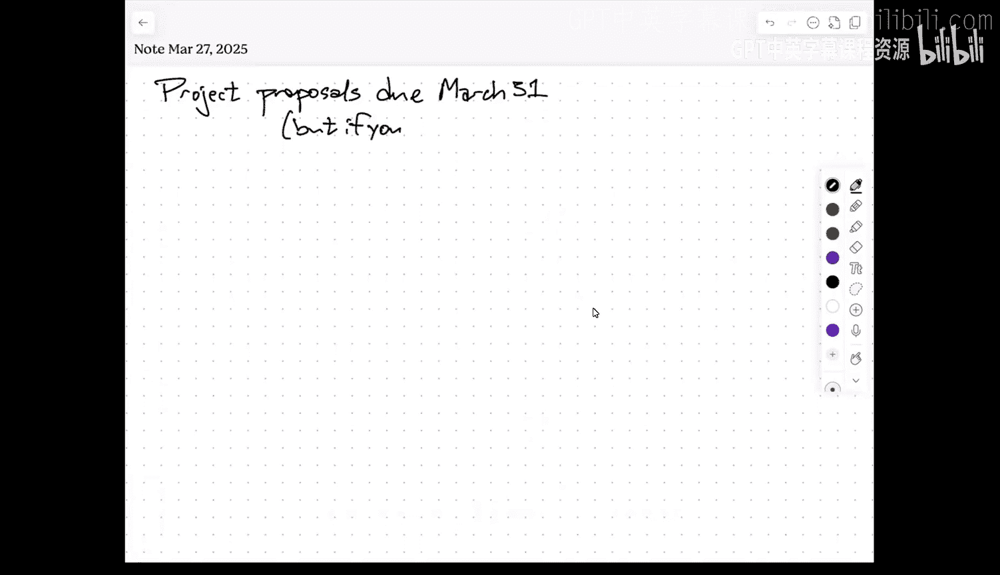
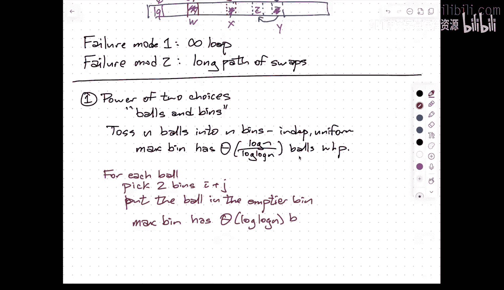
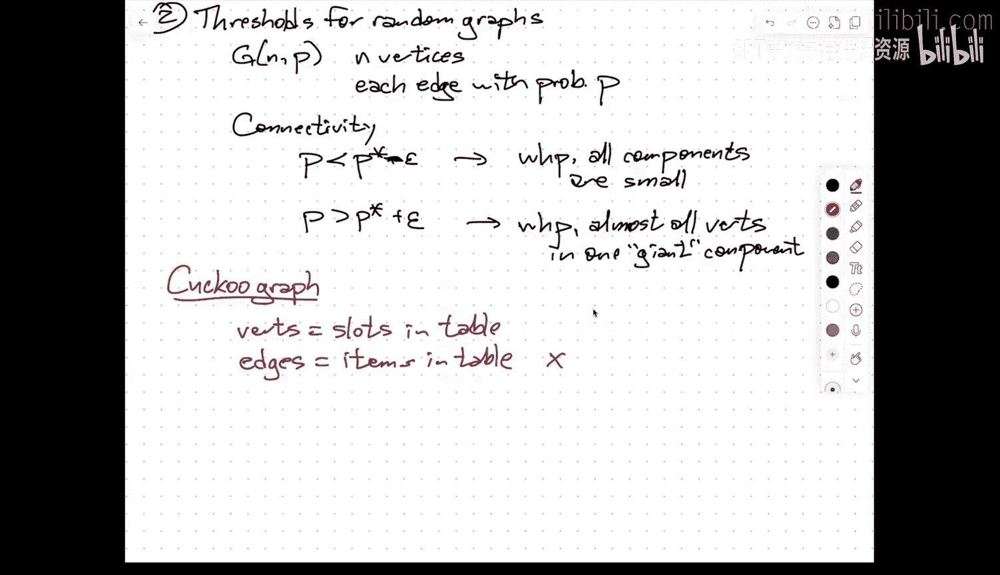
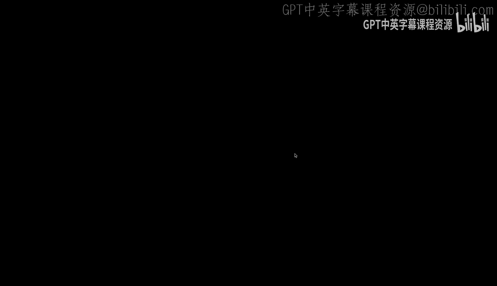
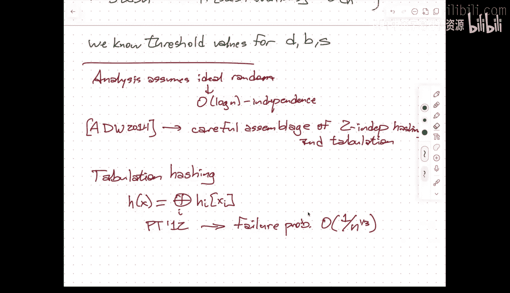

# UIUC《高级数据结构｜CS 598 JGE Advanced Data Structures — Spring 2025》中英字幕 p15 -08-Mar 27： Cuckoo hashing.zh_en -BV1kWFGzsEmN_p15-

But I need to give my Apple pencil a few minutes to charge up。U。

So as someone just pointed out to me the website。Had the deadline for the project proposals in more than one place。

And when I changed the deadline for the proposals from April 7th。

Which is a week from this coming Monday to March 31st， which is this coming Monday。

I did not manage to change all of them， So there's still one that says April 7。So。If you can。

 please try to get the project proposals in by Monday。

If you don't think you're going to be able to do it by Monday because you were relying on the April 7 deadline。

Do your best but send me email and then depending on what the responses are like。I will， if I get。

 you know enough of the proposals。By this coming Monday， then I'll present。

The proposals by on Tuesday。If it takes into they come in a couple of days later。

Then I'll present them on Thursday。And if all else fails， I can do the presentations next Tuesday。

 the downside of this is。The reason why I moved the deadline earlier by a week。

Is because normally when I teach this class， I have the we do the project presentations during Fis week。

But I will be traveling during Fis week。So instead， we're doing the project presentations earlier。

Over the last week， week and a half or depending on the number of teams。

 maybe even the last full two weeks of the semester。So because the presentations are earlier。

 I wanted there to be more time。After the proposal to work on the presentations。嗯。

This will so the later that we get the proposals in enough of the proposals in that I can present them to everybody the more time that you will have to use that feedback to create groups and work on the project before you need to propose describe your progress in the presentations。

So there's a trade off， more time now versus more time later。In any case， the final project right up。

Is due the last day of finals week？So you still have time leading all the way up to。

 I think it's May 14th。to submit the final project report。啊。

But the presentations will be during the last week and a half or two weeks of classes。

Um so please try to get them in by this Monday if you can， u if you want。

 if you need an extra day or two， that's fine， just let me know。Um， and depending on the responses。

 the my report back to you will either beum Tuesday or Thursday with a， you know。

 extreme fallback to next Tuesday。I apologize for。Web pages are just plain text。

I've never figured it， you know， I don't have the discipline to create programmatic web pages where I have dollar sign proposal due date in multiple files and I change it in one file。

So unfortunately， mistakes like this happen sometimes。Okay。So。

You actually write that down because not everybody's here。So。To。March 31st。But yes you。

Expected。April。come on it's just a wire， how can it fail？

啊。O。All right。So。Tuesday。We started talking a little bit about hashing， and I described。

One kind of summary result that summarizes a bunch of different techniques that people have used to design hash tables mostly developed within the last。

Decade， what I'm going to talk about today， although it feeds off stuff that。

There's one paper in the list that I gave for the paper chase assignment that touches on this topic。

 it dates back to the earlyaughts， so it's about about 20 years old。

But has been pretty high impact both in theory and in practice， lots and lots of follow up work。

That uses。A different collection of important techniques。And this is called。Cckoo hashing。

So the basic idea。It's sort of。Hinted out by the name so most people I think know about cuckoos is something that sticks its head out of the clock every hour and tells you what time it is。

 but cuckoos are real birds。That lay their eggs in the nests of other birds。

When that cuckoo hatchlings hatch。They instinctively push the other eggs out of the nest。

And the host bird not knowing any better treats the cuckoo chick as its own offspring and feeds it。

 And that's how the species survives。 So the idea behind cuckoo hashing is I'm going to have。

Two hash functions。's H1 and H2 both going from my universe to addresses in a table of size M。And。

The invariant。That I want to guarantee is that any item that's in the table。Is either。At。

Addres H1 of x。Or at H2 of x。So a cuckoo hash table is a simple array。嗯。

In the initial development and when I'm talking about it。In class。

 it was actually presented as two different arrays， one of which is addressed by hash function 1。

 the other was addressed by hash function 2， but the intuition is roughly equivalent。

And the analysis is not that different， and in practice。

 this is what you would really only use one table。Right so the idea is anything that's in the hash table at some address has。

Another place in the hash table where it might be， but isn't。Right。And so there might be， you know。

 another item at that address， which is pointing somewhere over here。

 and there might be another item at that address。Which is pointing over here。

And when I want to do an insertion。So lookups are really easy。

 the invariing implies if it's in the table at all。

 it's in one of these two addresses done Consantine。Deletions are really simple。

 the invariant implies is in one of these two places。Find it， erase that entry in the table。哎。

The only thing that's interesting is insertions， so if I want to insert。Some new elements。

Let's call it W。And I say， oh， okay， so W has one。Two possible homes in the hash table。

It'll check both of them。And if one of them is empty great， I put W there。

The interesting thing that happens is what happens if both of those cells in the table are occupied。

Then what happens is I clobber this， I put W there， and then I move X to its other home。

I clbber this and put X there， I clbber this and I put Y there and then finally I put Z there。

Okay so I say nope， this nest is mine， I kick the eggs out。

 but the other egg instead of falling out on the ground and exploding on the ground。

 it just goes to its other nest， but that other nest， if it's occupied。

 it kicks the egg out and that goes to its other nest。And so what。

Now obviously there are failure modes here and I'll talk about those in detail。

 but this is the basic idea yeah。YesEx。The display。Yeah， so a couple of things。

 one we want the analysis to imply that the expected number of times I need to jump is constant。Um。

 we。Are not going to be able to guarantee constant with high probability。

But we want something reasonable with high probability， you know。

 turnout in this case that reasonable is log at。And so with high probability。

 you'll need it most log n， and in fact， the way that it's usually implemented。

 you bake into the algorithm， if you needed to go more than log n。

 if you needed to try more than log n times， the hash functions are bad， rebuild the table。😡，And。嗯。

But there are actually two different ways that you can fail，So failure mode one。

Is you can get stuck in an infinite loop。W kicks out x， which kicks out y， which kicks out z。

 which kicks out x， which kicks out W， which did did。

So you can kick somebody from one nest to the other and then later pick it back to its original nest。

And so， you， it was just never halt at all。The other failure mode。呃。

Is that you don't get into an infinite loop。But you get a long path of these swaps。Okay。Um。

So in the actual insertion code， you put it in a for loop that has a hard limit on the number of stops。

 so both of these failure modes are in vote by that for loop running to completion without saying。

 oh， I found a place to put something in the table， let's return。

But the analysis treats these two failure modes fairly differently。Okay， so this。Was a。

Paper by Hawk and Road blur， which was originally， I think the conference version was published in 2001。

 it won you know 20 years later。It won test of time award at ASA， I think this was。2021 ish。

 I don't remember the exact date。嗯。But one of the interesting things about this result is。That it。

It's not perfect， it doesn't offer guarantees as strong as the result that I talked about on Tuesday。

 but it was really one of the first things where you could say definitively。

 we can actually analyze the performance of this thing without it's just a simple array。

There's no like weird changingming things， this is before anyone had had done a complete analysis of linear probing。

 for example， if you remember from 473，呃。And it hits on。At least tangentially。

A couple of other really important。Theorems that are useful in the design of randomized algorithms。

 I'm not necessarily going to make these。Connections explicit。

But I want to point them out so that there are vague connections in intuitive connections in literature。

 if you get deep into the actual analysis， these connections actually become much more explicit。

But one of these connections is something that's usually called the power of two choices。

And this is related to。What's usually referred to as balls and bins experiment。

 so the basic experiment is。That I want to toss n balls。Into。And bins。

Independently and uniformly at random。So。Independent。Uniform。And sort of。Relatively straightforward。

 algebraic manipulation says that the maximum bin。The worst bin has theta of log n over log log n。

False。With high probability。And this， this result is usually sort of held up as。An example of。

The idea that your intuition about what uniform means is probably wrong。

If you imagine uniformly distributing these balls and these bins。

 it's not the case that every ball will， every bin will have about the same number of balls in it。

 most of them will。But there'll be in particular， a constant fraction of the bins that don't have any balls in them at all。

 and those balls have to go somewhere。And out of the ones that are left。

 there'll be a constant fraction that only have one ball， but that leaves less space to the extras。

 and then'll be a constant fraction that only have two。

 but then there's even less space for the extras。And so just if you look at the maximum load in any bin。

 it's actually going to be pretty close to log n。The uniform distributions are actually a little bit lumpy。

They're not particularly smooth。But now let's play the following game。U。For each ball。Pick。Two bins。

I and J and then。Put the ball。In the。Emptier。Ben。Okay， really simple idea。

It does mean doing this does mean that the choices that you make。

For later balls depend on the choices you've made for earlier balls。

 so the independence of these random choices is a bit wonky compared to the standard experiment。

But now。The max bin。Has。Theta of log， log and balls。

With high probability。

Right， so I've gone from。About the same as a binary search tree in the worst case。

 if I want to think of this as a hash table。To。Exponentialally better。Okay。

 now you could reasonably ask what happens if I。Pick D bins。And what happens to that expression？

 Well， you you know， intuitively， you would expect that。The number goes down even more。

The question is how much more I got an exponential improvement going from one to two。

 what's the improvement I get from two to three or three to four。

 Unfortunately it turns out not to be so great。It's only it's actually going to improve relatively slowly once you go from one to two is a big change。

Two to three is not such a big change。Um。But then this is the one that I find that's weird。嗯。

I didn't say anything about how to break ties。So even in the case where you're looking at two different bins。

 it's possible that both of the bins that you're pointing at have the same number of balls in them and then in the initial experiment I'm imagining choose at random or choose adversarial it doesn't actually matter but in practice if you were doing this and I go oh I've got these I've got。

Say I'm throwing into three different bins， that one has five balls， that one has five balls。

 that one has five balls， okay， I've got a choice of what to you know in that case。

There's really a tide， there's nothing to do， but this has three， this has four， this has six。

I guess I'd go into three。How does this work？Yeah， let's just say the break ties to the left。

 so if I have multiple bins that have a minimum number of balls out of the random bins that I choose。

 I always choose the one has smaller index。Um。Then， the。I still get， you know， log， log。

 but now the dependence on。The number of choices improves。Just this one I find really。

 really counterintuitive。That somehow you're applying。Less randomness。

So I'm not choosing the break ties randomly， I'm making a canonical choice。

 but somehow that canonical choice。Biaass later ties with the same bins into different bins than this one。

Sooth things out and of course T to the right does the same thing Yeah。

 B T to the right does exactly the same thing。那个。Yeah。Yeah， for D equals  two， it doesn't matter。

 it's log， log in， full stop。But it's only when you start getting the higher order things that things start to get a little weird。

嗯。So。I mean， the connection here with， with kckoo hashing， again。

 it's not a direct analytical connection， but at least the idea that。

If I have a choice of two different things。Then I can smooth out lumps in what I would normally get from a uniform distribution。

And you know this result can be generalized to the case where a number of balls and number of bins aren't exactly the same and so kind there's there's an intuitive。

Yeah， I can kind of see why if I'm hashing into two different places and picking the better one。

 it would actually be an improvement's kind of from here there's a the fact that cuckoo hashing works。

In a way。That just normal hashing with no collision handling doesn't。The other thing。嗯。That。诶。

This is connected to。And this is a little bit more。Direct。So combinatorialists love graphs。

Because why wouldn't they， but in particular if you're a probabilistic combinatorialist love random graphs and so the most simple model of a random graph。

诶。You have N vertices。And each。Edge。With。UProbability P。And you can ask things like， well。

Keep n fixed for the moment and imagine varying P。嗯。For different values of P。

 the resulting graph is going to be more or less likely to be connected。More or less likely to have。

Small components or large components， more or less likely to have cycles。

And so there's this qualitative behavior， is's a very sharp threshold for a lot of graph properties like this。

 where if P is anywhere below the threshold， the property doesn't hold。With high probability。

 the property doesn't hold and anything slightly above that threshold with high probability the property does hold。

 so the simplest one is connectivity。And so if P is below。Am。This critical threshold。

 which is value I don't remember， but if it's significantly below that。Then with high probability。

All components。嗯。Are small。So a random graph just looks like a bunch of little tiny graphs that are all disjoint。

On the other hand， if P is。Significantly larger。Then that threshold， then with high probability。

Almost。All vertices。Are in one。Giant。Component。So there's a very thin margin between probabilities that almost always give you just a bunch of disconnected。

Has some trees。 And then suddenly you get one big glob and a few satellites。Right。嗯。

Now the connection with these these threshold values is actually actually fairly direct。

 so I imagine something called a cuckoo graph and this was you know introduced in the original paper by Po and rotler where the vertices。

Are slots in the table。And the edges。Are items in the table？So x leads to the vertex， H1 of x。

H2 of x。嗯。

And now。Failure mode。Two roughly corresponds to the fact that there are long paths。In the graph。Now。

 this isn't quite the same Erish Ray random graph model because I don't have like a probability of a particular edge being present or absent。

 Instead， I have N random edges。In a table， in a graph with M vertices， I'm sorry。

 that's backwards but。If N items in a table of size M。

 M now represents the number of vertices in the graph。

And you have an edge between two vertices if there's an item in the table that has those two addresses。

 oh， and I should say also this graph is。A。Normally has a direction。

 so I have an edge from H1x to H2 of x。If X is stored。In。

Address one and likewise so the arrow points away from the slot where X resides to the other slot that X could live。

Right。So when I kick X out of its home and it goes to its other home。

 that's equivalent to reversing an edge in the cuckoo graphs。Yeah。There等下。Stward up。

It's a little bit more subtle than that intuitively， yes。

 the idea of failure mode one comes from cycles in the graph。

But it's actually a bit more subtle than that， so what does failure mode  one look like？Um， so。

A cycle by itself does not necessarily lead to a failure。

 so want I want to draw a small example here。Okay， here's some nodes。In the u。

In the existing cuckoo graph and that red edge is the one corresponding to the thing that I insert。

This is failure mode one。So the idea is。I'm going to， you know， here's， here's my do X。

 I'm going to pick one side。 they're both occupied。 They both have an outgoing edge。

So a node with an outgoing edge corresponds to a slot in the table that's occupied。

And the overall graph， every vertex either has out degree1 or out degree zero。Um I。

So what' will happen is I'll。Put X here and then kick something else out。

But when I kick something else out， it'll reverse this edge。And now I'm。呃。Now I'm here。

I kick something out of that vertex that reverses that edge。And now I'm here。

And as I keep going around， thistle reverse， thistle reverse， thistle reverse， thistle reverse。

 and now'm I'm here again。And so what will happen is， I will。Re reverseverse this edge。

And go here and then re reverse this edge。Now I'm here and now I've got X in my hand again。

so the overall effect of attempting to put X into this。😡。

The portion of the table represented by this structure on the right。

Is I end up reversing the entire cycle。And the entire path stays exactly as it is。But then it's like。

 oh， I came back to where I started。 Now I go the other way。

 and exactly the same thing happens on the other side。 And then I come back。

And then I go to the right and I go again down the path around the loop in the other direction。

 and then I go back and then I go around the loop in the other direction and then I go back so after going on four different loops。

The cookingoo graph is back to its original status， and now I'm in an infinite loop。

was there a question， I thought I saw somebody's hand go up。U。Okay， so。Again。Let me。Sort of。

Label some。So some。Notdes here。So。The first thing I'll do is。Treverses。And reverse。

The path from J to K。Then I'll do the same thing as the loop going from K to itself。

And then I'll do it again， going from K to J to I to L。Then I'll go around the loopt from L。

And then finally， I'll go from L back to I and now we're。Back to the。Starting configuration。

And so in order to。Analyze the probability of failure mode one。😡。

I need to know what the likelihood is of this particular。Directed structure。

Given that I have a graph with randomly positioned edges。

All oriented in a way that every node has our degree one。Okay。😊，Kind of right。

And so this property also exhibits a similar threshold behavior。Which I think。

Motivates why the cuckoo hashing was initially described the way it was。That threshold value is one2。

So as long as you have。Some constant factor， less than one half of the slots in your table being occupied。

 Google hasshing works great。As soon as the threshold goes over a half， cuckoo hasing is terrible。

With high probability， the next insertion will kill you。系。So let me。啊。

Maybe try to be a bit more formal about this in terms of how the analysis actually。

How the analysis actually works。Right， so。In the original。啊。Description。I have two tables。T1 and T2。

Each of size M。Where M is slightly bigger than N。I need that plus epsilon because I need to be informally because I need to be away from the threshold probability。

 if I made M equal to n， then I'm in the weird chaotics。

Re where probabilistic results are hard to prove， but you certainly don't have good things happening with high probability。

Right， and so X。Is either？In。Position。In table one， given by its first hash value。Or x is。嗯。

In table two， given by second hash value。For now。I'm going to assume that these are ideal random hash functions。

 I will come back to this point later。The punchline later is that it is in fact。

 possible to implement cuckoo hashing with all probabilistic guarantees。

Using only a family of pair wise independent hash functions。

So you need actually very weak assumptions to make this work。This is a much newer result。

 I think it ultimately dates to like。I think it was like 2019。嗯。But it's much easier to explain。

What's going on if I assume ideal randomness？系。U。Okay。So u。The actual。Insertion algorithm。

I'm going to have a parameter here。 so if T1 of。H1 of x。Is empty。Then assign it to X。Else， if。

T2 of H2 of x。Is empty。Then assign it to X。Else。嗯。Repeat。啊。Max Lo。Times。

Swamp X with whatever it happens to be in。Position X1， then swapamp X。

With whatever happens to be in x2， but if in after doing the swap。If x is null。Return。And yeah。

If x equals。No。😔，Turn and if this all fails， then rebuild。Or fail， right。

That's the algorithm in more detail there's no particular reason to start at x1 instead of x2。

 there's no particular reason except it's simple order to write down the algorithm that I write the max loop means the number of times I iterate is counts iterations on both sides。

Just relatively simple to write the algorithm like this。Okay。嗯。So this parameter， max loop。

It turns out that in order to make things work。Max loop is going to be。What do I need it to be？

Something like。Log。Base one plus epsilon of them。IThink this is right。Yeah， that makes sense。

Maybe there's a constant here。Right。So this does mean that。

You're not going to get constant worst case insertion。

Because I don't cut off the insertion algorithm after only in constant number of iterations and if I did cut off the thing after a constant number of iterations。

 the probability of actually neededing to rebuild would go up unacceptably high yeah there was something back here yeah。

But how I just be。Right swap Well， I mean， when you， when you do the right swap， you're saying， oh。

Let me grab this item out of the right table， hold it in my hand， put X there。 Now。

 the other home of the thing that is in your hand is now in the left table。

So every items got either in one spot in the right table or in one spot in the left table。

 so if I kick it out of the right table， the only place it can go is in the left table。

So what this is doing is I say， oh。I've got X in my hand。 Y is sitting over there。 Let me put X down。

 Now， I've got Y in my hand。 The only other place y can go is in the other table。 So let me put， w。

 Z is already in that spot。 Let me go over。 I've got Z in my hand。 Now I'm back to the first table。

Right。So， yeah， the。The swaps kind of go。Like back and forth。Until I find something that's empty。嗯。

Again， in practice， there's no need to keep these tables separate。

 but it does make the analysis I think a little bit simpler。Okay， so。Let's look at。Again。

Faier mode one。Where I have an infinite loop。USo。诶。Actually， sorry。Before I do this。

I need to set up a couple of， I need to set up some terminology here。

So you'll notice the algorithm never notices that it's an infinite loop。

 but it just runs until it runs out of time， but。I want to。Define what it means。

For the algorithm to enter a closed loop。 So the insertion algorithm。Enters a loop。If it。Sws。

Why into some？T I of J or the。Second。Time。So I shouldn't say if I should say when。Okay。

 the moment that I tried to put the same key into the same address that I've done before。

That means I've entered into a I am in one of these infinite loops。Okay。

 so this is actually the event that I want to talk about。And again， the way that。啊。

YouThis can be violated。Its sort of captured in the following thing so suppose。The first。

P iterations。Of。Insert。啊。Do not。Enter。A loop。Now， because of this sort of around the loop and going back。

 it is possible to look at the same item more than once。Without being in a loop。But the analysis。

 I really want to argue about lots of these keys being different。

So let's call this you know x1 x2 up through Xp are the keys associated with these loops。

 and in particular x1 is the one that I'm actually trying to insert in the table for the very first time。

Okay， so lemma。嗯。There is。A contiguous。To give us a sub sequenceence。Of at least P over three items。

That are all distinct。And that start。With。An occurrence。Of x1。

So it doesn't necessarily start with x1， but it starts with。So if I'm trying to insert five。

 it doesn't mean the first insertion is the beginning of the sequence。

 it means this sequence starts with a five。So it might be five， seven， two， six， five。Eight，9， 10。

 11 12， 13，14， right？And the proof is basically just by looking at the structure of these P iterations。

 I mean， one possibility is that the P iterations all look at distinct keys that's kind of boring。

 but more generally。The string of keys that you're going to look at is going to break down。Into。

You know， six chunks。So this is you A， B， a reverse， C， D， C reverse， so this is around the path。

 this is around loop。This is around the same path only now that path has been reversed。

So A B a reverse is just recording the sequence of things that happened when I went around the loop。

 say to the right。And then similarly。Cd。Is around a path and then around a loop？

And then around a reversed path。And here。Is where I would enter。The loop or enter the closed loop。

Maybe yeah。To。Not be ambiguous。系。So this is。Around the path A is to the path to the right。

 B is around that cycle on the right， a reverse is backing up on the path on the right。

 C is taking the path to the left， D is around the cycle to the left。

 C reverse goes back to the start and then the next key that I would hit is the key that I'm trying to insert。

And looking at the beginning of this path， going to the right。系。And the key observation here is。That。

One of these two subequences。Is long enough to satisfy。Dilelemma。So everything in A and B。

 all those nodes are distinct， everything in C and D， all of those nodes are distinct。

One of those two red boxes covers at least a third of the string。鸡。So。

What I'm going to use is sort of a proxy for failure now is the existence of a long path in the cuckoo graph。

RightBecause if I， if I。Managed to go P iterations。Without entering a loop。

 that means there must be a path in the cuckoo graph of length at least P over 3。ok。All right， so。

Now I can talk about。The two failure modes again。系。嗯。So。Suppose。There's an infinite loop。Of length。L。

That's L equals two times the length of a plus the length of B plus two times the length of C plus the length of D。

Um with。Distinct keys， say in this picture， V is。A plus B plus C plus D。Okay。嗯。

Now I'm conditioning on this is。In the process of inserting a particular item X。ok。

So at the very beginning。When I want to do the insertion。

I'm going to choose these two values I and J， these are the two hash values of x。

Is there indices into the table， but I'm also thinking of them as nodes。

 These are determined by hash values， the hash value of x and any of the M possible hash values is equally likely。

 So what I'm going to do is just sort of count up。How many different ways this situation can come up？

Look at the probability of each of those possibilities and do a sumation。

And so this is purely just counting。So I've got v squared choices。For。I and J。I'll also fixed。

This this correct？嗯。Why is that v squared two choices？

I'm just going to write down things and I'm going to write down the analysis and then go back and try to Sandy each check here。

嗯。Got v。Choices。For。XL。First。Petated。Noode。Which makes me think， actually I've got this。Okay。

I'm just going to follow my notes and then I can tell that there' are errors。

 I'm going to back up and fix them later。I've got。M to the v minus1。Choices。4。Which sells。

Are involved。Because the idea of an infinite loop。Is I've got V different values。

 but I've only got v minus one hash slots that I could put them into。

 there just isn't enough room among the cycles to put it in。UAnd。

I've got n to the V minus one choices。For the。Heese。😔。

That are not equal to the key x1 that I want to put in。ok。

This all made sense when I read it in the paper。啊。But each of these things happens。

With probability one over M。To the2 V。 So the idea is。That for each of the V items。

I need to choose its two hash values in a very specific way in order to create the structure。

 So the probability that。H1 of a particular item is a particular index is exactly one over M because I'm assuming ideal random hashing。

Each of the V items has two hash values that have to come out to exactly the right thing。嗯。

So this altogether means the。Total probability。Of。Failure mode。1。Is at most。

Some over all V grade that are equal to three。Of。V cube because of the initial choices times。Sorry。

N to the v minus1 over M to the v minus1。And。If I do the math correctly。呃。

This ultimately comes out to be1 over n squared。Remember that M is1 plus epsilon n and epsilon is a constant。

So think of epsilon as you know， 0。1 0。01。So the n over Ms。Sorry， there should be a plus one here。

Okayk。嗯。This is what I have written down from reading through the paper and it made sense at the time when I was writing it into my notes。

I'm not going to claim that it actually makes sense to me now。

So what I'm going to this is the vague idea behind the this is the right symbols。In the right order。

But I'm afraid the meaning isn't becoming clear exactly how these choices are made。

So I apologize for not being able to explain this as well as I'd hoped。The punchline is。That。

Provided slightly less than half of the table is full。At most。This process will。

Get into an infinite loop。With probability 1 over n square。

Now this probability rises sharply when the table gets close to full and actually gets at more like one minus one over n if I hit the table more than half full。

U so。u。You should really think of it as yeah， I've got a million slots in my table divided in these two 500。

000 slot arrays， but I can only put about 490，000 things into the whole structure。Okay。

Let's see if my notes for failure mode2 make more sense。Okay。So。

Faure mode two is I don't actually ever get into a closed loop， I'm never actually repeating。

 but I still run out the clock。Because there are there's no no。I never enter a closed loop。

That means that there is a path of length， at least max loop over three。Okay， so I'm interested in。

 you know。There's a path。Of length。Let's call it Q at least。Max Lo。Over three。Okay。

 now let's say that it goes。Through keys y1， y2， through y Q in order for this to happen。

I need for there to be a collision between Y1 and Y2 in one of the tables。

 and then I need there to be a collision between Y2 and Y3 in the other table。

 and then I need there to be a collision between Y3 and Y4 in the first table and so on。嗯。

It's either this or swap all the ones and twos the subscripts of the Hs。系。So or H2， y1 equals H2， y2。

 et cetera。Because I'm dealing with ideal random hashing。

 each of these collisions happens with probability1 over M and they are all independent。

So the probability of this happening。Is at most twice1 over m to the Q minus1。ok。诶。On the other hand。

 there are n to the Q minus1 choices。For the keys Y2 up through YQ。

So if I just fix the fix y1 and let the other ones vary， I get these choices。

 so the probably there's any path of length Q starting at a given keyY1。Is。N to the Q -1 times that。

 So the probability of any。Paath。Of。Length Q starting。At Y1。

Is at most two times n over m to the Q minus1， which is2 times 1 over 1 plus epsilon to the Q minus1？

And remember Q minus1 is max loop over three， so this comes out to two times。

One over one plus epsilon to the one third。To the max loop。

Which comes out if you put on your big O glasses。嗯。As。有。1 plus。Sorry。Well。

 next loop was log base one of Epsilon of event。Times a constant。

 so I've got a one over epsilon to the log base one over epsilon of n so with the right constants。

This has kind of come out again。To be small polynomial。Sorry， moment。Pencil is acting up。Okay。

A little bit more analysis along the same lines。So this is just the probability that you fail at all along the same lines。

 the expected number of iterations when you want to do an insertion comes out to be one over one plus epsilon one plus one over epsilon。

So if Epsilon is 0。1。Then you need 11 iterations on average， if epsilon was half。

 so you're again doubling the amount of space that you're using。

 then the expected number of iterations is some really small constant。O。So。

What this all means in the end is。That insert。Runs。In。😔，Constant expected time。And log in。Time。

With high probability。As long as you stay within the load threshold for the hashtag。All right。Again。

诶。I'm sorry that this is a little bit incoherent，'ll please refer to the original paper。嗯。

The the last two things I want to talk about are one variations on this。So you can argue， hey。

 I really don't want to use a hash table that requires me to use twice as much space as the data actually needs。

 are there ways to get around this and there are sort of three。Different ways of extending。

Cukoo hashing， all of which have been studied and in fact all of which have been studied together。

 one of what these is diri hashing。Where you use Dre cuckoo hashing， sorry。

Where you use D hash functions。For some constant D larger than two。Another is you use bucketing。

So you're allowed to store more than one thing in each slot in the hash table。

And you only kick something out if the bucket is absolutely full。In both of these cases。

 you've got some interesting choices to make when you need to kick something out。

If you've got D different hash functions。There's a choice about which when I need to kick something out。

 which of my D minus1 other hash functions do I use？And so D hashing。

 it ends up looking like an analysis of。Oriented random deregular hypergraphs。Instead of graphs。

And as you might expect from the prefix hyper， this yet more complicated。

But it's been done bucketing， on the other hand， the question is not where do I send this。

 but what do I kick out when I want to kick something out of the bucket？Again。

 the usual choice is to pick something at random， but there's， you know。

 there are other things that you can imagine happening and the last idea。

Is that you have what's called the stash。So a stash is just a separate table。

Where if an insertion causes， if an insertion fails。Then instead of rebuilding the table。

 you just put the bad thing over there in the doghouse。And so when you do a query。

 if the query in the main table fails， you search in the stash instead。

Now the interesting thing here is we know what the behavior of these things are。

 and they all have the same high probability bounds of success， in particular。

 if I do DA hashing with a stash then the probability that the stash overflows。

For as long as I stay within my load threshold。呃。Is。Something is。

On the order of1 over n to the S plus one。So if I have a hash， if I have a stash that has， say。

 five elements in it。That reduces the probability of insertion failing and then needing to rebuild the hash table from one over and square to one over end of the sixth。

So in practice。嗯。If I just use a standard cuckoo hashing table。With a stash of size five。

That drives up the threshold where can that you can fill the table from 50% to 99%。

Right and so we have， we know。Thresholds。We know threshold values。4。D and B and S。So， be。P slot。

That'd say things like standard hashing， but if you do it five way instead of two。

 you get a threshold of 99%， even if you do three instead of two。

 the threshold goes from 50% up to like 91%。So you get these very sharp。

Improvements just from going from two to three， and then they kind of slack off because you're already so close to one that it doesn't matter。

So if you're really going to implement。Coooo hashing。

 you probably want to use either larger buckets or say three hash functions。

Or four hash functions or both。 and you might want to use a stash， but the stash， you're comfortably。

 you could use a stash of size  eight。And that would give you really， really good results。

People have looked at what happens with stas of super constant size that kind of slows down the naive algorithm。

 but if you use a stash that's just another hash table， then you keep the speed even then yeah。Pator。

可以。Spiritually related perco problem because both have this kind of yes， yeah。

 so the percoation thing is exactly the same character as the random graph properties so that might be a better lens to look at it through。

Just that I don't know much about percolation except。I drink a lot of coffee but。The other thing。

 as I said earlier， is the analysis。嗯。Assumes。Ideal randomness。But if you actually stare at。

The analysis for a while， it really only requires log n independence。

which is a lot easier to achieve than full randomness。

 even just using normal polynomial stuff for hash functions。

 you can get a login independent family of hash functions that can be evaluated in login time that's not great for hashing。

 but it's certainly better than full independence which seems to require linear time。

So the Almer Desful Binger and Wofler in 2014。Showed that， in fact。You know， a careful assemblage。Of。

Perarawise independent。Hashing。And what's called tabulation。Is enough。

So the idea behind tabulation is I'm going to prepare。A small array of random noise。

So simple tabulation hashing， this actually goes back。To a。The Stone Age of hashing。

The idea is that if I naively， what I could do is build a table the size of my universe filled with random noise。

 if I want to hash something， I just look it up in the table。That doesn't really work。

 but if my keys are 64 bit integers。I could prepare eight。Tables。

 each of size 256 containing random values。 And I could take the first 8 bits of my key and look up in the random value here。

 the second 8 bits of my key look up a random value there and so on。

 and just exclusive order them all together。So the hash value of x is the sort of exclusive or。

Of you know， let's break the bit stringing X up into smaller chunks， which I'll call X1 through Xi。

 use those as indices into a random table and exclusive order the results together。

That's called tabulation。So in particular， the tabulation result that you need here is you need to build a table of size roughly square root of n or cube root of n。

That number of that size of the array， and you combine your pairwise independent hash functions with the results from tabulation。

The interesting thing is if you just use tabulation hashing， exactly as is。

Paraku and Thororrop in 2012。Said that standard off the shelf。嗯。呃。嗯。

Standard off the shelf cuckoo hashing， you don't get one over n squared。So your probability。

 but you do get one over a polynomial。So just doing tabulation hashing。

 even though tabulation hashing is known not to even be for independent。😡。

you use the tabulation hashing off the shelf as your hash functions。

 it still has the same kind of behavior with tailing qualities and trough boundish things that implies you get failure probability like one over into the one third so if you're building a hash table of size one billion your failure probabilityba is only one out of1000 and not one over a quintillion。

 but from a practical standpoint， this might be sufficient。All of these things。The analysis is。

I think sort of deep into probability hell， but it's worth knowing that they exist， I think。

All right， I'm happy to answer any other questions I'm sorry for going a couple minutes over。

 but I'm happy to answer questions up front， all right， thank you。

