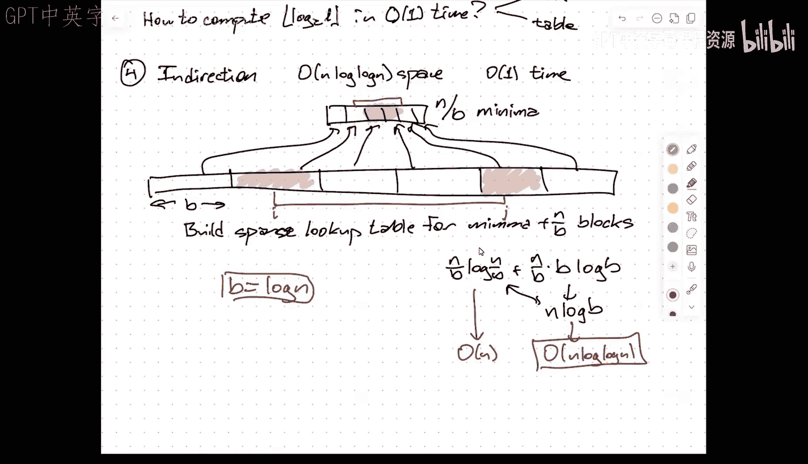
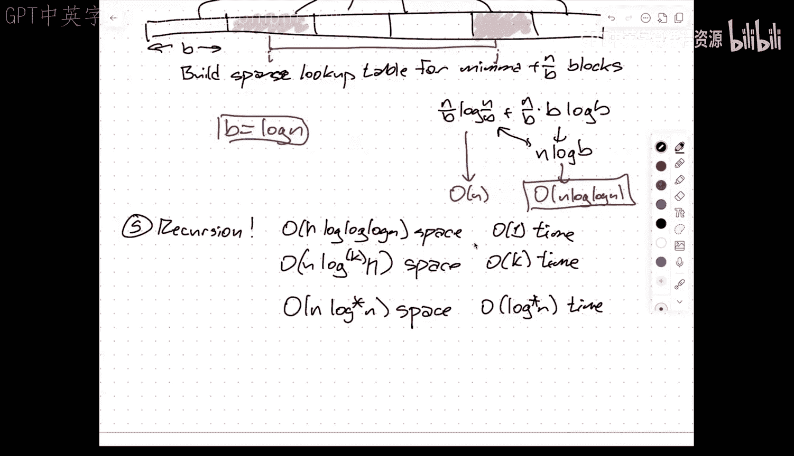

# 高级数据结构：001：课程概述与区间最小值查询


在本节课中，我们将学习高级数据结构课程的整体框架，并深入探讨一个具体的数据结构问题：区间最小值查询。我们将从课程的基本要求开始，逐步分析如何高效地解决这个查询问题。

## 课程概述

这门课程是为研究生设计的，重点在于数据结构的理论、设计与分析。课程不涉及代码实现，而是专注于算法复杂度分析、证明和数学建模。课程的核心评估方式是基于项目的最终报告和演示。

课程涵盖的主题广泛，包括但不限于：
*   前驱查询与平衡二叉搜索树
*   优先队列与堆
*   映射/字典与哈希表
*   动态图算法
*   考虑内存层次结构的数据结构
*   利用字长并行性的数据结构
*   数据结构的下界证明

## 区间最小值查询问题

现在，让我们聚焦于一个具体的数据结构问题：区间最小值查询。

### 问题定义

给定一个长度为 `n` 的静态数组 `A`，我们需要预处理这个数组，以便能够快速回答以下形式的查询：
`RMQ(i, j)`：返回子数组 `A[i..j]` 中最小元素的值（或索引）。

### 基础解决方案

最直接的解决方案是预先计算所有可能的 `(i, j)` 组合的答案。

以下是构建查询表的方法：
```python
# 假设 n 为数组长度
lookup_table = [[0] * n for _ in range(n)]
for i in range(n):
    current_min = A[i]
    for j in range(i, n):
        current_min = min(current_min, A[j])
        lookup_table[i][j] = current_min
```
这个方案能在 `O(1)` 时间内回答查询，但需要 `O(n²)` 的存储空间，对于大型数组来说不可行。

### 使用锦标赛树（区间树）

为了在减少空间的同时保持可接受的查询时间，我们可以使用基于二叉树的结构。

上一节我们介绍了基础解决方案的局限性，本节中我们来看看如何利用二叉树来优化。

其核心思想是将数组递归地分成两半，并在每个树节点存储其对应区间的最小值。查询时，我们将查询区间分解为树中若干个“规范区间”的并集。

以下是查询算法的伪代码描述：
```
function RMQ(node, i, j):
    if node.interval 与 [i, j] 不相交：
        return INFINITY
    if [i, j] 完全包含 node.interval：
        return node.min_value
    else:
        return min( RMQ(node.left, i, j), RMQ(node.right, i, j) )
```
这种方法使用 `O(n)` 空间构建树，每次查询最多访问 `O(log n)` 个节点，因此查询时间为 `O(log n)`。

### 稀疏表法

我们可以进一步优化，目标是让查询时间变为真正的常数，同时空间小于 `O(n²)`。

上一节我们利用二叉树将查询时间降至对数级，本节中我们来看看如何通过存储特定长度的区间答案来达到常数查询时间。

稀疏表法的核心是：我们只预计算所有长度为 `2^k`（即1, 2, 4, 8...）的区间的最小值。对于任意查询 `[i, j]`，我们可以用两个长度为 `2^k` 的区间（可能重叠）来覆盖它。

以下是构建稀疏表的方法：
```python
import math
k_max = math.floor(math.log2(n)) + 1
sparse_table = [[0] * n for _ in range(k_max)]

# 初始化长度为 1 的区间
for i in range(n):
    sparse_table[0][i] = A[i]

# 动态规划构建更长的区间
for k in range(1, k_max):
    length = 1 << k # 2^k
    for i in range(n - length + 1):
        # 区间 [i, i+2^k-1] 的最小值是两个半区间最小值的较小者
        sparse_table[k][i] = min(sparse_table[k-1][i], sparse_table[k-1][i + (length // 2)])
```
对于查询 `RMQ(i, j)`：
1.  计算区间长度 `L = j - i + 1`。
2.  找到最大的 `k`，使得 `2^k <= L`。
3.  查询两个长度为 `2^k` 的区间：`[i, i+2^k-1]` 和 `[j-2^k+1, j]`。
4.  返回这两个区间最小值中的较小者。

这个方法需要 `O(n log n)` 的存储空间，但能在 `O(1)` 时间内回答查询。

### 间接寻址法优化空间

稀疏表的空间是 `O(n log n)`，我们希望能接近 `O(n)`。

上一节我们通过稀疏表实现了常数查询时间，但空间开销仍然较大。本节中我们通过将问题分块，并结合稀疏表来进一步压缩空间。

我们将原数组分成大小为 `B` 的块。我们处理两个层次：
1.  **块内**：对每个大小为 `B` 的块，构建一个稀疏表来快速回答块内的区间查询。这需要 `O(B log B)` 空间每块，总共 `O(n log B)` 空间。
2.  **块间**：创建一个“概要数组”，其中每个元素是对应块的最小值。对这个概要数组构建一个稀疏表。这需要 `O((n/B) log(n/B))` 空间。

通过巧妙选择块大小 `B = log n`，可以使总空间复杂度降至 `O(n log log n)`，同时保持 `O(1)` 的查询时间（需要常数次稀疏表查询）。

### 递归应用与展望

我们可以递归地应用上述分块思想，将空间复杂度降至 `O(n log* n)` 甚至更低，每次递归增加一个常数倍的查询时间。

在后续课程中，我们将看到一种完全不同的方法，能够实现 `O(n)` 空间和真正的 `O(1)` 查询时间，彻底解决这个问题。




## 总结



本节课中我们一起学习了高级数据结构课程的框架和第一个深入案例——区间最小值查询。我们从最朴素的 `O(n²)` 空间解法出发，逐步优化：
1.  利用锦标赛树达到 `O(n)` 空间和 `O(log n)` 查询时间。
2.  利用稀疏表达到 `O(n log n)` 空间和 `O(1)` 查询时间。
3.  通过引入分块和间接寻址，权衡空间与时间，达到 `O(n log log n)` 空间和 `O(1)` 查询时间。
这个过程展示了数据结构设计中空间与时间权衡的核心思想，以及通过分层、分治来解决问题的通用技巧。