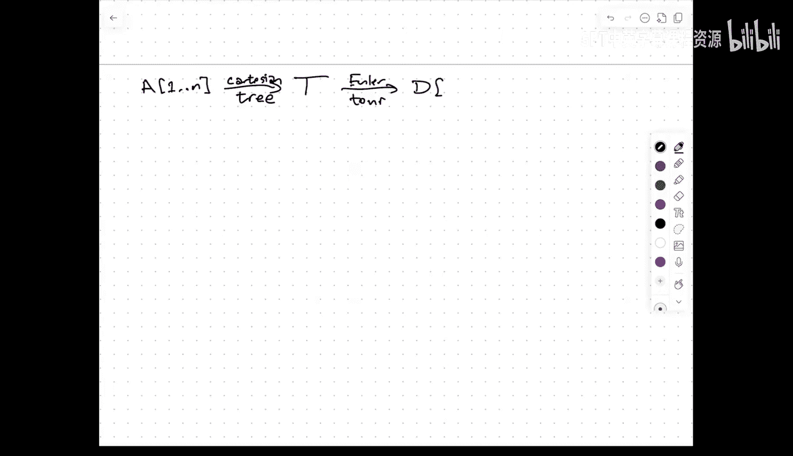
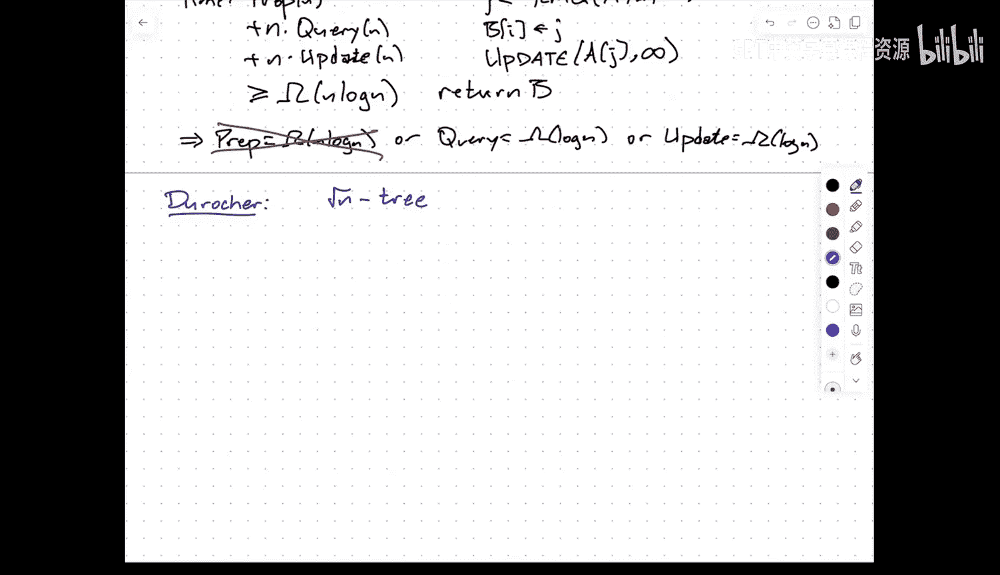
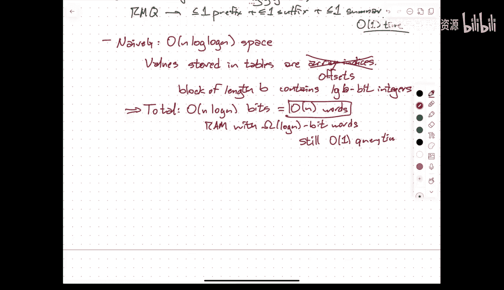
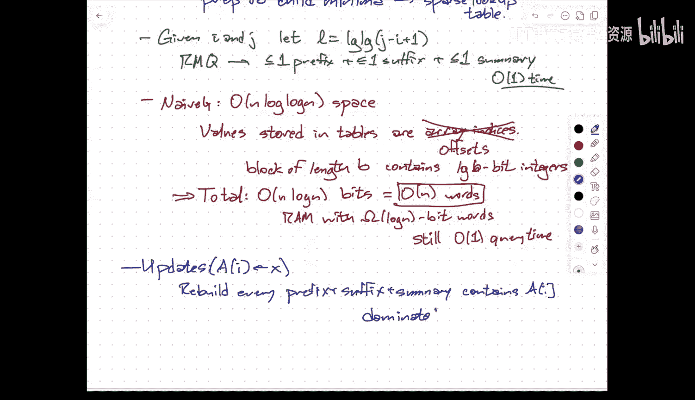
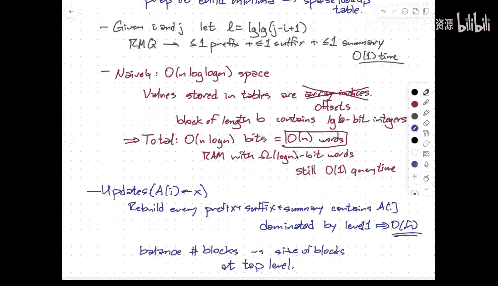

# 数据结构与算法：002：区间最小值查询（续）🔍

在本节课中，我们将继续深入探讨区间最小值查询问题，目标是构建一个使用线性空间和常数查询时间的数据结构。我们将通过引入最低公共祖先问题，并利用笛卡尔树和欧拉游历等概念，最终实现这一目标。

---

## 课程管理事项更新 📢

首先，有几项课程管理事项需要更新。学期初，我已经更正了Ed讨论区的链接，现在链接指向的是注册页面。如果仍然无法进入，请通过邮件告知我。

本学期，我将在课程网页上更新课堂板书（即所谓的“板书工作”）的副本以及讲座视频的链接。我也会尽可能提供更详细的讲义。

此外，我将在本周末之前在Gradescope上设置作业提交链接。最后，我的每周办公时间定于周五下午两点，地点在Sebel办公室外。如果这个时间对很多人不合适，我可能会进行调整，请通过邮件或Ed讨论区告知。

---

## 回顾区间最小值查询问题 🔄

上一节我们介绍了区间最小值查询问题。输入是一个来自全序集合的数组，我们可以比较元素。目标是对数组进行预处理，以便后续能快速回答形如 `(i, j)` 的查询，即返回子数组 `A[i:j]` 中最小值的**索引**。

我们讨论了两种基本方法：
1.  **构建所有答案的查找表**：使用 `O(n²)` 空间，实现 `O(1)` 查询。
2.  **使用线段树（或类似二叉树）**：每个节点存储其子树中叶子节点的最小值。这需要 `O(n)` 空间，但查询时间为 `O(log n)`。

我们通过“间接”技巧，在空间和查询时间之间取得了更精细的权衡，达到了 `O(n log log n)` 空间和 `O(1)` 查询。但我们的终极目标是 **`O(n)` 空间和 `O(1)` 查询**。

---

## 通向目标的桥梁：最低公共祖先问题 🌉

实现线性空间常数时间查询的关键，是引入一个看似无关的问题：**最低公共祖先查询**。

LCA问题的输入是一棵有根树 `T`。查询是给定两个节点 `u` 和 `v`，找到它们深度最深的公共祖先节点。

表面上看，LCA与RMQ毫无关系。但我们将展示，**RMQ问题可以规约到LCA问题，同时LCA问题也可以规约到RMQ问题**。这种等价性为我们提供了强大的工具。

### 从RMQ规约到LCA：笛卡尔树 🗺️

这个规约使用了一种称为**笛卡尔树**的数据结构。

给定数组 `A`，其笛卡尔树 `C` 定义如下：
*   树的中序遍历恰好得到原始数组 `A`。
*   树是一个最小堆：节点的值小于其子节点的值。

**构建过程**：根节点是数组中最小值的索引。其左子树递归地由该最小值左侧的元素构成，右子树递归地由该最小值右侧的元素构成。

**关键性质**：对于RMQ查询 `(i, j)`，数组 `A[i:j]` 中的最小值索引，恰好是笛卡尔树中代表索引 `i` 的节点和代表索引 `j` 的节点的**最低公共祖先**。

因此，如果我们能高效处理笛卡尔树上的LCA查询，就能高效回答原数组的RMQ查询。笛卡尔树本身只有 `O(n)` 个节点。

### 从LCA规约到RMQ：欧拉游历与深度序列 🧭

这个规约使用了一种称为**欧拉游历**的技术。

对树 `T` 进行欧拉游历，意味着沿着树的边“行走”，并在每次到达一个节点（无论是第一次还是返回时）都记录下它。对于一个有 `n` 个节点的树，欧拉游历序列的长度为 `2n-1`。

我们不仅记录节点，更关键的是记录每次访问节点时的**深度**。这样就得到了一个深度序列 `E`。

**关键性质**：对于LCA查询 `(u, v)`，在深度序列 `E` 中，任选 `u` 和 `v` 各一次出现的位置 `p_u` 和 `p_v`（假设 `p_u < p_v`），那么 `u` 和 `v` 的LCA的深度，就是子数组 `E[p_u : p_v]` 中的**最小值**。

因此，LCA查询被转化为了对深度序列 `E` 的RMQ查询。更重要的是，由于欧拉游历的特性，深度序列中相邻元素的差值总是 `+1` 或 `-1`。这被称为 **±1 RMQ** 问题，它具有特殊的结构，可以被利用。

---

## 实现线性空间与常数查询：四毛子算法 🧠

现在，我们结合上述规约和“间接”分块思想，来构建最终的 `O(n)` 空间、`O(1)` 查询的静态RMQ数据结构。这种方法常被称为“四毛子算法”。

以下是具体步骤：

1.  **从一般RMQ到±1 RMQ**：
    *   为原数组 `A` 构建笛卡尔树 `C`。
    *   对 `C` 进行欧拉游历，得到长度为 `2n-1` 的深度序列 `E`。`E` 是一个±1序列。
    *   现在，原数组的RMQ查询 `(i, j)` 可以转化为深度序列 `E` 上某个区间的RMQ查询。

2.  **对±1 RMQ序列进行分块**：
    *   将序列 `E` 分成大小为 `b = (1/2) log n` 的块（这里对数以2为底）。
    *   我们有一个“概要”数组，存储每个块的最小值。这个数组长度为 `n/b`。

3.  **预处理概要数组和块内部**：
    *   **概要数组**：使用稀疏表（Sparse Table）进行预处理，实现 `O(1)` 查询。这需要 `O((n/b) log(n/b))` 空间，当 `b = (1/2) log n` 时，空间为 `O(n)`。
    *   **块内部**：关键洞察在于，由于是±1序列，每个块的模式（上升/下降序列）最多只有 `2^(b-1)` 种可能。我们**预先计算所有可能模式对应的RMQ查询表**。虽然模式总数最多 `2^b ≈ √n` 种，对每种模式构建一个 `b x b` 的答案表，总预处理空间和时间仅为 `O(√n * b²) = O(n)`。

4.  **回答查询**：
    对于一个查询区间 `[i, j]`：
    *   它可能跨越多个完整的块。
    *   对于两端的非完整块，使用预先计算的、与该块模式对应的内部查询表，在 `O(1)` 时间内得到块内最小值。
    *   对于中间完整的块，使用概要数组的稀疏表查询，在 `O(1)` 时间内得到这些块最小值中的最小值。
    *   将上述三部分结果取最小值，即为最终答案。整个过程只涉及常数次数组查找。

通过这种方法，我们最终实现了 `O(n)` 空间和 `O(1)` 查询时间的静态RMQ数据结构。

---

## 支持动态更新的RMQ结构 ⚡

上述数据结构是静态的。如果我们希望支持更新操作（如修改数组中某个元素的值），该怎么办？

一个简单的动态结构是**线段树**，它支持 `O(log n)` 的查询和更新。但存在一个理论下界：在比较模型下，**任何RMQ数据结构，如果查询时间是 `O(1)`，则更新时间至少为 `O(log n)`；反之，如果更新时间是 `O(1)`，则查询时间至少为 `O(log n)`**。这是通过将RMQ用于模拟排序算法证明的。

目前已知最好的动态RMQ数据结构之一（De Roche算法）在保证 `O(1)` 查询的同时，实现了 `O(√n)` 的更新时间。其核心思想是构建一个深度为 `O(log log n)` 的树状层次结构：

*   **层次化分块**：将数组分成大小为 `√n` 的块，每个块再分成大小为 `n^(1/4)` 的子块，如此递归直到单个元素。
*   **每层预处理**：在每个块内，预处理所有前缀最小值和后缀最小值（通过简单循环）。同时，计算每个子块的摘要（最小值）上传给父块，父块用稀疏表处理这些摘要。
*   **常数查询**：给定查询 `[i, j]`，可以快速定位到某个层次，使得块大小与查询区间长度相当。答案由至多一个前缀查询、一个后缀查询和一个上层摘要查询组成，均为 `O(1)`。
*   **压缩存储**：通过将较小层次的索引（所需比特数少）打包存入机器字，可以将总空间控制在 `O(n)` 个机器字。
*   **`O(√n)` 更新**：更新一个元素需要重建包含它的所有层次的前缀/后缀/摘要结构。最耗时的部分在顶层，需要重建一个大小为 `√n` 的块及其父块摘要，因此更新时间为 `O(√n)`。

如何突破 `O(√n)` 的更新时间，同时保持 `O(1)` 查询，仍然是一个开放问题。

---

## 总结 📝

本节课我们一起深入学习了区间最小值查询问题的高效解决方案。

1.  我们首先回顾了空间与查询时间之间的基本权衡。
2.  然后，我们引入了**最低公共祖先问题**，并展示了它与RMQ问题的**双向规约**：
    *   通过**笛卡尔树**将RMQ规约到LCA。
    *   通过**欧拉游历**和**深度序列**将LCA规约到特殊的 **±1 RMQ**。
3.  利用这种等价性和**四毛子算法**（预计算所有小块模式），我们构建了**静态RMQ数据结构**，达到了理想的 `O(n)` 空间和 `O(1)` 查询时间。
4.  最后，我们探讨了**动态RMQ问题**，了解了线段树的 `O(log n)` 查询/更新权衡，以及更复杂的De Roche结构如何实现 `O(1)` 查询和 `O(√n)` 更新，并认识了该问题的理论下界和开放挑战。

这些技巧（规约、分层、预计算、位压缩）是设计高效算法和数据结构的核心工具，其应用远不止于RMQ问题。