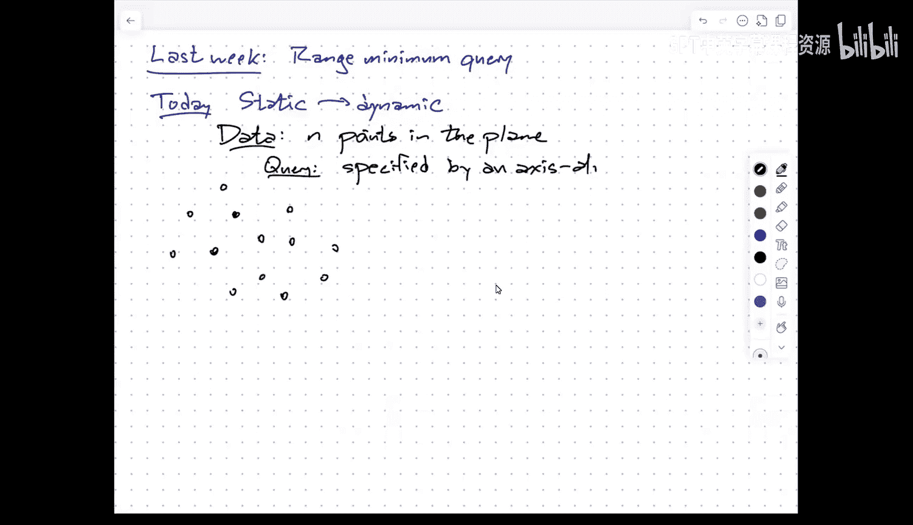
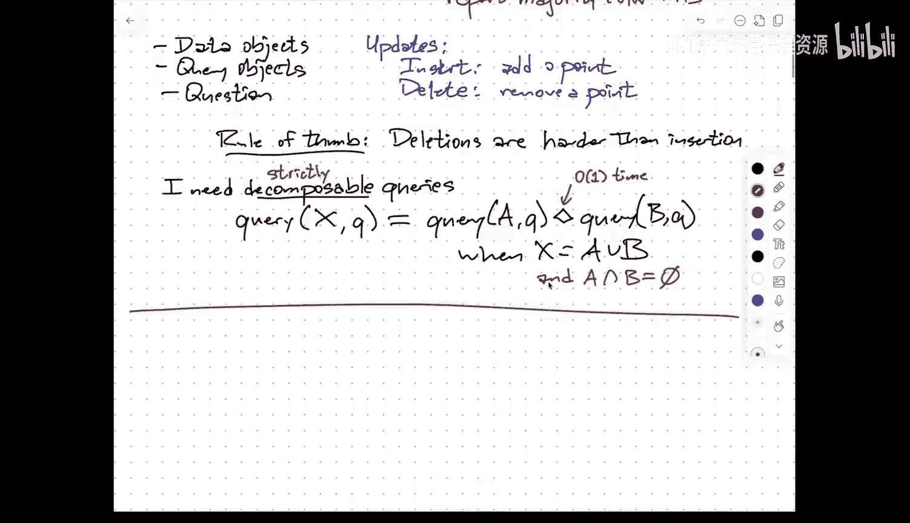
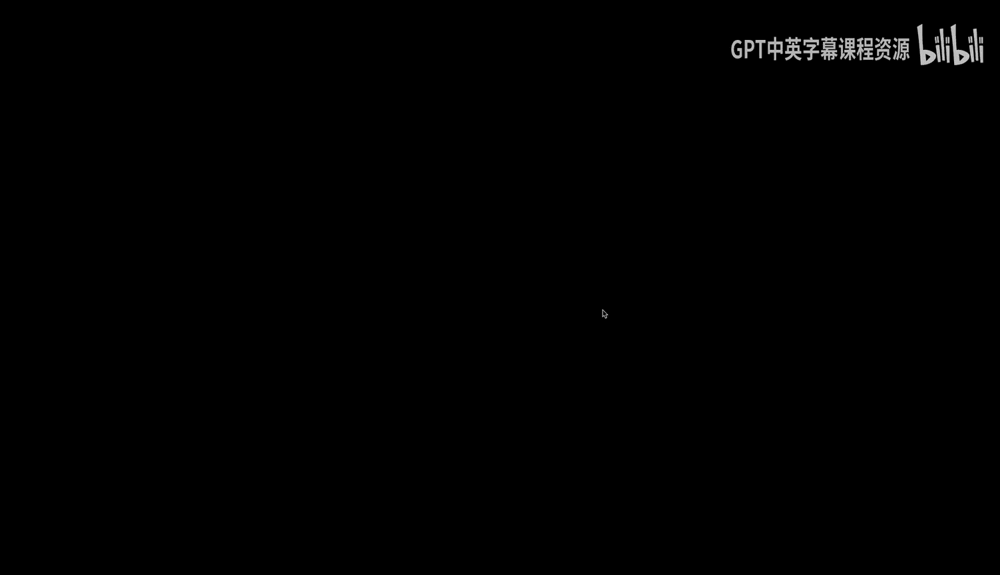
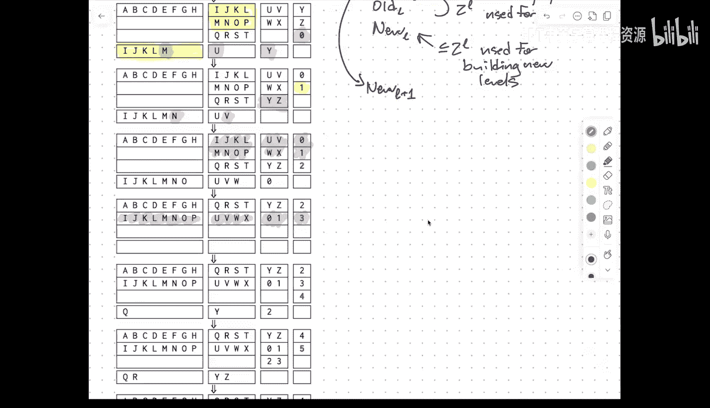
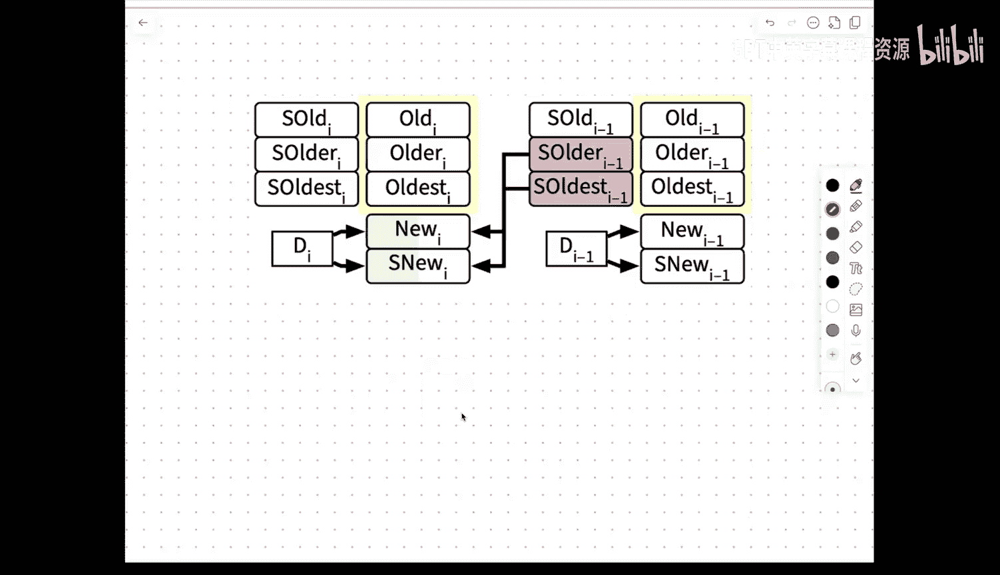

# 003：静态到动态的转换 🛠️


在本节课中，我们将学习如何将一个静态的、不支持更新的数据结构，转换为一个动态的、能够支持插入和删除操作的数据结构。我们将探讨两种核心方法：对数法（Logarithmic Method）和惰性重建法（Lazy Rebuilding），并了解它们适用的场景和限制。




---

## 可分解查询

上一节我们介绍了数据结构的通用问题模型。本节中，我们来看看一个关键概念：**可分解查询**。这是后续所有动态化技术的基础。

一个查询被称为**可分解的**，如果我们可以将数据集 `X` 任意划分为若干不相交的子集，然后通过以下方式回答关于 `X` 的查询 `q`：
1.  在每个子集上独立地执行查询。
2.  使用一个高效的运算符（记为 `◊`）合并这些子查询的结果。

这个过程可以用以下公式表示：
```
Query(q, X) = Query(q, A) ◊ Query(q, B) ◊ ... ◊ Query(q, Z)
```
其中，`A, B, ..., Z` 是 `X` 的一个划分，且运算符 `◊` 可以在常数时间内完成。

以下是几个常见查询类型的例子：
*   **计数查询**：运算符 `◊` 是加法 `+`。例如，`Count(box) = Count_red(box) + Count_blue(box)`。
*   **存在性查询**：运算符 `◊` 是逻辑或 `OR`。例如，`Exists(box) = Exists_red(box) OR Exists_blue(box)`。
*   **最小值查询**：运算符 `◊` 是取最小值 `min`。例如，`Min(box) = min(Min_red(box), Min_blue(box))`。



相反，**多数投票查询**（例如，查询矩形内哪种颜色占多数）通常是**不可分解**的，因为你无法仅从子区域的多数结果推断出整个区域的多数结果。



---

## 对数法：支持插入操作

上一节我们定义了可分解查询。本节中，我们来看看如何利用这个特性来支持**插入**操作。这种方法被称为**对数法**。

其核心思想是：我们不维护一个单一的大型静态数据结构，而是维护一系列大小呈指数增长的小型静态数据结构。

### 数据结构布局

我们将数据集划分为最多 `log₂ N` 个“层级”。每个层级 `L_i` 要么是空的，要么包含一个大小为 `2^i` 的静态数据结构。
*   层级 `i` 的状态（空或满）恰好反映了当前数据总数 `N` 的二进制表示中第 `i` 位的值（1 或 0）。
*   例如，当 `N = 13`（二进制 `1101`）时，我们将有：
    *   一个大小为 `2^0 = 1` 的数据结构（对应最低位 1）
    *   一个大小为 `2^2 = 4` 的数据结构（对应第三位 1）
    *   一个大小为 `2^3 = 8` 的数据结构（对应最高位 1）

### 查询操作

要回答一个查询，我们只需在所有非空的层级上分别执行查询，然后用运算符 `◊` 合并结果。
```
总查询时间 ≤ Σ Q(2^i) ≤ Q(N) * log N
```
其中 `Q(n)` 是静态数据结构在大小为 `n` 时的查询时间。如果 `Q(n)` 是多项式级的（例如 `√n`），则求和会形成一个几何级数，`log N` 因子会被吸收进大 O 记号。

### 插入操作

插入操作模拟了二进制加一的过程：
1.  将新元素视为一个大小为 `2^0 = 1` 的新数据结构。
2.  检查层级 `0`。如果为空，则放入。如果已满（即已有一个大小为 1 的结构），则将这两个大小为 1 的结构**合并**，构建成一个新的、大小为 `2^1 = 2` 的静态数据结构。
3.  将新的大小为 2 的结构放入层级 `1`。如果层级 `1` 已满，则继续合并并向上“进位”，直到找到一个空层级为止。

### 分摊分析

虽然单次插入在最坏情况下可能需要重建一个很大的数据结构（耗时 `P(2^i)`，`P(n)` 是预处理时间），但大型重建发生的频率很低。
*   大小为 `2^i` 的数据结构每 `2^i` 次插入才会被重建一次。
*   因此，维护层级 `i` 的**分摊**时间成本是 `P(2^i) / 2^i`。

对所有层级求和，得到**分摊插入时间**为：
```
O( Σ [P(2^i) / 2^i] ) ≤ O( (P(N) / N) * log N )
```
同样，如果 `P(n)` 是 `O(n log n)` 或更高阶多项式，`log N` 因子通常可以忽略。

---

## 惰性重建：获得最坏情况保证

上一节介绍的对数法提供了优秀的分摊时间复杂度。但在某些实时系统（如机器人控制、高频交易）中，我们需要**最坏情况**时间保证。本节介绍的**惰性重建**技术可以实现这一点。




核心思想是：将大型重建工作“均摊”到多次插入操作中去逐步完成，而不是一次性完成。

### 数据结构布局

每个层级 `L` 不再只有一个结构，而是维护最多四个结构：`oldest_L`, `older_L`, `old_L`, `new_L`。
*   `oldest`, `older`, `old` 是已完全构建好的、用于查询的静态数据结构，每个大小约为 `2^L`。每个数据项在整个系统中只存在于某一个层级的某一个 `old*` 结构中。
*   `new_L` 是一个正在构建中的结构，大小最多为 `2^L`，它包含了来自更低层级的数据副本。

### 操作过程

1.  **插入**：每次插入时，不仅将新元素加入 `new_0`，还会为每个层级 `L` 花费 `P(2^L) / 2^L` 的单位时间，用于将 `older_{L-1}` 和 `oldest_{L-1}` 的数据合并到 `new_L` 中。
2.  **渐进构建**：当 `new_L` 构建完成时，它会被“提升”为 `old_L`（或 `older_L` 等），同时清空其来源的低层级结构。
3.  **查询**：查询时，只查询所有 `old*` 结构，忽略 `new` 结构。由于每个层级最多有三个 `old*` 结构，查询时间仍为 `O(log N * Q(N))`。
4.  **正确性关键**：这种结构的状态对应于一种特殊的二进制表示（每位可取 1, 2, 3）。插入操作引起的状态变化与这种特殊计数的“加一”操作同步，从而保证了在需要提升 `new` 结构时，总有空的 `old*` 槽位可用。

通过这种方式，**每次插入的操作时间都严格控制在 `O((P(N)/N) * log N)` 以内**，实现了最坏情况下的时间保证。

---

## 支持删除操作

上一节我们实现了插入。本节中，我们来看看如何进一步支持**删除**操作。这需要更强的假设。

### 情形一：查询可逆（拥有“反操作”）

如果查询的合并运算符 `◊` 存在逆运算（例如加法对应减法，集合并对应差集），我们可以使用一种“反数据结构”策略。

*   **数据结构**：我们维护三个部分：
    *   `M`：主数据结构，包含“存活”的数据。
    *   `I`：一个仅支持插入的结构，记录自上次重建以来**新增**的数据。
    *   `D`：一个仅支持插入的结构，记录自上次重建以来**被删除**的数据（作为“墓碑”）。
*   **查询**：`Query(q) = Query(q, M) ◊ Query(q, I) ◊ Inverse(Query(q, D))`。通过从主结果中加入新增项、减去删除项，得到正确结果。
*   **空间优化与全局重建**：当“墓碑” `D` 的大小超过主结构 `M` 的一个常数比例（如 1/8）时，说明空间浪费严重。此时触发一次**全局重建**：将 `M`、`I`、`D` 合并，构建一个全新的、只包含当前有效数据的 `M‘`，然后清空 `I` 和 `D`。
*   **分摊分析**：重建成本 `P(N)` 可以分摊到触发重建前的那 `Ω(N)` 次删除操作上。因此，**删除的分摊时间复杂度**为 `O(插入成本 + P(N)/N)`。

### 情形二：弱删除（标记删除）

如果查询不可逆（如最小值查询），我们可以采用**弱删除**或**标记删除**。
*   删除一个元素时，并不立即将其从数据结构中物理移除，只是将其标记为“无效”（放置墓碑）。
*   查询时，数据结构需要能够忽略这些无效元素并给出正确结果。
*   同样，当无效元素积累到一定比例时，触发全局重建以清理空间并恢复性能。

这种方法被应用于一些平衡二叉搜索树（如替罪羊树 Scapegoat Tree）中，结合惰性重建思想，也可以实现最坏情况或分摊情况下的动态更新。

---

## 总结与展望

本节课中我们一起学习了将静态数据结构动态化的核心技巧：
1.  **可分解查询**是动态化的基础前提。
2.  **对数法**利用二进制思想，通过维护指数大小的结构块，以 `O((P(N)/N) log N)` 的分摊时间支持插入。
3.  **惰性重建**通过对数法的去分摊化，实现了同样的时间上限，但是是**最坏情况**保证。
4.  **支持删除**需要额外条件：要么查询可逆，配合“反数据结构”和全局重建；要么支持标记删除，并定期重建。



这些转换技术是通用的“工具箱”，允许我们在许多场景下为高效的静态数据结构添加动态更新能力。然而，它们也带来了额外的复杂度或常数因子。在后续课程中，我们将看到许多从一开始就为动态操作而设计的、更优雅高效的数据结构。