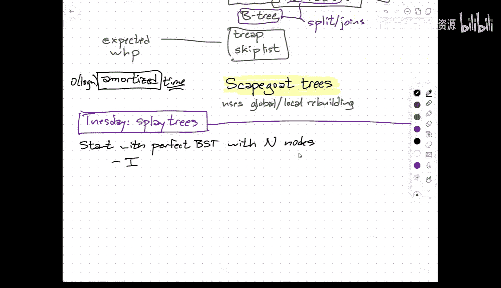
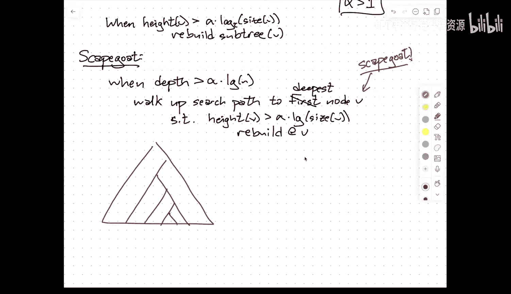
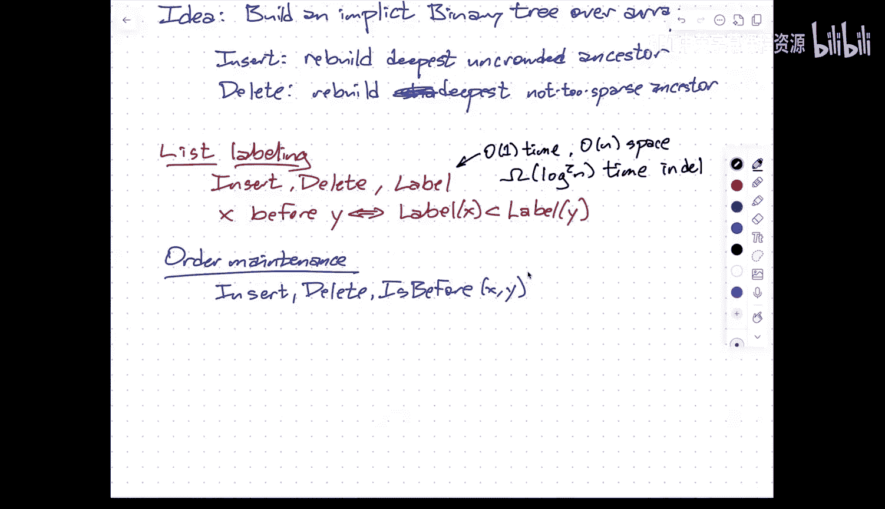
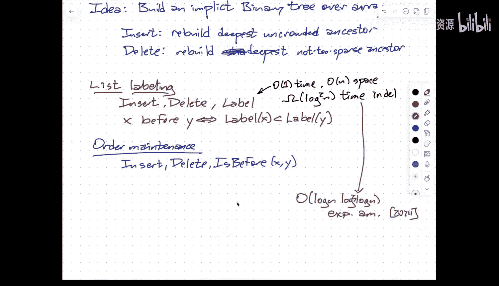

# 004：替罪羊树

在本节课中，我们将学习一种名为“替罪羊树”的平衡二叉搜索树。这种数据结构通过一种巧妙的“重建”策略来维持平衡，其核心思想是：当树变得不平衡时，不是通过复杂的旋转操作来调整，而是直接重建整个不平衡的子树，使其恢复完美平衡。我们将从最简单的场景开始，逐步引入替罪羊树的核心概念，并分析其性能。

## 从完美平衡树开始

上一节我们介绍了平衡二叉搜索树的基本概念。本节中，我们从一个非常基础的场景开始：一棵包含 N 个节点的**完美平衡二叉搜索树**，并且我们只关心**搜索**和**删除**操作。

由于树是完美平衡的，其深度为 `O(log N)`。因此，搜索操作的最坏情况时间复杂度为 `O(log N)`。

对于删除操作，标准的教科书算法如下：

以下是删除节点 V 的几种情况：
1.  **无子节点**：直接删除 V，将其父节点的对应子指针设为 `nil`。
2.  **有一个子节点**：将指向 V 的父节点指针，重定向指向 V 的唯一子节点 W。
3.  **有两个子节点**：找到 V 的**后继**节点 W（即其右子树中的最左节点）。将 V 和 W 的键值交换。此时，V 位于新的位置且没有右子节点，问题便转化为情况 1 或 2。

该算法的时间复杂度与树的深度成正比，因此也是 `O(log N)`。

然而，这里存在一个问题。随着我们不断执行删除操作，树中剩余的节点数（记为 `n`）会减少。虽然树的深度仍然是 `O(log N)`，但这里的 `N` 是初始的节点总数。当 `n` 远小于 `N` 时，`O(log N)` 可能不再是 `O(log n)`，甚至可能退化为线性时间。我们真正希望的是，每个操作的时间复杂度是当前树中实际节点数 `n` 的对数函数，即 `O(log n)`。

## 全局重建策略

为了解决上述问题，我们引入一个简单的**全局重建**规则：**在删除 `n/2` 个节点后，重建整棵树**。

这里的“重建”是指，收集所有仍然存活的节点（排除已删除的节点或“墓碑”节点），构建一棵新的、完美平衡的二叉搜索树。

设最近一次重建后树的大小为 `N`。在触发下一次重建之前，我们最多执行了 `N/2` 次删除，因此树中剩余的节点数 `n` 满足 `n ≥ N/2`，即 `N ≤ 2n`。

由此，我们可以得出以下性能保证：
*   **搜索**：最坏情况时间为 `O(log N) = O(log (2n)) = O(log n)`。
*   **删除（非重建时）**：最坏情况时间为 `O(log n)`。
*   **删除（触发重建时）**：重建整棵树需要 `O(N) = O(n)` 时间。

虽然单次重建的代价很高，但我们可以使用**摊还分析**。从上次重建到触发本次重建，我们至少执行了 `n` 次删除（因为 `n ≤ N/2`）。我们可以将重建的 `O(n)` 成本**分摊**到这 `n` 次删除操作上，即每次删除操作预先支付一个常数时间的“重建税”。

因此，**摊还后**的删除时间复杂度为：`O(log n)`（查找节点） + `O(1)`（实际删除和分摊的重建成本） = `O(log n)`。

## 插入操作与局部重建

上一节我们通过全局重建解决了删除导致的平衡问题。本节中我们来看看插入操作。插入比删除更容易破坏树的平衡性（例如，连续插入递增序列会形成一条链）。我们无法承受每次不平衡都进行全局重建的代价。

核心思想是进行**局部重建**：**当一个子树变得严重不平衡时，重建该子树**。

较小的子树更容易变得不平衡，但也更便宜、更频繁地被重建；较大的子树重建成本高，但重建频率低。这本质上是一个调度问题。

直觉上，每次插入操作时，我们沿着插入路径为路径上的每个节点 `z` 支付一个常数时间的“税”，用于支付未来重建以 `z` 为根的子树的费用。由于树始终保持近似平衡，深度为 `O(log n)`，因此支付的总“税额”也是 `O(log n)`，这保证了摊还插入时间为 `O(log n)`。

现在的问题是：如何定义“严重不平衡”？以及如何确保税收策略能覆盖重建成本？

## 权重平衡与高度平衡

有两种常见的方式来定义平衡：

1.  **权重平衡**：节点 `v` 是 **α 平衡** 的，当且仅当其左子树和右子树的大小都至少是 `α * size(v)`，其中 `α` 是一个小于 1 的常数（如 1/3 或 1/4）。如果树中所有节点都是 α 平衡的，那么树的深度为 `O(log n)`。
2.  **高度平衡**：节点 `v` 是高度平衡的，如果其子树的高度 `h(v)` 不超过 `c * log(size(v))`，其中 `c` 是一个常数。AVL 树就属于此类。

一个简单的重建触发策略是：插入新节点 `v` 后，从 `v` 向根回溯。如果遇到一个不平衡的节点 `u`，就重建以 `u` 为根的子树。

可以证明，如果一个节点因插入而变得 α 不平衡，那么自该节点上次被重建以来，至少有 `Ω(size(u))` 次插入进入了该子树。这意味着，重建以 `u` 为根的子树所需的 `O(size(u))` 成本，可以被分摊到导致其不平衡的那些插入操作上。

## 替罪羊树策略

替罪羊树结合了高度和权重的思想，并进行了优化：

1.  **触发条件（基于高度）**：维护一个参数 `α > 1`。当整棵树的高度超过 `α * log n` 时，认为树不平衡，需要干预。
2.  **寻找替罪羊（基于权重）**：从新插入的节点开始，向根回溯，找到**第一个**满足 `size(left) > α * size(v)` 或 `size(right) > α * size(v)` 的节点 `v`。这个节点被称为“替罪羊”。
3.  **惩罚替罪羊**：重建以替罪羊节点 `v` 为根的子树。

**为什么只重建一个节点就够了？** 在插入前，所有节点都是（接近）平衡的。插入一个节点可能使从插入点到根的路径上多个节点变得轻微不平衡。但是，重建最深的一个不平衡子树（替罪羊）会降低其高度，从而自动修复其所有祖先节点的不平衡状态。这就像把所有的“罪责”都归咎于替罪羊，惩罚它（重建）就能净化整个社区（树）。

**如何找到替罪羊而不存储子树大小？** 我们可以在需要时动态计算。从新节点开始向上遍历，对于每个祖先节点，我们遍历其整个子树来计算大小。虽然单次计算是 `O(size(subtree))` 的，但因为我们即将花费 `O(size(subtree))` 的时间来重建这个子树，所以**寻找替罪羊的成本可以被吸收到重建成本中**，是“免费”的。

## 最终方案与性能

替罪羊树的最终方案非常简洁：
*   **数据结构**：一个普通的二叉搜索树，外加两个整数：树的总大小 `n` 和删除计数器。
*   **插入**：按标准方式插入。如果插入后树高 `> α * log n`，则找到替罪羊节点并重建其子树。**摊还时间复杂度为 `O(log n)`**。
*   **删除**：使用“墓碑”法或惰性删除。维护一个删除计数器，当删除次数达到 `n/2` 时，触发一次全局重建。**摊还时间复杂度为 `O(log n)`**。
*   **搜索**：由于树始终保持 `O(log n)` 的深度，**最坏情况时间复杂度为 `O(log n)`**。

## 扩展应用：打包内存数组

局部/全局重建的思想不仅适用于二叉搜索树。这里简要介绍一个经典问题：**有序文件维护** 或 **打包内存数组**。

**问题**：维护一个有序序列（如代码行），支持在指定元素后插入、删除元素，以及向前/向后扫描 `k` 个元素。

**目标**：使用一个大小 `O(n)` 的连续数组存储 `n` 个元素，并保证任何连续的 `k` 个逻辑元素存储在 `O(k)` 大小的连续内存中。

**解决方案思想**：在数组上建立一个隐式的完全二叉树结构。每个树节点对应数组的一个区间。我们为每个区间设定密度上下限（如上界 2/3，下界 1/3）。当插入导致某个区间密度过高，或删除导致密度过低时，就重建（即均匀重排）该区间内的所有元素。通过类似替罪羊树的摊还分析，可以证明插入和删除的**摊还时间复杂度为 `O(log² n)`**，而扫描操作是 `O(k)` 最优的。

值得注意的是，对于确定性的数据结构，`Ω(log² n)` 是解决此问题的一个下界。而随机化算法可以做得更好，2024年的最新研究达到了接近 `O(log n)` 的期望摊还时间。

## 总结

本节课中我们一起学习了替罪羊树。它是一种通过**局部重建**来维持平衡的二叉搜索树。其核心在于：当插入操作导致树高超过阈值时，沿着路径向上找到一个“替罪羊”节点（其左右子树权重失衡），然后重建该子树以恢复平衡。通过巧妙的摊还分析，替罪羊树实现了 `O(log n)` 的最坏情况搜索时间，以及 `O(log n)` 的摊还插入和删除时间，同时几乎不需要在节点中存储额外的平衡信息。最后，我们还看到了局部重建思想在“打包内存数组”这一不同问题上的成功应用。