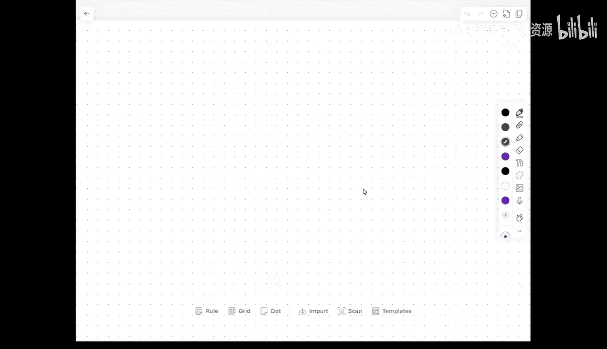
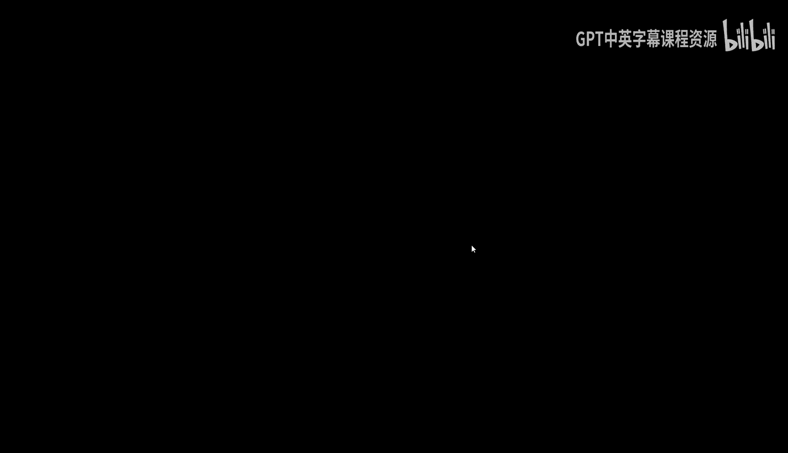
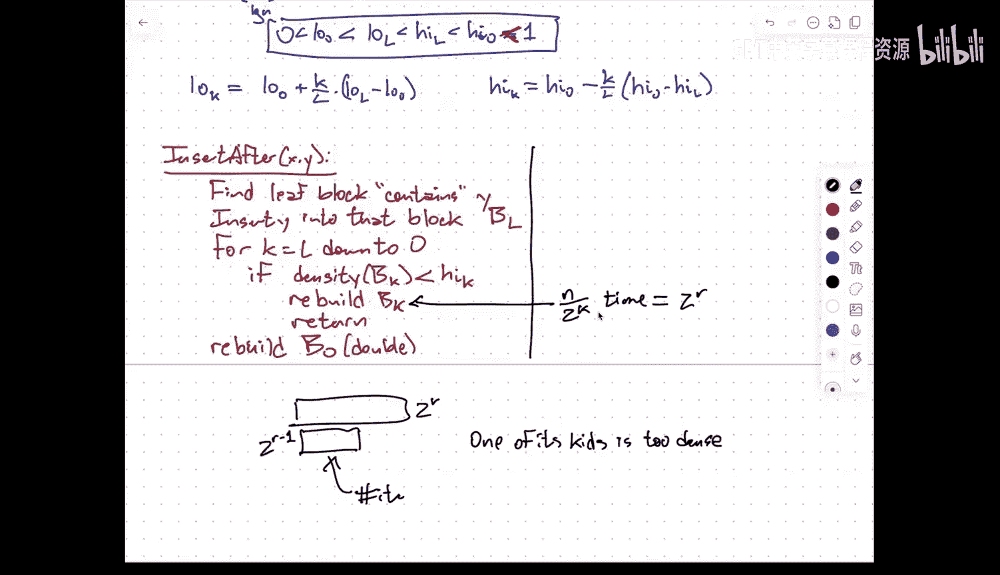
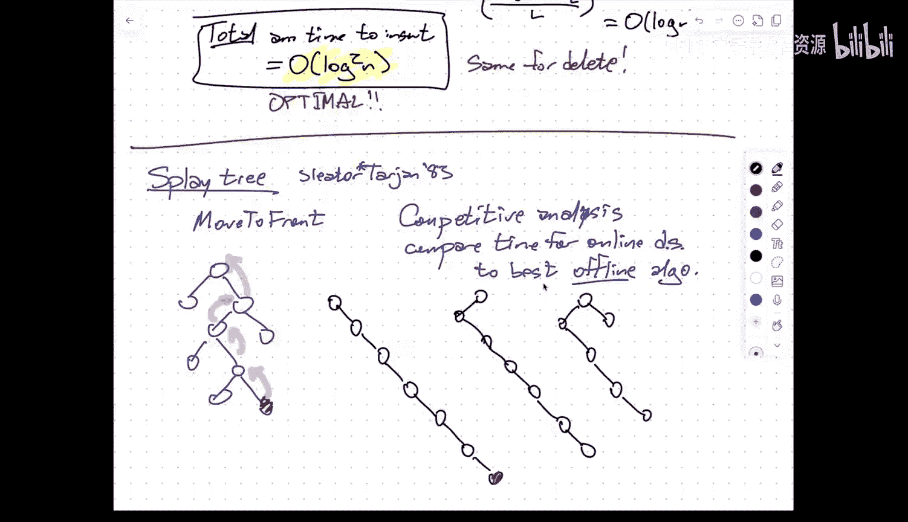
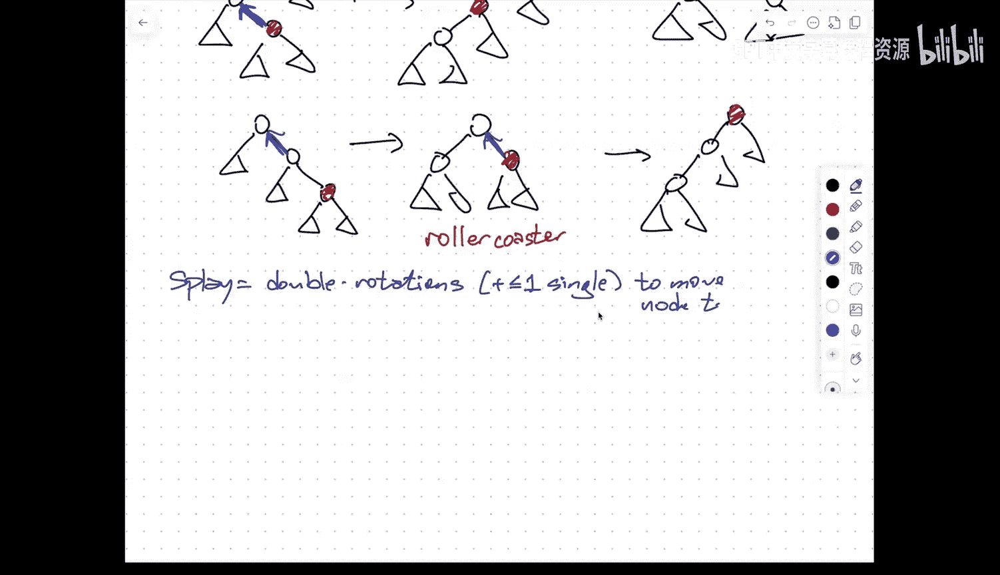
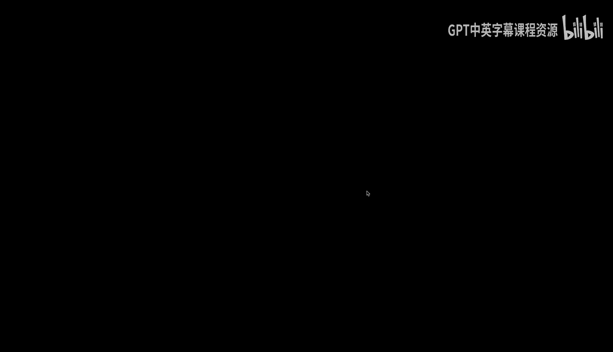
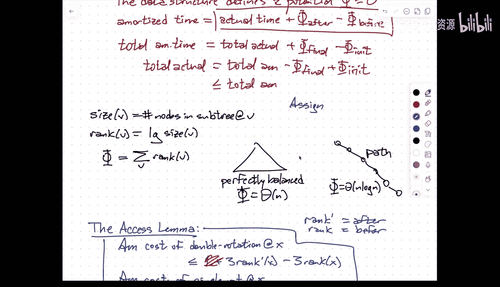
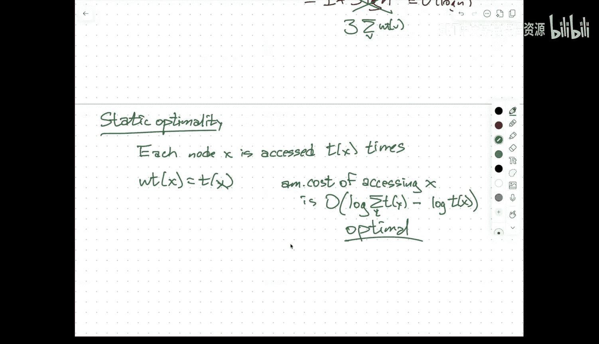

# 005：紧凑内存数组与伸展树

在本节课中，我们将学习两种重要的数据结构：紧凑内存数组和伸展树。紧凑内存数组是一种在连续内存块中高效维护序列的数据结构，支持插入、删除和扫描操作。伸展树是一种自调整的二叉搜索树，虽然没有最坏情况的时间保证，但在平摊分析下表现出色，并且具有一些近乎神奇的最优性特性。

## 紧凑内存数组

上一节我们介绍了课程的一些管理事项。本节中，我们来看看紧凑内存数组的具体细节。

紧凑内存数组的目标是存储一个包含 `n` 个项目的序列，并将其保存在一个大小为 `O(N)` 的连续内存块（即数组）中。它需要支持以下操作：
*   `insert_after(x, y)`：将 `y` 紧接在 `x` 之后插入。
*   `delete(x)`：从序列中移除 `x`。
*   `scan(x, k)`：如果 `k` 为正数，则扫描 `x` 之后的 `k` 个项目；如果 `k` 为负数，则扫描 `x` 之前的 `k` 个项目。

我们假设在给出序列中的某个项目时，我们实际上获得了指向该项目在数组中记录的指针。`scan` 操作的目标是达到每个报告元素的基本常数时间。

有人可能会问，为什么不能简单地使用双向链表来实现所有操作的常数时间？一个更清晰的答案是，我们希望支持“前序查询”。通过比较两个项目在数组中的地址，我们可以快速判断 `x` 是否在 `y` 之前。这在动态分配内存的链表中很难高效实现。

### 核心策略

基本思想是在数组元素之间保持常数大小的间隙。间隙不能太大，否则扫描数组获取数据的时间会变长；间隙也不能太小，否则插入新元素时，在狭小空间内挤压会创建更小的间隙。因此，元素大致均匀地分布在数组中。

当执行插入操作时，可能会导致局部区域过于密集；当执行删除操作时，可能会导致局部区域过于稀疏。在这两种情况下，我们都会执行局部重建。这里的“重建”比替罪羊树中的重建更简单：我们取数组的一部分，并将其中的元素均匀地重新分布，以消除过大的间隙或过密的区域。

### 密度阈值与层次结构

为了实现高效的平摊分析，我们定义一些密度阈值。在顶层，定义 `low_0` 和 `high_0`（`0 < low_0 < high_0 <= 1`），它们代表整个数组允许被占用的比例。如果数组中的元素数量低于 `low_0 * size`，我们将重建一个大小为原来一半的新数据结构。如果元素数量超过 `high_0 * size`，我们将数组大小加倍并重新分布所有元素。

为了更精细地控制重建，我们递归地将数组分解为块。为简化分析，我们假设数组长度是2的幂。我们将数组划分为大小为 `log n` 的叶块，而不是一直递归到大小为1的块。这样，树的深度为 `log(n/log n)`。

对于每一层 `k`，我们定义更严格的密度阈值 `low_k` 和 `high_k`。这些阈值构成一个等差数列：`low_k` 从 `low_0` 到 `low_L` 逐渐收紧（允许的密度范围变小），`high_k` 从 `high_0` 到 `high_L` 也逐渐收紧。

### 插入算法

以下是插入算法 `insert_after(x, y)` 的步骤：
1.  找到包含新元素 `y` 的叶块 `B_L`（`y` 紧接在 `x` 之后，可能位于 `x` 所在叶块或下一个叶块）。
2.  将 `y` 插入到该叶块中。
3.  从层级 `L`（叶块）向上遍历到层级 `0`（根块）：
    *   如果当前块 `B_k` 的密度超过 `high_k`，则重建（均匀分布）块 `B_k` 并返回。
    *   否则，继续检查父块。
4.  如果一直检查到根块都 overcrowded，则重建整个数据结构（并可能扩大数组）。

重建一个大小为 `2^r` 的块的成本与其大小成正比，即 `O(2^r)`。

### 平摊分析

分析的关键在于，一个块需要重建之前，必须有一定数量的插入操作发生在这个块内。具体来说，如果一个层级为 `k` 的块因为其子块过密而需要重建，那么自上次重建以来，插入到该块中的项目数至少为 `(high_{k+1} - high_k) * (块大小)`。

由于密度阈值是等差数列，相邻层级的阈值差为 `(high_L - high_0) / L`，这是一个 `O(1/L)` 的量级。因此，每次插入操作需要为该块平摊支付 `O(L)` 的成本，即 `O(log n)`。

然而，每次插入操作会影响从叶块到根块的整条路径上的所有 `O(log n)` 个块。因此，每次插入的总平摊成本为 `O(log^2 n)`。删除操作有对称的分析。

这个 `O(log^2 n)` 的平摊成本实际上是最优的，即使只支持地址比较的“前序查询”，在仅使用线性空间且希望插入和删除达到常数时间的情况下，也无法超越这个界限。

### 权衡与变体

通过允许使用比线性更多的空间，可以在插入/删除时间和扫描时间之间进行权衡。例如，如果只关心“前序查询”的标签维护，使用替罪羊树并利用搜索路径作为比特串标签可能是更合适的选择。

## 伸展树

接下来，我们讨论另一种平衡二叉搜索树数据结构——伸展树。它没有良好的最坏情况时间保证，但在平摊时间上具有非常好的保证。

伸展树由 Daniel Sleator 和 Robert Tarjan 在1983年左右提出。其核心思想是：每次访问（查找、插入、删除）一个节点后，通过一系列旋转将该节点移动到树的根节点，从而在局部调整树的结构，使其在未来对相同或附近节点的访问更快。

### 从“移至前端”启发法到伸展

最初，他们尝试了类似链表“移至前端”启发法的策略：每次查找一个节点后，通过单次旋转将其移动到根节点。然而，这在最坏情况下会导致 `Θ(n)` 的平摊搜索时间（例如，在一条链上反复查找最深节点）。

改进的策略是进行双旋转。具体分为两种情况：
1.  **之字形**：当节点 `x`、其父节点 `p` 和祖父节点 `g` 不处于同一条直线上时（例如，`x` 是 `p` 的右子节点，而 `p` 是 `g` 的左子节点）。首先旋转 `x` 和 `p`，然后再旋转 `x` 和新的父节点。
2.  **一字形**：当节点 `x`、其父节点 `p` 和祖父节点 `g` 处于同一条直线上时（例如，三者都是左子节点）。首先旋转 `p` 和 `g`，然后再旋转 `x` 和 `p`。

如果节点离根只有一步，则执行一次单旋转。通过这一系列操作将节点 `x` 移动到根的过程称为“伸展”。

### 伸展操作的直观效果

伸展操作的效果是压缩搜索路径。经过伸展后，原搜索路径上的节点深度大致减半（加减一个常数）。虽然某些不在路径上的节点深度可能略有增加，但总体而言，树的结构变得更加平衡。这种“昂贵的操作能显著改善数据结构状态”的特性是良好平摊性能的关键。

### 基本操作实现

*   **查找**：找到节点 `x` 后，立即对其进行伸展。如果查找失败，则对查找过程中访问的最后一个节点（即前驱或后继）进行伸展。
*   **插入**：首先像在普通BST中一样插入新节点 `x`，然后对 `x` 进行伸展。
*   **删除**：
    1.  对要删除的节点 `x` 进行伸展，使其成为根。
    2.  删除根节点 `x`，得到左子树 `T_L` 和右子树 `T_R`。
    3.  在 `T_L` 中找到最大节点（即 `x` 的前驱）`w`，对 `w` 进行伸展，使其成为 `T_L` 的根（此时 `w` 无右子树）。
    4.  将 `T_R` 作为 `w` 的右子树连接起来。

所有操作的成本都与从根到目标节点的路径长度加上伸展该节点的成本成正比，因此分析的关键在于理解单次伸展的平摊成本。

### 平摊分析：势能法

我们使用势能法进行分析。定义：
*   节点 `v` 的**大小** `size(v)`：以 `v` 为根的子树中的节点总数。
*   节点 `v` 的**秩** `rank(v)`：`log₂(size(v))`。可以直观理解为该子树理想平衡时的深度。
*   树 `T` 的**势能** `Φ(T)`：所有节点 `v` 的 `rank(v)` 之和。

势能总是在 `Θ(n)`（完美平衡树）和 `Θ(n log n)`（一条链）之间。

Sleator 和 Tarjan 证明的**访问引理**指出：
*   在节点 `x` 处的一次**双旋转**的平摊成本最多为 `1 + 3 * rank'(x) - 3 * rank(x)`，其中 `rank'(x)` 和 `rank(x)` 分别是旋转后和旋转前 `x` 的秩。
*   在节点 `x` 处的一次**单旋转**的平摊成本最多为 `3 * rank'(x) - 3 * rank(x)`。

由于在一次伸展中，除了最后一步可能是单旋转外，其余都是双旋转，且中间步骤的秩变化会抵消，因此将节点 `x` 伸展到根的**总平摊成本**最多为 `1 + 3 * rank(root) - 3 * rank(x)`。伸展后 `x` 成为根，`rank(root) = log₂(n)`，所以平摊成本为 `O(log n)`。

### 伸展树的魔力：静态最优性与其他性质

访问引理的证明可以推广到节点带权的情况。我们为每个节点 `x` 分配一个正权重 `w(x)`，并重新定义 `size(v)` 为子树中节点的权重和，`rank(v) = log₂(size(v))`。访问引理依然成立。

通过巧妙设置权重，我们可以证明伸展树自动具备一些最优性：
*   **静态最优性**：假设每个节点 `x` 被访问的频率为 `t(x)`。令所有权重 `w(x) = t(x)`。那么访问节点 `x` 的平摊成本为 `O(log(W / w(x)))`，其中 `W` 是所有权重之和。这正是以频率 `t(x)` 构建的最优静态二叉搜索树所期望的搜索成本（信息论下界）。伸展树在**不预先知道频率分布**的情况下，自动趋近于此最优结构。
*   **静态手指性质**：如果始终从某个固定“手指”节点开始搜索，则搜索到节点 `x` 的平摊成本为 `O(log(distance(finger, x)))`，其中距离是按关键字排序的秩差。

这些性质表明，伸展树不仅能自动平衡，还能自动适应不同的访问模式，达到近乎最优的性能。

### 动态最优性猜想

一个尚未解决的重要开放问题是**动态最优性猜想**：伸展树在平摊意义上是否在常数因子内逼近最优的离线二叉搜索树算法？即，即使对手知道所有未来的操作序列并可以离线最优地调整树，伸展树的总成本是否也在最优成本的常数倍之内？这是数据结构领域一个著名的难题。

## 总结

本节课中我们一起学习了两种重要的数据结构。紧凑内存数组展示了如何通过局部重建和层次化密度阈值，在连续数组中高效维护动态序列，达到 `O(log² n)` 的平摊操作时间，并且这个界是最优的。伸展树则展示了一种巧妙的自调整二叉搜索树，通过将访问节点移动到根部的伸展操作，在平摊分析下获得了 `O(log n)` 的性能，并且自动具备静态最优性等令人惊叹的特性。最后，我们提到了动态最优性猜想这一未解决的挑战。