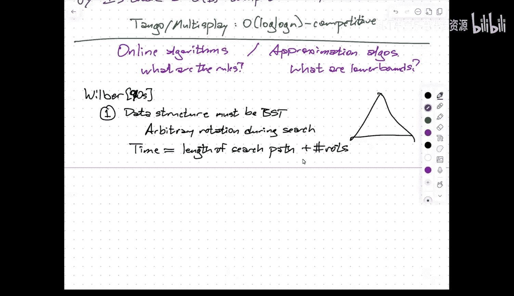
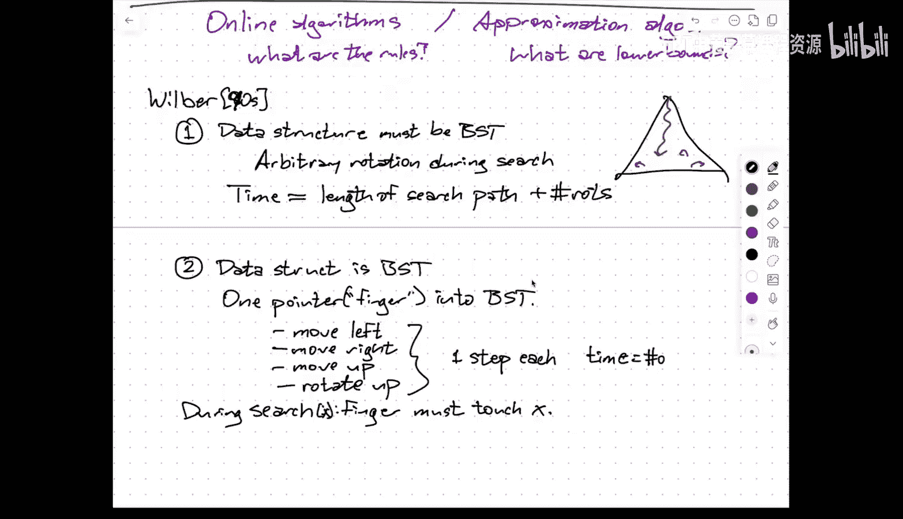
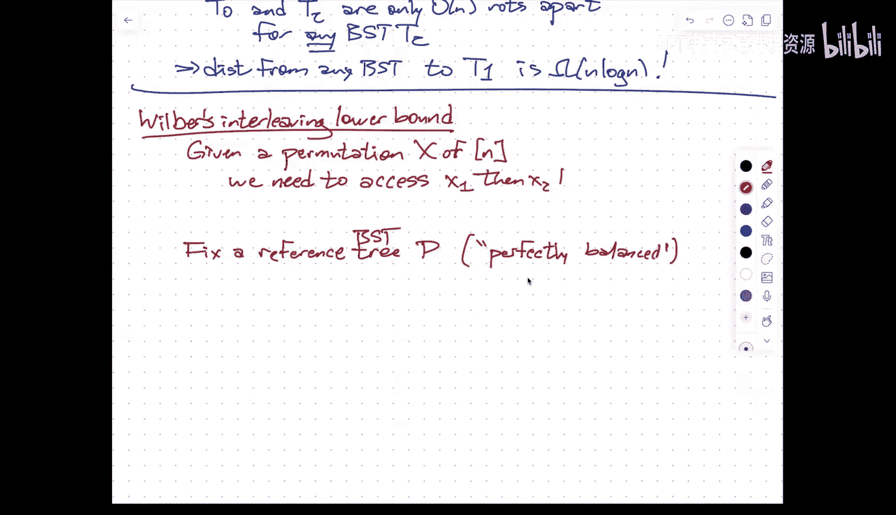
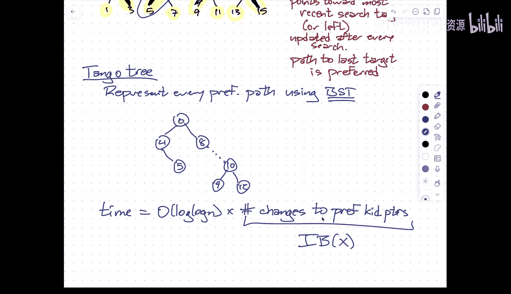

# 006：动态最优性与Tango/多伸展树

在本节课中，我们将学习动态最优性的概念，并探讨Tango树和多伸展树这两种数据结构。它们的目标是接近动态最优二叉搜索树的性能，即其操作总时间与一个能预知未来查询序列的最优二叉搜索树相比，只差一个对数对数的因子。

---

## 课程管理与回顾

首先，感谢大家的耐心等待。

关于课程管理，有几点需要宣布。作业零的解答已经发布。是否会布置作业一，取决于我批改作业零的速度。目前来看，布置作业一的概率大约是50%。我们拭目以待。

此外，学期末的安排有所调整。原本安排在期末考试周的项目展示，由于我将出国，现改为在最后三节常规课上进行。因此，项目提案的截止日期也相应推迟了一周。论文检索任务的截止日期没有改变，相关说明和论文列表将在本周末发布，大家仍有大约三周时间完成。

上次课程我们开始讨论伸展树。这是一种自调整二叉搜索树的例子。它不像其他树那样在插入和删除时通过显式规则来保持平衡，而是在执行搜索时动态调整树的形状。

伸展树具有许多优良特性。我们已看到，任何操作都能达到对数级的摊还时间。它还满足静态最优性，这意味着其运行时间总是类似于 `log(总搜索次数 / 对特定目标X的搜索次数)`，这在信息论上是最优的。

此外，还有静态手指界：假设搜索键是1到n的整数，并设定一个静态手指F，那么搜索目标X的运行时间总是 `log(|X - F|)`。这是空间局部性的体现。

以及工作集界：运行时间与自上次搜索X以来，所搜索的不同键的数量对数成正比。这体现了时间局部性，即搜索越频繁的项目，其搜索速度越快。

甚至有一个动态手指猜想：第i次搜索的成本，与它在排序空间中与前一次搜索目标的距离成正比。

然后，我们遇到了动态最优性猜想：它声称伸展树（或任何常数竞争的动态二叉搜索树）的性能，与一个能预知整个查询序列的最优二叉搜索树相比，只差一个常数因子。目前，无论是伸展树还是其他任何结构是否满足常数竞争，都是未解决的问题。

---

## 动态二叉搜索树模型

为了分析动态最优性，我们需要明确比较的规则和成本模型。Wilber在这一领域做出了奠基性工作。

我们首先定义什么是动态二叉搜索树。模型一：数据结构必须是一棵二叉搜索树，允许在搜索过程中进行任意旋转。时间成本定义为搜索路径长度加上旋转次数。在这个模型中，我们假设除旋转外的一切操作都是免费的，因此这个时间实际上是运行时间的一个下界。

模型二：数据结构是一棵二叉搜索树，并有一个指针（手指）。允许的操作包括：将指针移动到左子节点、右子节点、父节点，或者在指针所在节点进行旋转（使其与父节点交换位置）。搜索结束时，指针必须触及目标X。时间成本等于这些操作的总数。这个模型可以描述红黑树、AVL树、树堆、替罪羊树和伸展树等。

模型三：在搜索过程中，选择一个包含根节点和搜索目标X的连通子树S，然后可以任意重构S（即用同一组键的任何其他二叉搜索树替换它），并将S外的部分正确连接。时间成本与S中的节点数成正比。

Wilber证明了这三个模型在渐进意义下是等价的，即它们定义的时间成本彼此只差一个常数因子。这为我们形式化动态最优性猜想提供了基础：伸展树在模型二（或等价模型）下的运行时间，与能预知未来的最优二叉搜索树相比，是常数倍的。

---

## 一个下界论证：从排列到树变换

在深入讨论Tango树之前，我们先简要回顾作业零中的一个下界论证，以理解为何某些问题需要 `Ω(n log n)` 的时间。

考虑一个更一般的动态树模型，允许操作包括：左移、右移、上移、向上旋转、交换子节点、报告根。目标是处理一个排列X，使得在处理完第i个元素后，通过一系列操作让该元素位于根节点。

这个过程的“轨迹”是一个由这六个操作符号组成的字符串。给定初始树，执行这个轨迹就能还原出排列X。因此，轨迹编码了排列。由于存在 `n!` 个不同的排列，而长度为L的字符串最多只能编码 `6^L` 个排列，所以对于大多数排列X，轨迹长度L必须满足 `6^L ≥ n!`，即 `L = Ω(n log n)`。

另一方面，对于任何排列X，都存在一棵特定的树（例如一个右链），使得访问该序列只需 `O(n)` 次操作。这意味着，从任意二叉搜索树变换到这棵特定树，在最坏情况下需要 `Ω(n log n)` 次操作。这个论证说明了在允许交换子节点的模型中，达到某些排列的“距离”是很大的。

---

## Wilber的互穿下界

回到动态二叉搜索树的最优性分析，Wilber提出了一个用于下界分析的关键概念——互穿界。

我们固定一棵任意的参考二叉搜索树P。对于树P中的每个节点y，定义其左区域 `L(y)`（包含y及其在P中左子树的所有节点）和右区域 `R(y)`（包含y及其在P中右子树的所有节点）。

给定一个搜索序列X，我们提取出所有属于 `L(y) ∪ R(y)` 的搜索项，构成子序列 `X^y`。节点y的互穿值 `IB_y(X)` 定义为在 `X^y` 中，搜索项在左区域和右区域之间交替的次数。

整个序列X的互穿界 `IB(X)` 是所有节点y的互穿值之和。Wilber证明，任何动态二叉搜索树执行搜索序列X所需的时间，至少是 `Ω(IB(X))`。直观上，每当参考树中某个节点的偏好区域发生切换时，在实际的搜索树中都必须触及某个特定的节点，而这些被触及的节点对于不同的y是不同的。

---

## Tango树与多伸展树的设计

现在，我们来看如何设计一个数据结构，使其运行时间与互穿界 `IB(X)` 成正比，从而达到 `O(log log n * OPT)` 的竞争比。这就是Tango树和多伸展树的核心思想。

首先，我们固定一棵完全平衡的二叉搜索树作为参考树P。P中的每个节点维护一个“偏好孩子”指针，总是指向最近一次搜索所在子树的方向。这些偏好指针将P分解成若干条“偏好路径”。

Tango树的关键想法是：**用一棵平衡二叉搜索树来表示每一条偏好路径**。这样，整个Tango树就是由许多棵代表不同偏好路径的小二叉搜索树，通过指针连接而成的一棵大的二叉搜索树。

当执行一次搜索时，我们从根开始，沿着实际树（也是参考树P）的搜索路径下行。这条路径可能会穿越多条偏好路径。每次我们从一个偏好路径“离开”，通过一条非偏好边进入另一个偏好路径时，就对应参考树P中一个偏好孩子指针的改变（即一次“交替”）。

在Tango树中，每次进入一条新的偏好路径，我们需要在代表该路径的平衡BST中进行一次搜索（耗时 `O(log |路径长度|)`，而路径长度不超过树高 `O(log n)`，所以是 `O(log log n)`）。同时，搜索结束后，我们需要更新偏好指针，这可能涉及将一条偏好路径分裂成两条，或将两条路径合并。平衡BST（如红黑树或伸展树）可以高效地支持分裂与合并操作。

因此，一次搜索的总时间是 `O((交替次数) * log log n)`。而“交替次数”正好对应于Wilber互穿界中，本次搜索所贡献的部分。所以，Tango树的总运行时间是 `O(IB(X) * log log n)`，即 `O(log log n * OPT)`。

多伸展树与Tango树在精神上完全相同，唯一的区别在于它使用伸展树作为每条偏好路径的内部平衡BST。由于伸展树本身具有良好的摊还性能，多伸展树在某些方面分析起来更优，并能处理插入和删除操作。

---

## 总结

本节课我们一起探讨了动态最优性的概念。我们首先了解了动态二叉搜索树的几种等价模型，为分析奠定了基础。接着，我们通过一个排列编码的论证，理解了某些树变换问题需要 `Ω(n log n)` 时间。然后，我们介绍了Wilber的互穿下界，它为最优动态BST的性能提供了一个有力的下界工具。

最后，我们学习了Tango树和多伸展树的设计精髓：通过固定一棵参考树来跟踪“偏好路径”，并用平衡BST组织这些路径，从而将每次搜索的成本与参考树中偏好改变的次数（即互穿界）绑定，实现了与最优解相比仅差 `O(log log n)` 因子的竞争性能。这为我们设计近乎动态最优的数据结构提供了清晰的蓝图。