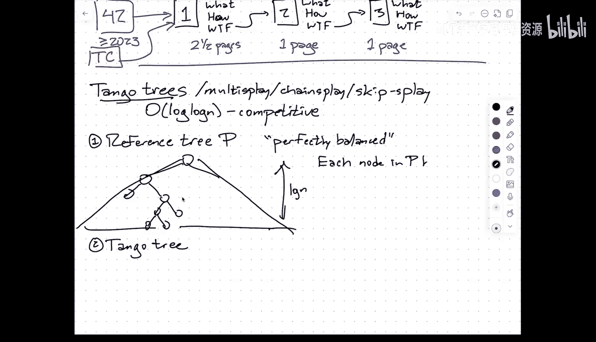
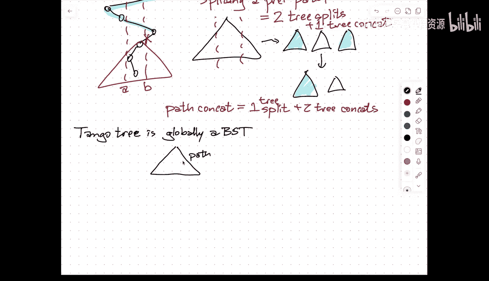
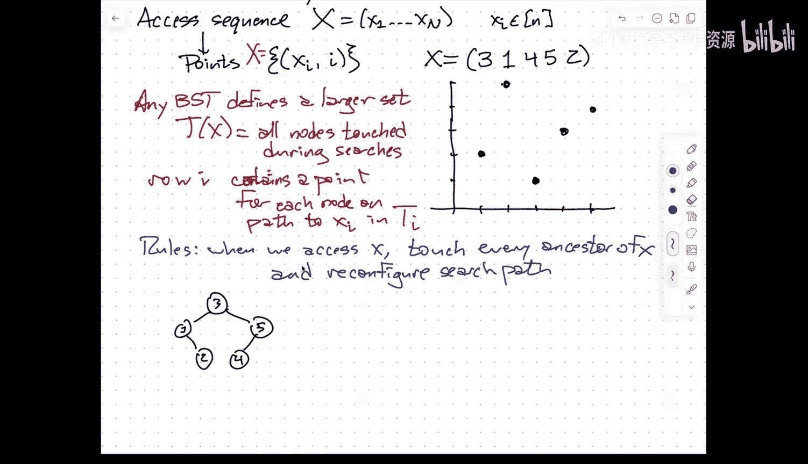
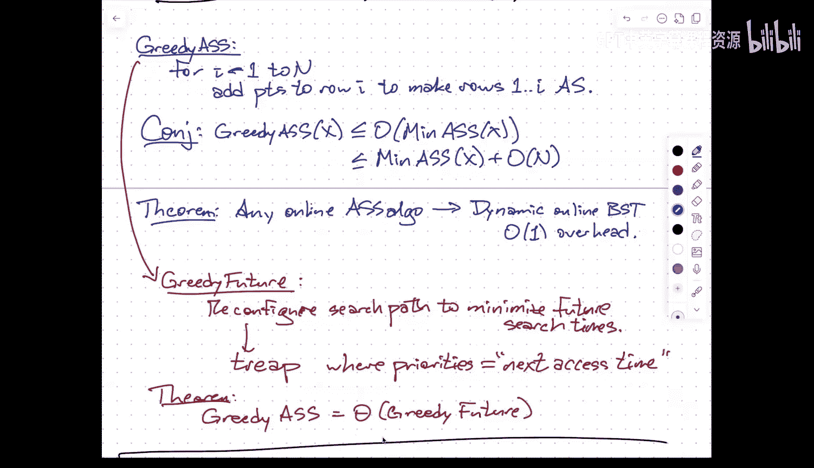

# 007：Tango树、多展树与二叉搜索树的几何视角

在本节课中，我们将学习两种重要的动态二叉搜索树结构：Tango树及其变体多展树，并探讨二叉搜索树性能分析的一个强大几何视角。我们将了解它们如何实现接近最优的搜索性能，以及如何通过几何模型来理解和分析二叉搜索树算法。

## 课程概述

首先，我们有一些课程管理事项需要宣布。纸面追踪作业已经发布。这项作业的目的是让大家熟悉阅读数据结构领域的研究文献，追踪参考文献以帮助理解，并能够向非专业受众清晰地阐述论文内容。

作业的基本结构是：首先找到一篇论文（称为论文一），撰写一篇简短的评述，描述论文的主要内容、主要贡献、使用的核心技术工具以及你在阅读中感到困惑的地方。然后，选择第二篇论文来帮助你解决对论文一的困惑，并解释它与论文一的关系以及它如何澄清了你的疑问。如果仍有困惑，可能需要选择第三篇论文。整个文档应控制在五页左右。

作业中提供了一个包含42篇2023年及之后发表的论文建议列表作为起点，但这并非强制要求。你也可以从其他来源选择论文。

## Tango树与多展树

上一节我们介绍了课程作业。本节中，我们来看看一种称为Tango树的数据结构及其变体。这些结构的目标是构建一个具有竞争性的动态二叉搜索树。

Tango树及其变体（如多展树、链展树、Skip-Splay树）都能达到 **O(log log n)** 的竞争比。这意味着，对于存储在树中的节点访问序列，Tango树所花费的时间最多是最优自调整二叉搜索树（即使它能预知未来）所花费时间的 **log log n** 倍。

Tango树的定义使用了两种树：
1.  **参考树 P**：这是一棵完美平衡的静态二叉搜索树，包含所有键值（例如1到n）。它用于定义“偏好”关系。
2.  **实际的Tango树**：这是动态维护的数据结构。

参考树P中的每个节点都有一个**偏好子节点**指针。其语义是：如果最近一次访问节点v的子树（或v本身）位于其左子树，则其偏好子节点为左孩子；否则为右孩子。这些偏好指针将P的顶点分解成若干条**偏好路径**，每条路径从一个节点开始，一直延伸到叶子节点。

每当访问一个节点x时，从P的根节点到x的路径就变为新的偏好路径。这可能会改变路径上一些节点的偏好子节点，从而改变偏好路径的分解方式。

Tango树的核心思想是：**将每一条偏好路径用一个平衡的二叉搜索树（如红黑树）来存储**。因此，Tango树本身是由多个代表偏好路径的平衡二叉搜索树通过指针连接而成的全局二叉搜索树。

当执行搜索时，我们沿着Tango树向下查找。每次从一个偏好路径树“跳转”到另一个偏好路径树时（这对应于在参考树P中遇到一个非偏好边），我们需要对当前的偏好路径树进行**分割**和**连接**操作，以反映偏好路径的变化。

由于每条偏好路径的长度最多为 **O(log n)**（因为P是完美平衡的），所以代表它的平衡树大小也是 **O(log n)**。在这些平衡树上进行搜索、分割、连接操作的时间复杂度为 **O(log (log n))**。

如果一次搜索在参考树P中经过了 **k** 条不同的偏好路径（即遇到了 **k-1** 次非偏好边），那么总时间就是 **O(k log log n)**。可以证明，这个 **k** 的总和正好等于Wilber的**交错界**，而交错界是任何二叉搜索树算法时间代价的一个下界。因此，Tango树的总时间是 **O(opt * log log n)**，其中 **opt** 是最优算法的代价。

原始的Tango树使用红黑树，每次搜索可能需要对 **O(log n)** 个路径树进行操作，因此单次搜索的最坏情况时间是 **O(log n log log n)**。而**多展树**使用伸展树作为组件，利用伸展树的摊还分析特性，可以证明其单次搜索的摊还时间仅为 **O(log n)**，从而实现了 **O(log log n)** 的竞争比。这是目前已知最接近常数竞争比的动态二叉搜索树结构。

## 二叉搜索树的几何视角

上一节我们介绍了Tango树如何实现对数对数级别的竞争性。本节中，我们转向一个分析二叉搜索树性能的强大工具：几何视角。

这个视角由Demaine、Harmon、Iacono、Pătraşcu等人提出。给定一个包含键值1到n的二叉搜索树和一个访问序列 **X = (x1, x2, ..., xm)**，我们可以将每次访问定义为一个二维平面上的点：**横坐标**为被访问的键值，**纵坐标**为访问发生的时间。

现在考虑任何自调整二叉搜索树算法。当它在时刻 **i** 访问键值 **xi** 时，它会“触及”从树根到 **xi** 的搜索路径上的所有节点。我们可以为这些被触及的节点也在平面上创建点（横坐标为节点键值，纵坐标为时间 **i**）。这样就得到了一个比原始访问序列点集更大的点集 **T(X)**。

研究者发现，点集 **T(X)** 满足一个称为**树状满足**的性质。其定义如下：
对于点集中任意两个横纵坐标均不同的点，它们确定了一个矩形。这个矩形内部或边界上必须包含该点集中的另一个点。

反之亦然：**任何包含原始访问点集X的树状满足点集，都对应着某个自调整二叉搜索树算法对于序列X的触及序列**。

因此，我们得到了一个关键定理：
> 对于给定访问序列X，最优动态二叉搜索树的代价（总触及节点数），等于**包含X的最小树状满足超集的大小**。

这为分析二叉搜索树的最优性能提供了一个清晰的几何刻画。

基于这个模型，一个自然的想法是使用贪心算法在线构建树状满足超集：按时间顺序处理访问，每次在必要时添加最少的点（通常是在新访问点与旧点构成的“违规”矩形的某个角落添加点）来保证当前所有点的树状满足性。

这个几何贪心算法可以（在付出常数倍时间开销的前提下）转化为一个在线的二叉搜索树算法，称为 **Greedy Future**。这个算法在道德上类似于根据节点下一次被访问的时间作为优先级，将搜索路径重构成一个**Treap**（树堆），以最小化未来访问的成本。

曾经有猜想认为Greedy Future算法是最优的，其代价最多比最优解多一个线性项（即 **OPT + O(n)**）。然而，近年来的研究（如Paper Chase列表中的论文13）证明这个猜想是**错误**的。他们表明Greedy Future的代价至少是 **OPT + Ω(n log log n)**，并且其竞争比至少为2。更奇怪的是，他们发现存在一些序列，对其运行Greedy Future的代价，比对它的逆序序列运行Greedy Future的代价高两倍；有时执行更多的搜索反而让Greedy Future更快。这些行为表明Greedy Future并非我们寻找的“终极”最优或近乎最优算法。

尽管如此，这个几何框架仍然是理解和设计二叉搜索树算法的强大工具，而最初的**伸展树猜想**（即伸展树是常数竞争的，代价为 **OPT + O(n)** ）仍然悬而未决。

## 总结

本节课我们一起学习了：
1.  **Tango树和多展树**：通过将静态完美平衡树中的偏好路径用平衡BST表示，并在线更新这些路径，实现了 **O(log log n)** 竞争比的动态二叉搜索树。
2.  **二叉搜索树的几何视角**：将访问序列和树的操作映射为二维点集，并引入了**树状满足性**这一关键性质。该视角证明了最优BST的代价等价于寻找包含访问点的最小树状满足超集，并由此引出了Greedy Future等在线算法。虽然Greedy Future被证明不是最优的，但这个几何模型为分析和设计BST算法提供了深刻的见解。

这些内容展示了现代数据结构研究如何将组合、几何和摊还分析相结合，以追求算法的理论极限。