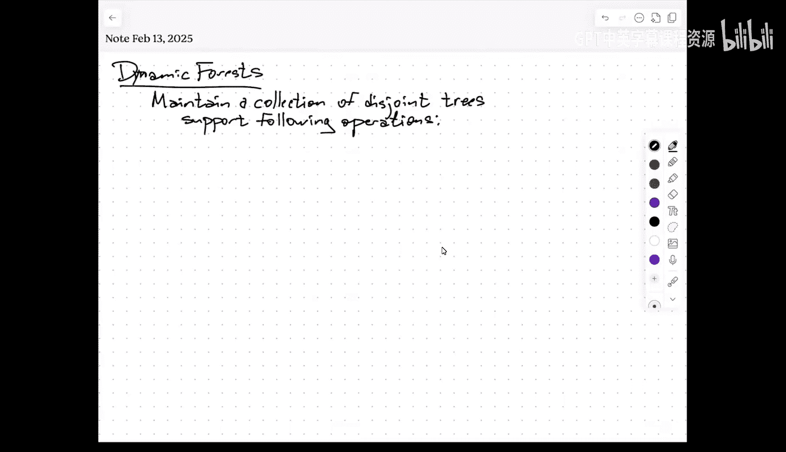
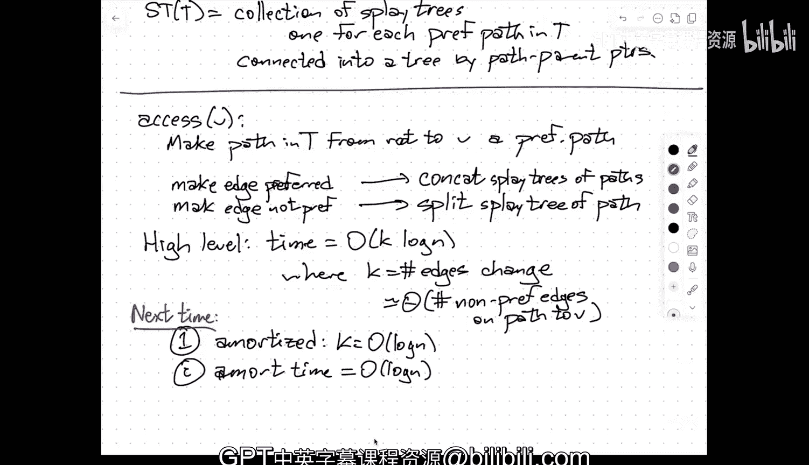

# 动态树结构：008：欧拉回路树与ST树

在本节课中，我们将要学习如何利用平衡二叉搜索树来维护一个动态变化的森林（即树的集合）。我们将重点介绍两种核心数据结构：用于处理子树操作的**欧拉回路树**，以及用于处理路径操作的**ST树**。这两种结构都能在**对数级**的摊销时间内支持对树的动态修改和查询。

---

## 欧拉回路树

上一节我们介绍了动态森林的基本操作需求，本节中我们来看看如何利用**欧拉回路**的概念来支持子树操作。

### 核心思想：将树转化为序列

欧拉回路树的核心思想是，将待表示的树 `T`（我们称之为**表示树**）通过一次欧拉遍历转化为一个序列。想象你从树中任意一点出发，左手始终触摸着树，沿着边走，每经过一个节点就记录下来。这样你会得到一个访问序列，其中每个节点会出现多次（次数等于其度数）。为了便于处理，我们将这个环形序列在某处断开，形成一个线性序列。

这个线性化的欧拉序列有一个关键性质：**表示树中的任意子树，对应欧拉序列中的一个（或至多两个）连续区间**。例如，当你进入一个子树时，你会遍历完整个子树再离开，因此在序列中，该子树的所有节点访问记录是连续的。

### 数据结构：平衡二叉搜索树

我们并不直接存储表示树 `T` 的图结构。相反，我们构建一棵**平衡二叉搜索树**（例如伸展树或红黑树），其**中序遍历顺序**恰好就是这个欧拉序列。树中节点的**键值**是其在序列中的位置。

以下是构建欧拉回路树的关键步骤：

1.  对表示树 `T` 进行欧拉遍历，得到序列 `S`。
2.  以 `S` 中元素的顺序作为键，构建一棵平衡二叉搜索树 `ET(T)`。对 `ET(T)` 进行中序遍历，即可还原序列 `S`。

### 支持操作：子树查询与更新

通过上述表示，子树操作被转化为对序列 `ET(T)` 的**区间操作**。

#### 子树查询

假设我们需要查询以边 `(U, V)` 指向的、包含 `V` 的子树中节点的权重和（或最大值等）。这对应于在欧拉序列中找到代表该子树的区间 `[l, r]`。

**实现方式**：
*   如果我们使用静态的、完全平衡的二叉搜索树，可以将查询区间分解为 `O(log n)` 个**规范区间**（即树中某些子树对应的区间）。我们只需合并这些子树根节点上预计算好的聚合信息（如和、最大值）。
*   如果我们使用**伸展树**，过程更直接：我们将区间端点 `l` 和 `r` 对应的节点**伸展**到根附近。操作完成后，与这两个节点相关的子树结构会包含整个查询区间，我们可以直接从相关节点获取聚合信息。

为了支持查询，每个树节点需要维护其子树（在二叉搜索树中的子树）的聚合信息，例如：
*   `sum`: 子树中所有权重之和。
*   `min`: 子树中所有权重的最小值。
*   `size`: 子树中节点个数（用于支持区间加法等更新）。

这些信息可以在树旋转时用常数时间更新。

#### 子树更新

当我们需要对子树中所有节点的权重进行批量更新时（例如全部加 `7`），显式地修改每个节点需要 `O(n)` 时间，不可接受。

**解决方案是惰性更新**：
*   每个树节点额外维护一个 `delta` 值，表示“应已加到其所有后代节点但尚未实际执行的增量”。
*   当需要对一个区间执行“全部加 `7`”操作时，我们只需在代表该区间的 `O(log n)` 个规范区间的根节点上，将其 `delta` 值增加 `7`。
*   在后续任何需要**访问**某个节点 `v` 的操作（如查询、伸展）之前，我们必须先将 `v` 节点上累积的 `delta` **下推**给它的两个子节点，并更新 `v` 自身的聚合信息。这保证了任何时候我们读取到的信息都是正确的。

通过这种方式，**区间更新**和**区间查询**的时间复杂度相同，均为 `O(log n)`（摊销时间，若使用伸展树）。

### 结构操作：连接与断开

`Link`（连接）和 `Cut`（断开）操作可以通过对欧拉回路序列进行拆分和拼接来实现。

*   **断开 `Cut(U, V)`**：在欧拉序列中，边 `(U, V)` 对应两段相邻的访问记录 `..., U, V, ...` 和 `..., V, U, ...`。断开操作相当于将环形序列在 `U, V` 和 `V, U` 之间切开，并重新连接形成两个独立的序列。这可以通过几次二叉搜索树的**拆分**和**拼接**操作完成。
*   **连接 `Link(U, V)`**：这是断开操作的逆过程。假设 `U` 和 `V` 属于不同的树，连接操作将两个欧拉序列合并为一个。这同样可以通过几次二叉搜索树的拆分和拼接操作完成。

由于伸展树能高效支持拆分和拼接（每次操作摊销 `O(log n)` 时间），因此 `Link` 和 `Cut` 操作也能在 `O(log n)` 摊销时间内完成。

---

## ST树（用于路径操作）

上一节我们学习了处理子树操作的欧拉回路树，本节中我们来看看处理路径操作的**ST树**。路径操作关心的是树上两个节点之间唯一路径上的信息。

### 核心思想：偏好路径分解

ST树的核心思想是将表示树 `T`（现在假设已指定一个根节点）动态地分解为若干条**偏好路径**。

*   每个非叶子节点可以指定其一个子节点为**偏好孩子**。连接节点与其偏好孩子的边称为**偏好边**。
*   连续的偏好边形成一条**偏好路径**。这样，整棵树被划分成若干条从某个节点向下延伸的路径。
*   “偏好”的定义是动态的：**最近被访问过的节点所在的子节点，成为其父节点的偏好孩子**。一个特殊的操作 `Access(v)` 会将从根到节点 `v` 的整条路径变为一条偏好路径。

### 数据结构：路径的集合

ST树并不显式存储整个树形结构，而是：
*   为**每一条偏好路径**维护一棵**平衡二叉搜索树**（通常也用伸展树），树中节点按路径从上到下的顺序存储。
*   每条偏好路径对应的二叉搜索树的**根节点**，存储一个**路径父指针**，指向该路径最顶端节点在表示树 `T` 中的父节点。通过这个指针，所有路径树被连接成一个整体。

### 关键操作：Access

几乎所有其他操作（路径查询、路径更新、换根等）都建立在 `Access(v)` 操作之上。`Access(v)` 的目标是：**将从根到 `v` 的路径变为一条连续的偏好路径**。

**实现过程简述**：
1.  从节点 `v` 开始，沿着路径父指针向上走，直到根路径。
2.  在向上走的过程中，我们需要不断改变边的偏好状态：
    *   **取消偏好**：当需要将当前路径与上方路径合并时，需要先断开当前路径顶端的偏好边。这对应在伸展树中进行一次**拆分**操作。
    *   **建立偏好**：然后将当前路径连接到上方路径。这对应在伸展树中进行一次**拼接**操作。
3.  这些拆分和拼接操作都是在伸展树上进行的，每次耗时摊销 `O(log n)`。

### 支持操作：路径查询与更新

执行 `Access(v)` 后，从根到 `v` 的路径已经成为一条偏好路径，并存储在一棵伸展树中。此时：
*   **路径查询**（如求路径上节点的权重和）：我们可以像在欧拉回路树中处理区间查询一样，在这棵代表路径的伸展树上进行查询。
*   **路径更新**（如给路径上所有节点加一个值）：同样，我们可以使用**惰性更新**技术在这棵伸展树上进行区间更新。

为了支持这些操作，伸展树的每个节点也需要维护聚合信息（如 `sum`, `min`, `size`）以及惰性标记（如 `delta`）。

### 时间复杂度分析

一次 `Access(v)` 操作可能会改变 `O(k)` 条边的偏好状态，其中 `k` 是路径上原本非偏好的边数。每次改变需要 `O(log n)` 的伸展树操作时间。通过精妙的摊还分析（例如使用势能法），可以证明**任意连续 `m` 次操作的总时间是 `O((m + n) log n)`**，因此单次操作的**摊销时间复杂度是 `O(log n)`**。

---

## 总结

本节课中我们一起学习了两种强大的动态树数据结构：
1.  **欧拉回路树**：通过将树的欧拉遍历序列存储在平衡二叉搜索树中，高效支持**子树**的查询、更新以及树的**连接**与**断开**操作。核心技巧是利用序列的区间特性以及惰性更新。
2.  **ST树**：通过动态维护**偏好路径**，并将每条路径存储在平衡二叉搜索树中，高效支持**路径**的查询、更新以及核心的 `Access` 操作。其效率依赖于伸展树的灵活性和精妙的摊还分析。

最终，存在一种称为**自调整拓扑树**的统一数据结构，它融合了二者的思想，能够同时支持所有类型的操作（子树、路径、结构修改），且每个操作均在 `O(log n)` 摊销时间内完成。欧拉回路树和ST树是理解这个统一结构的重要基础。