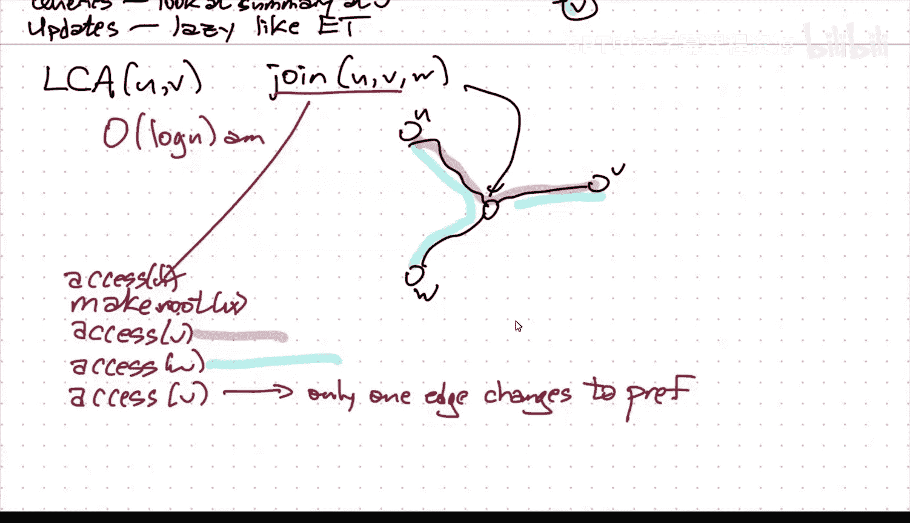

# 动态森林数据结构：009：ST-trees

在本节课中，我们将学习一种名为ST-trees（或称Link-Cut Trees）的动态森林数据结构。这种数据结构能够高效地维护一个由多棵不相交的树组成的森林，并支持对树的结构（如添加或删除边）以及对树上的路径进行查询和更新操作。

## 回顾与概述

上一节我们介绍了动态森林的基本概念和欧拉环游树（Euler Tour Trees），它能够以对数时间处理子树操作和结构操作。本节中，我们来看看另一种强大的数据结构——ST-trees，它专门用于处理**路径操作**。

ST-trees同样能在**对数分摊时间**内完成结构操作（如`cut`、`link`）和路径操作（如查询路径最小值、对路径上所有节点增加值等）。其核心思想与欧拉环游树不同，它并不依赖于全局的节点顺序，而是通过维护一种称为“偏好路径”的分解结构来实现。

## ST-trees 的核心机制

### 偏好路径与路径树

首先，想象我们为森林中的每棵树指定一个根节点（稍后会讨论如何改变根）。每个节点都有一个**偏好子节点指针**，它可以指向其某个子节点，也可以为空。这个指针指向该节点子树中**最近被访问过**的节点所在的子节点方向。

`access(v)`是一个核心抽象操作，其高级别的作用是**改变哪些子节点是“偏好”的**。具体来说，在访问节点`v`之后，从根节点到`v`的路径上的所有边都会变为“偏好”边，而离开这条路径的所有边（即连接到路径上节点的其他子树的边）都会变为“非偏好”边。

在数据结构的内部表示中，每一条**偏好路径**都被存储在一个**路径树**中。这是一个二叉搜索树（通常使用伸展树splay tree以简化分析），其中的节点按键的顺序存储，这个“键”就是节点在路径中的**深度**。因此，对路径树进行中序遍历，就能按深度递增的顺序得到路径上的所有节点。

### 数据结构的连接

不同的偏好路径通过**路径父指针**连接起来。对于一条偏好路径，其最顶端的节点（深度最浅）的父节点并不直接存储在该节点的子指针中，而是通过一个路径父指针，从**存储该顶端节点的路径树的根节点**指向代表其父节点的节点。

因此，整个ST-tree可以看作是由许多伸展树（每个代表一条偏好路径）通过虚线箭头般的路径父指针连接而成的集合。

### `access` 操作的过程

当我们执行`access(v)`时，算法大致流程如下：
1.  从代表节点`v`的伸展树节点开始。
2.  将该节点**伸展**到其所在路径树的根。
3.  找到从该路径树根出发的路径父指针（指向其父节点所在的另一条偏好路径）。
4.  我们需要将这条“虚线”连接变为“实线”连接，即进行树的连接（join）操作。这通常涉及对父节点所在路径树进行分裂（split），然后将两条路径树合并。
5.  合并后，继续向上重复这个过程（伸展、连接），直到抵达整棵ST-tree的根。

粗略分析，`access(v)`的时间复杂度与从根到`v`的路径上**初始非偏好边的数量**乘以`O(log n)`成正比，因为每处理一条这样的边（即连接两条偏好路径），可能需要进行一次伸展树的分裂与合并操作。

## 分摊时间复杂度分析

然而，通过巧妙的分摊分析，我们可以证明`access`操作的分摊时间复杂度实际上是`O(log n)`。这依赖于两个技巧。

### 技巧一：利用伸展树引理

首先，我们利用伸展树的**摊还引理**。该引理指出，伸展一个节点的摊还代价最多为 `1 + 3*(r'(x) - r(x))`，其中`r(x) = log(weight(x))`，`weight(x)`是我们为分析而定义的节点权重。

我们如下定义节点`x`的权重`weight(x)`：它是**所有通过路径父指针最终连接到`x`的路径树中的节点总数**（包括`x`自身）。这意味着，一个节点的权重包含了它自身以及所有“挂”在它下面的整条偏好路径的大小。

在`access(v)`过程中，节点`v`被反复伸展和连接。由于权重的定义方式，在连接操作前后，相关节点的**秩（rank）** 变化会相互抵消，最终摊还代价主要取决于`v`最终秩的增加。而`v`最终成为ST-tree的根，其权重为整棵树的大小`n`，秩为`log n`。因此，来自伸展操作的摊还代价总计为`O(log n)`。

### 技巧二：轻重路径分解

第二个技巧用于证明在摊还意义上，每次`access`操作需要改变偏好状态的边数仅为常数（实际上是`O(log n)`，但结合之前的`O(log n)`因子，总时间仍为`O(log n)`）。

我们引入一个独立于“偏好路径”的概念：**轻重路径分解**。在原始的被表示的树中，对于从父节点`u`到子节点`v`的边，如果以`v`为根的子树大小**严格大于**以`u`为根的子树大小的一半，则称这条边为**重边**，否则为**轻边**。每个节点最多有一个重子节点。

一个关键性质是：在任何从根到叶子的路径上，最多有 **`log n`** 条轻边。因为每经过一条轻边，其子树大小至少减半。

现在，我们将边的状态分为两类：重/轻（由树结构决定，除非进行`link/cut`，否则不变）和 偏好/非偏好（由`access`操作动态改变）。我们关心的是**重偏好边**的数量变化。

分析表明：
*   一次`access`操作，最多使`O(log n)`条边从非偏好变为偏好（因为路径上最多有`log n`条轻边，而重边变为偏好的次数可以分摊到后续它们变为非偏好的操作上）。
*   一次`cut`操作，在摊还意义上，最多改变`O(log n)`条边的重/轻状态。
*   一次`link`操作，在摊还意义上，不增加额外的重偏好边变化代价。

因此，综合来看，每种操作（`access`, `cut`, `link`）的摊还时间复杂度都是 **`O(log n)`**。

## 处理无根树与路径查询

ST-trees内部使用有根树，但我们可以处理无根树的路径查询。基本流程如下，假设要查询节点`u`和`v`之间的路径：
1.  `access(u)`：这将使从原根到`u`的路径变为偏好路径。
2.  `make_root(u)`：将`u`设为新的根。这通过**反转**从原根到`u`的偏好路径来实现。在路径树中，这可以通过设置一个“反转”懒惰标记高效完成，实际反转子树的操作在需要时才下推。
3.  `access(v)`：现在，从新根`u`到`v`的路径将成为唯一的偏好路径，并且通过最后的伸展操作，`v`会位于其路径树的根附近。此时，从`u`到`v`的整条路径就集中在了一个伸展树结构中。

完成上述步骤后，路径查询（如求和、求最小值）就变成了在这个路径树根节点上查询其维护的汇总信息。路径更新（如所有节点加一个值）也可以通过懒惰标记在根节点上记录，并在后续操作中下推。

## 其他操作：最近公共祖先

ST-trees也可以用来计算最近公共祖先。对于有根树，给定节点`u`和`v`，可以通过以下步骤找到其LCA：
1.  `access(u)`
2.  `make_root(u)` （如果需要，取决于初始根）
3.  `access(v)`
在第二次`access(v)`之后，LCA就是`v`所在路径树中，深度最小的那个节点（即第一次`access`后发生偏好子节点变更的那个节点的父节点）。这需要对数据结构内部有稍深入的了解，但实现起来是直接的。

## 总结

本节课我们一起学习了ST-trees（Link-Cut Trees）这一强大的动态森林数据结构。我们了解了它如何通过维护“偏好路径”并使用伸展树作为基础，来高效支持：
*   **结构更新**：`link`（连接两棵树）、`cut`（分割树）。
*   **路径查询与更新**：查询路径上节点的聚合信息（如和、最小值），或对路径上所有节点进行批量更新。
*   **辅助操作**：`find_root`（查找根）、`make_root`（换根），以及计算最近公共祖先。

所有操作都能在 **`O(log n)` 的分摊时间复杂度** 内完成。下一节，我们将探讨ST-trees在一些经典问题中的应用，例如平面图中的最短路径问题。

