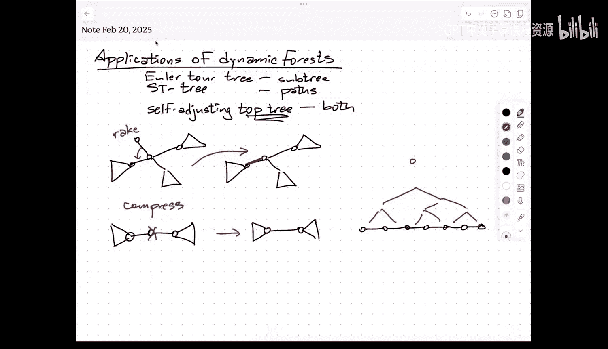
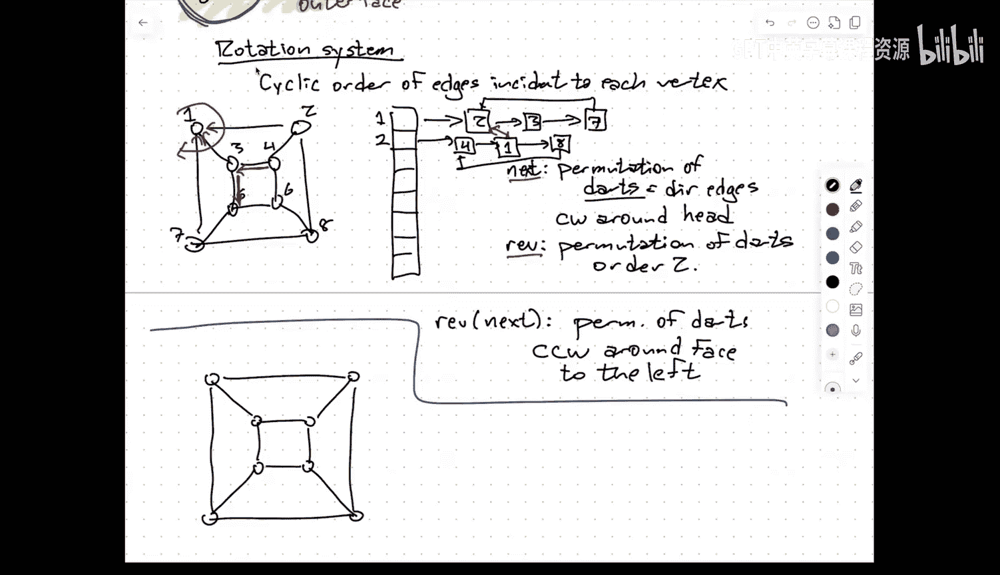
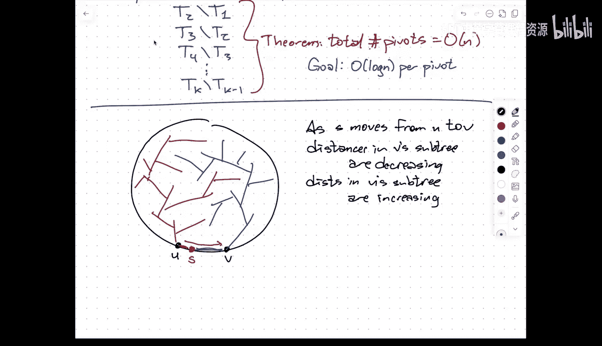
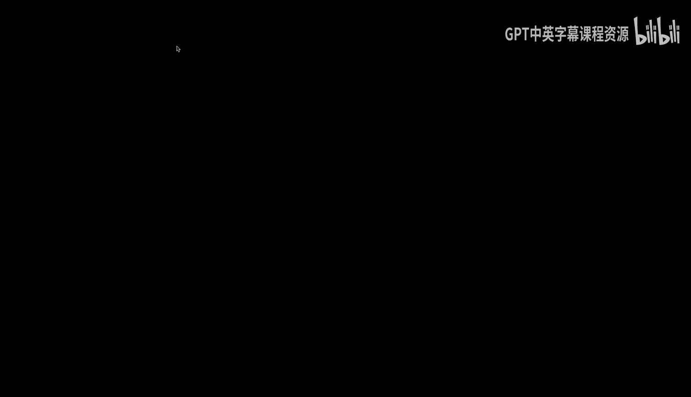
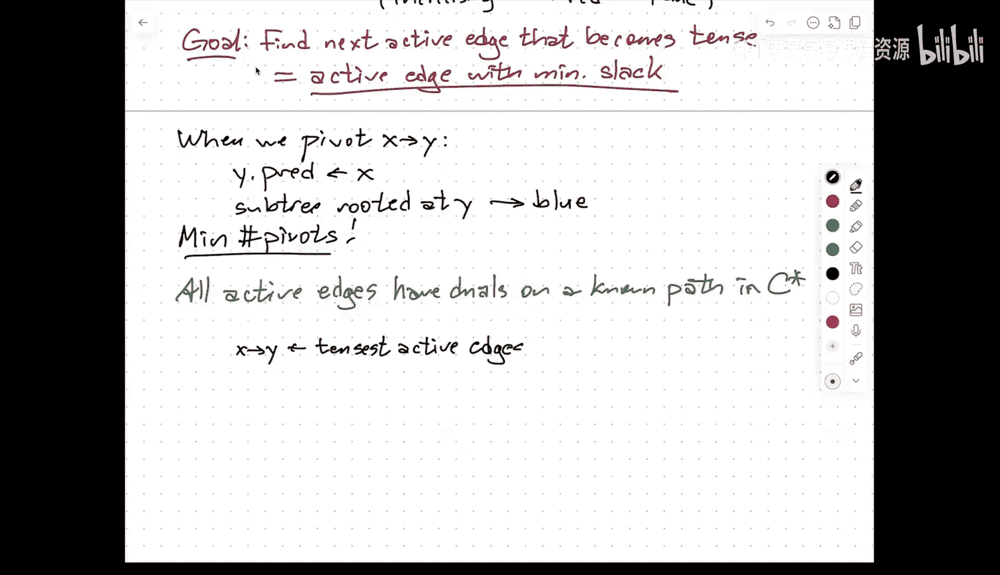
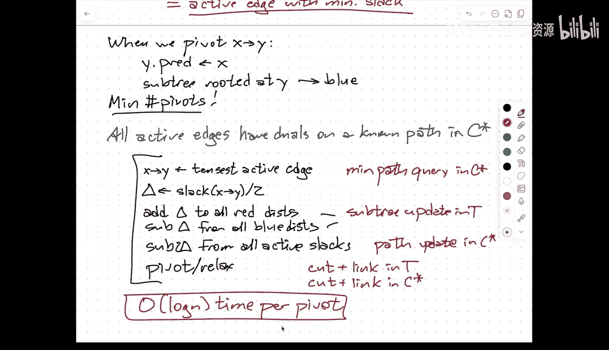

# 动态数据结构与算法：010：多源最短路径

在本节课中，我们将学习如何利用动态森林数据结构，高效地解决平面图上的多源最短路径问题。我们将从回顾动态森林和平面图的基本概念开始，逐步构建出解决该问题的完整算法框架。

## 动态森林数据结构回顾

上一节我们介绍了用于维护动态森林的几种数据结构。本节中，我们来看看这些结构如何应用于具体问题。

动态森林数据结构的核心目标是维护一个由多棵树组成的集合，并支持以下操作：
*   连接两棵树（通过添加边）。
*   将一棵树分割成更小的树（通过删除边）。
*   查询和更新子树或路径上的信息。

我们讨论过两种主要的数据结构：
1.  基于欧拉环游的数据结构，擅长处理子树操作。
2.  基于路径分解（使用平衡二叉搜索树，如伸展树）的数据结构，擅长处理路径操作。

目前，该领域最先进的结构是**自调整Top树**。它能够同时高效地处理子树和路径的查询与更新操作。

自调整Top树的核心思想是通过两种操作反复简化树的结构：
*   **Rake（耙）操作**：合并一个连接到度为1的顶点的边。
*   **Compress（压缩）操作**：消去一个度为2的顶点。

通过记录这些简化操作的历史，形成一个层次化的树状数据结构（即Top树）。本质上，它内部将用于处理子树操作的“Rake树”和处理路径操作的“Compress树”交织在一起。所有操作均能在 **O(log n)** 的摊还时间内完成。

需要注意的是，这些数据结构较为复杂，在实践中，只有当树的规模达到数万顶点时，其对数级优势才能抵消较大的常数开销。但从理论角度看，这是理想的结果。

## 平面图基础与多源最短路径问题

现在，我们将理论应用于一个具体问题：**平面图上的多源最短路径问题**。这是由Philip Klein在2005年提出的。

### 平面图与对偶图

首先，我们需要了解平面图的一些基本性质。

一个**平面图**是指可以画在平面上，使得其边仅在端点处相交的图。这样的画法将平面分割成若干区域，称为**面**，其中有一个无界的**外面**。

对于任一平面嵌入，可以定义其**对偶图 G\***：
*   **顶点**：原图G的每个面对应G\*中的一个顶点。
*   **边**：若原图G中两个面共享一条边，则在G\*中对应的两个顶点之间连一条边。

对偶图本身也是平面图，并且**对偶的对偶**拓扑等价于原图。

在数据结构中，平面图通常用**旋转系统**表示。它不仅记录每个顶点的邻接表，还记录邻接边围绕该顶点的**循环顺序**。通过结合“下一个边”和“反向边”两个置换，我们可以从原图的表示中高效地推导出对偶图的结构，而无需额外存储。

### 树-余树分解

平面图一个非常有用且关键的性质是**树-余树分解**。

设T是平面图G的一棵**生成树**。考虑所有**不在T中**的边，这些边在对偶图G\*中对应的边集C\*，恰好构成G\*的一棵**生成树**。

这个分解是**对称**的：你也可以从对偶图的一棵生成树开始，得到原图的一棵生成树。这个性质源于拓扑学中的乔丹曲线定理。

在本算法中，原图的生成树T将是我们的**最短路径树**。而对偶图的生成树C\*将帮助我们高效地定位需要更新的边。

### 最短路径算法回顾

回顾最短路径算法的通用框架（如Ford提出的松弛操作）：
*   每个顶点v维护一个距离估计值 `d[v]`，初始时源点s为0，其他为无穷大。
*   一条边 `(u, v)` 是**紧绷的**，如果 `d[u] + w(u, v) < d[v]`。
*   **松弛**一条紧绷边 `(u, v)`：设置 `d[v] = d[u] + w(u, v)`，并更新v的前驱指针为u。
*   算法不断松弛紧绷边，直到没有紧绷边为止。此时，`d[v]` 即为从s到v的真正最短距离，所有前驱指针构成一棵以s为根的**最短路径树**。

Dijkstra和Bellman-Ford算法都是这一框架的具体调度策略。

### 多源最短路径问题定义

**问题**：给定一个平面图G，预处理该图，以支持高效的**距离查询**：查询从**外面**上任意顶点u到图中任意顶点v的最短距离。

一种朴素的方法是对外面上的每个顶点运行一次Dijkstra算法。如果外面有O(n)个顶点，总时间将是 **O(n² log n)**。

Klein算法的目标是**在O(n log n)时间内完成预处理**，并支持**O(log n)时间的查询**。这看似不可思议，因为可能存在O(n²)对不同的距离。关键在于，算法并不显式存储所有距离，而是通过维护结构变化的历史来支持快速查询。

### 算法核心思想：连续移动源点

算法的核心洞察是：当源点沿着外面连续移动时，最短路径树的变化是**稀疏且结构化的**。

具体来说，考虑外面上的两个相邻顶点U和V。我们关注将源点从U连续移动到V的过程。在此过程中，我们维护以当前源点S（位于边(U, V)上）为根的最短路径树。

这棵树会自然地被分成两部分：
*   **红色子树**：通过U到达的子树。随着S远离U，这部分中所有顶点的距离都在**增加**。
*   **蓝色子树**：通过V到达的子树。随着S靠近V，这部分中所有顶点的距离都在**减少**。

所有连接**蓝色顶点到红色顶点**的边（称为**活动边**）的**松弛量**（slack）都在以**恒定速率（2倍速）减少**。松弛量的定义是：`slack(x, y) = d[y] - d[x] - w(x, y)`，其中x是蓝点，y是红点。

当一条活动边的松弛量减少到0时，它就变得紧绷，需要进行**枢轴旋转**：将这条边 `(x, y)` 加入最短路径树，替换掉原来进入y的树边。同时，以y为根的整个子树将从**红色变为蓝色**。

一个关键定理（利用平面图和乔丹曲线定理证明）指出：在将源点沿整个外面移动一圈的过程中，**枢轴旋转的总次数是O(n)**。这意味着树的变化是稀疏的。

### 算法流程与数据结构应用

因此，算法流程如下：
1.  初始化：计算以外面某个顶点为源的最短路径树T及其对偶生成树C\*。
2.  依次处理外面的每条边 `(U, V)`，模拟将源点从U移动到V：
    a. **找到下一个枢轴**：在所有活动边（即从蓝点到红点的边）中，找到**松弛量最小**的那条边 `(x, y)`。其松弛量决定了源点需要移动的“距离” `Δ = slack(x, y) / 2`。
    b. **更新距离和松弛量**：
        *   所有红点的距离 `+Δ`（子树更新，在T上操作）。
        *   所有蓝点的距离 `-Δ`（子树更新，在T上操作）。
        *   所有活动边的松弛量 `-2Δ`（路径更新，在C\*上操作）。
    c. **执行枢轴旋转**：
        *   在T中，连接 `(x, y)`，断开原先进入y的边（先Cut后Link）。
        *   在C\*中，进行互补的操作：断开 `(x, y)` 的对偶边，连接刚被T踢出的边的对偶边。
    d. 重复步骤a-c，直到源点到达V，此时最短路径树已更新为以V为根的树。
3.  为支持查询，我们需要记录整个过程中每一刻的最短路径树状态。这可以通过**持久化数据结构**来实现，使得我们能在O(log n)时间内查询历史上任何源点对应的距离。

**如何高效找到松弛量最小的活动边？**
这正是对偶生成树C\*发挥作用的地方。可以证明，所有活动边的对偶边，恰好位于C\*中连接两个特定面（即边(U,V)两侧的面）的**路径**上。因此，“查找最小松弛量活动边”等价于在C\*的某条路径上进行**最小值查询**。这正是动态森林数据结构（如Top树）所擅长的**路径查询**操作。

### 总结

本节课中我们一起学习了：
1.  回顾了动态森林数据结构，特别是能同时处理子树和路径操作的自调整Top树。
2.  介绍了平面图的基本概念，包括对偶图和关键的**树-余树分解**性质。
3.  回顾了最短路径算法的通用松弛框架。
4.  定义了**平面图多源最短路径问题**，并阐述了Klein算法的核心思想：通过连续移动源点，并利用最短路径树变化的稀疏性。
5.  详细说明了算法流程，展示了如何将**子树更新**（在最短路径树T上）和**路径查询/更新**（在对偶生成树C\*上）完美地结合，通过动态森林数据结构在O(log n)时间内完成每次枢轴旋转。
6.  由于总旋转次数为O(n)，因此总预处理时间为O(n log n)，并能支持O(log n)的查询时间。

该算法是动态图算法与计算几何图算法结合的一个优美范例，充分展示了数据结构在优化经典问题中的强大威力。