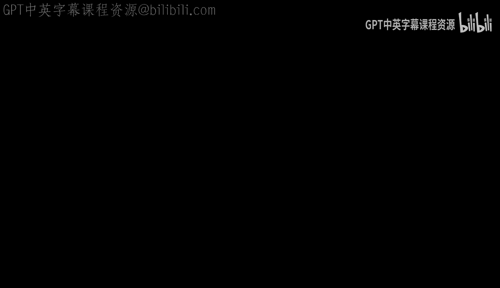
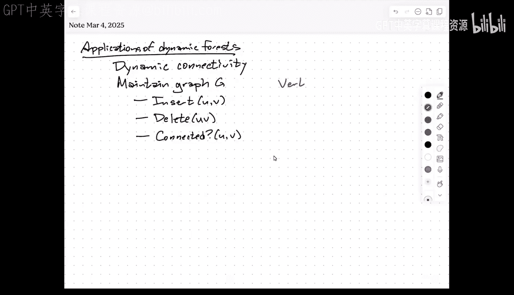
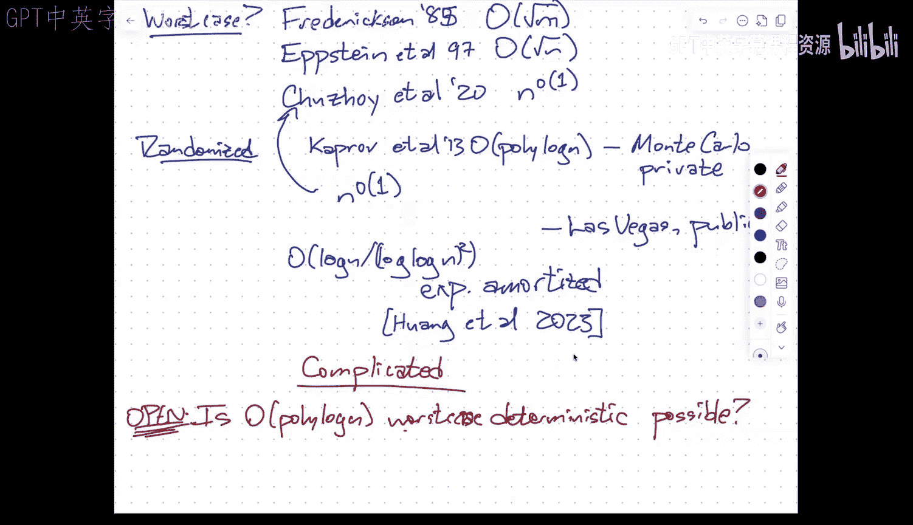

# 动态连通性：011：动态连通性算法详解 🧩






在本节课中，我们将学习如何维护一个动态变化的无向图，并高效地回答图中任意两个顶点是否连通的问题。我们将重点介绍一种基于层次化森林和欧拉回路树（Euler Tour Tree）的经典算法，它能以对数平方的均摊时间处理边的插入和删除，并以对数时间回答连通性查询。

## 算法核心思想与数据结构

上一节我们介绍了动态连通性问题的定义，本节中我们来看看解决该问题的核心数据结构设计。

算法的基本思想是维护一个**生成森林** `F`，它是当前图 `G` 的一个极大无圈子图。连通性查询可以通过检查两个顶点是否在森林 `F` 的同一棵树中来快速回答。

为了高效处理森林的更新（尤其是边的删除），算法引入了一个**层次结构**。我们为每条边分配一个**层级**（level），它是一个介于 `0` 到 `log n` 之间的整数。所有边初始层级为 `log n`。边的层级只会随时间**降低**，不会升高。

定义 `G_i` 为所有层级 **≤ i** 的边构成的子图。算法维护一个关键**不变式**：`G_i` 中每个连通分量包含的顶点数 **≤ 2^i**。

同时，我们为每个层级 `i` 维护一个生成森林 `F_i`，它是 `G_i` 的一个生成森林（实际上是最小生成森林，以层级作为权重）。显然，`F_{log n}` 就是全局生成森林 `F`，而 `F_0` 则是没有边的森林。

## 数据结构的具体实现

上一节我们介绍了算法的层次化思想，本节中我们来看看这些森林和层级信息是如何具体维护的。

算法使用**欧拉回路树**来维护每个层级 `i` 上，森林 `F_i` 中的每个连通分量。欧拉回路树支持以下三种操作：
*   `link(u, v)`: 合并 `u` 和 `v` 所在的两棵树。
*   `cut(u, v)`: 将边 `(u, v)` 从所在的树中删除，从而分裂成两棵树。
*   `connected(u, v)`: 查询 `u` 和 `v` 是否在同一棵树中。

此外，每个顶点 `v` 在层级 `i` 上维护一个信息：**关联的、层级恰好为 `i` 的非树边数量**。这个信息会被聚合到欧拉回路树的节点中，使得我们可以快速（在对数时间内）枚举出一个连通分量中所有层级为 `i` 的非树边。

以下是核心操作的伪代码描述：

```python
# 查询操作
def connected(u, v):
    return F.log_n.connected(u, v)  # 在顶层森林中查询

# 插入边 (u, v)
def insert_edge(u, v):
    if not connected(u, v):
        # 连接两个不同分量，需要在顶层森林中添加边
        for i in range(level(u, v), log_n + 1):
            F_i.link(u, v)
        # 预支付未来可能降低层级的开销
        prepay_for_potential_level_decrease(u, v)
```

## 边的删除与替换边查找

上一节我们介绍了相对简单的查询和插入操作，本节中我们来看看最复杂的操作——边的删除，特别是当删除的边位于生成森林中时。

删除边 `(u, v)` 的算法是算法的核心。如果 `(u, v)` 不是树边，操作很简单。如果是树边，则可能将一个连通分量分裂为两个，我们需要在图中寻找一条**替换边**来重新连接它们。

由于 `F_i` 是关于层级的最小生成森林，任何连接 `F_i` 中两个不同分量的边，其层级必须 **> i**。因此，当我们删除一条层级为 `l` 的树边后，我们从层级 `l` 开始向上寻找替换边。

以下是删除树边 `(u, v)` 的核心流程伪代码：

```python
def delete_tree_edge(u, v):
    l = level(u, v)
    for i in range(l, log_n + 1):
        # 在第 i 层森林中切断边 (u, v)
        F_i.cut(u, v)
        # 设 T_u, T_v 为删除边后包含 u 和 v 的树，且 |T_u| <= |T_v|
        T_u, T_v = get_smaller_and_larger_component(u, v, i)

        # 扫描 T_u 中所有层级为 i 的非树边 (x, y)
        for (x, y) in scan_edges_at_level(T_u, i):
            if y in T_v:  # 找到连接两部分的替换边！
                # 从层级 i 到 log_n，重新连接边 (x, y)
                for j in range(i, log_n + 1):
                    F_j.link(x, y)
                return  # 成功替换，结束
            else:
                # 此边未连接两部分，将其层级降为 i-1
                set_level(x, y, i-1)

        # 未找到替换边？继续尝试更高层级
```

**关键点分析**：
1.  **扫描效率**：`scan_edges_at_level` 利用欧拉回路树中维护的“层级 `i` 非树边计数”信息，可以跳过不含此类边的子树，从而保证枚举每条相关边的时间成本为 `O(log n)`。
2.  **层级降低与均摊分析**：当一条边被扫描到却未能作为替换边时，我们将其层级降低。**降低层级的开销已在插入该边时预先支付（均摊）**。因此，在删除算法中，降低层级是“免费”的。
3.  **不变式的维护**：我们总是扫描**较小**的连通分量 `T_u`。由于不变式保证 `|T_u| ≤ 2^{i-1}`，因此其中边的数量有限，并且降低这些边的层级后，新形成的 `F_{i-1}` 中的分量大小仍能满足 `≤ 2^{i-1}` 的不变式。
4.  **时间复杂度**：最坏情况下，我们可能需要在 `O(log n)` 个层级上尝试连接，每次连接成本为 `O(log n)`。因此，删除（以及插入）的**均摊时间复杂度为 O(log² n)**。连通性查询直接在顶层森林进行，**时间复杂度为 O(log n)**。

## 更优算法与开放问题

上一节我们详细分析了 Holm–de Lichtenberg–Thorup (2001) 算法，本节中我们简要了解该领域更前沿的进展和未解决的挑战。

对于**最坏情况**时间复杂度，目前已知的最好确定性算法是 Chuzhoy 等人 (2020) 提出的，其更新时间为**亚多项式**（即比任何 `n^ε` 增长都慢，但比多对数慢），这离理想的多对数时间仍有距离。

如果允许**随机化**，并且只关心**期望**运行时间，Hong 等人 (2023) 的算法可以达到 **O((log n / log log n)²)** 的期望均摊时间。

然而，一个重大的**开放问题**至今仍未解决：是否存在一个**确定性、最坏情况、多对数**更新时间的动态连通性算法？这个问题自 Frederickson 在 1985 年提出平方根时间算法以来，已开放了近四十年。

## 总结



本节课中我们一起学习了动态连通性问题的经典解法。我们看到了如何通过维护一个层次化的生成森林，并结合欧拉回路树，来高效处理边的插入和删除。算法的关键在于利用层级和不变式来组织搜索，并通过精妙的均摊分析将时间复杂度控制在 `O(log² n)` 更新和 `O(log n)` 查询。尽管存在更快的随机化算法和一些亚多项式的最坏情况算法，但实现确定性的多对数最坏情况更新时间仍然是一个悬而未决的难题。