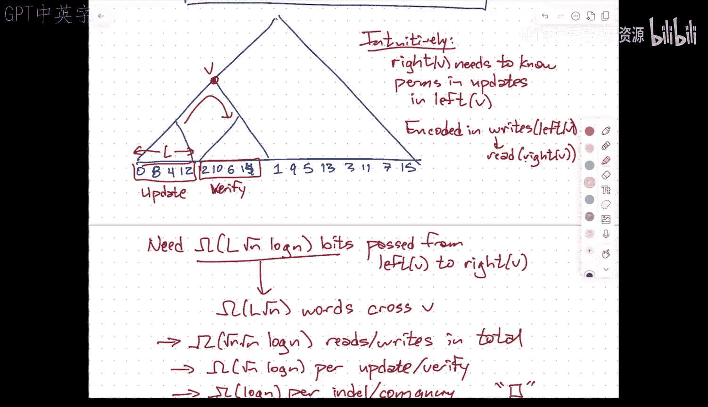
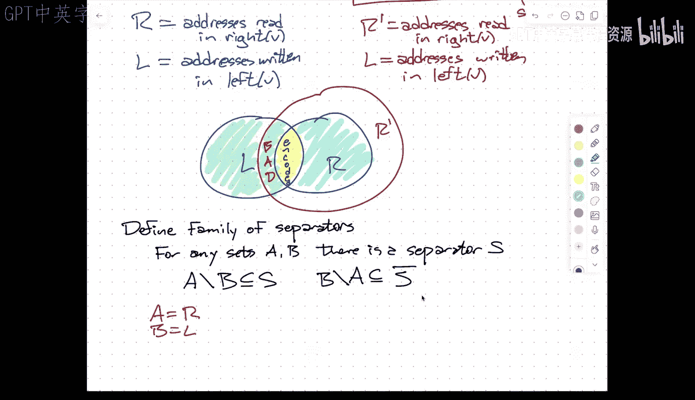

# 动态连通性：012：动态连通性的下界

在本节课中，我们将探讨动态连通性问题的计算下界。我们将学习一种称为“单元探测模型”的强大模型，并理解如何利用信息论论证来证明，即使对于非常简单的图（如不相交路径的集合），任何动态连通性数据结构也必须花费至少对数时间来处理每个操作。

---

## 单元探测模型

上一节我们介绍了动态连通性问题的背景和已有的数据结构。本节中，我们来看看一个用于证明下界的通用计算模型。

在单元探测模型中，我们只关心对内存的读写次数，而将所有其他计算（如算术、比较）视为免费。这使其成为证明下界的理想模型，因为它低估了算法的实际工作量。

该模型的核心假设如下：
*   内存由 `2^w` 个单元组成，每个单元存储一个 `w` 位的字。
*   我们通常假设 `w = Θ(log n)`，这样内存地址和索引就能存储在一个字中。
*   时间成本仅由读写内存的次数决定。

这个模型非常强大，因为它不限制算法内部的计算方式。因此，在此模型下证明的下界适用于任何符合该范式的实际算法。

---

## 下界证明的核心思路

为了证明下界，我们将构造一个困难的操作序列。核心思想是分析信息如何必须从一个操作“流”到后续的操作。

我们将操作序列组织成一棵平衡二叉树。对于树中的任意节点 `v`，我们关注其左子树中的写操作和右子树中的读操作之间的关系。具体来说，我们关心那些在左子树中最后被写入、然后在右子树中被读取的内存地址。

这些“跨越”节点 `v` 的读写对，代表了信息从左向右流动的必要通道。为了正确执行右子树中的查询，数据结构必须通过这些内存访问来“了解”左子树中发生的变化。

---

## 困难的操作序列构造

以下是构造困难操作序列的步骤：

1.  **设置图结构**：考虑一个 `√n × √n` 的网格图。初始时，每一列内部由一条特定的路径（即一个排列）连接，而列与列之间在对应行上有边相连。整个图编码了从第一列到最后一列的排列复合。

2.  **定义宏操作**：
    *   **更新(X, π)**：将第 `X` 列的排列更改为新的随机排列 `π`。这可以通过 `√n` 次动态图的“加边”和“删边”操作实现。
    *   **验证(X)**：检查从第一列到第 `X` 列的排列复合结果是否等于某个指定的排列。这可以通过 `√n` 次“连通性查询”操作实现。

3.  **生成操作序列**：我们按照“位反转”顺序遍历各列。对于每个列索引 `i`（按位反转顺序）：
    *   执行 **更新(bitrev(i), 随机排列)**。
    *   执行 **验证(bitrev(i))**，要求验证的排列正是之前所有更新操作复合后的正确结果。

这个序列的关键在于，右子树中的验证操作的正确性，完全依赖于左子树中更新操作所使用的随机排列。因此，关于这些排列的信息必须通过内存访问从“过去”（左子树）传递到“未来”（右子树）。

---

## 信息论论证

现在，我们进行信息论分析：

1.  **信息需求**：对于时间树中的节点 `v`，设其左子树有 `L` 个叶子（即 `L` 次更新操作）。右子树中的验证操作需要知道这 `L` 个随机排列的信息。每个排列有 `√n!` 种可能，因此编码所有排列至少需要 `L * Ω(√n log n)` 比特的信息。

2.  **信息载体**：这些比特信息只能通过“在左子树写入，在右子树读取”的内存单元来传递。每个这样的单元传递 `Θ(log n)` 比特（因为字长是 `Θ(log n)`）。因此，至少需要 `Ω(L * √n)` 次这样的跨越 `v` 的内存访问。

3.  **求和得到下界**：对树中同一层的所有节点 `v` 求和，`L` 的总和是 `Θ(√n)`。因此，每一层需要 `Ω(n)` 次内存访问。树有 `Θ(log n)` 层，故总的内存访问次数为 `Ω(n log n)`。

4.  **转换到原问题**：我们的操作序列包含 `√n` 个宏操作（更新或验证），每个宏操作对应 `√n` 次基本的动态连通性操作。因此，总的操作次数是 `n` 次。既然总时间下界是 `Ω(n log n)`，那么至少有一次基本操作需要 `Ω(log n)` 时间。

这就证明了，在单元探测模型下，动态连通性问题的每次操作都需要 `Ω(log n)` 时间，即使允许摊销分析和随机化算法，且图只是不相交路径的集合。

---

## 从“查询”下界到“验证”下界

上述论证基于一个更强的操作 **“查询(X)”**（直接返回排列复合结果），它比 **“验证(X)”** 返回更多信息。为了将下界应用到实际的“验证”操作上，需要更复杂的技术。

核心思路是**用多次验证来模拟一次查询**。为了知道复合排列是什么，我们可以遍历所有可能的排列，并逐个进行验证，直到某个验证返回“真”。这样，我们就用 `√n!` 次验证模拟了一次查询。

在模拟过程中，我们需要处理“模拟器访问了真实算法不会访问的内存地址”这一问题。这通过引入**分离器族** 的概念来解决。分离器可以帮助我们区分哪些内存访问是“好的”（真实算法会执行的），哪些是“坏的”。我们只需额外编码使用了哪个分离器，而这个开销很小，不会影响整体的下界结论。

最终，我们能够将针对“查询”操作的下界，转移到针对“验证”操作的下界，从而完成对原始动态连通性问题的下界证明。

---

## 总结

本节课中，我们一起学习了动态连通性问题的对数时间下界证明。我们首先介绍了用于下界分析的单元探测模型，该模型只计算内存访问次数。然后，我们通过构造一个基于网格图和位反转顺序的困难操作序列，将问题转化为信息在时间线上流动的问题。通过信息论论证，我们证明了必须有足够多的内存访问来传递左子树更新操作的信息，以满足右子树验证操作的需求，从而导出了 `Ω(log n)` 的每操作时间下界。这个结果非常强大，它表明我们之前学习的 `O(log² n)` 摊销时间数据结构在理论上已经接近最优。