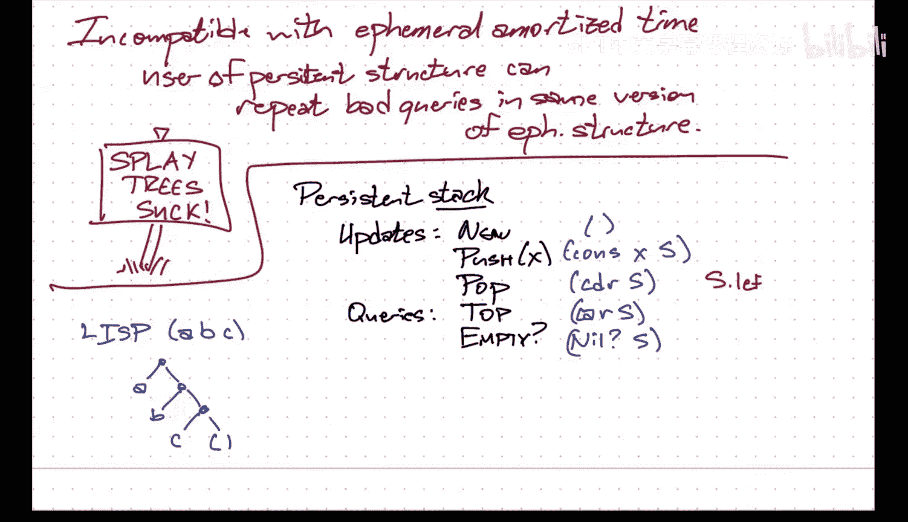
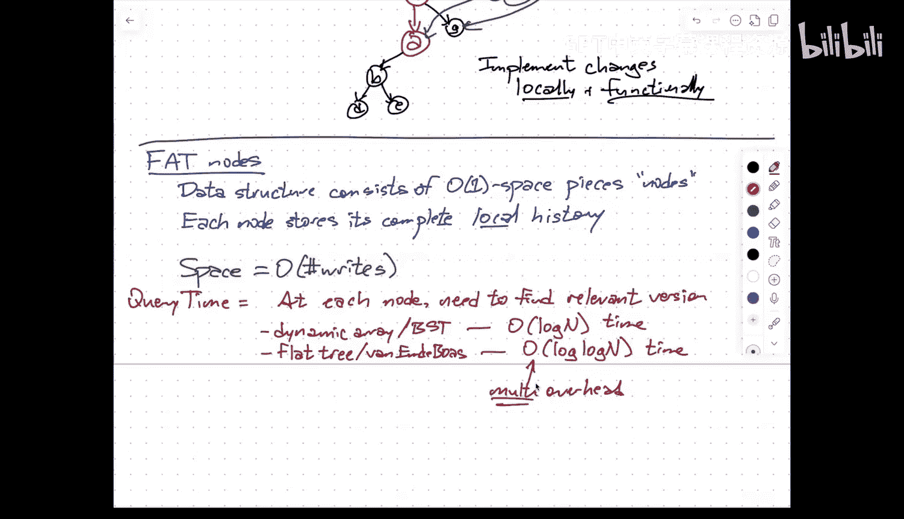

# 数据结构：013：持久化数据结构

在本节课中，我们将学习持久化数据结构的概念、不同类型以及实现它们的基本方法。持久化数据结构允许我们访问和操作其历史版本，这在许多应用中至关重要。

## 课程概述

持久化数据结构，也称为多版本数据结构，允许用户不仅对当前版本进行查询和更新，还能访问其过去版本。我们将探讨三种主要类型：部分持久化、完全持久化和汇合持久化，并介绍两种核心实现技术：路径复制和胖节点法。

---

## 项目与课程安排说明

上一节我们介绍了课程背景，本节中我们来看看本学期剩余时间的安排。

论文研读环节已基本结束，我将在春假期间进行评分。
下一个主要环节是项目提案，学期末则是项目展示和最终报告。

关于最终项目，特别是项目提案，我需要明确我的期望。理想的目标是项目最终可能导向可发表的成果，但考虑到项目周期仅为一个学期，期望达到那样的深度是不现实的。

因此，我对最终项目报告和展示的期望更接近于一份进展报告。报告应包含：我们尝试了哪些方法、我们的目标是什么、我们设定的子目标、我们取得的小成果、我们仍不确定是否能达成最终结果、我们考虑的特殊情况或变体，以及如果我们继续研究下一步将做什么。没有回答原始问题，但展示了进展和未来方向，这对我来说就是理想的期末项目报告。

这也应指导你构思项目提案。提案应提出一个有望取得一些进展的问题，并提供背景信息、相关成果以及一些初步想法。

项目也可以是其他形式，例如：为某个非标准应用开发更高效的数据结构、对同一问题的多种数据结构进行实验比较、或撰写关于某一类数据结构的详细综述。

你可以利用你之前的专业知识、研究经验或实习经历来匹配你想要做的项目类型。最终目标是取得进展。

最终项目预计需要投入20到40小时的工作量，分散在学期剩余几周。项目默认以三人小组形式进行，但如果有充分理由，也可以考虑更大规模的小组。评估更侧重于你在研究过程中取得的进展，而非抽象的最终目标。

关于成绩，除非完全不提交任何内容，否则我预计本课程的最低成绩为B或B+。评分更多基于整体表现而非具体分数。

项目提案在四月的第一个星期一截止，这是一个硬性截止日期。

---

## 持久化数据结构简介

上一节我们讨论了课程安排，本节中我们来看看持久化数据结构的基本概念。

持久化数据结构，或称多版本数据结构，允许我对数据结构进行更新和查询，同时还能以某种方式访问其过去版本。

最简单的例子是大多数文件系统使用的日志功能。当你更改文件时，系统会存储这些更改，使你可以在一定时间窗口内回溯并检索旧版本文件。

更复杂的版本如Git，我不仅可以查询过去，还可以创建分支（本质上修改过去，创建替代时间线），甚至可以将多个过去版本合并为新版本。

持久化通常用以下形容词来区分：
*   **部分持久化**：我只能更新最新版本，但可以查询任何过去版本。
*   **完全持久化**：我可以查询或更新任何版本。
*   **汇合持久化**：除了完全持久化的功能，我还可以通过合并旧版本来创建新版本。

这三种类型的区别在于版本历史的结构：
*   对于部分持久化数据结构，历史是一个序列（列表）。
*   对于完全持久化数据结构，历史是一棵树。
*   对于汇合持久化数据结构，历史是一个有向无环图。

Git最接近汇合持久化数据结构。

今天我将主要讨论部分持久化，周四会更详细地讨论完全持久化。

需要立即指出的一点是，汇合持久化数据结构的一个同义词是**函数式数据结构**。如果你在函数式编程语言中实现数据结构，由于没有状态和变量赋值，只有代表数学结构的新对象被创建，那么只要你能实现合并或连接操作，它就自动成为汇合持久化的。你始终持有版本7的句柄，三天后它看起来仍然和版本7完全一样，因为它从未改变。

有一本很棒的书叫《Purely Functional Data Structures》，作者是Chris Okasaki，我强烈推荐。

---

## 效率考量与摊还分析的挑战

上一节我们介绍了持久化的类型，本节中我们来看看实现持久化时的效率目标以及一个关键挑战。

理想的效率目标如下：
1.  **查询时间**：尽可能接近在特定版本的非持久化数据结构中的查询时间。
2.  **更新时间**：尽可能接近非持久化的更新时间，加上少量开销。
3.  **空间占用**：理想情况下应与整个历史中写入内存的总次数成正比，即数据结构需要改变的次数总和。

然而，当我们使用具有**摊还**时间保证的数据结构时，会出现一个严重问题。以伸展树为例，伸展树保证每次访问的摊还时间为O(log n)，但最坏情况下的查询时间可能是线性的。

假设对手创建了一个深度为线性的伸展树，并称其为版本7。然后，持久化数据结构的用户可以反复回到版本7，查询那个很深的节点。即使用户在摊还意义上对持久化结构进行了多次操作，每次查询那个旧版本中的坏节点都会触发最坏情况。因此，持久化数据结构中的整体查询时间（即使是摊还时间）会变得等于非持久化结构中的最坏情况查询时间。

**核心问题**：持久化数据结构的用户可以**重复**查询**同一**非持久化版本中的**坏查询**。

因此，为了使持久化数据结构高效，底层必须使用具有**最坏情况**对数时间保证的数据结构，例如红黑树、AVL树或B树的加权版本，而不能使用伸展树。

第二个问题是，伸展树的架构基于每次查询同时也是更新。这对于完全持久化没问题，因为每次对过去的查询都会分支出一个新版本。但对于部分持久化，我不被允许改变过去，因此无法使用伸展树。

简而言之，伸展树虽然在其他方面很优秀，但在持久化方面表现不佳，我们必须使用其他数据结构。

---

## 一个简单例子：持久化栈

上一节我们讨论了持久化的挑战，本节中我们通过一个简单的例子来理解持久化如何工作。

考虑一个**持久化栈**。栈维护一个序列，支持在序列开头添加元素、移除开头元素、查看开头元素以及检查栈是否为空。

有一种非常简单的方法可以实现持久化栈，这本质上也是Lisp的核心理念。Lisp围绕操作列表设计，列表在内部表示为二叉树。

假设我们有一个指针直接指向要查询的版本的头部。持久化栈可以这样实现：
*   `new()`: 返回空列表（nil指针）。
*   `push(S, x)`: 使用`cons`操作，构造一个新节点，其左子节点指向新元素`x`，右子节点指向旧栈`S`。返回指向新节点的指针。
*   `pop(S)`: 返回`S`的右子节点指针。
*   `top(S)`: 返回`S`的左子节点值。
*   `is_empty(S)`: 检查`S`是否为nil。

用非Lisp代码表示：
*   `push(S, x)`: 创建新节点`node`，`node.left = x`，`node.right = S`，返回`node`。
*   `pop(S)`: 返回`S.right`。
*   `top(S)`: 返回`S.left`。
*   `is_empty(S)`: 返回`(S == null)`。

这样，每次`push`都会创建一个新节点，该节点通过指针指向旧的栈结构。你得到的是一个指向新栈头部的指针。你可以保存这个指针，以后通过它来访问那个版本的栈并执行操作。这是一种函数式的方法：你创建新对象，但从不改变旧对象，只是让新对象通过指针指向旧对象。

---

## 实现方法一：路径复制

上一节我们看了一个简单的持久化栈，本节中我们探讨第一种通用的持久化实现方法：**路径复制**。

此方法需要一个限制性假设：数据结构由**有根森林**组成，是指针式的结构，具有常数个根指针，并且每个节点都有从某个根到该节点的唯一访问路径。

**核心思想**：当你想修改树中的某个节点时，复制从根到该节点的整条路径上的所有节点。对于路径上指向路径外节点的指针，保持其值与原始结构相同。

例如，考虑学期初用于解决区间最小值查询的锦标赛树。如果更改一个叶子节点的值，在非持久化结构中，变化可能不会一直传播到根。但在持久化结构中，你必须将复制操作一直传播到根节点，即使只有一个节点的数据发生变化。

**操作分析**：
*   **查询**：要查询版本`v`，只需将指向版本`v`根节点的指针视为根，然后像在非持久化结构中一样正常操作。
*   **更新**：更新一个节点所需的时间和额外空间，与该节点的**路径长度**成正比。对于平衡二叉搜索树，路径长度为O(log n)。
*   **空间**：总空间与所有更新中路径长度的总和成正比，即与非持久化更新时间的总和相关。

**局限性**：此方法难以直接处理具有父指针的数据结构，因为那会引入循环，违反唯一访问路径的假设。一种解决方案是使用**Zipper**数据结构。

**Zipper简介**：Zipper表示一棵树加上一个指向任意节点的指针（称为`finger`）。它通过“反转”从根到`finger`的路径来实现。在内部，它表示为一个特殊的树，其中节点可以有左孩子、右孩子或父孩子（并附带一个比特位指示是左孩子还是右孩子）。移动`finger`或进行局部修改（如旋转）只需要交换少量节点的顺序，更新常数个指针，创建常数空间。这使得在函数式环境中实现红黑树、AVL树等成为可能，从而获得完全持久化（甚至汇合持久化）的平衡二叉搜索树。

---

## 实现方法二：胖节点法

上一节我们介绍了路径复制，本节中我们看看另一种基础方法：**胖节点法**。

此方法假设数据结构由常数大小的单元（称为“节点”）组成。节点不一定是指针式的，也可以是数组中的单元格等。

**核心思想**：非常简单，每个节点存储其完整的**本地历史**。每次向节点写入新信息时，就在该节点的历史记录中创建一个新条目。从实践角度看，你不需要复制整个节点，只需记录哪个字段在何时从何值变为何值。但由于节点大小恒定，在大O表示法中，可以视为复制了整个节点。

**优势**：
*   **空间**：每次写入只使用常数额外空间来存储本地历史。因此，整个持久化数据结构的总空间等于创建所有版本所进行的**写入总次数**，这是可能的最佳情况。

**劣势**：
*   **时间**：查询过去版本时，在**每个**被访问的节点上，都需要找到该时间戳对应的正确版本。即，给定时间戳`t`，需要找到该节点历史中不晚于`t`的最新修改记录。

**查询开销**：
*   如果使用按时间排序的动态数组或平衡二叉搜索树来存储节点的历史，则每次查找前驱需要O(log N)时间，其中N是总更新次数。
*   由于时间戳是1到N之间的整数，我们可以使用**van Emde Boas树**等数据结构，将每次查找前驱的时间降低到O(log log N)。

**关键问题**：这个开销是**乘性**的。执行一次查询的总时间，是非持久化查询时间乘以这个O(log log N)的开销。虽然log log N在实践中很小（约等于5），但从理论角度看，我们希望在周四介绍一种方法，能将这个乘性开销降低为**加性**开销。这需要在不同节点的前驱搜索之间共享信息，并且需要更多工作来使其适用于完全持久化。

---

## 课程总结

本节课我们一起学习了持久化数据结构。我们了解了部分、完全和汇合持久化的区别，讨论了使用摊还分析数据结构实现持久化时面临的挑战。我们通过持久化栈的例子理解了函数式实现的思路，并深入探讨了两种通用的实现技术：路径复制和胖节点法，分析了它们各自的优势和代价。这些基础为我们后续学习更高效的持久化方案打下了基础。