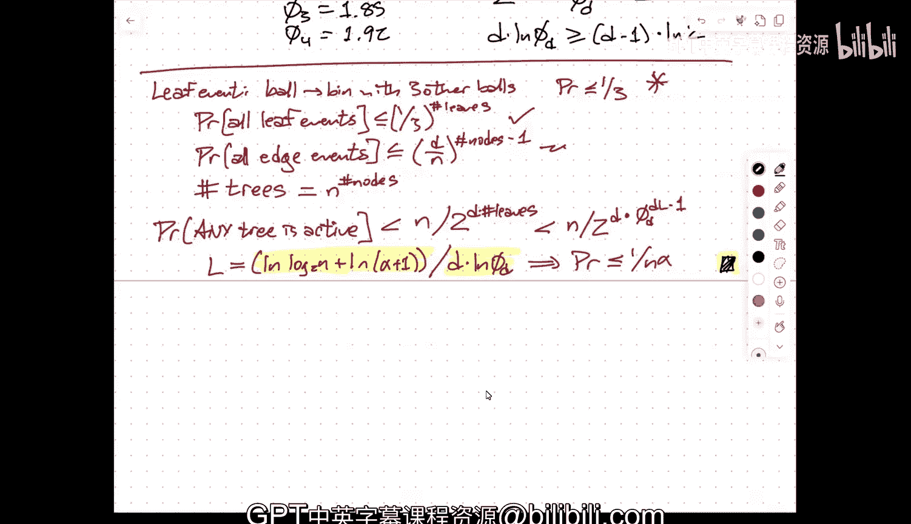

# 016：多选择的力量与“总是向左”策略


在本节课中，我们将学习“多选择”负载均衡模型，并深入探讨一个有趣的现象：当我们将选择范围限制在特定的“块”中，并采用“总是向左”的平局决胜规则时，最大负载会如何变化。我们将从经典的“球与箱子”模型开始，逐步引入更复杂的策略，并通过概率分析和“见证树”的概念来证明这些策略的性能上界。

---

## 经典“球与箱子”模型：热身

首先，我们回顾经典的“球与箱子”实验。假设我们有 `n` 个球和 `n` 个箱子。每个球被独立且均匀地随机投入一个箱子。

**核心问题**：所有箱子中，球最多的那个箱子（即最大负载）大约是多少？

通过概率分析可以证明，**以高概率**，最大负载约为：
```
log n / log log n
```
其中 `log` 表示自然对数。这个结果与使用链地址法的哈希表性能直接相关：最长的链长度大约就是这个值。

为了直观理解这个上界，我们可以进行一个简单的计数论证。

### 上界证明思路

考虑任意一个箱子（例如箱子1）拥有至少 `M` 个球的概率。通过组合计数和布尔不等式（Union Bound），我们可以得到：
```
Pr(箱子1有 ≥ M 个球) ≤ (n choose M) * (1/n)^M ≤ (e/M)^M
```
然后，我们考虑所有 `n` 个箱子。再次使用布尔不等式：
```
Pr(存在箱子有 ≥ M 个球) ≤ n * (e/M)^M
```
现在，我们设 `M = 4 * (log n / log log n)`。通过代入和代数运算（这里略去细节），可以证明当 `n` 很大时，这个概率小于 `1/n^2`。这意味着，以很高的概率，没有箱子会超过这个负载。虽然常数 `4` 不是紧的，但核心的增长阶 `log n / log log n` 是正确的。

---

## 多选择的力量

上一节我们看到了随机分配的负载情况。现在，我们引入一个更聪明的策略，它能显著降低最大负载。

**模型描述**：
1.  对于每个球，我们不再只随机选一个箱子，而是**独立、均匀地随机选择 `d` 个箱子**。
2.  然后，我们观察这 `d` 个箱子当前的负载（即已有球数）。
3.  最后，将球放入这 `d` 个箱子中**负载最轻**的那个。

**核心结论**：采用此策略后，以高概率，最大负载从 `Θ(log n / log log n)` 急剧下降至：
```
log log n / log d + O(1)
```
这是一个巨大的改进。即使 `d=2`（两个选择），最大负载也变成了双对数级别。

**与哈希的联系**：这直接对应到一种哈希表方案。我们有 `d` 个哈希函数，每个键计算 `d` 个位置，然后插入到其中负载最轻的桶中（例如使用链地址法处理冲突）。

---

## 非均匀选择与“总是向左”策略

现在，我们考虑一个更结构化的选择方式，并引入一个关键的平局决胜规则。

**模型修改**：
1.  **分块**：首先，将 `n` 个箱子均匀分成 `d` 个块，每个块包含 `n/d` 个箱子。
2.  **非均匀选择**：对于每个球，它在**每个块中独立、均匀地随机选择恰好一个箱子**。这样，它总共还是选择了 `d` 个箱子，但保证了每个块都有一个代表。
3.  **负载比较与插入**：球仍然放入这 `d` 个箱子中负载最轻的那个。
4.  **平局决胜规则**：当多个箱子负载相同时，我们总是选择**编号最小的块**中的那个箱子（即“总是向左”）。

这个模型是“布谷鸟哈希”的自然推广：我们有 `d` 个哈希表（对应 `d` 个块），每个键通过 `d` 个哈希函数分别映射到每个表中的一个位置。

**惊人的结论**：
*   如果平局是随机打破的，最大负载仍然是 `Θ(log log n / log d)`。
*   但如果采用“总是向左”的规则，最大负载可以进一步降低到 `Θ(log log n / d)`！当 `d` 增大时，这个改进非常显著。
*   理论证明，在给定的“选择 `d` 个箱子”的框架下，这种“分块+总是向左”的策略在**所有可能**的非均匀选择分布和平局决胜规则中，达到了最优的最大负载下界。

---

## 见证树分析：理解上界证明

为了证明多选择模型的上界，我们引入一个强大的组合工具——**见证树**。它能将“某个箱子负载过高”这个复杂事件，分解为一组更简单、概率更低的事件的组合。

### 均匀选择下的见证树

我们目标是证明：最大负载超过 `L + O(1)` 的概率非常小。

**见证树的定义**：
*   它是一棵**满的 d 叉树**，高度为 `L`（根在 level `L`，叶子在 level 0）。
*   树中每个节点关联一个**箱子**，以及**最后放入该箱子的那个球**。
*   **根节点**表示的事件是：某个球 `B` 被放入了一个已经装有至少 `L+3` 个球的箱子 `X`（使其成为第 `L+4` 个球）。
*   **子节点**的含义：既然球 `B` 选择了箱子 `X`，意味着在它做决定的时刻，它随机选择的 `d` 个箱子（记为 `H1(B), ..., Hd(B)`）负载都**至少**是 `L+3`。每个子节点就对应这些箱子之一，以及更早放入该箱子的最后一个球。
*   以此类推**递归构建**。叶子节点对应的事件是：某个球被放入了一个已经至少有 3 个球的箱子（即成为第 4 个球）。

**事件概率分析**：
1.  **叶子事件**：一个球被放入已有至少3个球的箱子。由于总共只有 `n` 个球，根据鸽巢原理，这种“富箱”最多有 `n/3` 个。因此，对于任何特定的箱子，一个随机球选择它作为 `d` 个选择之一的概率 ≤ `d/3`。通过更精细的分析，可以论证单个叶子事件发生的概率 ≤ `1/3`。
2.  **边事件**：连接父节点（球 `P`）和子节点（箱子 `V`）的边，表示球 `P` 的 `d` 个随机选择中，包含了箱子 `V`。这个概率 ≤ `d/n`。
3.  **树的结构数量**：一棵有 `m` 个节点的见证树，每个节点可以标记为 `n` 个箱子之一，所以最多有 `n^m` 种不同的标记方式。

**综合计算**：
一棵特定的、有 `q` 个叶子和 `m` 个节点的见证树，其所有事件（所有叶子事件和所有边事件）同时发生的概率上界大约是：
```
(n^m) * (d/n)^{m-1} * (1/3)^{q}
```
经过化简和近似（利用 `q ≈ d^L` 以及 `m ≈ q`），这个上界可以化为类似于 `n / 2^{d^L}` 的形式。

**得出结论**：
如果我们设 `L = log_d(log n) + O(1)`，那么上述概率就变得非常小（例如小于 `1/n^2`）。这意味着，以高概率，不存在高度为 `L` 的活跃见证树，从而没有箱子的负载会超过 `L + O(1)`。这就证明了上界 `log log n / log d`。

### “总是向左”策略下的见证树变化

在“分块+总是向左”的策略下，见证树的结构发生了关键变化，这导致了不同的负载上界。

**树结构的变化**：
*   每个节点现在除了负载高度 `h`，还关联一个**块编号 `i`** (1 ≤ i ≤ d)。
*   一个关联于块 `i`、高度 `h` 的节点，其子节点结构如下：
    *   对于块编号 `j < i`（左边块）：子节点高度为 `h`。
    *   对于块编号 `j = i`（自身块）：子节点高度为 `h-1`。
    *   对于块编号 `j > i`（右边块）：子节点高度为 `h-1`。
*   **原因**：“总是向左”规则意味着，当球放入块 `i` 的一个箱子时，所有左边块（`j < i`）中被选中的箱子负载必须**不低于**当前箱子，而右边块（`j > i`）中被选中的箱子负载可以**少一个**（因为如果少得更多，球就会去右边了）。

**对树大小的影响**：
这种结构下，树的生长速度不再像均匀情况那样是 `d^L`，而是遵循一个类似广义斐波那契数列的递归关系。叶子数量 `F(L)` 满足：
```
F(L) = F(L-1) + F(L-1) + ... + F(L-d) （具体形式与d有关）
```
分析表明，`F(L)` 的增长速度大约是 `(φ_d)^L`，其中 `φ_d` 是一个常数（`φ_2 ≈ 1.618`， `φ_3 ≈ 1.839`，随着 `d` 增大而接近2）。关键点是，`φ_d^L` 的增长速度比均匀情况下的 `d^L` **慢**。

**对负载上界的影响**：
在概率计算中，叶子数量 `q` 的增长速度变慢，意味着为了使得“所有事件发生”的总概率足够小，我们所允许的树高度 `L` 可以**更大**。但请注意，树的高度 `L` 对应的是负载的超出量。允许的 `L` 更大，实际意味着负载的实际上界**更小**。

将新的叶子数量增长阶 `(φ_d)^L` 代入之前的概率分析框架，最终可以得到最大负载的上界为 `Θ(log log n / (d * log φ_d))`。当 `d` 较大时，`log φ_d ≈ log 2`，因此上界简化为 `Θ(log log n / d)`。这比均匀选择下的 `Θ(log log n / log d)` 要好得多。

---

## 总结

本节课我们一起学习了负载均衡中的多选择策略及其分析。

1.  我们从经典的随机分配模型开始，其最大负载为 `Θ(log n / log log n)`。
2.  然后引入了**多选择（Power of d Choices）**策略，通过让每个球在 `d` 个随机选项中挑选负载最轻的，将最大负载显著降低到 `Θ(log log n / log d)`。
3.  进一步，我们探讨了**非均匀选择**模型（将箱子分块，每块选一个）和**特定的平局决胜规则（“总是向左”）**。令人惊讶的是，这种策略能达到理论最优的下界 `Θ(log log n / d)`。
4.  为了证明这些上界，我们学习了**见证树**这一强大的分析工具。它将高负载事件映射为一种树形结构，并通过计算特定树结构出现的概率来得到负载上界。均匀和非均匀策略下见证树结构的不同，直接导致了最终性能的差异。



这些结果不仅具有理论美感，也为设计高效的哈希表（如布谷鸟哈希的推广）和分布式负载均衡算法提供了坚实的理论基础。